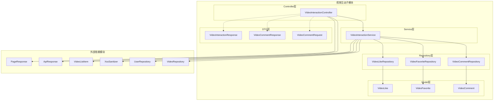
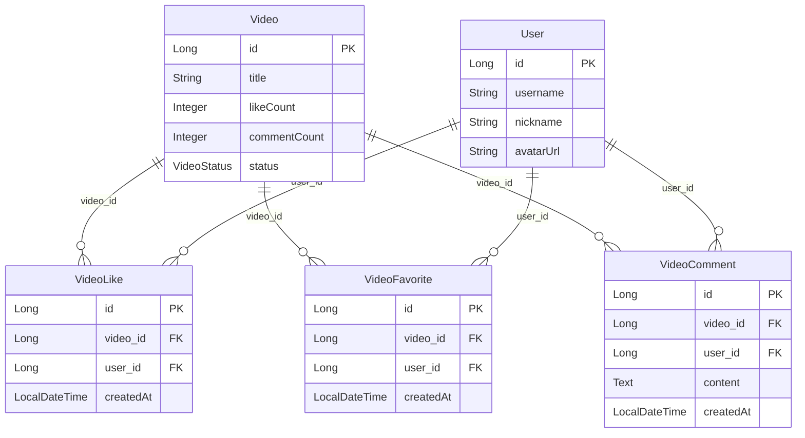
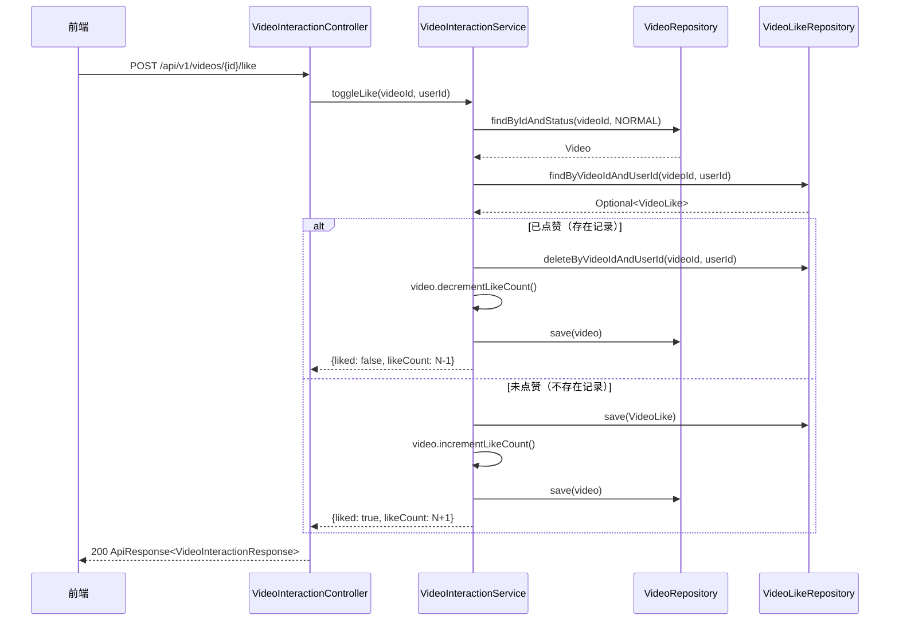
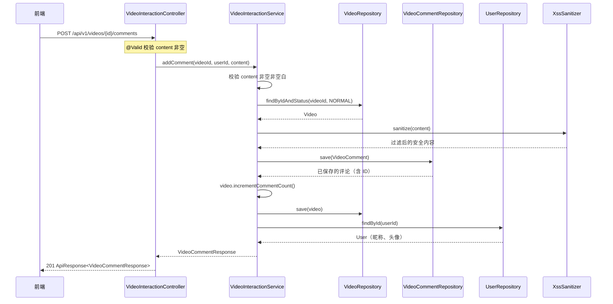
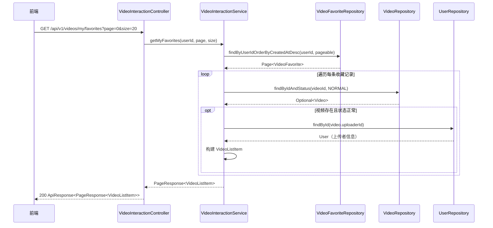
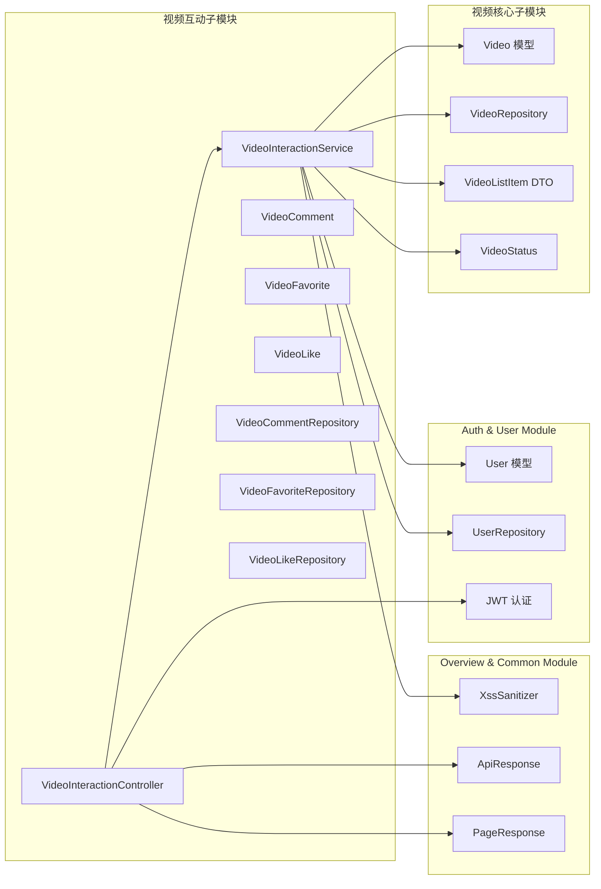
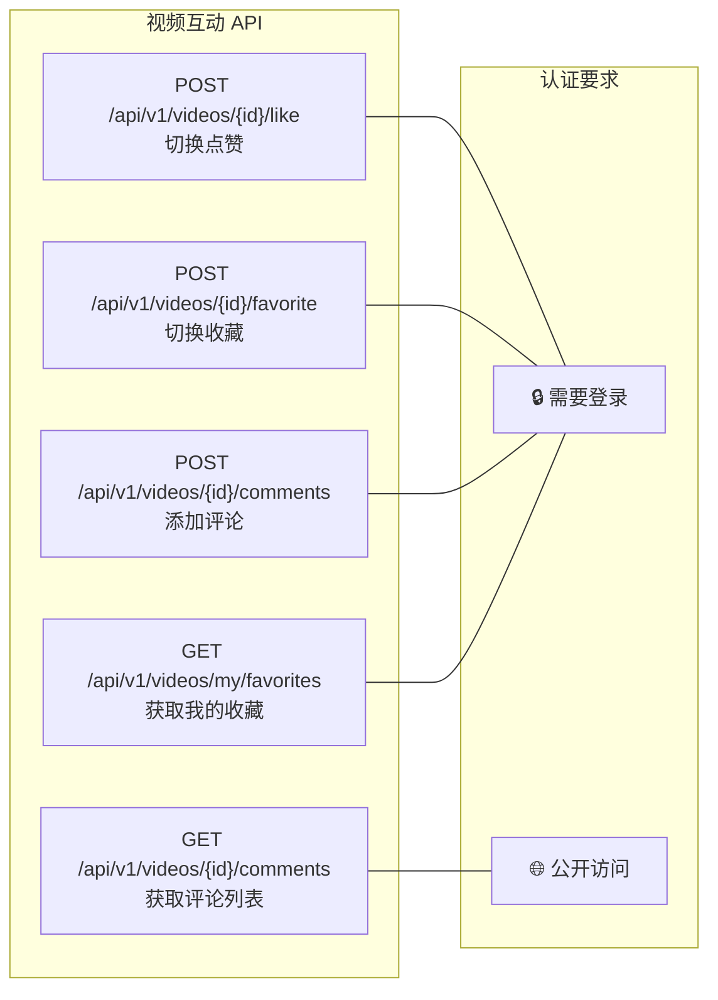

# 视频互动子模块

## 简介

视频互动子模块是 [Video Module](Video%20Module.md) 的核心子模块之一，负责处理用户与视频之间的所有互动行为，包括**点赞**、**收藏**和**评论**。该子模块为用户提供了丰富的社交互动能力，使用户能够对平台上的视频内容进行反馈和交流。

本子模块与 [视频核心子模块](视频核心子模块.md) 紧密协作——视频核心子模块负责视频的上传、管理和展示，而本子模块则在此基础上构建互动层。同时，本子模块依赖 [Auth & User Module](Auth%20%26%20User%20Module.md) 提供的用户身份认证与用户信息查询能力，以及 [Overview & Common Module](Overview%20%26%20Common%20Module.md) 提供的通用工具类（如 XSS 过滤、统一响应封装、分页响应封装）。

---

## 架构总览

---

## 组件详解

### 1. 控制器层

#### VideoInteractionController

视频互动控制器，提供 RESTful API 端点，处理所有与视频互动相关的 HTTP 请求。所有端点均挂载在 `/api/v1/videos` 路径下。

| 端点 | 方法 | 功能 | 认证要求 | 返回类型 |
|------|------|------|----------|----------|
| `/{id}/like` | POST | 切换视频点赞状态 | ✅ 需登录 | `ApiResponse<VideoInteractionResponse>` |
| `/{id}/favorite` | POST | 切换视频收藏状态 | ✅ 需登录 | `ApiResponse<VideoInteractionResponse>` |
| `/{id}/comments` | GET | 获取视频评论列表（分页） | ❌ 无需登录 | `ApiResponse<PageResponse<VideoCommentResponse>>` |
| `/{id}/comments` | POST | 添加视频评论 | ✅ 需登录 | `ApiResponse<VideoCommentResponse>` |
| `/my/favorites` | GET | 获取当前用户的收藏列表（分页） | ✅ 需登录 | `ApiResponse<PageResponse<VideoListItem>>` |

**关键设计要点：**
- 使用 `@AuthenticationPrincipal User currentUser` 注入当前登录用户，依赖 [认证子模块](Auth%20%26%20User%20Module.md) 的 JWT 认证机制
- 评论添加接口使用 `@Valid` 注解触发请求体校验
- 评论创建成功时返回 HTTP 201 状态码
- 分页参数支持默认值（`page=0`, `size=20`）

---

### 2. 服务层

#### VideoInteractionService

视频互动核心服务，封装所有互动业务逻辑。通过 `@Transactional` 注解确保数据一致性。

**核心方法：**

| 方法 | 事务类型 | 功能描述 |
|------|----------|----------|
| `toggleLike(videoId, userId)` | 读写事务 | 切换点赞状态：已点赞则取消，未点赞则添加，同步更新视频点赞计数 |
| `toggleFavorite(videoId, userId)` | 读写事务 | 切换收藏状态：已收藏则取消，未收藏则添加 |
| `addComment(videoId, userId, content)` | 读写事务 | 添加评论：XSS 过滤后保存，同步更新视频评论计数 |
| `getComments(videoId, page, size)` | 只读事务 | 分页查询视频评论列表，关联查询用户昵称和头像 |
| `getMyFavorites(userId, page, size)` | 只读事务 | 分页查询用户收藏的视频列表，关联查询上传者信息 |

**业务逻辑亮点：**

1. **Toggle 模式**：点赞和收藏均采用 toggle 语义，同一接口处理添加和取消两种操作，简化前端调用
2. **计数同步**：点赞和评论操作会同步更新 `Video` 实体上的冗余计数字段（`likeCount`、`commentCount`），避免实时聚合查询
3. **XSS 防护**：评论内容在保存前经过 `XssSanitizer.sanitize()` 处理，防止 XSS 攻击
4. **分页限制**：评论和收藏列表的分页大小被限制在最大 100 条，防止恶意大页查询
5. **状态校验**：所有互动操作仅针对 `VideoStatus.NORMAL` 状态的视频，已删除视频不可互动

---

### 3. 数据模型层

本子模块包含三个独立的互动实体，均通过 `video_id` 与 [视频核心子模块](视频核心子模块.md) 的 `Video` 实体关联，通过 `user_id` 与 [用户管理子模块](Auth%20%26%20User%20Module.md) 的 `User` 实体关联。

#### VideoLike（视频点赞）

| 字段 | 类型 | 约束 | 说明 |
|------|------|------|------|
| `id` | Long | PK, 自增 | 主键 |
| `videoId` | Long | 非空 | 关联视频 ID |
| `userId` | Long | 非空 | 点赞用户 ID |
| `createdAt` | LocalDateTime | 自动生成 | 点赞时间 |

- **唯一约束**：`(video_id, user_id)` 联合唯一，确保同一用户对同一视频只能点赞一次

#### VideoFavorite（视频收藏）

| 字段 | 类型 | 约束 | 说明 |
|------|------|------|------|
| `id` | Long | PK, 自增 | 主键 |
| `videoId` | Long | 非空 | 关联视频 ID |
| `userId` | Long | 非空 | 收藏用户 ID |
| `createdAt` | LocalDateTime | 自动生成 | 收藏时间 |

- **唯一约束**：`(video_id, user_id)` 联合唯一，确保同一用户对同一视频只能收藏一次

#### VideoComment（视频评论）

| 字段 | 类型 | 约束 | 说明 |
|------|------|------|------|
| `id` | Long | PK, 自增 | 主键 |
| `videoId` | Long | 非空 | 关联视频 ID |
| `userId` | Long | 非空 | 评论用户 ID |
| `content` | String(TEXT) | 非空 | 评论内容（已 XSS 过滤） |
| `createdAt` | LocalDateTime | 自动生成 | 评论时间 |

- **索引**：`(video_id, created_at DESC)` 复合索引，优化按视频查询评论的分页性能

---

### 4. Repository 层

#### VideoLikeRepository

| 方法 | 返回类型 | 说明 |
|------|----------|------|
| `findByVideoIdAndUserId(videoId, userId)` | `Optional<VideoLike>` | 查询用户对特定视频的点赞记录 |
| `existsByVideoIdAndUserId(videoId, userId)` | `boolean` | 判断用户是否已点赞 |
| `deleteByVideoIdAndUserId(videoId, userId)` | `void` | 删除用户对特定视频的点赞记录 |

#### VideoFavoriteRepository

| 方法 | 返回类型 | 说明 |
|------|----------|------|
| `findByUserIdOrderByCreatedAtDesc(userId, pageable)` | `Page<VideoFavorite>` | 分页查询用户收藏列表（按时间倒序） |
| `findByVideoIdAndUserId(videoId, userId)` | `Optional<VideoFavorite>` | 查询用户对特定视频的收藏记录 |
| `existsByVideoIdAndUserId(videoId, userId)` | `boolean` | 判断用户是否已收藏 |
| `deleteByVideoIdAndUserId(videoId, userId)` | `void` | 删除用户对特定视频的收藏记录 |

#### VideoCommentRepository

| 方法 | 返回类型 | 说明 |
|------|----------|------|
| `findByVideoIdOrderByCreatedAtDesc(videoId, pageable)` | `Page<VideoComment>` | 分页查询视频评论（按时间倒序） |
| `countByVideoId(videoId)` | `long` | 统计视频评论总数 |

---

### 5. DTO 层

#### 请求 DTO

**VideoCommentRequest** — 评论创建请求

| 字段 | 类型 | 校验 | 说明 |
|------|------|------|------|
| `content` | String | `@NotBlank` | 评论内容，不能为空 |

#### 响应 DTO

**VideoInteractionResponse** — 互动操作响应

| 字段 | 类型 | 说明 |
|------|------|------|
| `liked` | Boolean | 当前用户是否已点赞 |
| `favorited` | Boolean | 当前用户是否已收藏 |
| `likeCount` | Integer | 视频总点赞数 |
| `commentCount` | Integer | 视频总评论数 |

**VideoCommentResponse** — 评论详情响应

| 字段 | 类型 | 说明 |
|------|------|------|
| `id` | Long | 评论 ID |
| `content` | String | 评论内容 |
| `userId` | Long | 评论用户 ID |
| `userNickname` | String | 评论用户昵称 |
| `userAvatarUrl` | String | 评论用户头像 URL |
| `createdAt` | LocalDateTime | 评论创建时间 |

---

## 核心业务流程

### 点赞/取消点赞流程

### 添加评论流程

### 收藏列表查询流程

---

## 模块依赖关系

### 依赖说明

| 依赖模块 | 依赖组件 | 用途 |
|----------|----------|------|
| [视频核心子模块](视频核心子模块.md) | `Video`, `VideoRepository`, `VideoStatus`, `VideoListItem` | 查询视频信息、更新互动计数、构建视频列表项 |
| [Auth & User Module](Auth%20%26%20User%20Module.md) | `User`, `UserRepository`, JWT 认证 | 获取评论用户和视频上传者的昵称/头像，认证当前操作用户 |
| [Overview & Common Module](Overview%20%26%20Common%20Module.md) | `XssSanitizer`, `ApiResponse`, `PageResponse` | XSS 内容过滤、统一 API 响应封装、分页响应封装 |

---

## 前端类型定义

前端通过 `frontend/src/types/video.ts` 定义了与本子模块对应的 TypeScript 类型：

| 前端类型 | 对应后端 DTO | 说明 |
|----------|-------------|------|
| `VideoInteractionResponse` | `VideoInteractionResponse` | 互动操作响应（点赞/收藏状态及计数） |
| `VideoComment` | `VideoCommentResponse` | 评论详情 |
| `VideoListItem` | `VideoListItem` | 视频列表项（用于收藏列表展示） |
| `VideoPageResponse` | `PageResponse<VideoListItem>` | 分页响应封装 |

---

## API 端点汇总

---

## 设计特点与注意事项

### 数据一致性
- 点赞和评论操作通过 `@Transactional` 保证互动记录与视频计数字段的原子性更新
- 收藏操作不维护冗余计数，因为收藏列表通过分页查询直接获取

### 性能优化
- `VideoComment` 表建立了 `(video_id, created_at DESC)` 复合索引，优化评论分页查询
- `VideoLike` 和 `VideoFavorite` 表通过唯一约束防止重复数据，同时作为快速存在性检查的保障
- 视频点赞数和评论数作为冗余字段存储在 `Video` 表中，避免每次查询时进行聚合计算

### 安全性
- 评论内容经过 `XssSanitizer.sanitize()` 处理，转义 HTML 特殊字符并移除 `javascript:` 和事件处理器模式
- 所有写操作（点赞、收藏、评论）均要求用户认证
- 分页大小限制为最大 100，防止恶意大页查询导致的性能问题

### 扩展性考虑
- 互动实体采用独立表设计，便于未来扩展更多互动类型（如分享、举报等）
- Toggle 模式的 API 设计使前端无需预先查询状态，简化交互逻辑
