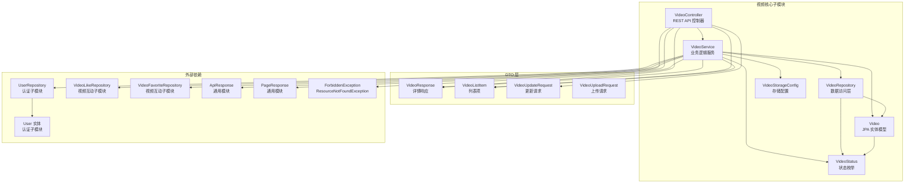
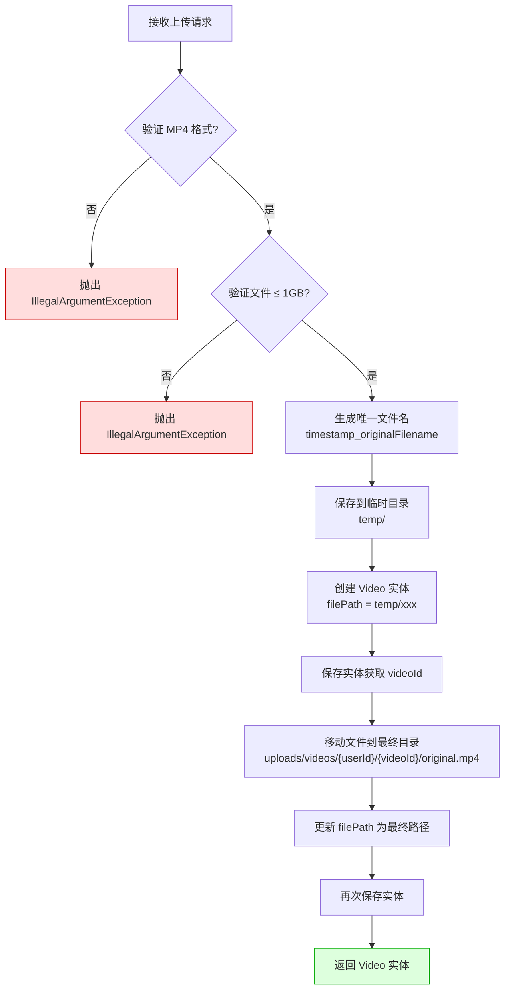
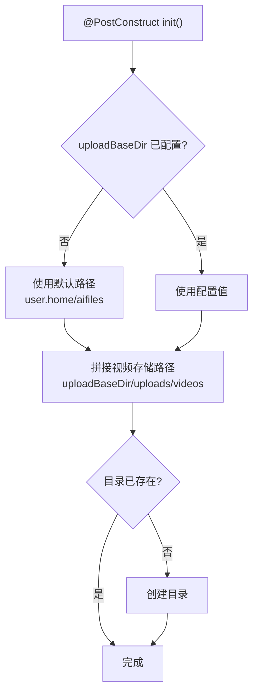
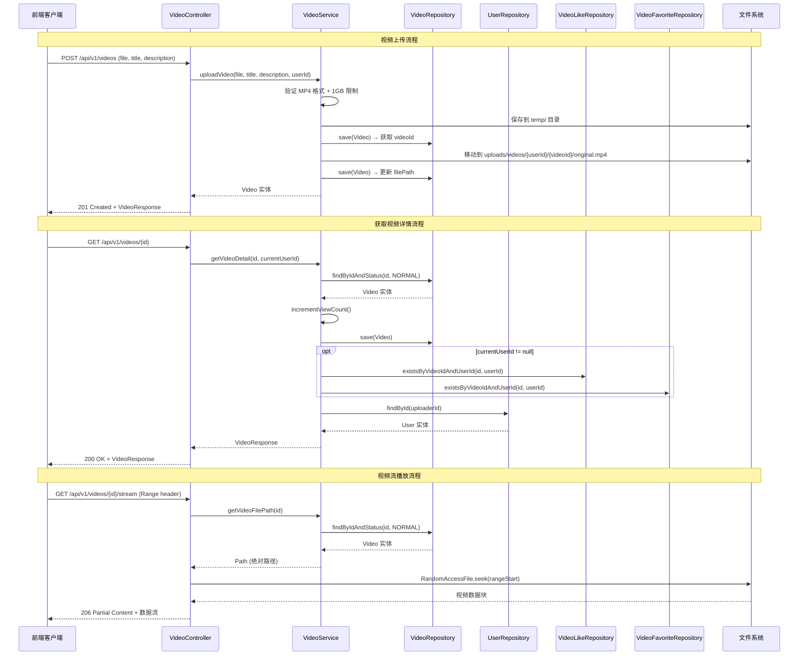
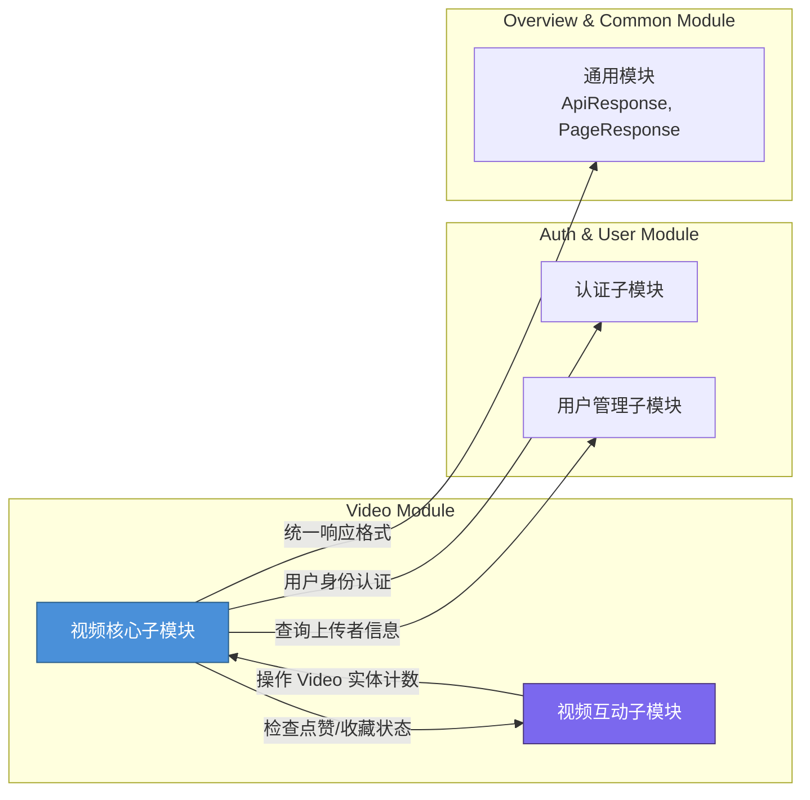
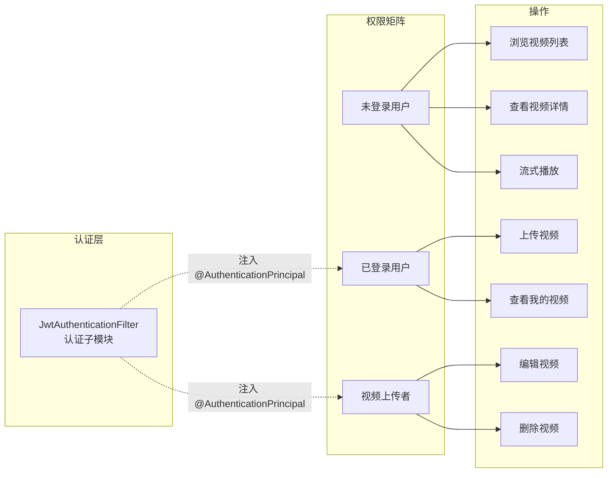

# 视频核心子模块

## 简介

视频核心子模块是 Video Module 的基础子模块，负责视频内容的全生命周期管理，包括视频上传、列表浏览、详情查看、信息更新、软删除以及基于 HTTP Range 的流式播放。该子模块为上层 [视频互动子模块](视频互动子模块.md)（点赞、收藏、评论）提供视频实体支撑，并与 [认证子模块](认证子模块.md) 集成以实现用户身份验证与权限控制。

---

## 架构概览



---

## 核心组件详解

### 1. VideoController（视频控制器）

**文件路径：** `backend/src/main/java/com/iaihub/toolbox/controller/video/VideoController.java`

REST API 控制器，基路径为 `/api/v1/videos`，提供以下端点：

| HTTP 方法 | 路径 | 功能 | 认证要求 | 说明 |
|-----------|------|------|----------|------|
| `POST` | `/api/v1/videos` | 上传视频 | ✅ 需要 | 接收 `MultipartFile` 文件 + 标题 + 描述 |
| `GET` | `/api/v1/videos` | 获取视频列表 | ❌ 无需 | 分页查询，默认 page=0, size=20 |
| `GET` | `/api/v1/videos/{id}` | 获取视频详情 | 🔶 可选 | 未登录用户也可访问，登录用户返回点赞/收藏状态 |
| `PUT` | `/api/v1/videos/{id}` | 更新视频信息 | ✅ 需要 | 仅上传者可编辑 |
| `DELETE` | `/api/v1/videos/{id}` | 删除视频 | ✅ 需要 | 仅上传者可删除（软删除） |
| `GET` | `/api/v1/videos/{id}/stream` | 视频流播放 | ❌ 无需 | 支持 HTTP Range 请求，实现分段加载 |
| `GET` | `/api/v1/videos/my` | 获取我的视频 | ✅ 需要 | 分页查询当前用户上传的视频 |

#### 流式播放机制

`streamVideo` 端点实现了完整的 HTTP Range 请求支持，核心逻辑如下：

- **有 Range 头**：解析 `bytes=start-end`，使用 `RandomAccessFile` 精确定位并返回 `206 Partial Content`，默认每次最多传输 1MB
- **无 Range 头**：返回完整文件，状态码 `200 OK`
- **Range 越界**：返回 `416 Requested Range Not Satisfiable`
- 使用 8KB 缓冲区进行流式写入，避免内存溢出

### 2. VideoService（视频服务）

**文件路径：** `backend/src/main/java/com/iaihub/toolbox/service/video/VideoService.java`

核心业务逻辑层，注入以下依赖：

| 依赖 | 来源 | 用途 |
|------|------|------|
| `VideoRepository` | 本模块 | 视频数据 CRUD |
| `UserRepository` | [认证子模块](认证子模块.md) | 查询上传者信息（用户名、昵称、头像） |
| `VideoLikeRepository` | [视频互动子模块](视频互动子模块.md) | 检查当前用户是否已点赞 |
| `VideoFavoriteRepository` | [视频互动子模块](视频互动子模块.md) | 检查当前用户是否已收藏 |
| `VideoStorageConfig` | 本模块 | 获取视频文件存储路径配置 |

#### 关键业务方法

| 方法 | 事务 | 说明 |
|------|------|------|
| `uploadVideo()` | `@Transactional` | 上传视频：验证 MP4 格式 + 1GB 大小限制 → 临时存储 → 创建实体 → 移动到最终目录 |
| `getVideoList()` | `@Transactional(readOnly)` | 分页查询状态为 NORMAL 的视频，按创建时间倒序 |
| `getVideoDetail()` | `@Transactional` | 获取详情并自增观看次数，登录用户额外返回点赞/收藏状态 |
| `updateVideo()` | `@Transactional` | 权限校验后更新标题和描述 |
| `deleteVideo()` | `@Transactional` | 软删除：将状态设为 `DELETED` |
| `getVideoFilePath()` | — | 返回视频文件绝对路径，供 Controller 流式播放 |
| `getMyVideos()` | `@Transactional(readOnly)` | 分页查询指定用户上传的视频 |

#### 视频上传文件存储流程



### 3. Video（视频实体模型）

**文件路径：** `backend/src/main/java/com/iaihub/toolbox/model/video/Video.java`

JPA 实体，映射到 `video` 表，包含以下字段：

| 字段 | 类型 | 数据库列 | 约束 | 说明 |
|------|------|----------|------|------|
| `id` | `Long` | `id` | 主键，自增 | 视频 ID |
| `title` | `String` | `title` | 非空，最长 200 | 视频标题 |
| `description` | `String` | `description` | TEXT | 视频描述 |
| `filePath` | `String` | `file_path` | 非空，最长 500 | 文件相对路径 |
| `fileName` | `String` | `file_name` | 非空，最长 255 | 原始文件名 |
| `fileSize` | `Long` | `file_size` | 非空 | 文件大小（字节） |
| `duration` | `Integer` | `duration` | 默认 0 | 视频时长（秒） |
| `coverUrl` | `String` | `cover_url` | 最长 500 | 封面图 URL |
| `uploaderId` | `Long` | `uploader_id` | 非空 | 上传者用户 ID |
| `status` | `VideoStatus` | `status` | 非空，最长 20，默认 NORMAL | 视频状态 |
| `viewCount` | `Integer` | `view_count` | 默认 0 | 观看次数 |
| `likeCount` | `Integer` | `like_count` | 默认 0 | 点赞数 |
| `commentCount` | `Integer` | `comment_count` | 默认 0 | 评论数 |
| `createdAt` | `LocalDateTime` | `created_at` | 非空，不可更新 | 创建时间 |
| `updatedAt` | `LocalDateTime` | `updated_at` | 非空 | 更新时间 |

#### 数据库索引

| 索引名 | 列 | 用途 |
|--------|-----|------|
| `idx_video_uploader` | `uploader_id, status` | 加速按上传者查询视频 |
| `idx_video_status_created` | `status, created_at DESC` | 加速按状态+时间排序的视频列表查询 |

#### 内置计数操作方法

| 方法 | 说明 |
|------|------|
| `incrementViewCount()` | 观看次数 +1 |
| `incrementLikeCount()` | 点赞数 +1 |
| `decrementLikeCount()` | 点赞数 -1（不低于 0） |
| `incrementCommentCount()` | 评论数 +1 |

> **注意：** `likeCount` 和 `commentCount` 的实际维护由 [视频互动子模块](视频互动子模块.md) 中的 `VideoInteractionService` 负责，本模块仅提供实体方法。

#### 生命周期回调

- `@PrePersist`：创建时自动设置 `createdAt`、`updatedAt`，并确保 `status` 默认为 `NORMAL`
- `@PreUpdate`：更新时自动刷新 `updatedAt`

### 4. VideoStatus（视频状态枚举）

**文件路径：** `backend/src/main/java/com/iaihub/toolbox/model/video/VideoStatus.java`

| 枚举值 | 说明 |
|--------|------|
| `NORMAL` | 正常状态，视频可见可操作 |
| `DELETED` | 已删除（软删除），不可见 |

使用 `@Enumerated(EnumType.STRING)` 存储为字符串，保证可读性和数据库兼容性。

### 5. VideoRepository（视频数据访问层）

**文件路径：** `backend/src/main/java/com/iaihub/toolbox/repository/video/VideoRepository.java`

继承 `JpaRepository<Video, Long>`，提供以下自定义查询方法：

| 方法 | 返回类型 | 说明 |
|------|----------|------|
| `findByStatusOrderByCreatedAtDesc(VideoStatus, Pageable)` | `Page<Video>` | 按状态分页查询，按创建时间倒序 |
| `findByUploaderIdAndStatusOrderByCreatedAtDesc(Long, VideoStatus, Pageable)` | `Page<Video>` | 按上传者+状态分页查询，按创建时间倒序 |
| `findByIdAndStatus(Long, VideoStatus)` | `Optional<Video>` | 按 ID+状态查询单个视频 |

### 6. VideoStorageConfig（视频存储配置）

**文件路径：** `backend/src/main/java/com/iaihub/toolbox/config/VideoStorageConfig.java`

负责视频文件存储路径的配置与初始化。

#### 配置属性

| 属性 | 配置键 | 默认值 | 说明 |
|------|--------|--------|------|
| `uploadBaseDir` | `app.upload.base-dir` | `{user.home}/aifiles` | 上传根目录 |
| `videoStoragePath` | —（计算得出） | `{uploadBaseDir}/uploads/videos` | 视频存储目录绝对路径 |

#### 初始化流程



---

## DTO 数据结构

### VideoResponse（视频详情响应）

用于 `GET /{id}` 和 `PUT /{id}` 接口的响应，包含视频完整信息及上传者信息和用户互动状态。

| 字段 | 类型 | 说明 |
|------|------|------|
| `id` | `Long` | 视频 ID |
| `title` | `String` | 标题 |
| `description` | `String` | 描述 |
| `coverUrl` | `String` | 封面 URL |
| `duration` | `Integer` | 时长（秒） |
| `fileSize` | `Long` | 文件大小（字节） |
| `viewCount` | `Integer` | 观看次数 |
| `likeCount` | `Integer` | 点赞数 |
| `commentCount` | `Integer` | 评论数 |
| `uploaderId` | `Long` | 上传者 ID |
| `uploaderName` | `String` | 上传者用户名 |
| `uploaderNickname` | `String` | 上传者昵称 |
| `uploaderAvatarUrl` | `String` | 上传者头像 URL |
| `userLiked` | `Boolean` | 当前用户是否已点赞 |
| `userFavorited` | `Boolean` | 当前用户是否已收藏 |
| `createdAt` | `LocalDateTime` | 创建时间 |
| `updatedAt` | `LocalDateTime` | 更新时间 |

### VideoListItem（视频列表项）

用于 `GET /` 和 `GET /my` 接口的分页列表响应，是 `VideoResponse` 的精简版本，不包含 `description`、`fileSize`、`userLiked`、`userFavorited`、`updatedAt` 字段。

### VideoUpdateRequest（视频更新请求）

| 字段 | 类型 | 校验 | 说明 |
|------|------|------|------|
| `title` | `String` | `@NotBlank`，`@Size(max=200)` | 视频标题 |
| `description` | `String` | — | 视频描述（可选） |

### VideoUploadRequest（视频上传请求）

与 `VideoUpdateRequest` 结构相同，用于文档化上传接口的表单字段（实际上传通过 `@RequestParam` 接收，非 `@RequestBody`）。

---

## API 请求/响应数据流



---

## 模块依赖关系



### 依赖说明

| 依赖方向 | 依赖模块 | 依赖内容 | 说明 |
|----------|----------|----------|------|
| 本模块 → [用户管理子模块](用户管理子模块.md) | `UserRepository`、`User` | 查询视频上传者的用户名、昵称、头像信息 | 在 `toVideoListItem` 和 `toVideoResponse` 中使用 |
| 本模块 → [视频互动子模块](视频互动子模块.md) | `VideoLikeRepository`、`VideoFavoriteRepository` | 检查当前用户对视频的点赞和收藏状态 | 在 `getVideoDetail` 中使用 |
| 本模块 → [通用模块](通用模块.md) | `ApiResponse`、`PageResponse` | 统一 API 响应格式和分页响应封装 | Controller 层使用 |
| 本模块 → [认证子模块](认证子模块.md) | `@AuthenticationPrincipal User` | JWT 认证后的用户身份注入 | Controller 层使用 |
| [视频互动子模块](视频互动子模块.md) → 本模块 | `Video` 实体的计数方法 | 点赞/收藏/评论操作后更新 Video 的 `likeCount`、`commentCount` | 反向依赖 |

---

## 文件存储结构

```
{uploadBaseDir}/                          # 默认: ~/aifiles
└── uploads/
    └── videos/
        ├── temp/                         # 临时上传目录
        │   └── {timestamp}_{filename}    # 临时文件
        └── {userId}/                     # 按用户分组
            └── {videoId}/                # 按视频 ID 分组
                └── original.mp4          # 最终视频文件
```

---

## 异常处理

本模块通过以下异常类实现错误处理（定义于通用异常层）：

| 异常类 | HTTP 状态码 | 触发场景 |
|--------|-------------|----------|
| `IllegalArgumentException` | 400 | 上传非 MP4 格式文件、文件超过 1GB |
| `ResourceNotFoundException` | 404 | 视频不存在、已删除、文件物理丢失 |
| `ForbiddenException` | 403 | 非上传者尝试编辑或删除视频 |

---

## 安全与权限控制



| 操作 | 未登录 | 已登录（非上传者） | 上传者 |
|------|--------|-------------------|--------|
| 浏览视频列表 | ✅ | ✅ | ✅ |
| 查看视频详情 | ✅（不返回互动状态） | ✅ | ✅ |
| 流式播放 | ✅ | ✅ | ✅ |
| 上传视频 | ❌ | ✅ | ✅ |
| 编辑视频 | ❌ | ❌ | ✅ |
| 删除视频 | ❌ | ❌ | ✅ |
| 查看我的视频 | ❌ | ✅ | ✅ |

---

## 与前端类型的映射

前端类型定义于 `frontend/src/types/video.ts`，与本模块后端 DTO 的对应关系：

| 前端类型 | 后端 DTO/实体 | 说明 |
|----------|---------------|------|
| `VideoDetail` | `VideoResponse` | 视频详情 |
| `VideoListItem` | `VideoListItem` | 视频列表项 |
| `VideoUploadRequest` | `VideoUploadRequest` | 上传请求 |
| `VideoUpdateRequest` | `VideoUpdateRequest` | 更新请求 |
| `VideoPageResponse` | `PageResponse<VideoListItem>` | 分页响应 |
| `VideoInteractionResponse` | `VideoInteractionResponse` | 互动响应（[视频互动子模块](视频互动子模块.md)） |
| `VideoComment` | `VideoCommentResponse` | 评论（[视频互动子模块](视频互动子模块.md)） |
