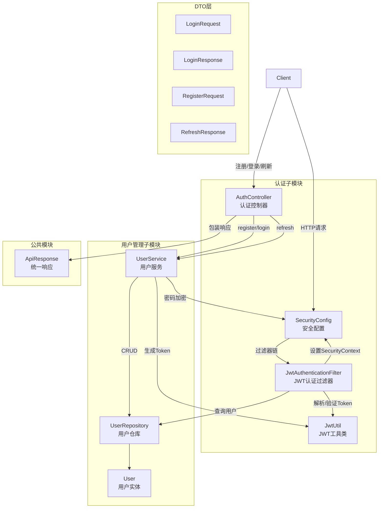
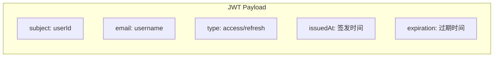
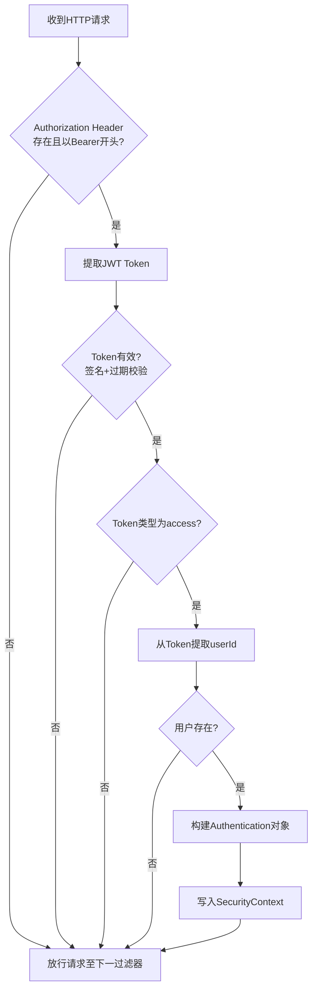
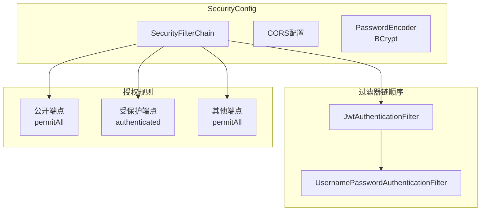
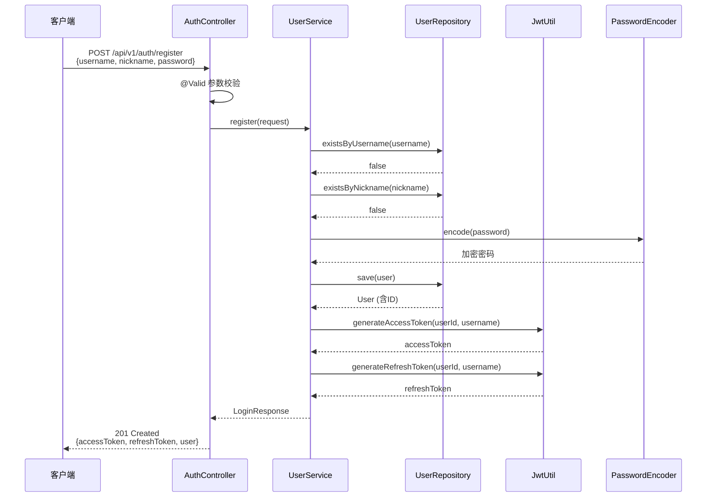
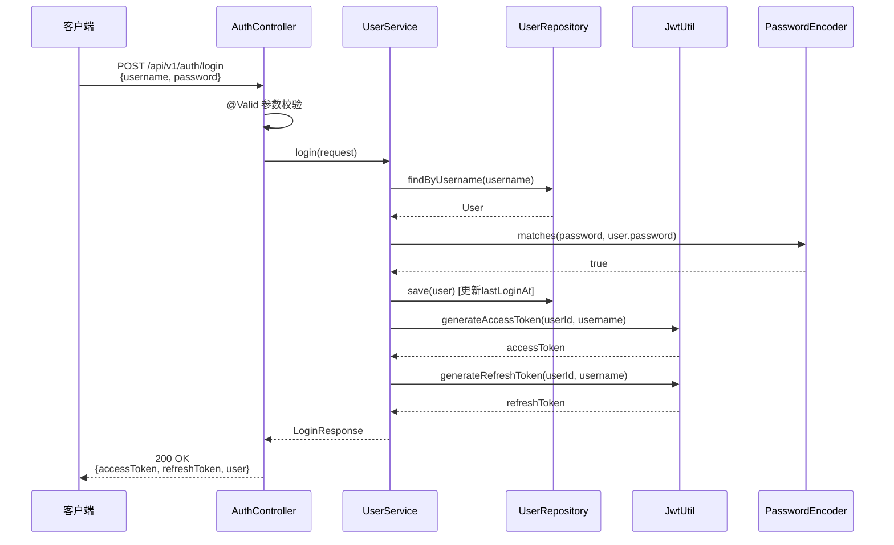
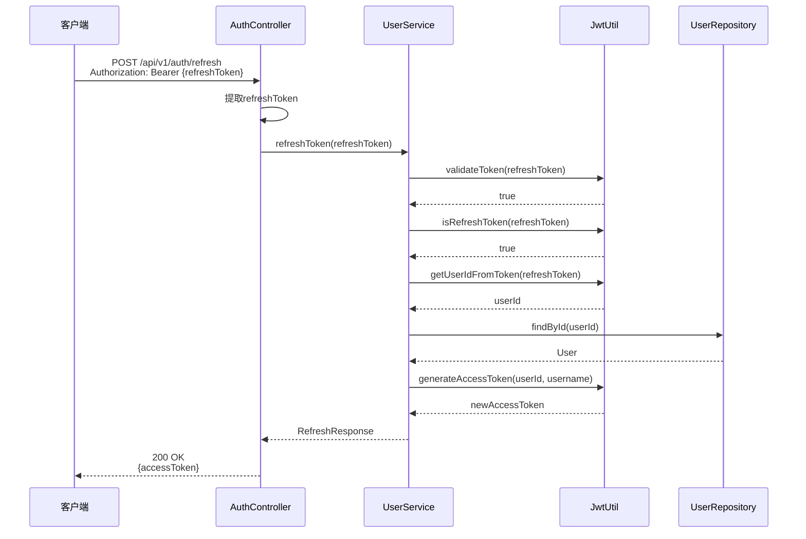
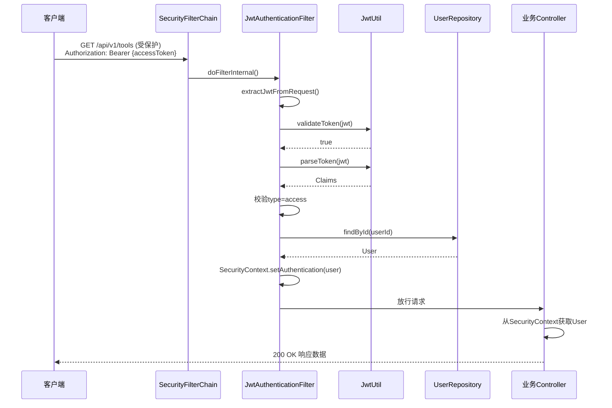
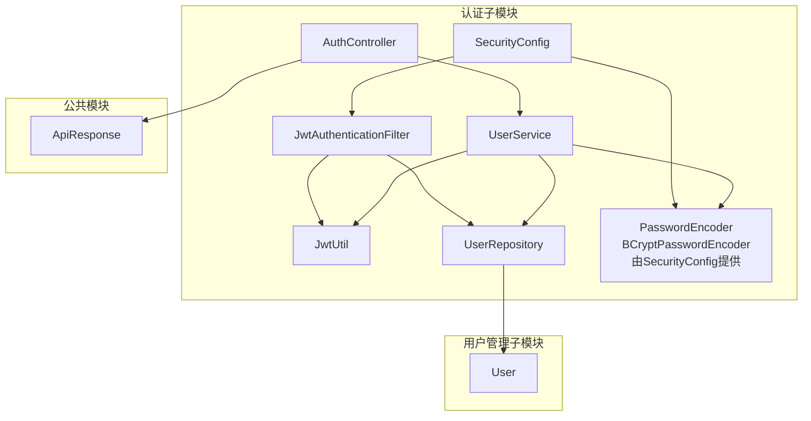

# 认证子模块

## 简介

认证子模块是 **Auth & User 模块** 的核心组成部分，负责系统的用户身份认证与授权。该子模块基于 **JWT（JSON Web Token）** 实现无状态认证机制，提供用户注册、登录、令牌刷新三大核心功能，并通过 Spring Security 过滤器链对每个 HTTP 请求进行统一的身份校验。

认证子模块与 [用户管理子模块](用户管理子模块.md) 紧密协作：认证子模块负责"你是谁"的身份验证，用户管理子模块负责"你的信息"的数据管理。两者共享 `UserService` 作为业务逻辑中枢。

---

## 架构总览

---

## 核心组件

### 1. AuthController — 认证控制器

**文件**: `backend/src/main/java/com/iaihub/toolbox/controller/AuthController.java`

认证入口控制器，暴露三个 RESTful 端点，所有路径前缀为 `/api/v1/auth`。

| 端点 | 方法 | 功能 | 请求体 | 响应体 | HTTP状态码 |
|------|------|------|--------|--------|-----------|
| `/api/v1/auth/register` | POST | 用户注册 | `RegisterRequest` | `ApiResponse<LoginResponse>` | 201 Created |
| `/api/v1/auth/login` | POST | 用户登录 | `LoginRequest` | `ApiResponse<LoginResponse>` | 200 OK |
| `/api/v1/auth/refresh` | POST | 刷新令牌 | Authorization Header | `ApiResponse<RefreshResponse>` | 200 OK |

**关键设计**：
- 控制器层不包含业务逻辑，全部委托给 `UserService` 处理
- 使用 `@Valid` 注解触发请求体参数校验
- 注册和登录成功后直接返回双令牌（accessToken + refreshToken），客户端无需再次请求登录
- 刷新端点通过 `Authorization` 请求头传递 refreshToken，而非请求体

---

### 2. JwtUtil — JWT 工具类

**文件**: `backend/src/main/java/com/iaihub/toolbox/util/JwtUtil.java`

封装 JWT 的生成、解析与验证逻辑，是整个认证体系的基础设施。

**配置参数**（通过 `application.yml` 注入）：

| 参数 | 配置键 | 说明 |
|------|--------|------|
| 密钥 | `app.jwt.secret` | HMAC-SHA 签名密钥 |
| Access Token 过期时间 | `app.jwt.access-token-expiration` | 访问令牌有效期（毫秒） |
| Refresh Token 过期时间 | `app.jwt.refresh-token-expiration` | 刷新令牌有效期（毫秒） |

**Token 结构**：

**核心方法**：

| 方法 | 功能 |
|------|------|
| `generateAccessToken(userId, email)` | 生成访问令牌（type=access） |
| `generateRefreshToken(userId, email)` | 生成刷新令牌（type=refresh） |
| `parseToken(token)` | 解析 Token 并返回 Claims |
| `validateToken(token)` | 验证 Token 有效性（签名+过期） |
| `isRefreshToken(token)` | 判断是否为刷新令牌 |
| `getUserIdFromToken(token)` | 从 Token 中提取用户 ID |

**双令牌机制**：系统采用 Access Token + Refresh Token 的双令牌策略。Access Token 有效期较短，用于日常 API 请求认证；Refresh Token 有效期较长，仅用于获取新的 Access Token，降低令牌泄露风险。

---

### 3. JwtAuthenticationFilter — JWT 认证过滤器

**文件**: `backend/src/main/java/com/iaihub/toolbox/config/JwtAuthenticationFilter.java`

继承 `OncePerRequestFilter`，在每个 HTTP 请求处理前执行一次，负责从请求中提取并验证 JWT，将认证信息写入 Spring Security 上下文。

**处理流程**：

**关键设计**：
- 仅接受 `type=access` 的令牌，拒绝使用 refresh token 直接访问 API
- 通过 `UserRepository.findById()` 查询用户实体，确保用户仍然存在
- 认证异常被捕获并记录日志，不会中断请求链，未认证请求将以匿名身份继续
- 认证成功后，`User` 实体被设置为主体（principal），后续可通过 `SecurityContextHolder` 获取

---

### 4. SecurityConfig — 安全配置

**文件**: `backend/src/main/java/com/iaihub/toolbox/config/SecurityConfig.java`

Spring Security 的核心配置类，定义过滤器链、授权规则、CORS 策略和密码编码器。

**安全策略架构**：

**公开端点（无需认证）**：

| 路径模式 | 说明 |
|----------|------|
| `/api/v1/auth/**` | 所有认证端点（注册、登录、刷新） |
| `GET /api/v1/tools`, `/api/v1/tools/{id}` | 工具列表与详情（公开浏览） |
| `GET /api/v1/tools/{id}/comments` | 工具评论（公开查看） |
| `GET /api/v1/tools/{id}/like-status` | 工具点赞状态（公开查看） |
| `GET /api/v1/categories` | 分类列表（公开查看） |
| `GET /api/v1/tools/{toolId}/files` | 工具文件列表（公开查看） |
| `GET /api/v1/tools/{toolId}/files/{fileId}/download` | 文件下载（公开） |
| `POST /api/v1/tools/{toolId}/files` | 文件上传（公开） |
| `GET /api/v1/static/avatars/**` | 头像静态资源 |
| `GET /api/v1/users/{id}` | 公开用户资料 |
| `/mcp/**`, `/sse` | MCP 端点（无认证） |
| `GET /api/v1/videos`, `/api/v1/videos/{id}` | 视频列表与详情（公开浏览） |
| `GET /api/v1/videos/{id}/stream` | 视频流（公开） |
| `GET /api/v1/videos/{id}/comments` | 视频评论（公开查看） |

**受保护端点（需要认证）**：

| 路径模式 | 说明 |
|----------|------|
| `/api/v1/videos/**`（非GET公开部分） | 视频管理操作 |
| `/api/v1/tools/**`（非GET公开部分） | 工具管理操作 |
| `/api/v1/users/**`（非GET公开部分） | 用户管理操作 |

**关键配置项**：
- **CSRF**: 禁用（无状态 API 不需要）
- **Session**: `STATELESS` — 不创建 HTTP Session，完全依赖 JWT
- **CORS**: 允许所有来源、标准 HTTP 方法、所有请求头，支持凭证，预检缓存 3600 秒
- **密码编码**: `BCryptPasswordEncoder` — 用于密码哈希存储与验证

---

### 5. DTO 数据传输对象

#### LoginRequest

| 字段 | 类型 | 校验规则 | 说明 |
|------|------|----------|------|
| `username` | String | `@NotBlank` | 用户名 |
| `password` | String | `@NotBlank` | 密码 |

#### RegisterRequest

| 字段 | 类型 | 校验规则 | 说明 |
|------|------|----------|------|
| `username` | String | `@NotBlank`, `@Size(4-20)`, `@Pattern(字母数字下划线)` | 用户名 |
| `nickname` | String | `@NotBlank`, `@Size(2-10)`, `@Pattern(中文字母数字)` | 昵称 |
| `password` | String | `@NotBlank`, `@Size(min=6)` | 密码 |

#### LoginResponse

| 字段 | 类型 | 说明 |
|------|------|------|
| `accessToken` | String | 访问令牌 |
| `refreshToken` | String | 刷新令牌 |
| `user` | `UserDTO`（内部类） | 用户基本信息 |

**LoginResponse.UserDTO**（内部类）：

| 字段 | 类型 | 说明 |
|------|------|------|
| `id` | Long | 用户 ID |
| `username` | String | 用户名 |
| `nickname` | String | 昵称 |
| `avatarUrl` | String | 头像 URL |

#### RefreshResponse

| 字段 | 类型 | 说明 |
|------|------|------|
| `accessToken` | String | 新的访问令牌 |

---

## 核心业务流程

### 注册流程

### 登录流程

### 令牌刷新流程

### 请求认证流程

---

## 组件依赖关系

---

## 与其他模块的关系

| 关联模块 | 关系说明 |
|----------|----------|
| [用户管理子模块](用户管理子模块.md) | `UserService` 是认证子模块与用户管理子模块的共享业务层。认证子模块的 `AuthController` 委托 `UserService` 处理注册/登录/刷新逻辑；`JwtAuthenticationFilter` 通过 `UserRepository` 查询用户实体。`User` 模型、`UserRepository`、`UserDTO` 均属于用户管理子模块。 |
| [头像管理子模块](头像管理子模块.md) | `UserService` 同时承担头像上传/删除逻辑，但该功能属于头像管理子模块范畴。认证子模块的 `LoginResponse.UserDTO` 中包含 `avatarUrl` 字段，与头像管理子模块的数据相关联。 |
| [Overview & Common Module](OverviewAndCommonModule.md) | `ApiResponse` 统一响应包装类属于公共模块，被 `AuthController` 用于标准化所有 API 响应格式。 |

---

## 安全设计要点

### 1. 无状态认证
系统采用 `SessionCreationPolicy.STATELESS`，不创建和维护 HTTP Session，完全依赖 JWT 进行身份认证，适合分布式部署和水平扩展。

### 2. 双令牌策略
- **Access Token**：有效期短，用于 API 请求认证，存储在客户端内存中
- **Refresh Token**：有效期长，仅用于刷新 Access Token，降低长期凭证暴露风险

### 3. 密码安全
- 使用 `BCryptPasswordEncoder` 对密码进行加盐哈希存储
- 登录时使用 `passwordEncoder.matches()` 进行密码比对，不存储明文密码

### 4. Token 类型隔离
`JwtAuthenticationFilter` 严格校验 Token 类型，仅接受 `type=access` 的令牌，防止 Refresh Token 被误用于 API 访问。

### 5. 最小权限公开策略
安全配置采用白名单模式，默认所有端点需要认证，仅显式声明的公开端点允许匿名访问，确保未授权端点不会被意外暴露。

### 6. CORS 安全
配置允许跨域访问以支持前后端分离架构，同时设置 `allowCredentials=true` 以支持携带认证信息的跨域请求。
