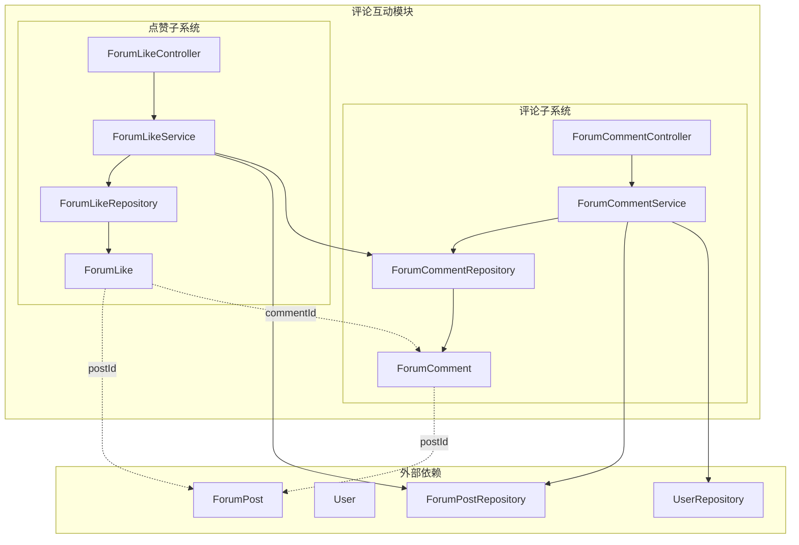
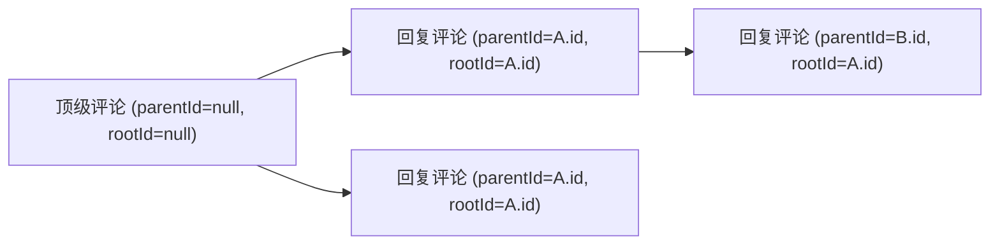
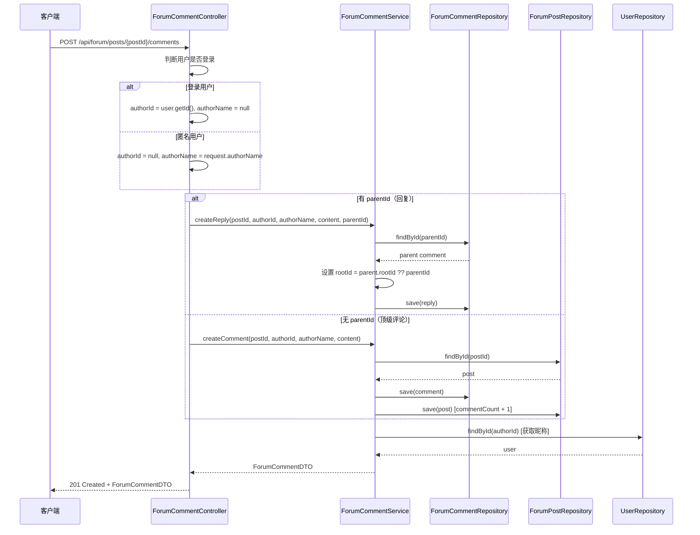
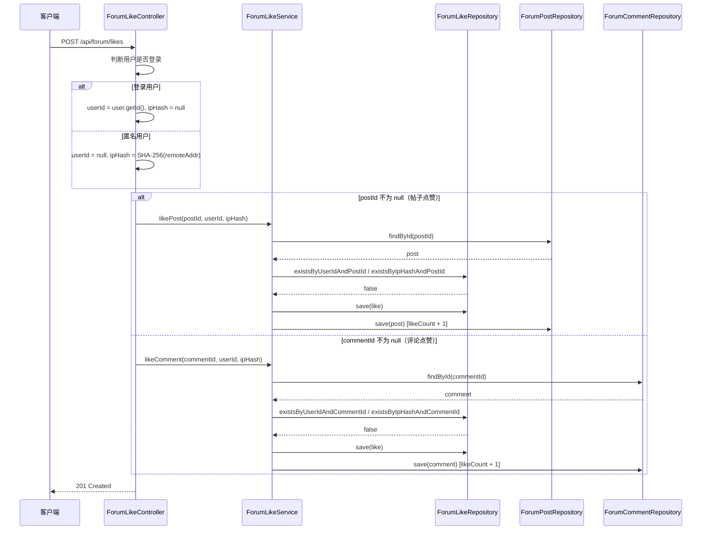
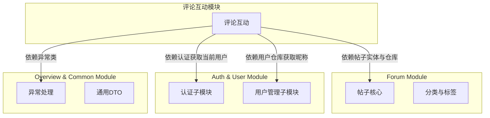

# 评论互动模块

## 模块简介

评论互动模块是 [Forum Module](Forum.md) 的核心子模块之一，负责论坛帖子下的评论管理与点赞互动功能。该模块支持嵌套回复（父子评论结构）、匿名/登录用户双模式评论与点赞，并自动维护帖子与评论的计数统计。

### 核心能力

| 能力 | 说明 |
|------|------|
| 评论创建 | 登录用户与匿名用户均可发表评论，支持嵌套回复 |
| 评论查询 | 按帖子 ID 获取全部评论，按创建时间升序排列 |
| 评论删除 | 仅评论作者可删除自己的评论 |
| 帖子点赞 | 对帖子进行点赞/取消点赞，支持登录与匿名用户 |
| 评论点赞 | 对评论进行点赞，支持登录与匿名用户 |
| 计数同步 | 评论/点赞操作自动更新帖子和评论的计数字段 |

---

## 架构总览



---

## 组件详解

### 1. 评论子系统

#### 1.1 ForumCommentController

评论相关的 REST API 控制器，提供评论的增删查接口。

| HTTP 方法 | 路径 | 说明 | 认证要求 |
|-----------|------|------|----------|
| `GET` | `/api/forum/posts/{postId}/comments` | 获取帖子下所有评论 | 无 |
| `POST` | `/api/forum/posts/{postId}/comments` | 创建评论或回复 | 可选（匿名可评论） |
| `DELETE` | `/api/forum/comments/{id}` | 删除评论 | 必须登录（仅作者可删） |

**双模式评论逻辑：**
- **登录用户**：通过 `@AuthenticationPrincipal User` 获取用户信息，`authorId` 设为用户 ID，`authorName` 置空
- **匿名用户**：使用请求体中的 `authorName` 字段作为评论者名称，`authorId` 为 null

**评论 vs 回复判断：** 根据 `ForumCommentCreateRequest.parentId` 是否为 null 区分是顶级评论还是对某条评论的回复。

#### 1.2 ForumCommentService

评论业务逻辑层，核心方法如下：

| 方法 | 事务 | 说明 |
|------|------|------|
| `getCommentsByPostId(Long postId)` | 否 | 查询帖子下所有评论并转换为 DTO |
| `createComment(...)` | `@Transactional` | 创建顶级评论，同步增加帖子 `commentCount` |
| `createReply(...)` | `@Transactional` | 创建回复评论，设置 `parentId` 和 `rootId` |
| `deleteComment(...)` | `@Transactional` | 删除评论（需作者验证），同步减少帖子 `commentCount` |

**嵌套回复设计：**



- `parentId`：直接父评论 ID
- `rootId`：根评论 ID（即顶级评论的 ID），用于快速查询整个评论树

**作者信息解析：** `toDTO()` 方法中，若 `authorId` 不为 null，则从 `UserRepository` 查询用户昵称填充 `authorNickname` 字段。

#### 1.3 ForumComment 实体

| 字段 | 类型 | 说明 |
|------|------|------|
| `id` | `Long` | 主键，自增 |
| `postId` | `Long` | 所属帖子 ID（非空） |
| `authorId` | `Long` | 作者用户 ID（匿名时为 null） |
| `authorName` | `String` | 匿名作者名称（登录用户为 null） |
| `parentId` | `Long` | 父评论 ID（顶级评论为 null） |
| `rootId` | `Long` | 根评论 ID（顶级评论为 null） |
| `content` | `String` | 评论内容（TEXT 类型） |
| `likeCount` | `Integer` | 点赞数（默认 0） |
| `createdAt` | `LocalDateTime` | 创建时间 |
| `updatedAt` | `LocalDateTime` | 更新时间 |

**数据库索引：**
- `idx_forum_comment_post`：`post_id` 列索引，加速按帖子查询评论
- `idx_forum_comment_root`：`root_id` 列索引，加速按根评论查询回复树

#### 1.4 ForumCommentRepository

| 方法 | 说明 |
|------|------|
| `findByPostIdOrderByCreatedAtAsc(Long postId)` | 按帖子 ID 查询评论，创建时间升序 |
| `findByRootId(Long rootId)` | 按根评论 ID 查询所有回复 |
| `findByParentId(Long parentId)` | 按父评论 ID 查询直接回复 |
| `countByPostId(Long postId)` | 统计帖子评论数 |

#### 1.5 评论 DTO

**ForumCommentCreateRequest（请求）：**

```java
public record ForumCommentCreateRequest(
    @NotBlank String content,   // 评论内容（必填）
    Long parentId,              // 父评论 ID（回复时填写）
    String authorName           // 匿名作者名称（匿名评论时填写）
) {}
```

**ForumCommentDTO（响应）：**

```java
public record ForumCommentDTO(
    Long id,                    // 评论 ID
    Long postId,                // 帖子 ID
    Long authorId,              // 作者用户 ID
    String authorName,          // 匿名作者名称
    String authorNickname,      // 作者昵称（登录用户）
    Long parentId,              // 父评论 ID
    Long rootId,                // 根评论 ID
    String content,             // 评论内容
    Integer likeCount,          // 点赞数
    LocalDateTime createdAt     // 创建时间
) {}
```

> **注意：** 模块中还存在一个 `CreateCommentRequest` DTO（位于 `com.iaihub.toolbox.dto` 包），这是一个较简单的评论请求类，仅包含 `content` 字段。当前评论互动模块主要使用 `ForumCommentCreateRequest`。

---

### 2. 点赞子系统

#### 2.1 ForumLikeController

点赞相关的 REST API 控制器，统一路径为 `/api/forum/likes`。

| HTTP 方法 | 路径 | 说明 | 认证要求 |
|-----------|------|------|----------|
| `POST` | `/api/forum/likes` | 点赞（帖子或评论） | 可选（匿名可点赞） |
| `DELETE` | `/api/forum/likes` | 取消点赞（仅帖子） | 可选 |

**双模式点赞逻辑：**
- **登录用户**：使用 `userId` 作为唯一标识
- **匿名用户**：对客户端 IP 进行 SHA-256 哈希后作为 `ipHash` 唯一标识

**点赞目标判断：** 根据 `ForumLikeRequest` 中的 `postId` 或 `commentId` 判断是对帖子还是评论点赞。

#### 2.2 ForumLikeService

点赞业务逻辑层，核心方法如下：

| 方法 | 事务 | 说明 |
|------|------|------|
| `likePost(Long postId, Long userId, String ipHash)` | `@Transactional` | 帖子点赞，防重复，同步增加帖子 `likeCount` |
| `unlikePost(Long postId, Long userId, String ipHash)` | `@Transactional` | 帖子取消点赞，同步减少帖子 `likeCount` |
| `likeComment(Long commentId, Long userId, String ipHash)` | `@Transactional` | 评论点赞，防重复，同步增加评论 `likeCount` |

**防重复点赞机制：**
- 登录用户：通过 `existsByUserIdAndPostId` / `existsByUserIdAndCommentId` 检查
- 匿名用户：通过 `existsByIpHashAndPostId` / `existsByIpHashAndCommentId` 检查
- 若已点赞则抛出 `BusinessException("已点赞")`

#### 2.3 ForumLike 实体

| 字段 | 类型 | 说明 |
|------|------|------|
| `id` | `Long` | 主键，自增 |
| `postId` | `Long` | 点赞的帖子 ID（与 commentId 互斥） |
| `commentId` | `Long` | 点赞的评论 ID（与 postId 互斥） |
| `userId` | `Long` | 点赞用户 ID（匿名时为 null） |
| `ipHash` | `String` | 匿名用户 IP 哈希（登录用户为 null） |
| `createdAt` | `LocalDateTime` | 创建时间 |

> `postId` 和 `commentId` 互斥：一条点赞记录要么针对帖子，要么针对评论。

#### 2.4 ForumLikeRepository

| 方法 | 说明 |
|------|------|
| `findByUserIdAndPostId(Long, Long)` | 按用户 ID 和帖子 ID 查找点赞 |
| `findByIpHashAndPostId(String, Long)` | 按 IP 哈希和帖子 ID 查找点赞 |
| `findByUserIdAndCommentId(Long, Long)` | 按用户 ID 和评论 ID 查找点赞 |
| `findByIpHashAndCommentId(String, Long)` | 按 IP 哈希和评论 ID 查找点赞 |
| `existsByUserIdAndPostId(Long, Long)` | 判断用户是否已点赞帖子 |
| `existsByIpHashAndPostId(String, Long)` | 判断匿名用户是否已点赞帖子 |
| `existsByUserIdAndCommentId(Long, Long)` | 判断用户是否已点赞评论 |
| `existsByIpHashAndCommentId(String, Long)` | 判断匿名用户是否已点赞评论 |

#### 2.5 ForumLikeRequest DTO

```java
public record ForumLikeRequest(
    Long postId,        // 帖子 ID
    Long commentId      // 评论 ID
) {
    // 构造器校验：postId 和 commentId 必须且只能有一个非 null
}
```

构造时进行参数校验：
- 两者都为 null → 抛出 `IllegalArgumentException`
- 两者都不为 null → 抛出 `IllegalArgumentException`

---

## 数据流

### 评论创建流程



### 点赞流程



---

## 异常处理

本模块使用全局异常体系，相关异常类定义在 `com.iaihub.toolbox.exception` 包下：

| 异常类 | HTTP 状态码 | 触发场景 |
|--------|-------------|----------|
| `ResourceNotFoundException` | 404 | 帖子/评论/父评论不存在 |
| `ForbiddenException` | 403 | 非评论作者尝试删除评论 |
| `BusinessException` | 400 | 重复点赞 |
| `IllegalArgumentException` | - | `ForumLikeRequest` 参数校验失败 |

---

## 模块依赖关系



### 依赖说明

| 依赖模块 | 依赖内容 | 用途 |
|----------|----------|------|
| [Forum Module - 帖子核心](Forum.md) | `ForumPost`、`ForumPostRepository` | 验证帖子存在性、维护帖子评论/点赞计数 |
| [Auth & User Module - 用户管理](Auth_User.md) | `User`、`UserRepository` | 获取登录用户信息、查询作者昵称 |
| [Auth & User Module - 认证](Auth_User.md) | `@AuthenticationPrincipal`、JWT 认证 | 识别当前请求用户身份 |
| [Overview & Common Module](Overview_Common.md) | `BusinessException`、`ResourceNotFoundException`、`ForbiddenException` | 统一异常处理 |

---

## 前端类型定义

前端 TypeScript 类型定义位于 `frontend/src/types/forum.ts`：

```typescript
// 评论类型
interface ForumComment {
  id: number;
  postId: number;
  authorId: number | null;
  authorName: string | null;
  authorNickname?: string | null;
  parentId: number | null;
  rootId: number | null;
  content: string;
  likeCount: number;
  createdAt: string;
}

// 创建评论请求
interface ForumCommentCreateRequest {
  content: string;
  parentId?: number;
  authorName?: string;
}

// 点赞请求
interface ForumLikeRequest {
  postId?: number;
  commentId?: number;
}
```

---

## API 接口汇总

### 评论接口

| 方法 | 路径 | 请求体 | 响应 | 状态码 |
|------|------|--------|------|--------|
| `GET` | `/api/forum/posts/{postId}/comments` | - | `List<ForumCommentDTO>` | 200 |
| `POST` | `/api/forum/posts/{postId}/comments` | `ForumCommentCreateRequest` | `ForumCommentDTO` | 201 |
| `DELETE` | `/api/forum/comments/{id}` | - | - | 204 |

### 点赞接口

| 方法 | 路径 | 请求体 | 响应 | 状态码 |
|------|------|--------|------|--------|
| `POST` | `/api/forum/likes` | `ForumLikeRequest` | - | 201 |
| `DELETE` | `/api/forum/likes` | `ForumLikeRequest` | - | 204 |

---

## 设计要点

### 1. 匿名与登录双模式

评论和点赞均支持匿名用户参与，通过以下机制实现：
- **评论**：匿名用户通过 `authorName` 标识，登录用户通过 `authorId` 标识
- **点赞**：匿名用户通过 IP 的 SHA-256 哈希标识，登录用户通过 `userId` 标识
- IP 哈希化处理保护用户隐私，避免明文存储 IP 地址

### 2. 嵌套评论树结构

采用 `parentId` + `rootId` 双字段设计：
- `parentId` 指向直接父评论，支持多级嵌套回复
- `rootId` 指向顶级评论，便于一次性查询整个评论树
- 顶级评论的 `parentId` 和 `rootId` 均为 null

### 3. 计数同步维护

评论和点赞操作会在事务内同步更新关联实体的计数字段：
- 创建评论 → 帖子 `commentCount + 1`
- 删除评论 → 帖子 `commentCount - 1`（最小为 0）
- 帖子点赞 → 帖子 `likeCount + 1`
- 帖子取消点赞 → 帖子 `likeCount - 1`（最小为 0）
- 评论点赞 → 评论 `likeCount + 1`

这些计数字段直接影响 [Forum Module - 帖子核心](Forum.md) 中帖子的热度评分（`score = viewCount * 1 + likeCount * 3 + commentCount * 5`）。

### 4. 防重复点赞

通过数据库查询实现防重复：
- 点赞前先检查是否已存在记录
- 已存在则抛出 `BusinessException("已点赞")`
- 取消点赞时通过 `userId` 或 `ipHash` 查找并删除记录
