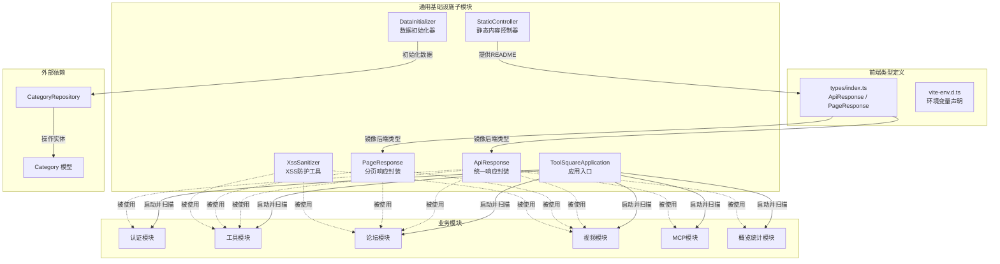
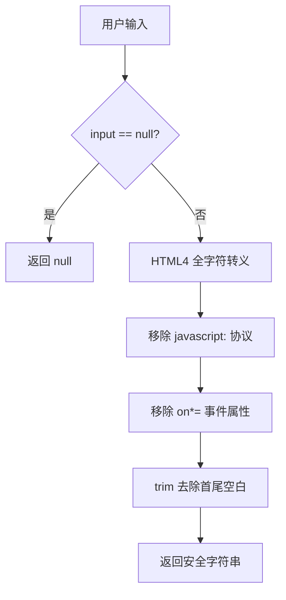
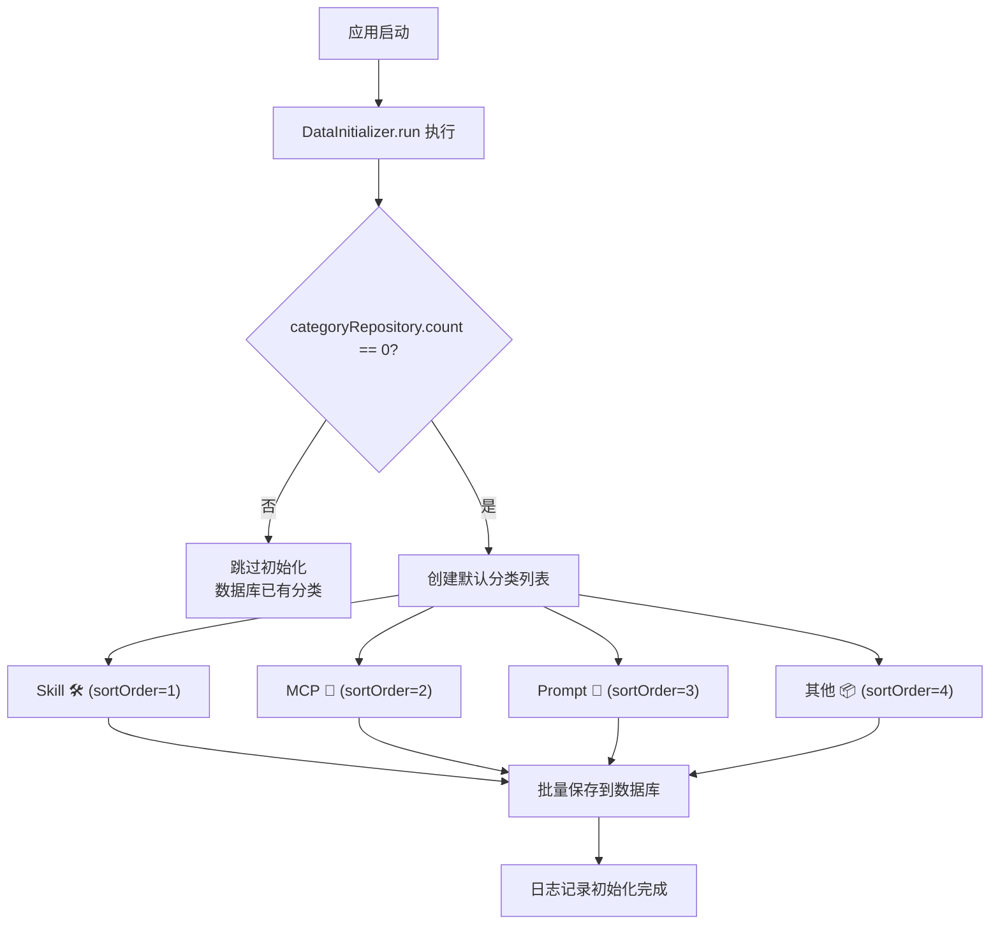
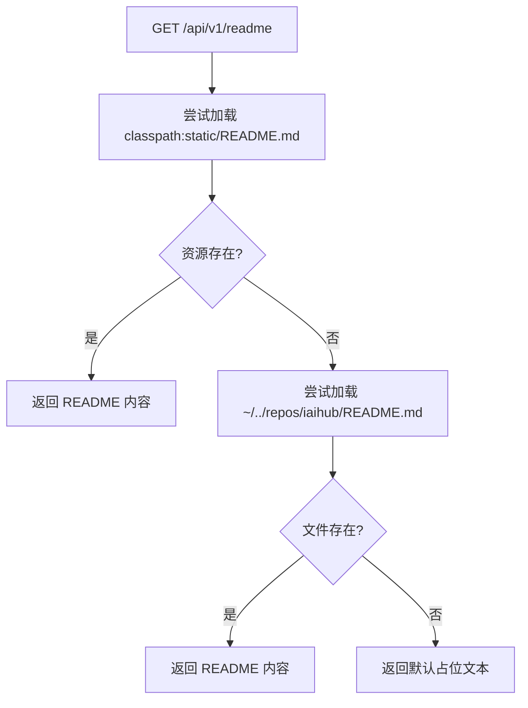
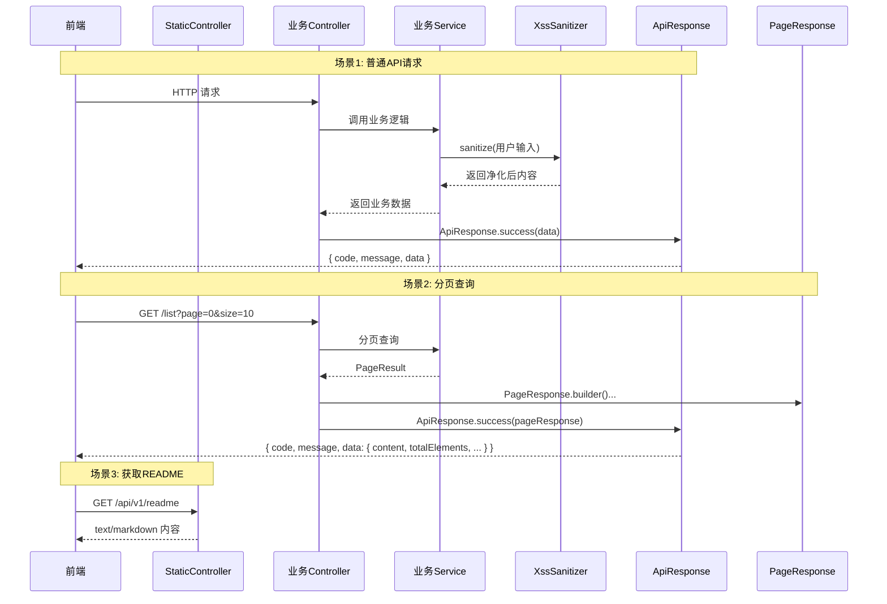
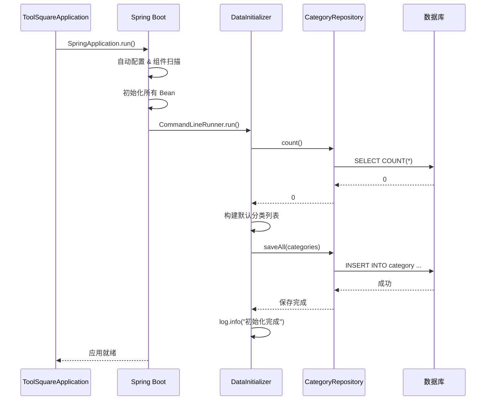
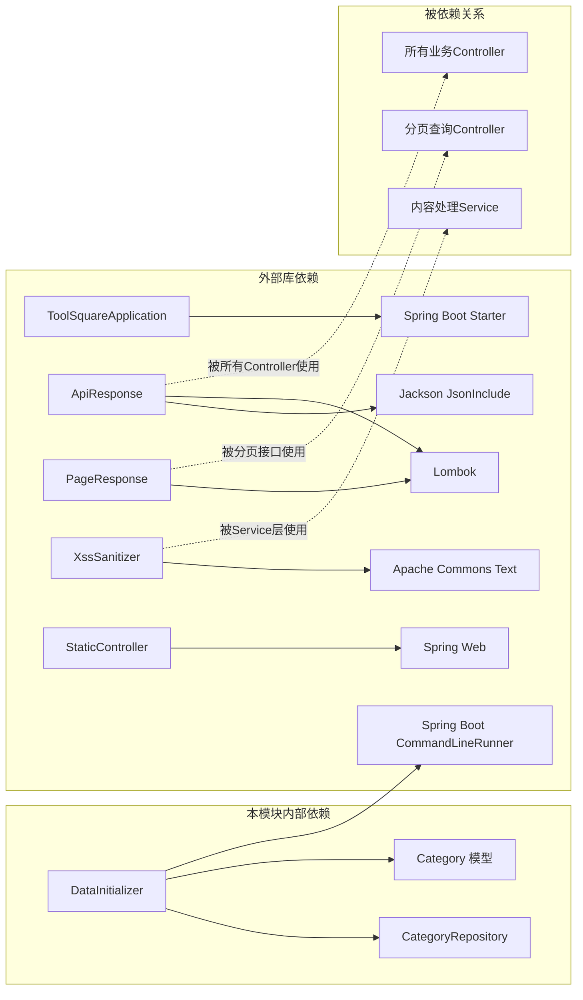

# 通用基础设施子模块

## 模块简介

通用基础设施子模块是整个工具广场（ToolSquare）系统的基石层，提供了所有业务模块共享的核心基础设施能力。该模块包含 Spring Boot 应用入口、统一 API 响应封装、分页响应封装、XSS 安全防护工具、系统数据初始化器以及静态内容服务。这些组件被系统中的所有其他模块（认证、工具管理、论坛、视频、MCP 等）广泛依赖，构成了系统的通用通信协议与安全基线。

---

## 架构总览



---

## 核心组件详解

### 1. ToolSquareApplication — 应用入口

| 属性 | 值 |
|------|-----|
| **文件路径** | `backend/src/main/java/com/iaihub/toolbox/ToolSquareApplication.java` |
| **类型** | Spring Boot 启动类 |
| **注解** | `@SpringBootApplication` |

这是整个后端应用的入口点。通过 `@SpringBootApplication` 注解，它自动启用了以下 Spring Boot 核心功能：

- **组件扫描**：自动扫描 `com.iaihub.toolbox` 包及其子包下的所有 `@Component`、`@Service`、`@Controller`、`@Repository` 等注解标注的类
- **自动配置**：根据 classpath 中的依赖自动配置 Spring Bean（如 JPA、Security、Web MVC 等）
- **配置加载**：加载 `application.yml` / `application.properties` 配置文件

所有业务模块（[认证子模块](认证子模块.md)、[工具核心子模块](工具核心子模块.md)、[论坛模块](帖子核心.md)、[视频模块](视频核心子模块.md)、[MCP模块](MCP服务器配置子模块.md)）均通过此入口被自动发现和装配。

---

### 2. ApiResponse\<T\> — 统一 API 响应封装

| 属性 | 值 |
|------|-----|
| **文件路径** | `backend/src/main/java/com/iaihub/toolbox/dto/ApiResponse.java` |
| **类型** | 泛型响应包装类 |
| **注解** | `@Data`, `@Builder`, `@JsonInclude(NON_NULL)` |

#### 设计目的

为所有 REST API 端点提供统一的响应格式，确保前后端通信协议一致。前端可通过统一的 `code` 字段判断请求状态，通过 `message` 获取提示信息，通过 `data` 获取业务数据。

#### 响应结构

```json
{
  "code": 200,
  "message": "success",
  "data": { ... }
}
```

#### 工厂方法

| 方法 | HTTP 语义 | 说明 |
|------|-----------|------|
| `success(T data)` | 200 OK | 成功响应，默认消息 "success" |
| `success(String message, T data)` | 200 OK | 成功响应，自定义消息 |
| `created(T data)` | 201 Created | 资源创建成功，默认消息 "success" |
| `created(String message, T data)` | 201 Created | 资源创建成功，自定义消息 |
| `error(int code, String message)` | 自定义 | 错误响应，不携带 data 字段 |

> **注意**：`@JsonInclude(JsonInclude.Include.NON_NULL)` 确保当 `data` 为 null 时（如 `error()` 场景），该字段不会出现在 JSON 输出中。

#### 使用范围

该类被系统中所有 Controller 使用，包括但不限于：
- [认证子模块](认证子模块.md) — `AuthController`
- [工具核心子模块](工具核心子模块.md) — `ToolController`
- [帖子核心](帖子核心.md) — `ForumPostController`
- [视频核心子模块](视频核心子模块.md) — `VideoController`
- [概览统计子模块](概览统计子模块.md) — `OverviewController`

---

### 3. PageResponse\<T\> — 分页响应封装

| 属性 | 值 |
|------|-----|
| **文件路径** | `backend/src/main/java/com/iaihub/toolbox/dto/PageResponse.java` |
| **类型** | 泛型分页响应包装类 |
| **注解** | `@Data`, `@Builder` |

#### 设计目的

为需要分页的列表查询接口提供标准化的分页数据结构。通常作为 `ApiResponse<PageResponse<T>>` 的 `data` 字段使用，形成两层嵌套的统一分页响应。

#### 字段说明

| 字段 | 类型 | 说明 |
|------|------|------|
| `content` | `List<T>` | 当前页的数据列表 |
| `totalElements` | `long` | 符合查询条件的总记录数 |
| `totalPages` | `int` | 总页数 |
| `page` | `int` | 当前页码（从 0 开始） |
| `size` | `int` | 每页大小 |

#### 响应结构示例

```json
{
  "code": 200,
  "message": "success",
  "data": {
    "content": [ ... ],
    "totalElements": 150,
    "totalPages": 15,
    "page": 0,
    "size": 10
  }
}
```

#### 使用范围

该类被以下模块的分页查询接口使用：
- [工具核心子模块](工具核心子模块.md) — 工具列表分页
- [帖子核心](帖子核心.md) — 帖子列表分页
- [视频核心子模块](视频核心子模块.md) — 视频列表分页

---

### 4. XssSanitizer — XSS 安全防护工具

| 属性 | 值 |
|------|-----|
| **文件路径** | `backend/src/main/java/com/iaihub/toolbox/util/XssSanitizer.java` |
| **类型** | 工具类（final，不可实例化） |
| **依赖** | `org.apache.commons.text.StringEscapeUtils` |

#### 设计目的

防止跨站脚本攻击（XSS），对用户输入的文本内容进行 HTML 转义和恶意模式清除。该工具类为系统提供了内容安全的第一道防线。

#### 方法说明

| 方法 | 说明 | 处理策略 |
|------|------|----------|
| `sanitize(String input)` | 通用净化，适用于需要 Markdown 渲染的场景 | 1. HTML4 全字符转义<br>2. 移除 `javascript:` 协议<br>3. 移除 `on*=` 事件处理器属性<br>4. 去除首尾空白 |
| `sanitizePlainText(String input)` | 纯文本净化，不保留任何 HTML 语法 | 仅执行 HTML4 全字符转义 |

#### 安全处理流程



#### 使用范围

该工具被以下模块在处理用户提交的富文本内容时调用：
- [工具核心子模块](工具核心子模块.md) — 工具内容净化
- [帖子核心](帖子核心.md) — 帖子标题与内容净化
- [评论互动](评论互动.md) — 评论内容净化
- [视频互动子模块](视频互动子模块.md) — 视频评论净化

---

### 5. DataInitializer — 系统数据初始化器

| 属性 | 值 |
|------|-----|
| **文件路径** | `backend/src/main/java/com/iaihub/toolbox/config/DataInitializer.java` |
| **类型** | Spring `CommandLineRunner` 组件 |
| **注解** | `@Component`, `@Slf4j`, `@RequiredArgsConstructor` |
| **依赖** | `CategoryRepository`（来自 [Category 模块](#)） |

#### 设计目的

在应用启动时自动检测并初始化系统所需的基础数据。通过实现 `CommandLineRunner` 接口，在 Spring Boot 应用完全启动后执行初始化逻辑。

#### 初始化逻辑



#### 默认分类数据

| 分类名称 | 图标 | 排序 |
|----------|------|------|
| Skill | 🛠️ | 1 |
| MCP | 🔌 | 2 |
| Prompt | 💬 | 3 |
| 其他 | 📦 | 4 |

> **幂等性保证**：通过 `categoryRepository.count() == 0` 判断，确保仅在数据库为空时执行初始化，避免重复插入。

#### 关联模块

初始化的分类数据被 [Category 模块](#) 管理和展示，并被 [工具核心子模块](工具核心子模块.md) 中的工具实体引用（每个工具归属于一个分类）。

---

### 6. StaticController — 静态内容控制器

| 属性 | 值 |
|------|-----|
| **文件路径** | `backend/src/main/java/com/iaihub/toolbox/controller/StaticController.java` |
| **类型** | REST 控制器 |
| **基础路径** | `/api/v1` |

#### API 端点

| 方法 | 路径 | 产出类型 | 说明 |
|------|------|----------|------|
| `GET` | `/api/v1/readme` | `text/markdown` | 获取项目 README 内容 |

#### README 加载策略



该控制器采用多级回退策略查找 README 文件，优先从 classpath 资源加载，其次从文件系统查找，最后返回默认占位文本，确保接口始终有响应。

---

### 7. 前端类型定义

#### 7.1 `types/index.ts` — 核心类型定义

| 属性 | 值 |
|------|-----|
| **文件路径** | `frontend/src/types/index.ts` |

该文件定义了前端与后端通信所需的核心 TypeScript 接口，其中与通用基础设施子模块直接相关的类型包括：

**ApiResponse\<T\>** — 镜像后端 `ApiResponse` 结构：

```typescript
export interface ApiResponse<T> {
  code: number
  message: string
  data: T
}
```

**PageResponse\<T\>** — 镜像后端 `PageResponse` 结构：

```typescript
export interface PageResponse<T> {
  content: T[]
  totalElements: number
  totalPages: number
  page: number
  size: number
}
```

> 该文件还包含其他模块的类型定义（如 `User`、`Category`、`ToolSummary`、`ToolDetail` 等），这些类型分别属于 [认证子模块](认证子模块.md)、[Category 模块](#) 和 [工具核心子模块](工具核心子模块.md)。

#### 7.2 `vite-env.d.ts` — Vite 环境声明

| 属性 | 值 |
|------|-----|
| **文件路径** | `frontend/src/vite-env.d.ts` |

该文件为 Vite 构建工具提供环境变量类型声明和 Vue 单文件组件模块声明：

| 声明 | 说明 |
|------|------|
| `ImportMetaEnv` | 声明 `VITE_API_BASE_URL` 环境变量为只读 `string` 类型 |
| `ImportMeta` | 扩展 `import.meta.env` 属性类型 |
| `*.vue` 模块声明 | 使 TypeScript 能正确识别 Vue 单文件组件导入 |

---

## 组件交互关系



---

## 系统启动流程



---

## 依赖关系图



---

## 模块在系统中的定位

通用基础设施子模块位于系统架构的最底层，具有以下特征：

1. **无业务依赖**：本模块不依赖任何业务模块，仅依赖 Spring Boot 框架和 Apache Commons Text 库
2. **全局共享**：`ApiResponse` 和 `PageResponse` 作为系统通信协议，被所有业务模块的 Controller 层使用
3. **安全基线**：`XssSanitizer` 为所有涉及用户输入的 Service 层提供 XSS 防护
4. **启动保障**：`DataInitializer` 确保系统首次启动时具备基础数据
5. **前后端契约**：前端 `types/index.ts` 中的 `ApiResponse` 和 `PageResponse` 接口与后端定义保持镜像同步，构成前后端类型契约

### 与其他模块的关联

| 关联模块 | 关联方式 | 说明 |
|----------|----------|------|
| [认证子模块](认证子模块.md) | 使用 `ApiResponse` | 登录/注册等接口的统一响应 |
| [工具核心子模块](工具核心子模块.md) | 使用 `ApiResponse`、`PageResponse`、`XssSanitizer` | 工具CRUD、分页查询、内容净化 |
| [帖子核心](帖子核心.md) | 使用 `ApiResponse`、`PageResponse`、`XssSanitizer` | 帖子CRUD、分页查询、内容净化 |
| [视频核心子模块](视频核心子模块.md) | 使用 `ApiResponse`、`PageResponse` | 视频列表分页查询 |
| [概览统计子模块](概览统计子模块.md) | 使用 `ApiResponse` | 统计数据响应封装 |
| [Category 模块](#) | `DataInitializer` 初始化数据 | 启动时创建默认分类 |
| [MCP服务器配置子模块](MCP服务器配置子模块.md) | 使用 `ApiResponse` | MCP搜索等接口响应封装 |
