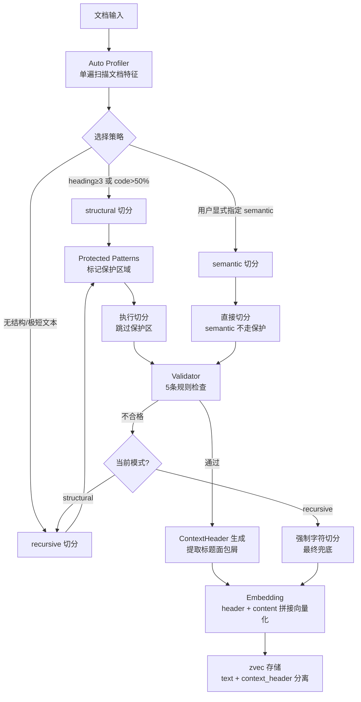
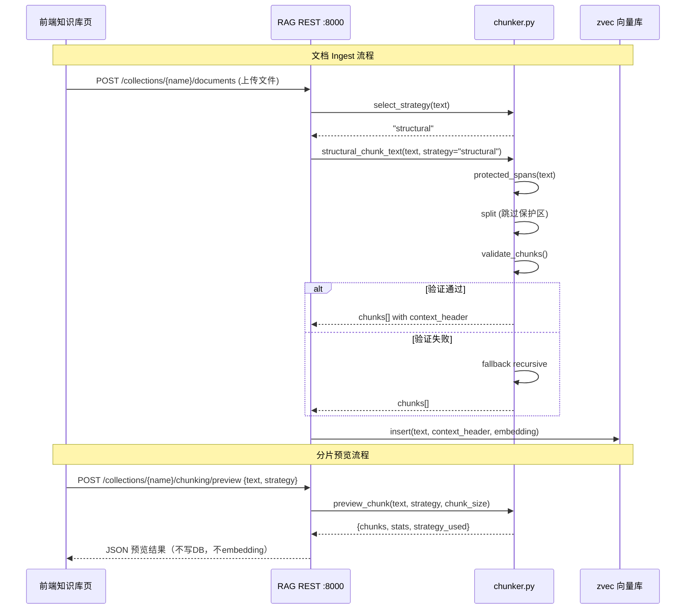
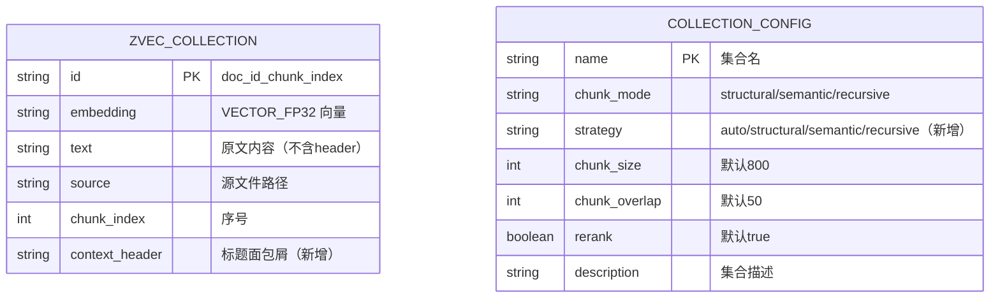

## 背景（Context）

CodingHub RAG 服务（`rag/core/chunker.py`）当前提供三种切片模式：recursive（递归字符切分）、semantic（embedding 相似度断点）、structural（Markdown 标题/代码块/表格边界）。用户通过 collection config 的 `chunk_mode` 手动选择。

通过对 WeKnora（腾讯开源，Go 实现，`internal/infrastructure/chunker/`）源码的深度分析，识别出四个可移植的核心机制：Protected Patterns（保护区域不切断）、Validator + Tier 降级（质量兜底）、ContextHeader 分离（embedding 上下文与原文位置解耦）、Auto Profiler（文档特征驱动策略选择）。

约束条件：
- RAG 服务为纯 Python 单进程，CPU-only 运行（i7-6700 VDI 环境）
- 不引入 LLM 依赖，保持"纯检索、零配置"设计哲学
- zvec 嵌入式向量库，schema 变更需考虑向后兼容
- 前端 Vue 3.4 + TypeScript，知识库页面已有基础 CRUD 和搜索展示

## 目标 / 非目标（Goals / Non-Goals）

**目标：**
- 切分质量：消除原子内容被切断的问题（图片/链接/公式/表格行/代码块）
- 质量兜底：任何模式下切出碎片时自动降级到 recursive，避免垃圾 chunk 进入向量库
- 上下文增强：embedding 时携带标题面包屑，提升跨 section 检索召回率
- 零配置体验：新文档 ingest 时自动选择最优策略，无需用户手动指定 chunk_mode
- 可观测性：前端提供分片预览调试面板，用户可直观看到切分效果

**非目标：**
- 不实现 Parent-Child 双层切片（现有 expand_context 邻居扩展已覆盖）
- 不实现 Heuristic Tier（form-feed/多语言章节标记——CodingHub 文档以 MD/代码为主）
- 不引入 GraphRAG / 知识图谱
- 不改变 MCP/REST 接口签名（仅扩展返回字段）
- 不改变 semantic 模式的 embedding 调用逻辑（CPU 上慢，保持为可选模式）

## 决策（Decisions）

### D1: Protected Patterns 实现方式

**选择**：正则预扫描 + span 标记，切分时跳过保护区

**备选方案**：
- A) 预扫描标记 span（WeKnora 方案）：先用 6 组正则找出所有保护区 byte offset，切分只在非保护区进行 ✓
- B)  tokenizer 级别保护：用 embedding model 的 tokenizer 做 token-aware 切分——过重，CPU 上不可接受
- C) 后处理修复：先切再检查是否切断了保护内容，切断了就回退——逻辑复杂且不可靠

**理由**：方案 A 是 WeKnora 验证过的方案，正则预扫描 O(N) 且纯 CPU，保护模式固定（6 种正则），不需要模型推理。

### D2: Validator 规则集

**选择**：5 条规则，不合格则降级

| 规则 | 阈值 | 来源 |
|------|------|------|
| 空输出 | chunks == 0 | WeKnora validator |
| 大文档单 chunk | chunks == 1 且 totalChars > 2×chunkSize | WeKnora validator |
| 碎片率过高 | >25% 的 chunk < 50 字符（排除最后一个） | WeKnora validator |
| 超大 chunk | 任何 chunk > 2×chunkSize | WeKnora validator |
| 全 chunk 远低于目标 | maxLen < chunkSize/4 且 totalChars > chunkSize | WeKnora validator |

**降级链**：structural → recursive（semantic 不参与自动降级，因为它是用户显式选择的高成本模式）

### D3: ContextHeader 存储方案

**选择**：zvec schema 新增 `context_header` STRING 字段

**备选方案**：
- A) zvec 新增字段（独立存储）✓
- B) 拼入 text 字段用特殊分隔符（如 `[CTX]...[/CTX]`）——污染原文，解析脆弱
- C) 存 SQLite 元数据表，zvec 只存 content——检索时需额外 join，增加延迟

**理由**：zvec 支持动态 schema（`coll.insert` 时传新字段即可），旧数据该字段为空字符串，不影响 ANN 检索。embedding 输入改为 `context_header + "\n\n" + content`，存储和检索解耦。

### D4: Auto Profiler 策略选择逻辑

**选择**：简化版 profiler（对比 WeKnora 的 15+ 指标，CodingHub 只需 4 个）

```python
def select_strategy(text: str) -> str:
    """单遍扫描，返回最优 chunk_mode"""
    heading_count = count_md_headings(text)  # #{1,6} 标题数
    code_ratio = compute_code_ratio(text)     # 围栏代码占比
    has_tables = detect_tables(text)          # 是否有 | 表格
    total_chars = len(text)

    if heading_count >= 3 and heading_count / max(lines, 1) > 0.005:
        return "structural"
    if code_ratio > 0.5:
        return "structural"  # 代码文档用结构切分保护代码块
    if total_chars < 200:
        return "recursive"   # 极短文本无需结构分析
    return "structural"      # 默认 structural（对 MD 最友好）
```

**理由**：CodingHub 知识库主要是 MD/TXT/代码文件，structural 是绝大多数场景的最优解。Profiler 的价值在于：1) 识别纯文本无结构文档降级到 recursive；2) 为未来扩展留接口。semantic 模式因 CPU 成本不参与 auto 选择。

### D5: 前端分片预览 API 设计

**选择**：RAG REST API 新增 `POST /api/collections/{name}/chunking/preview`

```json
// Request
{ "text": "样本文本...", "strategy": "auto", "chunk_size": 800, "chunk_overlap": 50 }

// Response
{
  "strategy_used": "structural",
  "chunks": [
    { "index": 0, "text": "...", "context_header": "# 标题", "char_count": 342, "token_est": 85 }
  ],
  "stats": { "total_chunks": 12, "avg_chars": 410, "min_chars": 120, "max_chars": 780, "stddev": 156 }
}
```

**理由**：参考 WeKnora 的 `POST /api/v1/chunker/preview` 设计，只读操作，不写 DB，不调 embedding API，5s 超时保护。前端直接调 RAG :8000 端口（已有 CORS）。

## 流程图



## 时序图



## 数据模型



## 风险 / 权衡（Risks / Trade-offs）

- [Protected Patterns 正则性能] 6 组正则在超大文档（>1MB）上可能耗时 → 缓解：对 >500KB 文档跳过保护扫描，直接 recursive 切分
- [zvec schema 兼容性] 新增 context_header 字段后旧数据该字段为空 → 缓解：检索时空字符串不影响 ANN，EmbeddingContent() 对空 header 直接返回 content
- [Validator 误杀] 某些文档天然碎片化（如 FAQ 列表），structural 切出短 chunk 被误判为碎片 → 缓解：排除最后一个 chunk；阈值 25% 足够宽松；用户可手动指定 chunk_mode 绕过 auto
- [前端直连 RAG 端口] 预览 API 在 :8000，前端需 CORS → 缓解：RAG 已默认开启 CORS（RAG_CORS_ORIGINS）
- [embedding 维度变化] context_header 拼入后 embedding 输入变长，向量语义偏移 → 缓解：header 通常 <50 字符，对 512-800 字符的 chunk 影响 <10%；且所有 chunk 统一加 header，相对排序不变

## 迁移计划（Migration Plan）

1. **Phase 1（RAG 后端）**：修改 `chunker.py` + `vector_store.py` + `service.py`，新增 protected patterns / validator / profiler / context_header。已有 collection 无 strategy 字段时默认 "structural"（保持现有行为）。
2. **Phase 2（REST API）**：新增 `/chunking/preview` 端点。
3. **Phase 3（前端）**：知识库设置页增加分片预览面板；文档列表增加 chunk 统计列。
4. **回滚策略**：strategy 字段为纯新增，删除即回退；zvec 新字段为空不影响旧逻辑；前端组件独立，移除不影响现有页面。

## 待定问题（Open Questions）

- 是否需要对已有文档提供"重新切片"按钮（re-ingest with new strategy）？当前设计是仅新文档走 auto，旧文档保持不变。
- semantic 模式是否也应加 Protected Patterns？当前设计不加（semantic 按句子粒度切，本身不会切断行内元素），但如果句子提取逻辑有 bug 仍可能切断。
