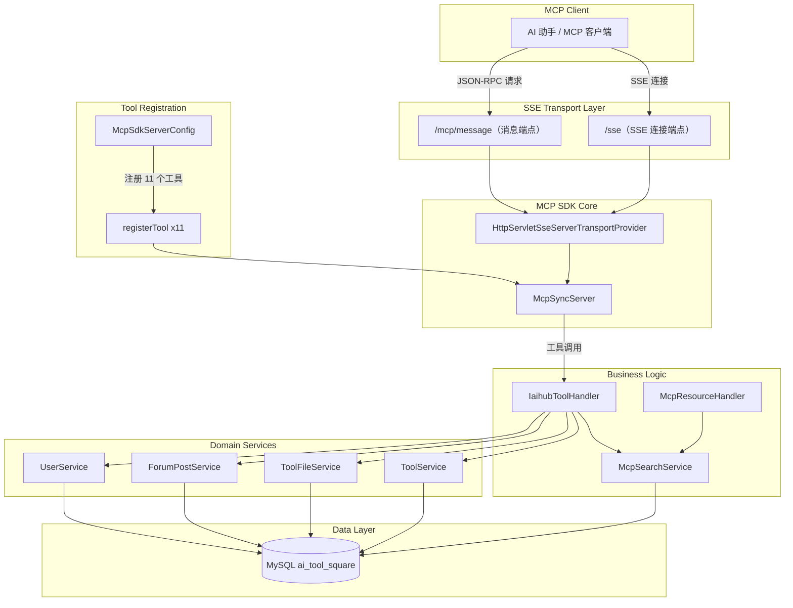
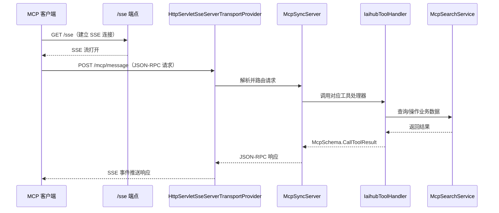
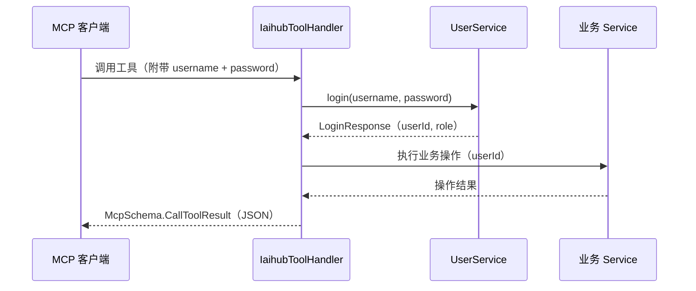

# MCP 协议模块

## 1. 模块简介

MCP（Model Context Protocol）协议模块是 CodingHub 平台的 AI 代理接入层，基于 **Spring AI MCP SDK 2.0.0** 实现。该模块将平台的工具管理能力、论坛社区能力通过标准化的 MCP 协议暴露给外部 AI 代理（如 Claude、Cursor、QoderWork 等），使 AI 助手可以直接搜索、创建、修改工具和帖子，实现平台能力的程序化调用。

### 核心能力

- **工具管理**：搜索工具、获取详情、文件管理（列表/下载/上传/删除）、创建与修改工具
- **论坛交互**：搜索帖子、获取帖子详情、创建帖子
- **SSE 传输**：基于 Server-Sent Events 的实时双向通信
- **认证集成**：写操作通过用户名/密码进行身份验证

### 核心设计目标

- **标准化**：遵循 MCP 协议规范，使用 JSON-RPC 2.0 消息格式
- **安全性**：写操作（创建、修改、删除）要求 MCP 客户端传入用户凭证进行认证
- **可扩展**：工具注册机制采用统一的 `registerTool` 方法，新增工具只需添加注册代码
- **向后兼容**：保留旧版 `McpConnectionManager`（标记 `@Deprecated`），平滑迁移至 SDK 内置传输层

## 2. 架构总览



### 请求处理流程



## 3. MCP SDK 集成

### 3.1 依赖配置

项目使用 **MCP SDK BOM 2.0.0** 进行版本管理：

```groovy
// build.gradle
dependencyManagement {
    mavenBom 'io.modelcontextprotocol.sdk:mcp-bom:2.0.0'
}

dependencies {
    implementation('io.modelcontextprotocol.sdk:mcp') {
        exclude group: 'io.modelcontextprotocol.sdk', module: 'mcp-json-jackson3'
    }
    implementation 'io.modelcontextprotocol.sdk:mcp-json-jackson2'
}
```

> **注意**：项目排除了 `mcp-json-jackson3` 并显式引入 `mcp-json-jackson2`，以兼容 Spring Boot 3.2.x 自带的 Jackson 2.x 版本。

### 3.2 SDK 核心组件

| 组件 | 用途 |
|------|------|
| `McpSyncServer` | 同步 MCP 服务器实例，管理工具注册和请求路由 |
| `HttpServletSseServerTransportProvider` | SSE 传输层，处理 HTTP 连接和消息收发 |
| `McpSchema` | MCP 协议数据模型（Tool、CallToolRequest、CallToolResult 等） |
| `McpServerFeatures.SyncToolSpecification` | 工具定义 + 调用处理器的绑定 |
| `JacksonMcpJsonMapper` | 基于 Jackson 的 JSON 序列化/反序列化 |

## 4. 源码文件清单

| 文件路径 | 类名 | 职责 |
|---------|------|------|
| `config/McpServerConfig.java` | `McpServerConfig` | MCP 服务器配置属性（端口、主机、超时等） |
| `mcp/McpSdkServerConfig.java` | `McpSdkServerConfig` | MCP SDK 核心配置，注册 11 个工具 |
| `mcp/IaihubToolHandler.java` | `IaihubToolHandler` | 工具处理器，封装所有 MCP 工具的业务逻辑 |
| `mcp/McpResourceHandler.java` | `McpResourceHandler` | 资源处理器，提供工具列表与检索 |
| `mcp/McpConnectionManager.java` | `McpConnectionManager` | 旧版 SSE 连接管理器（已废弃） |
| `controller/McpController.java` | `McpController` | HTTP 健康检查端点 |
| `service/McpSearchService.java` | `McpSearchService` | MCP 搜索服务，封装工具和帖子检索 |
| `dto/McpSearchRequest.java` | `McpSearchRequest` | 搜索请求 DTO |

## 5. MCP Server 配置

### 5.1 服务器属性配置（McpServerConfig）

`McpServerConfig` 通过 `@ConfigurationProperties(prefix = "mcp.server")` 绑定 Spring Boot 配置文件，支持以下属性：

| 属性 | 类型 | 默认值 | 说明 |
|------|------|--------|------|
| `mcp.server.port` | `int` | `8082` | MCP 服务监听端口 |
| `mcp.server.host` | `String` | `0.0.0.0` | 绑定地址，默认监听所有网卡 |
| `mcp.server.enabled` | `boolean` | `true` | 是否启用 MCP 服务 |
| `mcp.server.max-connections` | `int` | `10` | 最大并发连接数 |
| `mcp.server.connection-timeout-ms` | `int` | `30000` | 连接超时时间（毫秒） |

配置示例（`application.yml`）：

```yaml
mcp:
  server:
    port: 8082
    host: 0.0.0.0
    enabled: true
    max-connections: 10
    connection-timeout-ms: 30000
```

### 5.2 SDK 核心配置（McpSdkServerConfig）

`McpSdkServerConfig` 是 MCP 服务的核心配置类，负责初始化以下 Spring Bean：

#### McpJsonMapper

```java
@Bean
public McpJsonMapper mcpJsonMapper(ObjectMapper objectMapper) {
    return new JacksonMcpJsonMapper(objectMapper);
}
```

使用 Jackson 作为 MCP 协议的 JSON 序列化/反序列化引擎，复用 Spring Boot 全局 `ObjectMapper`。

#### HttpServletSseServerTransportProvider

```java
@Bean
public HttpServletSseServerTransportProvider servletSseServerTransportProvider(McpJsonMapper mcpJsonMapper) {
    return HttpServletSseServerTransportProvider.builder()
            .jsonMapper(mcpJsonMapper)
            .messageEndpoint("/mcp/message")
            .build();
}
```

创建 MCP SDK 提供的 SSE 传输层，消息端点设为 `/mcp/message`。

#### ServletRegistrationBean

```java
@Bean
public ServletRegistrationBean<HttpServletSseServerTransportProvider> customServletBean(
        HttpServletSseServerTransportProvider transportProvider) {
    return new ServletRegistrationBean<>(transportProvider, "/sse", "/mcp/message");
}
```

将 `HttpServletSseServerTransportProvider` 注册为 Servlet，映射到两个 URL 路径：
- `/sse` — SSE 连接端点（客户端通过 GET 建立长连接）
- `/mcp/message` — 消息端点（客户端通过 POST 发送 JSON-RPC 请求）

#### McpSyncServer

```java
@Bean(destroyMethod = "close")
public McpSyncServer mcpSyncServer(HttpServletSseServerTransportProvider transportProvider,
                                   IaihubToolHandler toolHandler) {
    McpSyncServer mcpSyncServer = McpServer.sync(transportProvider)
            .serverInfo("H3CodingHub-MCP-Server", "2.0.0")
            .capabilities(McpSchema.ServerCapabilities.builder()
                    .tools(true)
                    .logging()
                    .build())
            .build();
    // ... 注册 11 个工具 ...
    return mcpSyncServer;
}
```

创建同步 MCP 服务器实例，声明服务器信息和能力，并注册全部 11 个工具。Bean 销毁时自动调用 `close()` 释放资源。

## 6. 连接管理

### 6.1 当前方案：MCP SDK 内置传输层

当前版本使用 MCP SDK 提供的 `HttpServletSseServerTransportProvider` 管理所有 SSE 连接。该组件内部处理：

- SSE 连接的建立与维护
- JSON-RPC 消息的接收与响应
- 连接生命周期管理（超时、断开、错误处理）

### 6.2 旧版方案：McpConnectionManager（已废弃）

`McpConnectionManager` 是早期自研的 SSE 连接管理器，现已标记为 `@Deprecated`，由 SDK 内置传输层替代。

**核心组件：**

| 组件 | 说明 |
|------|------|
| `CopyOnWriteArrayList<SseEmitter>` | 线程安全的连接列表 |
| `AtomicInteger connectionIdGenerator` | 连接 ID 生成器 |
| `ConcurrentHashMap<Integer, Long>` | 连接时间戳映射 |
| `AtomicInteger activeConnections` | 活跃连接计数器 |

**关键方法：**

| 方法 | 说明 |
|------|------|
| `registerEmitter(SseEmitter)` | 注册 SSE 连接，绑定 `onCompletion`、`onTimeout`、`onError` 回调 |
| `broadcastEvent(String, Object)` | 向所有连接广播事件（格式：`event: {name}\ndata: {json}\n\n`） |
| `sendToEmitter(SseEmitter, String, Object)` | 向指定连接发送事件 |
| `heartbeat()` | 心跳检测（预留接口） |
| `shutdown()` | 关闭所有 SSE 连接 |
| `getActiveConnectionCount()` | 获取当前活跃连接数 |

**SseEmitter 封装类：**

`McpConnectionManager.SseEmitter` 对 Spring 的 `org.springframework.web.servlet.mvc.method.annotation.SseEmitter` 做了封装，提供：

- `send(String data)` — 发送原始数据
- `event()` — 创建 `SseEmitterEvent` 构建器
- `complete()` / `completeWithError(Throwable)` — 完成/异常关闭连接
- `getDelegate()` — 获取底层 Spring SseEmitter 实例

**SSE 超时配置：** 默认 30 分钟（`30 * 60 * 1000L` 毫秒）。

## 7. 工具处理器（IaihubToolHandler）

`IaihubToolHandler` 是 MCP 模块的核心业务组件，封装了所有 11 个 MCP 工具的处理逻辑。

### 7.1 依赖注入

```java
@Component
public class IaihubToolHandler {
    private final McpSearchService searchService;    // 搜索服务
    private final ToolService toolService;            // 工具 CRUD 服务
    private final ToolFileService toolFileService;    // 文件管理服务
    private final ForumPostService postService;       // 帖子服务
    private final UserService userService;            // 用户认证服务
    private final ObjectMapper objectMapper;           // JSON 序列化
}
```

### 7.2 认证机制

对于需要认证的写操作（创建、修改、删除），MCP 客户端需在工具参数中传入 `username` 和 `password`。处理器内部通过 `UserService.login()` 进行认证，获取用户 ID 和角色信息后执行实际操作。



### 7.3 版本号自动递增

当修改工具时未传入 `version` 参数，`incrementVersion()` 方法自动递增版本号的最后一位：

| 当前版本 | 递增后 |
|---------|--------|
| `1.0.0` | `1.0.1` |
| `2.3.5` | `2.3.6` |
| `1.0.0-beta` | `1.0.1-beta` |
| `1.0.alpha` | `1.0.alpha.1` |

### 7.4 响应格式

所有工具返回统一的 `McpSchema.CallToolResult` 格式：

**成功响应：**
```json
{
  "isError": false,
  "content": [
    {
      "type": "text",
      "text": "{...业务 JSON 数据...}"
    }
  ]
}
```

**错误响应：**
```json
{
  "isError": true,
  "content": [
    {
      "type": "text",
      "text": "{\"error\": \"错误描述信息\"}"
    }
  ]
}
```

### 7.5 内部 DTO 类

`IaihubToolHandler` 内部定义了以下 DTO 类用于序列化响应：

| DTO 类 | 字段 | 用途 |
|--------|------|------|
| `ToolSearchResponse` | `tools`, `count` | 工具搜索结果 |
| `ToolDetailResponse` | `id`, `name`, `version`, `content`, `category` | 工具详情 |
| `FileInfo` | `fileName`, `fileSize`, `downloadUrl`, `createdAt` | 文件信息 |
| `ToolFilesResponse` | `files`, `count`, `toolId` | 工具文件列表 |
| `PostSearchResponse` | `posts`, `count` | 帖子搜索结果 |
| `PostDetailResponse` | `id`, `title`, `content`, `authorId`, `createdAt` | 帖子详情 |
| `ErrorResponse` | `error` | 错误信息 |
| `FileDownloadResponse` | `fileId`, `fileName`, `fileSize`, `contentType`, `downloadUrl`, `createdAt` | 文件下载信息 |
| `FileUploadInfoResponse` | `toolId`, `toolName`, `uploadUrl`, `httpMethod`, `contentType`, `formFields`, `limits`, `instruction` | 文件上传指引 |
| `FileDeleteResponse` | `toolId`, `fileId`, `deleted` | 文件删除结果 |

## 8. 资源处理器（McpResourceHandler）

`McpResourceHandler` 提供 MCP 资源层面的工具列表与检索能力：

| 方法 | 说明 |
|------|------|
| `listTools()` | 返回最多 50 个工具的列表，格式为 MCP 工具描述 |
| `searchTools(query, category, limit)` | 委托 `McpSearchService` 搜索工具 |
| `getToolContent(toolId)` | 获取指定工具的 Markdown 内容 |

## 9. 搜索服务（McpSearchService）

`McpSearchService` 是 MCP 模块的数据访问层，封装了对 Repository 的调用：

| 方法 | 说明 | 事务 |
|------|------|------|
| `searchTools(query, category, limit)` | 搜索已审批工具，默认返回 20 条 | `@Transactional(readOnly = true)` |
| `getToolById(toolId)` | 获取工具详情（含关联关系） | — |
| `getToolFiles(toolId)` | 获取工具的文件列表（状态正常） | — |
| `searchPosts(query, limit)` | 搜索论坛帖子，按标题匹配或时间倒序 | — |
| `getPostById(postId)` | 获取帖子详情 | — |
| `getToolFile(toolId, fileId)` | 获取指定工具下的指定文件 | — |

## 10. 工具注册与发现机制

### 10.1 注册流程

工具注册在 `McpSdkServerConfig.mcpSyncServer()` 方法中完成，通过统一的 `registerTool()` 私有方法：

```java
private void registerTool(McpSyncServer server, String name, String description,
                          String inputSchemaJson,
                          BiFunction<McpSyncServerExchange, McpSchema.CallToolRequest,
                                     McpSchema.CallToolResult> handler)
```

**注册步骤：**

1. 将 JSON Schema 字符串解析为 `Map<String, Object>`
2. 构建 `McpSchema.Tool` 对象（名称 + 描述 + 输入 Schema）
3. 创建 `McpServerFeatures.SyncToolSpecification`，绑定工具定义和调用处理器（`BiFunction`）
4. 调用 `server.addTool(toolHandler)` 注册到 MCP 服务器

### 10.2 工具发现

MCP 客户端通过标准协议流程发现可用工具：

1. 客户端发送 `tools/list` JSON-RPC 请求
2. MCP 服务器返回所有已注册工具的名称、描述和输入 Schema
3. 客户端根据 Schema 构造 `tools/call` 请求调用具体工具

## 11. SSE 事件流协议

### 11.1 连接建立

```
GET /sse HTTP/1.1
Host: localhost:8082
Accept: text/event-stream
```

服务器响应 SSE 流，保持长连接。

### 11.2 消息发送

```
POST /mcp/message HTTP/1.1
Host: localhost:8082
Content-Type: application/json

{
  "jsonrpc": "2.0",
  "method": "tools/call",
  "params": {
    "name": "h3_coding_hub_tool_search",
    "arguments": {
      "query": "数据分析",
      "limit": 10
    }
  },
  "id": 1
}
```

### 11.3 响应推送

服务器通过 SSE 流推送 JSON-RPC 响应：

```
event: message
data: {"jsonrpc":"2.0","result":{"content":[{"type":"text","text":"..."}], "isError":false},"id":1}
```

## 12. API 端点

| 方法 | 路径 | 说明 | 处理方 |
|------|------|------|--------|
| GET | `/sse` | SSE 连接端点 | `HttpServletSseServerTransportProvider` |
| POST | `/mcp/message` | JSON-RPC 消息端点 | `HttpServletSseServerTransportProvider` |
| GET | `/mcp/health` | 健康检查 | `McpController` |

### 健康检查响应示例

```json
{
  "status": "ok",
  "version": "1.0.0",
  "mcpServer": "H3CodingHub-MCP-Server",
  "timestamp": "2025-01-15T08:30:00Z"
}
```

## 13. 工具清单

### 13.1 查询类工具（无需认证）

| # | 工具名称 | 说明 | 必填参数 | 可选参数 |
|---|---------|------|---------|----------|
| 1 | `h3_coding_hub_tool_search` | 搜索工具列表，支持关键词和分类过滤 | — | `query`（关键词）、`category`（分类名）、`limit`（默认 20） |
| 2 | `h3_coding_hub_tool_get` | 获取工具详情，含完整 Markdown 文档 | `toolId` | — |
| 3 | `h3_coding_hub_tool_files` | 获取工具的文件下载信息 | `toolId` | — |
| 4 | `h3_coding_hub_post_search` | 搜索社区帖子 | — | `query`（关键词）、`limit`（默认 20） |
| 5 | `h3_coding_hub_post_get` | 获取帖子内容，含完整 Markdown | `postId` | — |
| 6 | `h3_coding_hub_tool_download` | 获取工具文件的下载链接 | `toolId`, `fileId` | — |

### 13.2 写入类工具（需要认证）

| # | 工具名称 | 说明 | 必填参数 | 可选参数 |
|---|---------|------|---------|----------|
| 7 | `h3_coding_hub_tool_create` | 创建新工具，返回工具 ID | `name`, `categoryId`, `content`, `version`, `username`, `password` | — |
| 8 | `h3_coding_hub_post_create` | 创建新帖子 | `title`, `content`, `categoryId`, `username`, `password` | — |
| 9 | `h3_coding_hub_tool_file_upload` | 获取文件上传 REST API 信息 | `toolId` | — |
| 10 | `h3_coding_hub_tool_modify` | 修改已有工具，支持部分更新 | `toolId`, `username`, `password` | `name`, `categoryId`, `content`, `version`（不传则自动递增） |
| 11 | `h3_coding_hub_tool_file_delete` | 删除工具下的指定文件 | `toolId`, `fileId`, `username`, `password` | — |

### 13.3 工具详细说明

#### h3_coding_hub_tool_search

搜索平台中的工具列表。支持按关键词模糊搜索和分类过滤，返回工具 ID、名称、摘要、分类和版本号。

```json
// 请求参数
{ "query": "数据分析", "category": "AI", "limit": 10 }

// 响应示例
{ "tools": [{ "id": 1, "name": "...", "description": "...", "category": "AI", "version": "1.0.0", "createdAt": "..." }], "count": 1 }
```

#### h3_coding_hub_tool_get

获取指定工具的完整详情，包括 Markdown 格式的文档内容。

```json
// 请求参数
{ "toolId": 1 }

// 响应示例
{ "id": 1, "name": "数据分析工具", "version": "1.0.0", "content": "# 工具文档\n...", "category": "AI" }
```

#### h3_coding_hub_tool_files

获取指定工具关联的文件列表，包含文件名、大小、下载路径和创建时间。

```json
// 请求参数
{ "toolId": 1 }

// 响应示例
{ "files": [{ "fileName": "data.csv", "fileSize": 1024, "downloadUrl": "/api/files/download/1", "createdAt": "..." }], "count": 1, "toolId": 1 }
```

#### h3_coding_hub_post_search

搜索论坛帖子。若提供关键词则按标题匹配，否则按创建时间倒序返回。

```json
// 请求参数
{ "query": "使用教程", "limit": 10 }

// 响应示例
{ "posts": [{ "id": 1, "title": "...", "summary": "...", "authorName": "admin", "createdAt": "..." }], "count": 1 }
```

#### h3_coding_hub_post_get

获取指定帖子的完整内容。

```json
// 请求参数
{ "postId": 1 }

// 响应示例
{ "id": 1, "title": "使用教程", "content": "# 教程\n...", "authorId": 1, "createdAt": "..." }
```

#### h3_coding_hub_tool_download

获取工具文件的下载链接。返回相对路径，需拼接 MCP 服务器地址（`http://<host>:8082`）构成完整下载 URL。

```json
// 请求参数
{ "toolId": 1, "fileId": 1 }

// 响应示例
{ "fileId": 1, "fileName": "data.csv", "fileSize": 1024, "contentType": "text/csv", "downloadUrl": "/api/v1/tools/1/files/1/download", "createdAt": "..." }
```

#### h3_coding_hub_tool_create

创建新工具。需要用户认证，创建成功后返回工具 ID，可继续通过 `h3_coding_hub_tool_file_upload` 上传文件。

```json
// 请求参数
{ "name": "新工具", "categoryId": 1, "content": "# 工具说明", "version": "1.0.0", "username": "admin", "password": "123456" }
```

#### h3_coding_hub_post_create

创建论坛帖子。需要用户认证。

```json
// 请求参数
{ "title": "新帖子", "content": "帖子内容", "categoryId": 1, "username": "admin", "password": "123456" }
```

#### h3_coding_hub_tool_file_upload

获取文件上传的 REST API 接口信息，引导 MCP 客户端通过 HTTP Multipart POST 直接上传文件。

**上传 API 详情：**

| 项 | 值 |
|----|----|
| URL | `POST /api/v1/tools/{toolId}/files` |
| Content-Type | `multipart/form-data` |
| 表单字段 | `files`（必填，文件列表）、`readme`（可选，Markdown 文本） |
| 限制 | 单文件 50 MB，总计 200 MB |

```json
// 请求参数
{ "toolId": 1 }

// 响应示例
{ "toolId": 1, "toolName": "数据分析工具", "uploadUrl": "/api/v1/tools/1/files", "httpMethod": "POST", "contentType": "multipart/form-data", "formFields": "files (必填, 文件列表), readme (可选, markdown文本)", "limits": "50MB per file, 200MB total", "instruction": "使用 HTTP POST 请求 /api/v1/tools/1/files..." }
```

#### h3_coding_hub_tool_modify

修改已有工具。支持部分更新（仅传入需要修改的字段），版本号不传时自动递增最后一位。

```json
// 请求参数
{ "toolId": 1, "name": "新名称", "username": "admin", "password": "123456" }
```

#### h3_coding_hub_tool_file_delete

删除指定工具下的文件。只能删除自己创建的工具下的文件，删除时同时移除物理文件和数据库记录。

```json
// 请求参数
{ "toolId": 1, "fileId": 1, "username": "admin", "password": "123456" }

// 响应示例
{ "toolId": 1, "fileId": 1, "deleted": true }
```

## 14. 搜索请求 DTO（McpSearchRequest）

`McpSearchRequest` 是 MCP 搜索接口的数据传输对象，包含以下字段：

| 字段 | 类型 | 约束 | 默认值 | 说明 |
|------|------|------|--------|------|
| `query` | `String` | `@Size(max = 200)` | — | 搜索关键词 |
| `category` | `String` | — | — | 分类名称 |
| `limit` | `Integer` | `@Min(1)` `@Max(100)` | `20` | 返回数量限制 |

## 15. MCP 客户端接入指南

### 15.1 连接配置

MCP 客户端需配置以下连接信息：

| 项 | 值 |
|----|----|
| SSE 端点 | `http://<host>:8082/sse` |
| 消息端点 | `http://<host>:8082/mcp/message` |
| 协议版本 | MCP（JSON-RPC 2.0） |
| 传输方式 | SSE（Server-Sent Events） |

### 15.2 典型使用流程


1. **建立连接**：GET `/sse` 建立 SSE 长连接
2. **发现工具**：发送 `tools/list` 获取 11 个可用工具的 Schema
3. **搜索工具**：调用 `h3_coding_hub_tool_search` 按关键词搜索
4. **查看详情**：调用 `h3_coding_hub_tool_get` 获取完整文档
5. **下载文件**：调用 `h3_coding_hub_tool_download` 获取下载链接，拼接服务器地址下载
6. **创建工具**：调用 `h3_coding_hub_tool_create`（需认证），获取工具 ID
7. **上传文件**：调用 `h3_coding_hub_tool_file_upload` 获取上传接口信息，通过 HTTP POST 上传

### 15.3 认证说明

- **查询类操作**（搜索、查看详情、下载）无需认证
- **写入类操作**（创建、修改、删除）需在参数中传入 `username` 和 `password`
- 默认密码为 `123456`
- 认证在工具处理器内部通过 `UserService.login()` 完成，不使用 JWT Token

## 16. 与其他模块的关系

- **[工具市场](工具市场.md)**：MCP 模块通过 `ToolService`、`ToolFileService` 实现工具的 CRUD 操作，共享 `Tool`、`ToolFile` 实体和 `ToolRepository`、`ToolFileRepository` 数据访问层。MCP 工具 `h3_coding_hub_tool_search`、`h3_coding_hub_tool_get` 等直接操作工具市场的数据。
- **[论坛社区](论坛社区.md)**：MCP 模块通过 `ForumPostService` 实现帖子的查询和创建，共享 `ForumPost` 实体和 `ForumPostRepository` 数据访问层。MCP 工具 `h3_coding_hub_post_search`、`h3_coding_hub_post_get`、`h3_coding_hub_post_create` 直接操作论坛帖子数据。
- **认证系统**：写操作工具通过 `UserService.login()` 进行身份验证，复用现有的登录认证流程，而非使用 JWT Token 机制。
- **文件存储**：文件上传/下载通过 `ToolFileService` 实现，文件存储在服务器 `uploads/` 目录下。