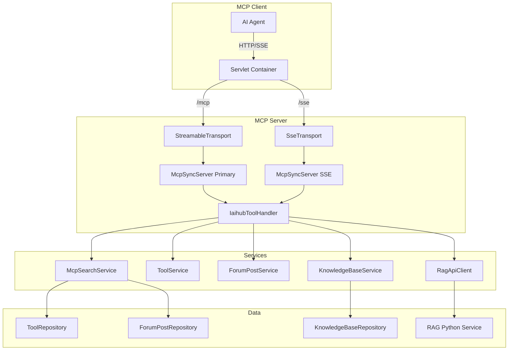
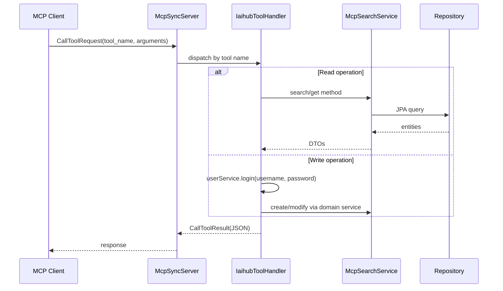

# MCP协议模块

## 模块概述

MCP（Model Context Protocol）模块为 CodingHub 提供 AI 代理集成能力，通过标准化的 MCP 协议将平台资源（工具、论坛帖子、知识库）暴露给外部 AI 客户端（如 Claude Desktop、QoderWork）。支持 **Streamable HTTP** 和 **SSE** 双传输协议，共注册 **18 个工具**，覆盖工具发现、论坛搜索、知识库语义检索等场景。

## 架构图

## 核心组件

### McpSdkServerConfig — 服务器配置与工具注册

Spring `@Configuration` 类，基于 **Java MCP SDK 2.0.0** 引导 MCP 服务器。创建两个并行的 `McpSyncServer` 实例：

- **Streamable HTTP** (`/mcp`): 遵循 MCP 协议 2025-03-26 规范，为现代客户端提供 Streamable 传输
- **SSE** (`/sse`, `/sse/message`): 兼容旧版 SSE 客户端

两个服务器注册完全相同的 18 个工具。工具注册通过 `registerAllTools()` 方法完成，每个工具包含 JSON Schema 输入定义和 lambda 处理器。

### IaihubToolHandler — 工具调度中心

所有 MCP 工具调用的统一入口，将 `CallToolRequest` 翻译为服务层调用。18 个工具分为四个领域：

**工具域（7个）**：`tool_search`、`tool_get`、`tool_files`、`tool_download`、`tool_create`、`tool_modify`、`tool_file_upload_info`、`tool_file_delete`

**论坛域（3个）**：`post_search`、`post_get`、`post_create`

**知识库域（7个）**：`kb_list`、`kb_search`、`kb_create`、`kb_update`、`kb_delete`、`kb_upload_document`、`kb_document_status`

**健康检查（1个）**：通过 REST 控制器提供

### McpSearchService — 只读查询服务

封装所有 MCP 模块的只读数据访问，作为 Repository 门面层：

- `searchTools()` — 按分类/关键词搜索工具，内容截断至 100 字符
- `searchPosts()` — 搜索论坛帖子，关联解析作者名称
- `getToolById()` / `getPostById()` — 获取详情

### McpConnectionManager — 连接管理器（已废弃）

遗留的 SSE 连接管理器，已被 MCP SDK 的 `HttpServletSseServerTransportProvider` 替代。保留用于向后兼容。

## 关键设计决策

### 双传输协议

同时运行 Streamable HTTP 和 SSE 两套传输层，共享相同的工具注册集，确保新旧 MCP 客户端均可连接。

### 无状态逐次认证

MCP 层不使用 Session 或 JWT。写操作工具接受 `username`/`password` 作为 MCP 工具参数，每次调用 `userService.login()` 进行认证。这对 MCP 的离散工具调用模式是务实的选择。

### 元数据与二进制分离

MCP 不传输二进制文件。上传/下载工具返回 REST 端点元数据（URL、HTTP 方法、Content-Type、curl 示例），由 MCP 客户端直接通过 HTTP multipart 完成文件传输。

### 知识库语义搜索

`kb_search` 工具支持语义检索，参数包括 `topK`、`rerank`、`expandContext`，通过 [RAG服务](RAG服务.md) 实现向量化搜索。

## 数据流

## 交叉引用

- [工具市场](工具市场.md) — 工具 CRUD 底层实现
- [论坛社区](论坛社区.md) — 帖子搜索底层实现
- [知识库](知识库.md) — 知识库 CRUD 底层实现
- [RAG服务](RAG服务.md) — 语义搜索引擎
- [认证与用户](认证与用户.md) — 用户认证

<!-- crosslinks (auto-generated) -->
## Related Modules
- Depends on: [工具市场](工具市场.md), [知识库](知识库.md), [认证与用户](认证与用户.md), [论坛社区](论坛社区.md)
