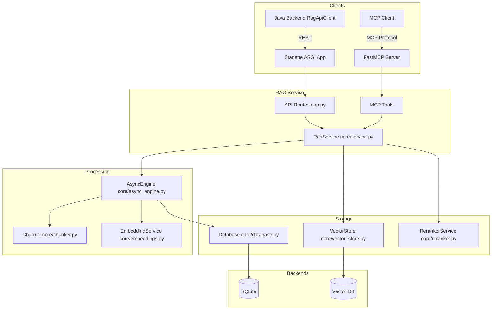
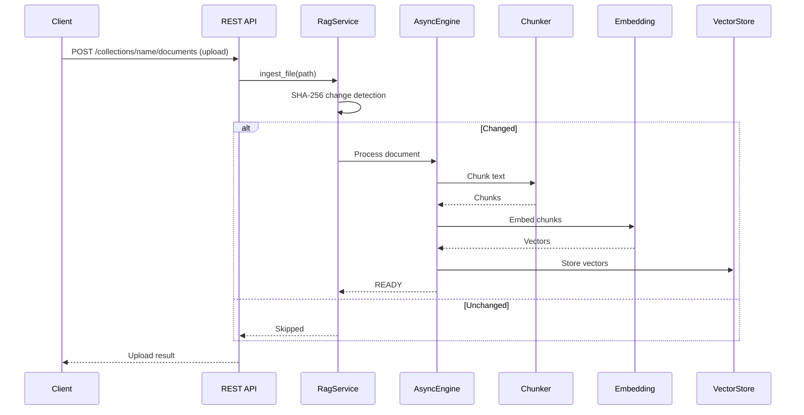

# RAG服务模块

## 模块概述

RAG（检索增强生成）服务是 CodingHub 的 Python 独立服务，提供文档摄入、向量化存储、语义搜索和重排能力。同时作为 MCP Server 和 REST API 运行，支持多种传输协议。服务通过异步引擎处理批量文档，使用 SQLite 跟踪处理状态。

## 架构图

## 核心组件

### server.py — 入口点

创建 `FastMCP` 服务器，暴露 12 个 MCP 工具（search、ingest_file、ingest_directory、ingest_url、upload_info、document_status、list_collections、list_documents、delete_document、delete_collection、configure_collection、get_collection_config）。支持 stdio、SSE、streamable-http 三种传输模式。SSE/streamable-http 模式下，REST API 和 MCP 路由合并到同一个 Starlette ASGI 应用。

### api/app.py — REST API

基于 Starlette（无 FastAPI 依赖）的 REST API：

- 健康检查、集合管理、文档上传/删除/状态查询
- 批量上传（异步，返回 202）
- 语义搜索
- 集合配置 CRUD
- CORS 中间件、文件名编码修复（GBK/Latin-1）

### core/service.py — 业务逻辑单例

共享业务逻辑，持有 `VectorStore` 单例：

- `ingest_file()` — SHA-256 变更检测，跳过未修改文件
- `ingest_content()` — 上传文本摄入
- `search()` — 语义搜索，可选重排和上下文扩展
- `delete_document()` / `delete_collection()` — 删除
- `list_collections()` / `list_documents()` — 查询
- 支持文本文件（60+ 扩展名）和二进制文档（PDF/DOCX/PPTX/XLSX via MarkItDown）

### core/async_engine.py — 异步处理引擎

异步文档处理管道：

- `asyncio.Semaphore` 控制并发（默认 3 个并发任务）
- 处理管道：CONVERTING → CHUNKING → EMBEDDING → READY/FAILED
- 每个阶段在线程池中运行（`asyncio.to_thread`）
- 单文档超时默认 10 分钟
- 启动时恢复：将卡住的进行中状态标记为 FAILED

### core/chunker.py — 分块器

三种分块策略：

- **recursive** — 段落/句子/字符递归分割
- **semantic** — 基于嵌入的语义主题边界
- **structural** — Markdown 标题/代码块/表格结构分割

### core/embeddings.py — 嵌入服务

将文本块转换为向量表示，用于语义搜索。

### core/vector_store.py — 向量存储

管理向量数据库的存储和检索操作。

### core/reranker.py — 重排服务

可选的 cross-encoder 重排器，提升搜索结果的相关性。

### core/database.py — 数据库

SQLite 驱动的文档状态跟踪，支持启动时恢复失败/卡住的文档。

## 数据流

## 设计要点

- **双接口**：同一服务层同时被 MCP 工具和 REST API 消费
- **异步批量处理**：单文件上传同步处理，批量上传返回 202 后台处理
- **变更检测**：SHA-256 文件哈希跳过未修改文件
- **上下文扩展**：搜索结果可包含前后 N 个相邻文本块
- **启动恢复**：卡住的文档自动标记为 FAILED 并重新提交

## 交叉引用

- [知识库](知识库.md) — Java 后端 BFF 接口
- [MCP协议](MCP协议.md) — MCP 知识库工具调用