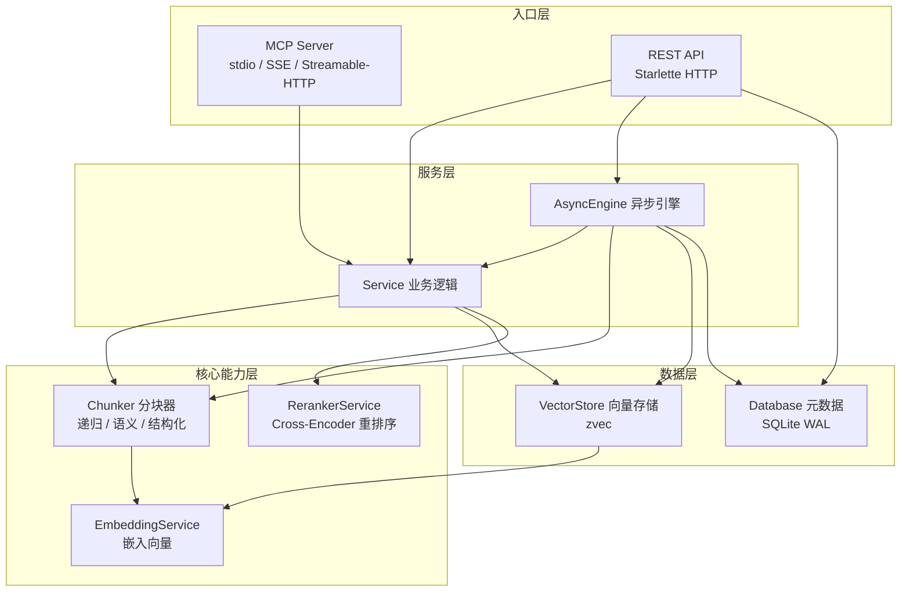

## RAG服务概述

RAG（Retrieval-Augmented Generation）服务是 CodingHub 的智能知识库引擎，以 Python 独立实现，为平台提供文档导入、智能分块、向量存储与语义检索能力。该服务采用双协议架构——同时作为 MCP 服务器和 REST API 对外提供服务，既支持 AI 代理通过 MCP 协议直接调用知识库操作，也支持前端通过 HTTP 接口进行文档管理与搜索。

### 架构总览

RAG 服务采用四层架构设计，从上到下依次为入口层、服务层、核心能力层和数据层：

### 核心能力

| 能力 | 说明 |
|------|------|
| 文档导入 | 支持文本类（md, txt, py, js 等）和二进制类（pdf, docx, pptx, xlsx）文件，具备 SHA256 变更检测 |
| 智能分块 | 三种策略：递归字符分块（通用）、语义分块（长文档）、结构化分块（Markdown） |
| 向量检索 | 基于 zvec 的向量存储，支持归一化嵌入与 Cross-Encoder 重排序 |
| 异步处理 | 基于 asyncio 的并发处理引擎，支持状态跟踪、超时保护与故障恢复 |
| 双协议接入 | MCP 协议（AI 代理直连）+ REST API（前端 HTTP 调用） |

### 与 CodingHub 后端集成

RAG 服务通过以下方式与 Java 后端协作：

1. **REST API 对接**：后端 `KnowledgeController` 通过 HTTP 调用 RAG 服务的 `/api/` 接口
2. **MCP 协议**：AI 代理通过 MCP SSE/Streamable-HTTP 直接调用知识库工具
3. **共享存储**：RAG 数据目录独立于 MySQL，使用 zvec + SQLite 存储向量和元数据

### 子模块

| 子模块 | 说明 |
|--------|------|
| [RAG核心](RAG服务_RAG核心.md) | RAG 服务的完整实现，涵盖 MCP 服务器、REST API、业务逻辑、分块引擎、嵌入服务、重排序、向量存储及元数据库 |
