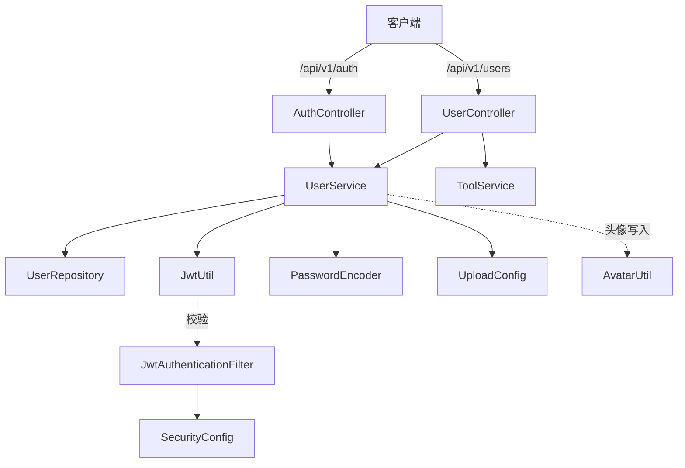

# 认证与用户模块（Auth & User）

## 模块简介

认证与用户模块是 CodingHub 的账户中枢，负责**用户注册、登录、令牌刷新、个人资料维护、头像管理、公开资料查询**，以及后台的**管理员审批与账号状态管理**。所有需要身份态的业务（工具、论坛、视频、知识库、互动）都依赖本模块产出的 JWT 令牌与 `User` 主体。

- 入口前缀：`/api/v1/auth`、`/api/v1/users`
- 核心分层：`AuthController` / `UserController`（L4）→ `UserService`（L3）→ `UserRepository`（L2）→ `User` / `Role` / `AccountStatus`（L1）
- 安全机制：`JwtUtil` 签发令牌，`JwtAuthenticationFilter` + `SecurityConfig` 完成请求级鉴权。

## 架构图

## 核心组件职责

### AuthController（`controller/AuthController.java`）
认证入口，仅 3 个端点：
- `POST /api/v1/auth/register` — 注册。调用 `UserService.register`；若返回 `accessToken == null` 说明注册的是 **ADMIN 账号**，进入 `PENDING` 待审批态，前端提示“等待超级管理员审批”。
- `POST /api/v1/auth/login` — 登录。调用 `UserService.login` 返回双令牌。
- `POST /api/v1/auth/refresh` — 刷新。从 `Authorization: Bearer <refreshToken>` 提取刷新令牌，调用 `UserService.refreshToken`。

### UserController（`controller/UserController.java`）
当前用户资料与账户操作（`@AuthenticationPrincipal User` 注入登录主体）：
- `GET /me` 当前用户 DTO；`GET /me/tools` 我的工具（委托 `ToolService.getMyTools`）。
- `POST /me/avatar`（multipart）、`DELETE /me/avatar` 头像上传/删除。
- `PUT /me/profile` 修改昵称/简介；`PUT /me/password` 修改密码。
- `GET /{id}` 查询他人公开资料（`PublicUserDTO`）。

### UserService（`service/UserService.java`）（18 方法）
业务核心，关键能力：
- **注册**：用户名/昵称唯一性校验；角色解析（禁止注册 `SUPER_ADMIN`）；ADMIN 注册置 `PENDING` 且不发令牌，USER 注册直接签发双令牌。
- **登录**：凭据比对 → 账号状态机校验（`PENDING/REJECTED/DISABLED` 分别抛 `ForbiddenException`）→ 更新 `lastLoginAt` → 签发双令牌。
- **刷新**：校验 refresh 令牌有效性 + 类型，重新签发 access 令牌（refresh 令牌 7 天，access 令牌 15 分钟，见 [基础设施与异常模块](infra.md) 的 `JwtUtil`）。
- **资料/密码/头像**：昵称变更做唯一性复核；头像经 `AvatarUtil.validateAndGetExtension` 校验扩展名，按 `UploadConfig.getAvatarMaxFileSize()` 限流，写入 `{baseDir}/{avatarSubdir}/{userId}.{ext}` 并更新 `avatarUrl`（`/api/v1/static/avatars/...`）。
- **后台方法**：`getPendingUsers` / `approveUser` / `rejectUser` / `getUsers`（分页过滤）/ `updateUserStatus` / `deleteUser`，其中对 `SUPER_ADMIN` 的操作一律拒绝。

### User（`model/User.java`）
账户实体，表名反引号包裹为 `` `user` ``（关键字转义）。字段：`id`、`password`（BCrypt 加密）、`username`（唯一）、`nickname`（唯一）、`createdAt`/`updatedAt`（JPA 回调维护）、`lastLoginAt`、`avatarUrl`、`bio`、`role`（`Role` 枚举，默认 `USER`）、`status`（`AccountStatus` 枚举，默认 `ACTIVE`）。

### 枚举与工具
- `Role`：`USER` / `ADMIN` / `SUPER_ADMIN`，权限层级为 `USER < ADMIN < SUPER_ADMIN`。
- `AccountStatus`：`ACTIVE` / `PENDING` / `REJECTED` / `DISABLED`。
- `JwtUtil`：基于 JJWT 生成/校验 access 与 refresh 令牌，从令牌解析 `userId` / `username`。
- `JwtAuthenticationFilter`：拦截请求、解析 `Authorization` 头、写入 `SecurityContext`。
- `SecurityConfig`：Spring Security 过滤器链配置，放行静态资源与认证端点，其余需鉴权。
- `UserRepository`：继承 JPA，提供 `existsByUsername`、`existsByNickname`、`findByUsername`、`findByStatusAndRole`、`findAllFiltered`（管理后台分页）。

## 关键 API

| 方法 | 路径 | 说明 | 鉴权 |
|------|------|------|------|
| POST | `/api/v1/auth/register` | 注册（USER 直接发令牌，ADMIN 待审批） | 否 |
| POST | `/api/v1/auth/login` | 登录获取双令牌 | 否 |
| POST | `/api/v1/auth/refresh` | 刷新 access 令牌 | refresh 令牌 |
| GET | `/api/v1/users/me` | 当前用户资料 | 是 |
| PUT | `/api/v1/users/me/profile` | 修改资料 | 是 |
| PUT | `/api/v1/users/me/password` | 修改密码 | 是 |
| POST | `/api/v1/users/me/avatar` | 上传头像 | 是 |
| GET | `/api/v1/users/{id}` | 公开资料 | 否 |

## 依赖关系（🔗 CodeGraph 增强）

- **上游调用**：`ToolController`、`ForumPostController`、`VideoController`、`KnowledgeBaseController`、`UnifiedInteractionController` 等均通过 `@AuthenticationPrincipal User` 依赖本模块产出的登录主体；[统一互动服务模块](unified-services.md) 的权限判断（`isOwner || isAdmin`）读取 `User.role`。
- **下游依赖**：`UserService` → `UserRepository`（持久化）、`JwtUtil`（令牌）、`PasswordEncoder`（BCrypt）、`UploadConfig` + `AvatarUtil`（头像）。
- **变更影响**：修改 `User` 实体字段会影响全部业务模块的 DTO 映射；修改 `Role`/`AccountStatus` 枚举会影响 [概览与管理模块](overview-admin.md) 的审批流程与全局权限判断。

## 相关模块

- [工具广场模块](tool-plaza.md) — 用户发布/管理工具
- [统一互动服务模块](unified-services.md) — 互动与权限
- [概览与管理模块](overview-admin.md) — 用户审批后台
- [基础设施与异常模块](infra.md) — JWT、安全、XSS 配置
