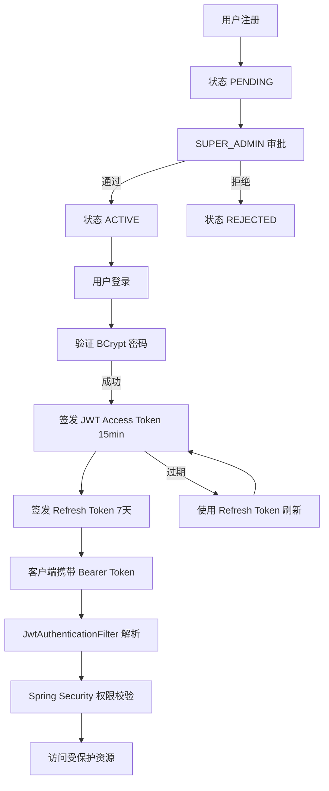
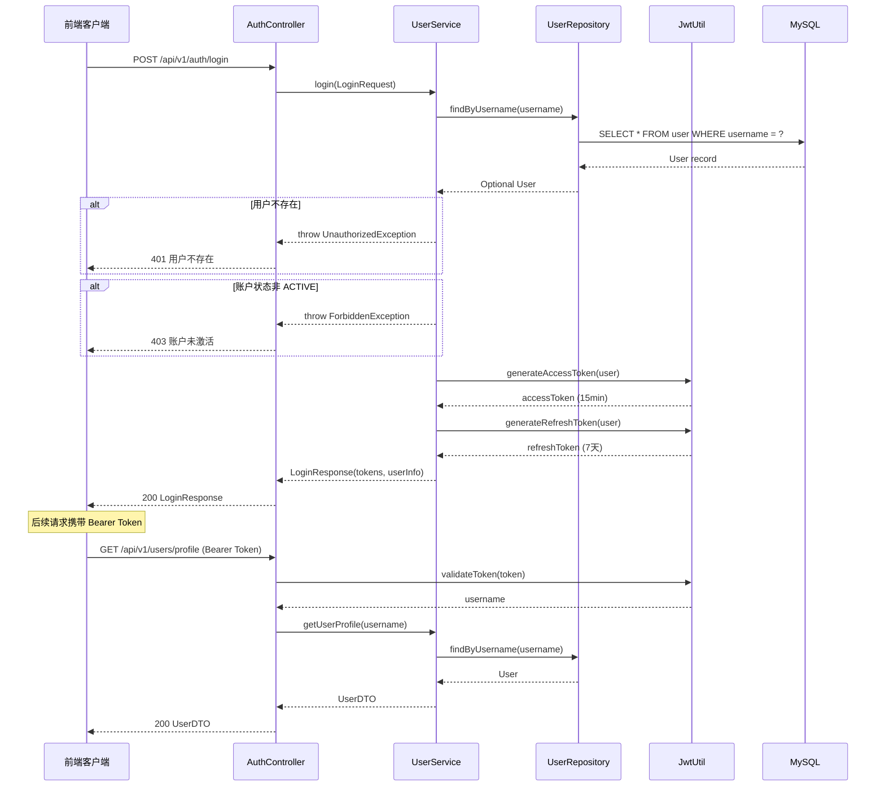

# 认证与用户管理

认证与用户管理模块是 CodingHub 平台的安全基石，负责用户注册、登录认证、权限控制和账户全生命周期管理。该模块围绕 JWT（JSON Web Token）双令牌机制构建，结合 Spring Security 过滤链实现细粒度的访问控制，同时支持管理员审批流程以确保平台安全。

本模块涵盖从用户注册到管理员审批、从登录获取令牌到携带令牌访问受保护资源的完整流程。所有认证相关的配置、异常处理和服务逻辑均集中在后端 `com.iaihub.toolbox` 包下，通过 RESTful API 与前端交互。

## 认证流程架构



## 组件职责

### Controllers

| 组件 | API 前缀 | 职责说明 |
|------|----------|----------|
| AuthController | `/api/v1/auth` | 处理用户登录（`/login`）、注册（`/register`）和令牌刷新（`/refresh`）端点 |
| UserController | `/api/v1/users` | 管理个人资料查询与更新（`/profile`）、头像上传与删除（`/avatar`）、密码修改（`/password`）、我的工具列表（`/my-tools`） |
| AdminController | `/api/v1/admin` | 管理员专属操作：审批用户（`/approve`）、拒绝用户（`/reject`）、待审批列表（`/pending-users`）、用户列表（`/users`）、用户状态管理（`/status`）、删除用户（`/delete`） |

### Service

**UserService** 是本模块的核心业务逻辑层，封装了以下关键能力：

| 功能 | 说明 |
|------|------|
| 用户注册 | 接收注册请求，使用 BCrypt 对密码进行加密存储，新用户初始状态为 `PENDING` |
| 用户登录 | 验证用户名和密码（BCrypt 比对），成功后签发 JWT access token（15 分钟过期）和 refresh token（7 天过期） |
| Token 刷新 | 验证 refresh token 有效性，签发新的 access token 和 refresh token 对 |
| 头像管理 | 支持头像上传（存储到 `upload/{userId}/` 目录）和删除，限制文件大小 |
| 密码修改 | 验证旧密码后使用 BCrypt 加密新密码并更新 |
| 资料更新 | 更新用户昵称等个人资料字段 |
| 管理员审批 | SUPER_ADMIN 审批 PENDING 状态用户，可批准或拒绝 |

### Models

| 实体/枚举 | 字段/值 | 说明 |
|-----------|---------|------|
| User | username, nickname, password, role, status, avatarUrl, onCreate, onUpdate | 用户实体，包含 JPA 生命周期回调 `@PrePersist` / `@PreUpdate` 自动维护时间戳 |
| Role | USER, ADMIN, SUPER_ADMIN | 角色枚举，决定用户的权限级别 |
| AccountStatus | PENDING, ACTIVE, REJECTED | 账户状态枚举，控制用户是否可登录 |

### DTOs

| DTO | 用途 |
|-----|------|
| LoginRequest | 登录请求体（username, password） |
| LoginResponse | 登录响应体（accessToken, refreshToken, user 信息） |
| RegisterRequest | 注册请求体（username, password, nickname） |
| RefreshResponse | 令牌刷新响应体（新 accessToken, 新 refreshToken） |
| AdminUserDTO | 管理员视角的用户信息（含角色、状态等管理字段） |
| PendingUserDTO | 待审批用户信息（精简字段） |
| PublicUserDTO | 公开用户信息（脱敏，不含密码和敏感数据） |
| UserDTO | 当前用户完整信息（含角色、状态） |
| UserStatusUpdateRequest | 用户状态变更请求 |
| ChangePasswordRequest | 密码修改请求（oldPassword, newPassword） |
| UpdateProfileRequest | 资料更新请求（nickname 等） |
| AvatarUploadResponse | 头像上传响应（avatarUrl） |

### Repository

**UserRepository** 继承 `JpaRepository<User, Long>`，提供以下自定义查询方法：

| 方法 | 说明 |
|------|------|
| `findByUsername(String)` | 根据用户名查找用户，返回 `Optional<User>` |
| `findByRole(Role)` | 根据角色查找用户列表 |
| `findByStatus(AccountStatus)` | 根据账户状态查找用户列表 |
| `existsByUsername(String)` | 检查用户名是否已存在 |
| `existsByNickname(String)` | 检查昵称是否已存在 |

## 数据模型详解

### User 实体字段

| 字段名 | 类型 | 约束 | 说明 |
|--------|------|------|------|
| id | Long | @Id @GeneratedValue | 主键，自增 |
| username | String | @Column(unique, nullable) | 用户名，全局唯一，不可修改 |
| nickname | String | @Column(unique) | 昵称，全局唯一，可修改 |
| password | String | @Column(nullable) | BCrypt 加密后的密码 |
| role | Role | @Enumerated(STRING) | 角色枚举，默认 USER |
| status | AccountStatus | @Enumerated(STRING) | 账户状态，默认 PENDING |
| avatarUrl | String | nullable | 头像文件 URL，为空表示使用默认头像 |
| createdAt | LocalDateTime | @Column(updatable=false) | 创建时间，由 @PrePersist 自动设置 |
| updatedAt | LocalDateTime | — | 更新时间，由 @PreUpdate 自动刷新 |

### JPA 生命周期回调

User 实体通过 JPA 生命周期注解自动维护时间戳字段：

- `@PrePersist`：实体首次持久化时，自动设置 `createdAt` 和 `updatedAt` 为当前时间
- `@PreUpdate`：实体更新时，自动刷新 `updatedAt` 为当前时间

这些回调由 JPA Provider（Hibernate）在数据库操作前自动触发，业务代码无需手动设置时间字段。

### 角色与状态枚举

```
Role 枚举:
  USER          — 普通用户，基础操作权限
  ADMIN         — 管理员，可管理他人内容
  SUPER_ADMIN   — 超级管理员，拥有用户管理和系统配置权限

AccountStatus 枚举:
  PENDING       — 待审批，注册后默认状态，不可登录
  ACTIVE        — 已激活，可正常登录和使用平台
  REJECTED      — 已拒绝，注册被管理员拒绝，不可登录
```

## 认证时序图



## API 端点列表

### 认证端点（公开）

| 方法 | 路径 | 说明 |
|------|------|------|
| POST | `/api/v1/auth/register` | 用户注册，初始状态 PENDING |
| POST | `/api/v1/auth/login` | 用户登录，返回 JWT 令牌对 |
| POST | `/api/v1/auth/refresh` | 刷新 access token |

### 用户端点（需认证）

| 方法 | 路径 | 说明 |
|------|------|------|
| GET | `/api/v1/users/profile` | 获取当前用户资料 |
| PUT | `/api/v1/users/profile` | 更新个人资料 |
| POST | `/api/v1/users/avatar` | 上传头像 |
| DELETE | `/api/v1/users/avatar` | 删除头像 |
| PUT | `/api/v1/users/password` | 修改密码 |
| GET | `/api/v1/users/my-tools` | 获取我发布的工具列表 |

### 管理端点（需 SUPER_ADMIN）

| 方法 | 路径 | 说明 |
|------|------|------|
| GET | `/api/v1/admin/pending-users` | 获取待审批用户列表 |
| POST | `/api/v1/admin/approve` | 审批通过用户 |
| POST | `/api/v1/admin/reject` | 拒绝用户注册 |
| GET | `/api/v1/admin/users` | 获取所有用户列表 |
| PUT | `/api/v1/admin/status` | 修改用户状态 |
| DELETE | `/api/v1/admin/delete` | 删除用户 |

## 关键特性

### JWT 双令牌机制

系统采用 access token + refresh token 的双令牌策略，兼顾安全性和用户体验：

- **Access Token**：有效期 15 分钟，携带在请求头 `Authorization: Bearer <token>` 中，用于 API 认证
- **Refresh Token**：有效期 7 天，仅在 access token 过期后用于换取新令牌对
- 令牌由 `JwtUtil` 工具类负责生成、验证和解析，签名密钥配置在 `application.yml` 中

### 管理员审批流程

用户注册后并不能直接登录，必须经过以下审批流程：

1. 用户提交注册信息，系统创建 `PENDING` 状态的账户
2. SUPER_ADMIN 通过 `/api/v1/admin/pending-users` 查看待审批列表
3. SUPER_ADMIN 调用 `/api/v1/admin/approve` 或 `/api/v1/admin/reject` 进行审批
4. 审批通过后账户状态变为 `ACTIVE`，用户方可登录

### 三级角色权限

| 角色 | 权限范围 |
|------|----------|
| USER | 基础操作：浏览工具、发帖、评论、点赞、管理自己的内容 |
| ADMIN | USER 权限 + 管理内容（删除他人帖子/工具等） |
| SUPER_ADMIN | ADMIN 权限 + 用户管理（审批/删除用户、角色变更） |

### 头像文件管理

头像文件存储在服务器本地 `upload/` 目录下，按 `userId` 组织子目录结构。上传时进行文件大小校验，删除时同步清理磁盘文件。

## 与其他模块的关系

- **安全配置**：本模块依赖 [基础设施](infra.md) 中的 `SecurityConfig` 和 `JwtAuthenticationFilter` 完成请求级认证
- **工具管理**：用户发布的工具通过 `UserController` 的 `/my-tools` 端点查询，工具实体关联用户外键
- **MCP 认证**：MCP 工具操作通过 [MCP 服务](mcp-service.md) 中的 `auth_login` 工具进行独立认证
- **通知系统**：用户相关事件（如审批结果）可触发通知推送

## 安全注意事项

### 密码安全

- 密码使用 BCrypt 加密存储，不可逆。BCrypt 内置随机盐（salt），相同密码每次加密结果不同
- 注册时前端传输明文密码，后端使用 `BCryptPasswordEncoder` 进行加密
- 登录时使用 `BCryptPasswordEncoder.matches()` 进行比对，不暴露原始密码
- 密码修改需验证旧密码正确性后方可设置新密码
- 系统初始 super_admin 默认密码为 `123456`，生产环境部署后应立即修改

### Token 安全

- 所有认证端点在生产环境应使用 HTTPS 传输，防止 Token 被中间人截获
- Access Token 短有效期（15 分钟）降低了令牌泄露的风险窗口
- Refresh Token 每次刷新后会签发新令牌对，旧令牌失效（Rotation 策略）
- JWT 签名密钥应通过环境变量注入，不应硬编码在配置文件中
- Token 不存储在服务端（Stateless），无法主动吊销单个用户的 Token

### 权限校验原则

- 内容操作遵循 `isOwner || isAdmin` 权限校验原则：用户只能修改/删除自己创建的内容，ADMIN 及以上角色可管理任何内容
- 用户管理操作（审批/拒绝/删除/状态变更）仅限 SUPER_ADMIN 角色执行
- SecurityConfig 中的 URL 权限矩阵是第一道防线，Service 层的业务权限校验是第二道防线

### 输入验证与防护

- 用户输入经过 [XSS 防护](infra.md) 处理，防止跨站脚本攻击
- 用户名和昵称有唯一性约束，通过 `existsByUsername` / `existsByNickname` 在注册时校验
- 头像上传限制文件大小和类型，防止恶意文件上传
- 软删除策略：用户删除后标记为 `DELETED` 状态而非物理删除，保留数据审计追溯能力

### 已知限制与改进建议

- 当前无登录失败次数限制（Rate Limiting），存在暴力破解风险，建议后续引入账户锁定或验证码机制
- Refresh Token 无服务端存储，无法主动吊销，建议后续引入 Token 黑名单机制
- 头像文件存储在本地磁盘，无 CDN 加速，大规模部署时建议迁移至对象存储（如 MinIO / OSS）
