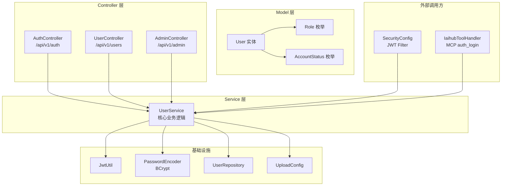
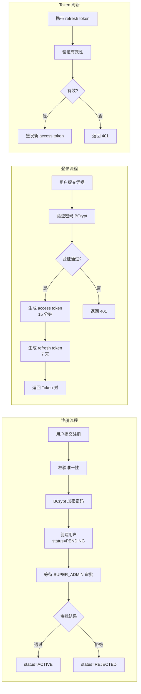
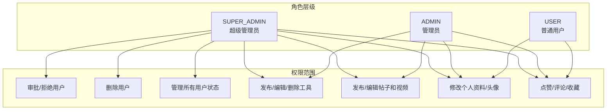

# 认证与用户管理

## 模块简介

认证与用户管理模块是 CodingHub 平台的安全核心，负责用户身份验证、角色权限管理和账户生命周期管控。该模块基于 JWT（JSON Web Token）实现无状态认证，采用 BCrypt 密码加密，并通过三级角色体系（USER / ADMIN / SUPER_ADMIN）实现细粒度的访问控制。

模块包含 56 个组件，涵盖 3 个 Controller、1 个核心 Service、3 个 Model（含枚举）、11 个 DTO 以及 1 个 Repository。所有认证与用户管理操作均通过 RESTful API 暴露，前端与 MCP 工具均通过此模块完成用户身份验证。

---

## 架构总览

---

## 组件职责说明

### Controllers

| 组件 | API 前缀 | 职责 |
|------|----------|------|
| **AuthController** | `/api/v1/auth` | 用户登录、注册、Token 刷新 |
| **UserController** | `/api/v1/users` | 个人资料管理、头像上传/删除、密码修改、我的工具列表 |
| **AdminController** | `/api/v1/admin` | 用户审批（通过/拒绝）、待审批列表、用户状态管理、用户删除 |

### Service

**UserService** 是模块的核心业务逻辑层，承担以下职责：

- **用户注册**：校验用户名/昵称唯一性，BCrypt 加密密码，初始状态设为 `PENDING`
- **用户登录**：验证凭据，生成 JWT access token（15 分钟）和 refresh token（7 天）
- **Token 刷新**：验证 refresh token 有效性，签发新的 access token
- **头像管理**：上传头像文件（限制大小），按 userId 组织存储路径，支持删除
- **密码修改**：验证旧密码，BCrypt 加密新密码
- **个人资料更新**：更新昵称等可编辑字段
- **管理员审批**：SUPER_ADMIN 审批 PENDING 用户，可批准或拒绝

### Models

| 组件 | 说明 |
|------|------|
| **User** | 用户实体，包含 `username`、`nickname`、`password`、`role`、`status`、`avatarUrl`，具备 `onCreate` / `onUpdate` 生命周期回调 |
| **Role** | 角色枚举：`USER`（普通用户）、`ADMIN`（管理员）、`SUPER_ADMIN`（超级管理员） |
| **AccountStatus** | 账户状态枚举：`PENDING`（待审批）、`ACTIVE`（已激活）、`REJECTED`（已拒绝） |

### DTOs

| DTO | 用途 |
|-----|------|
| **LoginRequest** | 登录请求（username + password） |
| **LoginResponse** | 登录响应（accessToken + refreshToken + 用户信息） |
| **RegisterRequest** | 注册请求（username + password + nickname） |
| **RefreshResponse** | Token 刷新响应（新 accessToken） |
| **AdminUserDTO** | 管理员视图的用户信息 |
| **PendingUserDTO** | 待审批用户的精简信息 |
| **PublicUserDTO** | 公开用户信息（脱敏） |
| **UserDTO** | 标准用户信息传输对象 |
| **UserStatusUpdateRequest** | 用户状态更新请求 |
| **ChangePasswordRequest** | 密码修改请求（旧密码 + 新密码） |
| **UpdateProfileRequest** | 个人资料更新请求 |
| **AvatarUploadResponse** | 头像上传响应（头像 URL） |

### Repository

**UserRepository** 提供以下数据访问方法：

- `findByUsername(String username)` — 按用户名查找
- `findByRole(Role role)` — 按角色查找
- `findByStatus(AccountStatus status)` — 按状态查找
- `existsByUsername(String username)` — 检查用户名是否存在
- `existsByNickname(String nickname)` — 检查昵称是否存在

---

## API 端点列表

### 认证接口（AuthController）

| 方法 | 路径 | 说明 | 认证 |
|------|------|------|------|
| POST | `/api/v1/auth/login` | 用户登录，返回 JWT Token 对 | 无 |
| POST | `/api/v1/auth/register` | 用户注册（状态为 PENDING） | 无 |
| POST | `/api/v1/auth/refresh` | 刷新 access token | 无（需 refreshToken） |

### 用户接口（UserController）

| 方法 | 路径 | 说明 | 认证 |
|------|------|------|------|
| GET | `/api/v1/users/profile` | 获取当前用户资料 | 需要 |
| PUT | `/api/v1/users/profile` | 更新个人资料 | 需要 |
| POST | `/api/v1/users/avatar` | 上传头像 | 需要 |
| DELETE | `/api/v1/users/avatar` | 删除头像 | 需要 |
| PUT | `/api/v1/users/password` | 修改密码 | 需要 |
| GET | `/api/v1/users/my-tools` | 获取我发布的工具列表 | 需要 |

### 管理接口（AdminController）

| 方法 | 路径 | 说明 | 认证 |
|------|------|------|------|
| POST | `/api/v1/admin/approve/{userId}` | 审批通过用户 | SUPER_ADMIN |
| POST | `/api/v1/admin/reject/{userId}` | 拒绝用户注册 | SUPER_ADMIN |
| GET | `/api/v1/admin/pending-users` | 获取待审批用户列表 | SUPER_ADMIN |
| GET | `/api/v1/admin/users` | 获取所有用户列表 | SUPER_ADMIN |
| PUT | `/api/v1/admin/users/{userId}/status` | 更新用户状态 | SUPER_ADMIN |
| DELETE | `/api/v1/admin/users/{userId}` | 删除用户 | SUPER_ADMIN |

---

## 认证流程

---

## 角色权限矩阵

| 操作 | SUPER_ADMIN | ADMIN | USER |
|------|:-----------:|:-----:|:----:|
| 审批/拒绝用户 | ✅ | ❌ | ❌ |
| 删除用户 | ✅ | ❌ | ❌ |
| 管理用户状态 | ✅ | ❌ | ❌ |
| 发布/编辑/删除工具 | ✅ | ✅ | ✅（仅自己的） |
| 发布/编辑帖子和视频 | ✅ | ✅ | ✅（仅自己的） |
| 修改个人资料/头像 | ✅ | ✅ | ✅ |
| 点赞/评论/收藏 | ✅ | ✅ | ✅ |

---

## 依赖关系

### 上游依赖（谁依赖本模块）

| 依赖方 | 依赖方式 | 说明 |
|--------|----------|------|
| [SecurityConfig](infra.md) | JWT Filter 链 | `JwtAuthenticationFilter` 在每次请求中调用 `UserService` 加载用户信息进行认证 |
| [IaihubToolHandler](mcp-service.md) | MCP 工具调用 | `auth_login` MCP 工具直接调用 `UserService.login()` 完成认证 |
| ToolService | Service 引用 | 工具实体关联 User（创建者），查询工具时需加载用户信息 |
| ForumPostService | Service 引用 | 帖子实体关联 User（作者），展示帖子时需加载作者信息 |
| VideoService | Service 引用 | 视频实体关联 User（上传者），展示视频时需加载上传者信息 |
| KnowledgeBaseService | Service 引用 | 知识库关联 User（创建者） |

### 下游依赖（本模块依赖谁）

| 依赖项 | 类型 | 说明 |
|--------|------|------|
| UserRepository | Repository | 用户数据持久化访问 |
| JwtUtil | Util | JWT Token 的生成、验证与解析 |
| PasswordEncoder（BCrypt） | Spring Bean | 密码加密与验证 |
| [UploadConfig](infra.md) | Config | 头像文件存储路径配置 |

### 变更影响

> **User 实体是本模块中影响范围最大的组件。**

User 实体的任何字段变更（增删字段、类型修改、枚举值变更）都会产生广泛的级联影响：

- **ToolService** — 工具创建者信息展示
- **ForumPostService** — 帖子作者信息展示
- **VideoService** — 视频上传者信息展示
- **KnowledgeBaseService** — 知识库创建者信息
- **所有 DTO** — 可能需要对应调整映射逻辑
- **SecurityConfig** — 如果 Role 枚举变更，权限规则需同步更新
- **DataInitializer** — 启动时初始化的 super_admin 用户依赖 User + Role

---

## 关键实现细节

### JWT 认证机制

- **Access Token**：有效期 15 分钟，携带在 `Authorization: Bearer <token>` 请求头中
- **Refresh Token**：有效期 7 天，仅用于换取新的 access token
- Token 过期时返回特定的异常信息，客户端可据此决定是否尝试刷新

### 注册审批流程

1. 用户提交注册请求，系统校验用户名和昵称唯一性
2. 密码经 BCrypt 加密后存储，账户状态设为 `PENDING`
3. SUPER_ADMIN 在管理后台查看待审批列表
4. 审批通过后状态变为 `ACTIVE`，用户可正常登录
5. 审批拒绝后状态变为 `REJECTED`

### 头像管理

- 头像文件存储在 `upload` 目录下，按 `userId` 组织子目录
- 上传时校验文件大小限制（由 [UploadConfig](infra.md) 配置）
- 删除头像时同步清理磁盘文件

### 管理员操作限制

- 所有管理员操作（审批、拒绝、删除用户、修改用户状态）仅限 `SUPER_ADMIN` 角色
- 此权限约束在 [SecurityConfig](infra.md) 的 URL 权限规则中强制执行

---

## 相关模块

- [基础设施](infra.md) — SecurityConfig 安全过滤链、JwtUtil、UploadConfig
- [MCP 服务](mcp-service.md) — auth_login MCP 工具调用本模块的登录功能
