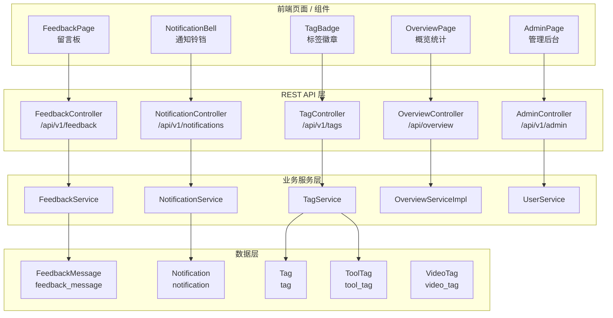
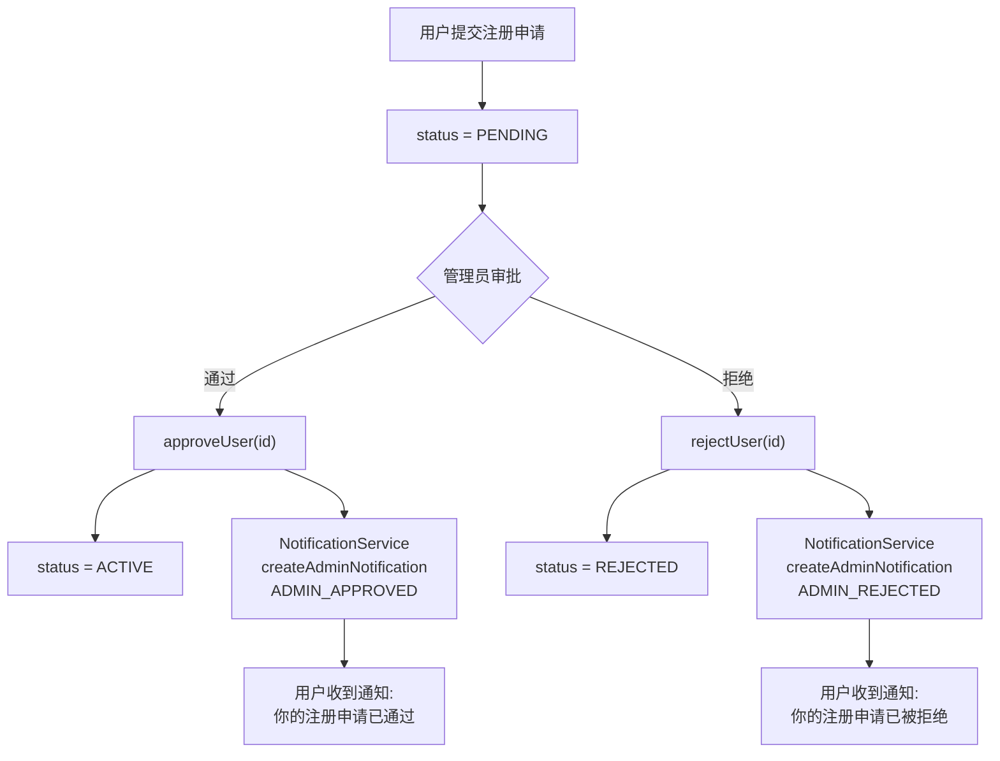
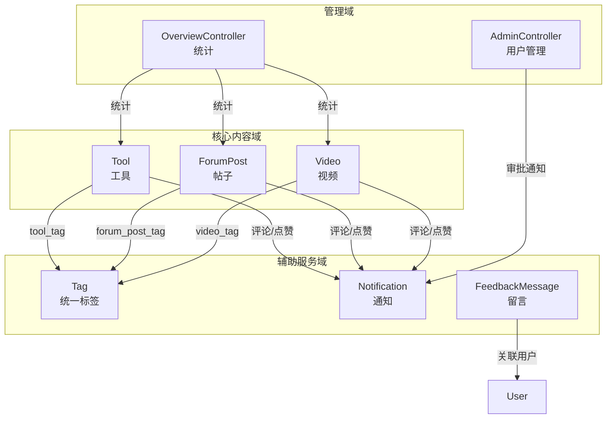

# 辅助服务模块 (auxiliary-services)

## 1. 模块概述

辅助服务模块涵盖 CodingHub 平台中除核心工具广场和论坛之外的五个支撑性子域：**留言反馈**、**站内通知**、**统一标签**、**概览统计** 和 **管理后台**。这些子域为平台提供运营支撑能力，确保用户反馈闭环、互动通知触达、内容标签化管理、数据可视化和管理员审批流程的完整运作。

各子域遵循统一的分层架构（Controller → Service → Repository → Model），相互之间无直接依赖，均通过 Spring Security 实现权限控制。

### 相关模块

| 关联模块 | 关系说明 |
|---------|---------|
| [backend-infra](backend-infra.md) | Spring Security 认证授权、JWT、XSS 防护等基础设施 |
| [tool-plaza](tool-plaza.md) | 工具广场核心业务，标签系统与工具实体关联 |
| [mcp-service](mcp-service.md) | MCP 服务通过 [TagService](../backend\src\main\java\com\iaihub\toolbox\service\tag\TagService.java) 进行标签解析，通过通知服务推送资源变更 |
| [unified-interactions](unified-interactions.md) | 统一互动模块触发评论和点赞通知 |
| [rag-service](rag-service.md) | RAG 知识库服务，与知识库标签管理相关 |

---

## 2. 整体架构



---

## 3. 留言反馈子域 (Feedback)

### 3.1 功能说明

留言反馈模块提供用户与管理员之间的异步沟通通道。用户可以提交留言（支持匿名），管理员可以进行回复或删除。

**核心特性**：
- 支持已登录用户和匿名用户两种提交方式
- 留言分类管理（建议、Bug、功能请求等）
- XSS 防护 — 所有用户输入经过 `XssSanitizer.sanitize()` 处理
- 匿名用户通过 IP 哈希（SHA-256）进行标识
- 软删除机制 — 删除操作仅将 `status` 设为 `DELETED`
- 管理员回复功能 — 记录回复内容和操作人

### 3.2 API 端点

| HTTP 方法 | 路径 | 说明 | 权限 |
|-----------|------|------|------|
| `GET` | `/api/v1/feedback` | 分页查询留言列表，可按分类过滤 | 公开 |
| `POST` | `/api/v1/feedback` | 提交新留言 | 公开（支持匿名） |
| `PUT` | `/api/v1/feedback/{id}/reply` | 管理员回复留言 | ADMIN / SUPER_ADMIN |
| `DELETE` | `/api/v1/feedback/{id}` | 删除留言（软删除） | ADMIN / SUPER_ADMIN |

**查询参数**（GET）：

| 参数 | 类型 | 默认值 | 说明 |
|------|------|--------|------|
| `category` | string | 无 | 留言分类过滤 |
| `page` | int | 0 | 页码（从 0 开始） |
| `size` | int | 20 | 每页条数 |

### 3.3 数据模型 — [FeedbackMessage](../backend\src\main\java\com\iaihub\toolbox\model\feedback\FeedbackMessage.java)

```
feedback_message 表
├── id              BIGINT (PK, AUTO_INCREMENT)
├── content         TEXT (留言内容, NOT NULL)
├── nickname        VARCHAR(50) (昵称)
├── contact         VARCHAR(100) (联系方式)
├── category        VARCHAR(20) (分类枚举, NOT NULL, 默认 SUGGESTION)
├── user_id         BIGINT (FK → user, 已登录用户关联)
├── ip_hash         VARCHAR(64) (匿名用户 IP 的 SHA-256 哈希)
├── status          VARCHAR(20) (状态枚举: NORMAL / DELETED, 默认 NORMAL)
├── admin_reply     TEXT (管理员回复内容)
├── replied_by      BIGINT (FK → user, 回复管理员)
├── replied_at      DATETIME (回复时间)
├── created_at      DATETIME (创建时间, NOT NULL)
└── updated_at      DATETIME (更新时间, NOT NULL)
```

**索引**：
- `idx_feedback_status_created` — (status, created_at DESC)
- `idx_feedback_category_status` — (category, status, created_at DESC)

### 3.4 业务流程

```
用户提交留言:
  ├── 已登录用户 → 关联 userId，自动取 nickname
  └── 匿名用户 → 计算 IP SHA-256 哈希作为 ipHash
  ↓
  XssSanitizer.sanitize() 净化输入
  ↓
  保存到 feedback_message 表（status = NORMAL）

管理员回复:
  校验 ADMIN/SUPER_ADMIN 权限
  ↓
  查找留言（status = NORMAL）
  ↓
  设置 adminReply、repliedBy、repliedAt
  ↓
  保存更新

管理员删除:
  校验 ADMIN/SUPER_ADMIN 权限
  ↓
  查找留言（status = NORMAL）
  ↓
  设置 status = DELETED（软删除）
```

---

## 4. 站内通知子域 ([Notification](../backend\src\main\java\com\iaihub\toolbox\model\notification\Notification.java))

### 4.1 功能说明

通知模块为平台内所有用户互动行为提供站内消息推送能力。当用户的内容被评论、点赞，或注册审批状态变化时，系统自动创建通知记录。

**支持的通知类型**：

| 类型 | 枚举值 | 触发场景 |
|------|--------|---------|
| 评论回复 | `COMMENT_REPLY` | 用户内容被他人评论 |
| 点赞 | `LIKE` | 用户内容被他人点赞 |
| 审批通过 | `ADMIN_APPROVED` | 注册申请被管理员通过 |
| 审批拒绝 | `ADMIN_REJECTED` | 注册申请被管理员拒绝 |

**核心特性**：
- 自动过滤自我操作（不通知自己评论/点赞自己）
- 未读计数查询
- 单条标记已读 / 全部标记已读
- 分页查询通知列表（按创建时间倒序）
- 权限隔离 — 只能操作自己的通知

### 4.2 API 端点

| HTTP 方法 | 路径 | 说明 | 权限 |
|-----------|------|------|------|
| `GET` | `/api/v1/notifications` | 分页查询当前用户的通知列表 | 登录用户 |
| `GET` | `/api/v1/notifications/unread-count` | 获取未读通知数量 | 登录用户 |
| `PUT` | `/api/v1/notifications/{id}/read` | 标记指定通知为已读 | 登录用户（仅本人） |
| `PUT` | `/api/v1/notifications/read-all` | 标记所有通知为已读 | 登录用户 |

### 4.3 数据模型 — [Notification](../backend\src\main\java\com\iaihub\toolbox\model\notification\Notification.java)

```
notification 表
├── id              BIGINT (PK, AUTO_INCREMENT)
├── user_id         BIGINT (FK → user, NOT NULL, 通知接收者)
├── type            VARCHAR(30) (通知类型枚举, NOT NULL)
├── target_type     VARCHAR(30) (目标类型: TOOL / FORUM_POST / VIDEO / USER)
├── target_id       BIGINT (目标实体 ID, NOT NULL)
├── message         VARCHAR(500) (通知消息文本, NOT NULL)
├── actor_id        BIGINT (触发者用户 ID)
├── actor_name      VARCHAR(100) (触发者用户名)
├── is_read         BOOLEAN (是否已读, 默认 false)
└── created_at      DATETIME (创建时间, NOT NULL)
```

**索引**：
- `idx_notification_user` — (user_id)
- `idx_notification_read` — (is_read)

### 4.4 通知创建接口

`NotificationService` 提供三个内部方法供其他服务调用以创建通知：

```java
// 评论通知 — 被评论内容的作者收到通知
createCommentNotification(targetOwnerId, targetType, targetId, actorId, actorName, preview)

// 点赞通知 — 被点赞内容的作者收到通知
createLikeNotification(targetOwnerId, targetType, targetId, actorId, actorName)

// 管理员审批通知 — 用户收到审批结果通知
createAdminNotification(userId, type)
```

**调用来源**：
- 评论服务（[unified-interactions](unified-interactions.md)）在创建评论时调用 `createCommentNotification`
- 互动服务在创建点赞时调用 `createLikeNotification`
- 管理后台在审批用户时调用 `createAdminNotification`

### 4.5 前端集成

通知模块的前端组件为 `NotificationBell`，通常置于页面顶部导航栏，实时显示未读通知数量并提供下拉列表查看通知详情。

---

## 5. 统一标签子域 ([Tag](../backend\src\main\java\com\iaihub\toolbox\model\tag\Tag.java))

### 5.1 功能说明

统一标签模块为平台的不同内容类型（工具、帖子、微课视频）提供集中化的标签管理能力。标签系统支持自动创建、使用频次统计、热门标签排行等功能。

**支持的标签类型**：

| 类型 | 枚举值 | 关联表 | 说明 |
|------|--------|--------|------|
| 工具标签 | `TOOL` | `tool_tag` | 工具广场中的工具标签 |
| 帖子标签 | `FORUM` | `forum_post_tag` | 论坛帖子标签 |
| 视频标签 | `VIDEO` | `video_tag` | 微课视频标签 |

**核心特性**：
- 标签名与类型的唯一约束（`uk_name_type`）
- 自动创建 — 不存在的标签在关联时自动创建
- 使用计数 — 每次关联/取消关联时递增/递减 `usageCount`
- 并发安全 — 捕获唯一约束冲突后回退查询
- 热门标签查询 — 按使用频次排序

### 5.2 API 端点

| HTTP 方法 | 路径 | 说明 | 权限 |
|-----------|------|------|------|
| `GET` | `/api/v1/tags` | 获取指定类型的所有标签 | 公开 |
| `GET` | `/api/v1/tags/hot` | 获取热门标签（按使用频次排序） | 公开 |
| `POST` | `/api/v1/tags` | 创建新标签 | 登录用户 |

**查询参数**：

| 参数 | 类型 | 默认值 | 说明 |
|------|------|--------|------|
| `type` | string | `TOOL` | 标签类型（TOOL / FORUM / VIDEO） |
| `limit` | int | 20 | 热门标签返回数量（上限 100） |

### 5.3 数据模型 — [Tag](../backend\src\main\java\com\iaihub\toolbox\model\tag\Tag.java)

```
tag 表
├── id              BIGINT (PK, AUTO_INCREMENT)
├── name            VARCHAR(50) (标签名, NOT NULL)
├── tag_type        VARCHAR(20) (标签类型枚举, NOT NULL)
├── usage_count     INTEGER (使用计数, 默认 0)
└── created_at      DATETIME (创建时间, NOT NULL)
```

**索引**：
- `uk_name_type` — (name, tag_type) **UNIQUE**

**关联表**：

| 关联表 | 字段 | 说明 |
|--------|------|------|
| `tool_tag` | tool_id, tag_id | 工具-标签多对多关联 |
| `forum_post_tag` | post_id, tag_id | 帖子-标签多对多关联 |
| `video_tag` | video_id, tag_id | 视频-标签多对多关联 |

### 5.4 核心服务方法

| 方法 | 说明 |
|------|------|
| `createTag(name, type)` | 创建标签，已存在则直接返回（幂等） |
| `getTagsByType(type)` | 获取指定类型的所有标签 |
| `getHotTags(type, limit)` | 获取热门标签，按 `usageCount` 降序 |
| `getOrCreateTag(name, tagType)` | 获取或创建单个标签 |
| `resolveOrCreateTags(names, tagType)` | **批量**解析标签名列表为 ID 列表，不存在自动创建 |
| `incrementUsage(tagId)` | 使用计数 +1 |
| `decrementUsage(tagId)` | 使用计数 -1（不低于 0） |

### 5.5 批量解析与并发处理

`resolveOrCreateTags` 是 MCP 工具创建和修改操作中的关键方法，其处理逻辑：

```
输入: ["MCP", "Spring", "AI"] + TagType.TOOL

对于每个标签名:
  1. 按 name + tagType 查询数据库
  2. 如果存在 → 直接返回 ID
  3. 如果不存在 → 创建新标签
     ├── 成功 → 返回新标签 ID
     └── DataIntegrityViolationException（并发冲突）
         → 回退：重新查询数据库获取已有记录
  4. 收集所有 ID 返回
```

---

## 6. 概览统计子域 (Overview)

### 6.1 功能说明

概览统计模块为平台首页的 Overview 页面提供全局数据统计和内容排行榜功能。

**提供的数据维度**：
- 平台全局统计（用户数、帖子数、工具数、视频数）
- 工具排行榜（按评分 score 降序，取 Top 10）
- 帖子排行榜（按评分 score 降序，取 Top 10）
- 视频排行榜（按浏览量 viewCount 降序，取 Top 10）

### 6.2 API 端点

| HTTP 方法 | 路径 | 说明 | 权限 |
|-----------|------|------|------|
| `GET` | `/api/overview/stats` | 获取平台全局统计数据 | 公开 |
| `GET` | `/api/overview/tool-ranks` | 获取工具排行榜 Top 10 | 公开 |
| `GET` | `/api/overview/post-ranks` | 获取帖子排行榜 Top 10 | 公开 |
| `GET` | `/api/overview/video-ranks` | 获取视频排行榜 Top 10 | 公开 |

### 6.3 响应数据结构

**[StatsDto](../backend\src\main\java\com\iaihub\toolbox\dto\StatsDto.java)** — 全局统计：

| 字段 | 类型 | 说明 |
|------|------|------|
| `userCount` | long | 注册用户总数 |
| `postCount` | long | 帖子总数 |
| `toolCount` | long | 工具总数 |
| `videoCount` | long | 视频总数 |

**[ToolRankDto](../backend\src\main\java\com\iaihub\toolbox\dto\ToolRankDto.java)** — 工具排行：

| 字段 | 类型 | 说明 |
|------|------|------|
| `id` | long | 工具 ID |
| `category` | string | 分类名称 |
| `name` | string | 工具名称 |
| `score` | BigDecimal | 综合评分 |

**[PostRankDto](../backend\src\main\java\com\iaihub\toolbox\dto\PostRankDto.java)** — 帖子排行：

| 字段 | 类型 | 说明 |
|------|------|------|
| `id` | long | 帖子 ID |
| `category` | string | 分类名称 |
| `title` | string | 帖子标题 |
| `score` | BigDecimal | 综合评分 |

**[VideoRankDto](../backend\src\main\java\com\iaihub\toolbox\dto\VideoRankDto.java)** — 视频排行：

| 字段 | 类型 | 说明 |
|------|------|------|
| `id` | long | 视频 ID |
| `title` | string | 视频标题 |
| `viewCount` | int | 浏览次数 |
| `likeCount` | int | 点赞次数 |

### 6.4 排行计算逻辑

排行实现采用内存排序方式（当前数据规模适用）：

```
工具排行: ToolRepository.findAll() → 按 score 降序排序 → 取 Top 10
帖子排行: ForumPostRepository.findAll() → 按 score 降序排序 → 取 Top 10
视频排行: VideoRepository.findTop20ByStatusOrderByViewCountDesc(NORMAL) → 取 Top 10
```

> **优化建议**：当数据量增长时，可考虑引入数据库级排序查询或缓存机制，避免全量加载到内存。

---

## 7. 管理后台子域 (Admin)

### 7.1 功能说明

管理后台模块提供平台管理员所需的运营管理能力，主要包括用户审批和用户管理两大功能。

**核心功能**：
- 查看待审批用户列表
- 审批通过/拒绝注册用户
- 分页查询用户列表（支持按角色、状态、关键词过滤）
- 修改用户状态（封禁/解禁）
- 删除用户

### 7.2 API 端点

| HTTP 方法 | 路径 | 说明 | 权限 |
|-----------|------|------|------|
| `GET` | `/api/v1/admin/pending-users` | 获取待审批用户列表 | ADMIN / SUPER_ADMIN |
| `POST` | `/api/v1/admin/approve/{id}` | 审批通过用户注册 | ADMIN / SUPER_ADMIN |
| `POST` | `/api/v1/admin/reject/{id}` | 拒绝用户注册 | ADMIN / SUPER_ADMIN |
| `GET` | `/api/v1/admin/users` | 分页查询用户列表 | ADMIN / SUPER_ADMIN |
| `PUT` | `/api/v1/admin/users/{id}/status` | 修改用户状态（封禁/解禁） | ADMIN / SUPER_ADMIN |
| `DELETE` | `/api/v1/admin/users/{id}` | 删除用户 | ADMIN / SUPER_ADMIN |

**用户列表查询参数**（GET `/api/v1/admin/users`）：

| 参数 | 类型 | 默认值 | 说明 |
|------|------|--------|------|
| `page` | int | 0 | 页码 |
| `size` | int | 10 | 每页条数 |
| `role` | string | 无 | 按角色过滤（USER / ADMIN / SUPER_ADMIN） |
| `status` | string | 无 | 按状态过滤（PENDING / ACTIVE / DISABLED） |
| `keyword` | string | 无 | 关键词搜索（用户名/昵称） |

### 7.3 用户审批流程



### 7.4 用户状态管理

| 状态 | 枚举值 | 说明 |
|------|--------|------|
| 待审批 | `PENDING` | 新注册用户，等待管理员审批 |
| 正常 | `ACTIVE` | 已审批通过，正常使用 |
| 已封禁 | `DISABLED` | 被管理员封禁，无法登录 |

### 7.5 角色体系

| 角色 | 权限说明 |
|------|---------|
| `USER` | 普通用户，可使用平台基础功能 |
| `ADMIN` | 管理员，可审批用户、管理留言、管理内容 |
| `SUPER_ADMIN` | 超级管理员，拥有所有管理权限 |

---

## 8. 跨域关联关系



---

## 9. 安全与防护

### 9.1 权限控制

各子域使用 Spring Security 的 `@PreAuthorize` 注解进行权限控制：

```java
// 留言管理 — 仅管理员可回复和删除
@PreAuthorize("hasAnyRole('ADMIN', 'SUPER_ADMIN')")

// 通知操作 — 基于 @AuthenticationPrincipal 确保只能操作自己的通知
if (!n.getUser().getId().equals(userId)) {
    throw new ForbiddenException("无权操作此通知");
}

// 管理后台 — 通过 Security 配置限制路径访问
@RequestMapping("/api/v1/admin")
```

### 9.2 XSS 防护

留言反馈模块对所有用户输入执行 XSS 净化：

```java
// FeedbackService.submit()
XssSanitizer.sanitize(request.content())
XssSanitizer.sanitize(request.nickname())
XssSanitizer.sanitize(request.contact())

// FeedbackService.reply()
XssSanitizer.sanitize(adminReply)
```

### 9.3 匿名标识

匿名用户提交留言时，系统通过 SHA-256 哈希记录客户端 IP，既保留追溯能力又避免明文存储 IP 地址：

```java
private String computeIpHash(HttpServletRequest request) {
    String ip = request.getRemoteAddr();
    // 考虑反向代理场景
    String forwarded = request.getHeader("X-Forwarded-For");
    if (forwarded != null && !forwarded.isEmpty()) {
        ip = forwarded.split(",")[0].trim();
    }
    MessageDigest digest = MessageDigest.getInstance("SHA-256");
    byte[] hash = digest.digest(ip.getBytes(StandardCharsets.UTF_8));
    // 转为十六进制字符串
}
```

---

## 10. 数据库表汇总

| 表名 | 所属子域 | 关键字段 | 说明 |
|------|---------|---------|------|
| `feedback_message` | 留言反馈 | content, category, status, admin_reply | 留言与管理员回复 |
| `notification` | 通知 | user_id, type, target_type, is_read | 站内通知 |
| `tag` | 统一标签 | name, tag_type, usage_count | 标签定义 |
| `tool_tag` | 统一标签 | tool_id, tag_id | 工具-标签关联 |
| `video_tag` | 统一标签 | video_id, tag_id | 视频-标签关联 |

---

## 11. 设计要点与注意事项

### 11.1 软删除一致性

留言反馈模块采用软删除（`status = DELETED`），查询时仅返回 `status = NORMAL` 的记录。这与工具广场和论坛帖子模块的软删除策略保持一致。

### 11.2 通知去重

通知服务在创建时检查 `targetOwnerId.equals(actorId)`，避免用户对自己的操作收到通知（如自己评论自己）。

### 11.3 标签并发安全

`resolveOrCreateTags` 方法通过捕获 `DataIntegrityViolationException` 处理并发创建场景：当两个请求同时尝试创建同名标签时，后执行的请求会捕获唯一约束冲突异常，然后回退查询已有记录。

### 11.4 统计性能

当前概览统计采用全量查询 + 内存排序的方式，适用于数据量较小的阶段。当数据量增长到万级以上时，建议：

1. 使用数据库 `ORDER BY ... LIMIT` 查询替代内存排序
2. 引入缓存机制（如 Redis），定时刷新统计数据
3. 统计计数使用异步计数器，避免每次请求执行 `COUNT(*)`

### 11.5 标签使用计数

标签的 `usageCount` 在内容关联/取消关联时由业务层显式调用 `incrementUsage` / `decrementUsage` 更新。该计数用于热门标签排序和内容推荐。


<!-- crosslinks (auto-generated) -->
## Related Modules
- Depends on: [auth-user](auth-user.md), [backend-infra](backend-infra.md), [forum](forum.md), [tool-plaza](tool-plaza.md), [video](video.md)
- Used by: [forum](forum.md), [mcp-service](mcp-service.md), [tool-plaza](tool-plaza.md), [video](video.md)
