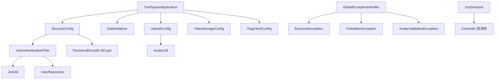
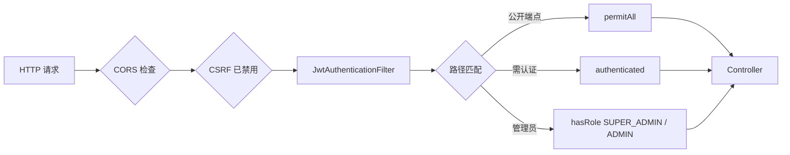
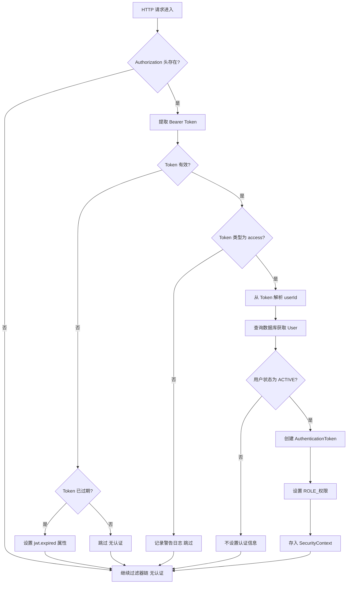
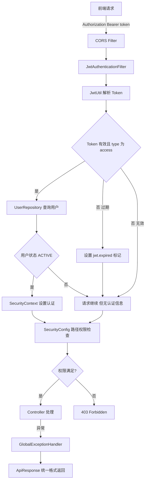

# backend-infra -- 后端基础设施

> 本模块涵盖 CodingHub 后端的**启动入口、安全框架、配置管理、全局异常处理与工具类**，是所有业务模块运行的底层基座。

---

## 1. 模块总览

| 维度 | 说明 |
|------|------|
| 技术栈 | Java 17 + Spring Boot 3.2.5 + Spring Security 6.x |
| 包路径 | `com.iaihub.toolbox.{config, exception, util}` |
| 文件数量 | config(7) + exception(9) + util(3) = 共 19 个文件 |
| 层级 | L0（基础层），可被 L1~L4 任意层依赖 |
| 端口 | HTTP 8082 |

### 架构图



---

## 2. 组件职责详解

### 2.1 启动入口 -- `ToolSquareApplication`

| 属性 | 值 |
|------|------|
| 文件 | `ToolSquareApplication.java` |
| 注解 | `@SpringBootApplication` |
| 职责 | Spring Boot 应用的主启动类，扫描 `com.iaihub.toolbox` 包下的所有组件 |

这是整个后端的最小入口，：

```java
@SpringBootApplication
public class ToolSquareApplication {
    public static void main(String[] args) {
        SpringApplication.run(ToolSquareApplication.class, args);
    }
}
```

启动时 Spring Boot 自动完成：
1. 扫描所有 `@Configuration`、`@Component`、`@Service`、`@Repository` 标注的 Bean
2. 初始化数据库连接池（Hibernate / JPA
3. 执行 `DataInitializer`（`CommandLineRunner`）创建超级管理员

---

### 2.2 安全框架 -- `SecurityConfig`

| 属性 | 值 |
|------|------|
| 文件 | `config/SecurityConfig.java` |
| 注解 | `@Configuration`, `@EnableWebSecurity` |
| 核心 Bean | `SecurityFilterChain`, `CorsConfigurationSource`, `PasswordEncoder` |

#### 2.2.1 安全策略总览



#### 2.2.2 会话管理

- **无状态会话**：`SessionCreationPolicy.STATELESS`，服务端不创建 Session
- **CSRF 禁用**：前后端分离架构，使用 JWT 替代 Cookie-Session，无需 CSRF 防护
- **CORS 配置**：允许所有来源（`*`），支持 GET/POST/PUT/DELETE/OPTIONS，凭证传递开启

#### 2.2.3 端点权限矩阵

| 端点模式 | HTTP 方法 | 权限 | 说明 |
|---------|-----------|------|------|
| `/api/v1/auth/**` | ALL | 公开 | 认证相关（注册/登录/刷新） |
| `/api/v1/tools` | GET | 公开 | 工具列表浏览 |
| `/api/v1/tools/{id}` | GET | 公开 | 工具详情查看 |
| `/api/v1/tools/hot-top5` | GET | 公开 | 热门工具 Top5 |
| `/api/v1/categories` | GET | 公开 | 工具分类列表 |
| `/api/v1/tools/{toolId}/files` | GET | 公开 | 工具附件列表 |
| `/api/v1/tools/{toolId}/files/{fileId}/download` | GET | 公开 | 附件下载 |
| `/api/v1/static/avatars/**` | GET | 公开 | 头像静态资源 |
| `/api/v1/users/{id}` | GET | 公开 | 用户公开资料 |
| `/sse/**`, `/mcp/**` | ALL | 公开 | MCP 协议端点（SSE + Streamable HTTP） |
| `/api/v1/videos` | GET | 公开 | 微课列表 |
| `/api/v1/videos/{id}` | GET | 公开 | 微课详情 |
| `/api/v1/videos/{id}/stream` | GET | 公开 | 视频流播放 |
| `/api/v1/videos/{id}/cover-image` | GET | 公开 | 视频封面图 |
| `/api/v1/videos/hot-top5` | GET | 公开 | 热门微课 Top5 |
| `/api/forum/posts/hot-top5` | GET | 公开 | 热门帖子 Top5 |
| `/api/v1/tags`, `/api/v1/tags/hot` | GET | 公开 | 标签列表/热门标签 |
| `/api/v1/interactions/likes/status` | GET | 公开 | 点赞状态查询 |
| `/api/v1/interactions/likes` | POST | 公开 | 点赞操作（支持匿名） |
| `/api/v1/interactions/comments` | GET/POST | 公开 | 评论查看与发表 |
| `/api/v1/interactions/comments/**` | DELETE | 需认证 | 删除评论 |
| `/api/v1/interactions/favorites/**` | ALL | 需认证 | 收藏操作 |
| `/api/v1/admin/approve/**`, `/api/v1/admin/reject/**` | ALL | SUPER_ADMIN | 用户审批 |
| `/api/v1/admin/pending-users` | ALL | SUPER_ADMIN | 待审批用户列表 |
| `/api/v1/admin/users/*/status` | ALL | SUPER_ADMIN | 修改用户状态 |
| `/api/v1/admin/**` | ALL | ADMIN / SUPER_ADMIN | 通用管理操作 |
| `/api/v1/notifications/**` | ALL | 需认证 | 通知相关 |
| `/api/v1/knowledge` | GET | 公开 | 知识库列表 |
| `/api/v1/knowledge/{id}/search` | POST | 公开 | 知识库搜索 |
| `/api/v1/knowledge/**` | ALL | 需认证 | 知识库管理 |
| `/api/v1/feedback` | GET/POST | 公开 | 留言查看与发表 |

#### 2.2.4 异常响应入口

当未认证用户访问受保护端点时，`authenticationEntryPoint` 根据 `jwt.expired` 属性区分响应：

| 场景 | HTTP 状态码 | JSON 响应体 |
|------|------------|------------|
| Token 已过期 | 401 | `{"error":"TOKEN_EXPIRED","message":"Token has expired"}` |
| 未提供 Token / Token 无效 | 401 | `{"error":"TOKEN_REQUIRED","message":"Authentication required"}` |

#### 2.2.5 密码编码器

使用 `BCryptPasswordEncoder` 对用户密码进行单向哈希加密，注册时编码、登录时比对。

---

### 2.3 JWT 认证过滤器 -- `JwtAuthenticationFilter`

| 属性 | 值 |
|------|------|
| 文件 | `config/JwtAuthenticationFilter.java` |
| 继承 | `OncePerRequestFilter`（确保每个请求仅执行一次） |
| 注入位置 | `SecurityFilterChain` 中 `UsernamePasswordAuthenticationFilter` 之前 |

#### 处理流程



**关键设计要点**：

1. **Token 类型校验**：仅允许 `type=access` 的 Token 进行身份认证，`refresh` Token 被拒绝
2. **账户状态检查**：仅 `AccountStatus.ACTIVE` 的用户才能通过认证，PENDING / REJECTED / DISABLED 用户即使 Token 有效也不会获得认证
3. **权限映射**：从 `User.role` 直接映射为 Spring Security 的 `ROLE_` 前缀权限（如 `ROLE_USER`, `ROLE_ADMIN`, `ROLE_SUPER_ADMIN`）
4. **异常隔离**：过滤器内的所有异常被 `catch` 后仅记录日志，不会中断请求处理链

---

### 2.4 数据初始化器 -- `DataInitializer`

| 属性 | 值 |
|------|------|
| 文件 | `config/DataInitializer.java` |
| 接口 | `CommandLineRunner`（应用启动后自动执行） |
| 配置前缀 | `app.super-admin.username` / `app.super-admin.password` |
| 默认值 | 用户名 `admin`，密码 `Cloud@1234` |

#### 初始化逻辑

| 步骤 | 操作 | 说明 |
|------|------|------|
| 1 | 查询 `superAdminUsername` 是否已存在 | 防止重复创建 |
| 2a | 已存在且角色为 SUPER_ADMIN | 记录 info 日志，跳过 |
| 2b | 已存在但角色不是 SUPER_ADMIN | 记录 warn 日志，提示手动修复 |
| 2c | 不存在 | 创建 SUPER_ADMIN 用户，密码 BCrypt 编码 |

创建的超级管理员属性：

| 字段 | 值 |
|------|------|
| username | 配置值（默认 `admin`） |
| nickname | `超级管理员` |
| role | `SUPER_ADMIN` |
| status | `ACTIVE` |

---

### 2.5 上传配置 -- `UploadConfig`

| 属性 | 值 |
|------|------|
| 文件 | `config/UploadConfig.java` |
| 配置前缀 | `app.upload` |
| 初始化时机 | `@PostConstruct` |

#### 配置参数

| 参数 | 默认值 | 说明 |
|------|--------|------|
| `baseDir` | `${user.home}/aifiles` | 上传根目录 |
| `maxFileSize` | `50MB` | 单个文件最大大小 |
| `maxRequestSize` | `200MB` | 单次请求最大大小 |
| `allowedExtensions` | 空列表（不限制） | 工具附件允许的扩展名白名单 |
| `avatarSubdir` | `avatars` | 头像子目录名 |
| `avatarMaxFileSize` | `2MB` | 头像文件最大大小 |
| `avatarAllowedExtensions` | `jpg, jpeg, png, webp, gif` | 头像允许的扩展名 |

#### 目录结构

启动时自动创建的目录：

```
${user.home}/aifiles/           # 上传根目录
    avatars/                    # 头像存储目录
    uploads/
        videos/                 # 视频存储目录（由 VideoStorageConfig 创建）
```

---

### 2.6 视频存储配置 -- `VideoStorageConfig`

| 属性 | 值 |
|------|------|
| 文件 | `config/VideoStorageConfig.java` |
| 配置前缀 | `app.upload.base-dir`（复用上传根目录） |
| 视频路径 | `${baseDir}/uploads/videos` |

在 `@PostConstruct` 阶段确保视频存储目录存在，不存在则自动创建。

---

### 2.7 RAG 客户端配置 -- `RagClientConfig`

| 属性 | 值 |
|------|------|
| 文件 | `config/RagClientConfig.java` |
| Bean | `HttpClient`（`java.net.http.HttpClient`） |
| 连接超时 | 10 秒 |

提供一个全局共享的 `HttpClient` Bean，用于向 RAG Python 服务发送 HTTP 请求（知识库语义搜索等功能）。

---

### 2.8 全局异常处理器 -- `GlobalExceptionHandler`

| 属性 | 值 |
|------|------|
| 文件 | `exception/GlobalExceptionHandler.java` |
| 注解 | `@RestControllerAdvice`（全局拦截所有 Controller 异常） |
| 响应格式 | `ApiResponse<Void>` 统一错误响应 |

#### 异常处理映射

| 异常类型 | HTTP 状态码 | 处理说明 |
|---------|------------|----------|
| `BusinessException` | 异常自带 `code`（默认 400） | 业务逻辑错误，返回 code + message |
| `MethodArgumentNotValidException` | 400 | DTO 校验失败，拼接所有字段错误信息 |
| `ForbiddenException` | 403 | 权限不足（继承自 [BusinessException](../backend\src\main\java\com\iaihub\toolbox\exception\BusinessException.java)） |
| `IllegalArgumentException` | 400 | 参数非法 |
| `Exception`（兜底） | 500 | 未预期异常，记录完整堆栈日志 |

#### 异常类层级

```
RuntimeException
    BusinessException (code + message)
        ForbiddenException (403)
        UnauthorizedException (401)
        DuplicateResourceException (409)
        ResourceNotFoundException (404)
        UserNotFoundException (404)
        FileValidationException (400)
        AvatarValidationException (400)
```

所有业务异常继承自 `BusinessException`，通过 `getCode()` 获取 HTTP 状态码。`GlobalExceptionHandler` 统一将其转换为 `ApiResponse.error(code, message)` 格式返回。

---

### 2.9 JWT 工具类 -- `JwtUtil`

| 属性 | 值 |
|------|------|
| 文件 | `util/JwtUtil.java` |
| 依赖库 | `io.jsonwebtoken`（JJWT） |
| 签名算法 | HMAC-SHA（密钥由 `app.jwt.secret` 配置） |

#### Token 配置

| 配置项 | 说明 | 典型值 |
|--------|------|--------|
| `app.jwt.secret` | HMAC 签名密钥 | 配置文件指定 |
| `app.jwt.access-token-expiration` | Access Token 有效期 | 15 分钟（900000ms） |
| `app.jwt.refresh-token-expiration` | Refresh Token 有效期 | 7 天（604800000ms） |

#### Token 结构

```json
{
  "sub": "用户ID（Long.toString）",
  "email": "用户名",
  "type": "access | refresh",
  "iat": "签发时间",
  "exp": "过期时间"
}
```

#### 核心方法

| 方法 | 说明 |
|------|------|
| `generateAccessToken(userId, email)` | 生成短期 Access Token |
| `generateRefreshToken(userId, email)` | 生成长期 Refresh Token |
| `parseToken(token)` | 解析 Token，返回 Claims |
| `validateToken(token)` | 校验 Token 有效性（签名 + 过期） |
| `isTokenExpired(token)` | 判断 Token 是否已过期（区分过期与无效） |
| `isRefreshToken(token)` | 判断 Token 是否为 Refresh 类型 |
| `getUserIdFromToken(token)` | 从 Token 提取用户 ID |

---

### 2.10 XSS 防护工具 -- `XssSanitizer`

| 属性 | 值 |
|------|------|
| 文件 | `util/XssSanitizer.java` |
| 依赖库 | `org.apache.commons.text.StringEscapeUtils` |
| 设计模式 | 工具类（私有构造器 + 静态方法） |

#### 方法说明

| 方法 | 用途 | 处理步骤 |
|------|------|----------|
| `sanitize(input)` | 通用内容净化 | 1. HTML 实体转义 2. 移除 `javascript:` 协议 3. 移除 `onXxx=` 事件属性 4. 去除首尾空白 |
| `sanitizePlainText(input)` | 纯文本净化 | 仅 HTML 实体转义 |

**使用场景**：所有用户提交的文本内容（帖子标题/内容、评论、工具描述等）在入库前必须调用 `XssSanitizer.sanitize()` 进行净化处理。

---

### 2.11 头像工具类 -- `AvatarUtil`

| 属性 | 值 |
|------|------|
| 文件 | `util/AvatarUtil.java` |
| 设计模式 | 工具类（私有构造器 + 静态方法） |

#### 安全校验规则

| 校验项 | 允许值 | 拒绝值 |
|--------|--------|--------|
| 扩展名白名单 | `jpg, jpeg, png, webp, gif` | 其他所有格式 |
| 危险扩展名黑名单 | -- | `svg, html, htm, xml, js`（XSS 风险） |
| MIME 类型白名单 | `image/jpeg, image/png, image/webp, image/gif` | 不匹配的 MIME |
| 文件有效性 | 非空、有文件名 | 空文件或无文件名 |
| 路径安全 | 纯数字用户 ID | 非数字（防止路径穿越） |

#### 核心方法

| 方法 | 说明 |
|------|------|
| `validateAndGetExtension(file)` | 校验上传文件，返回合法扩展名 |
| `validatePathSafe(userIdStr)` | 校验用户 ID 为纯数字，防止路径穿越 |
| `normalizeExt(ext)` | 扩展名标准化（`jpeg` 转为 `jpg`） |

---

## 3. 数据流：请求认证全链路



---

## 4. 配置项汇总

以下是本模块涉及的所有外部配置项（定义在 `application.yml` 或环境变量中）：

| 配置项 | 类型 | 默认值 | 被引用组件 |
|--------|------|--------|-----------|
| `app.jwt.secret` | String | 无（必填） | [JwtUtil](../backend\src\main\java\com\iaihub\toolbox\util\JwtUtil.java) |
| `app.jwt.access-token-expiration` | long | 无（必填） | [JwtUtil](../backend\src\main\java\com\iaihub\toolbox\util\JwtUtil.java) |
| `app.jwt.refresh-token-expiration` | long | 无（必填） | [JwtUtil](../backend\src\main\java\com\iaihub\toolbox\util\JwtUtil.java) |
| `app.super-admin.username` | String | `admin` | [DataInitializer](../backend\src\main\java\com\iaihub\toolbox\config\DataInitializer.java) |
| `app.super-admin.password` | String | `Cloud@1234` | [DataInitializer](../backend\src\main\java\com\iaihub\toolbox\config\DataInitializer.java) |
| `app.upload.base-dir` | String | `${user.home}/aifiles` | [UploadConfig](../backend\src\main\java\com\iaihub\toolbox\config\UploadConfig.java), [VideoStorageConfig](../backend\src\main\java\com\iaihub\toolbox\config\VideoStorageConfig.java) |
| `app.upload.max-file-size` | String | `50MB` | [UploadConfig](../backend\src\main\java\com\iaihub\toolbox\config\UploadConfig.java) |
| `app.upload.max-request-size` | String | `200MB` | [UploadConfig](../backend\src\main\java\com\iaihub\toolbox\config\UploadConfig.java) |
| `app.upload.allowed-extensions` | List | 空 | [UploadConfig](../backend\src\main\java\com\iaihub\toolbox\config\UploadConfig.java) |
| `app.upload.avatar-subdir` | String | `avatars` | [UploadConfig](../backend\src\main\java\com\iaihub\toolbox\config\UploadConfig.java) |
| `app.upload.avatar-max-file-size` | String | `2MB` | [UploadConfig](../backend\src\main\java\com\iaihub\toolbox\config\UploadConfig.java) |
| `app.upload.avatar-allowed-extensions` | List | `jpg,jpeg,png,webp,gif` | [UploadConfig](../backend\src\main\java\com\iaihub\toolbox\config\UploadConfig.java) |

---

## 5. 关键设计决策

### 5.1 为什么使用无状态 JWT 而非 Session

- 前后端分离架构，前端运行在 `localhost:5173`，后端在 `localhost:8082`
- 无状态 Token 无需服务端存储会话，水平扩展更容易
- Access Token 短期有效（15 分钟），配合 Refresh Token（7 天）实现安全与体验平衡

### 5.2 为什么区分 Token 过期与 Token 无效

`JwtAuthenticationFilter` 专门区分了 `ExpiredJwtException` 和其他 JWT 异常：
- **过期**：设置 `jwt.expired=true` 属性，`authenticationEntryPoint` 返回 `TOKEN_EXPIRED`，前端可据此自动调用 `/refresh` 接口
- **无效**：不设置特殊标记，返回 `TOKEN_REQUIRED`，前端引导用户重新登录

### 5.3 为什么禁用 CSRF

- CSRF 攻击针对的是 Cookie-Session 认证模式
- 本项目使用 `Authorization: Bearer` 头传递 Token，浏览器不会自动附加
- 因此 CSRF 保护无意义，禁用可减少不必要的请求校验开销

### 5.4 为什么头像使用文件系统而非数据库

- 头像文件存储在 `${baseDir}/avatars/{userId}.{ext}`，通过 `AvatarStaticController` 提供 HTTP 访问
- 避免了大文件 BLOB 存储带来的数据库膨胀问题
- 利用 HTTP 缓存头（`Cache-Control: max-age=3600`）减少重复请求

---

## 6. 与其他模块的关系

| 关联模块 | 关系说明 |
|---------|---------|
| [auth-user](auth-user.md) | 用户注册/登录/Token 刷新依赖 `JwtUtil`、`SecurityConfig`、`PasswordEncoder` |
| [tool-plaza](tool-plaza.md) | 工具 CRUD 受 `SecurityConfig` 权限规则保护，内容入库前调用 `XssSanitizer` |
| [unified-interactions](unified-interactions.md) | 点赞/评论/收藏的权限策略在 `SecurityConfig` 中定义 |

---

## 7. 文件索引

| 文件路径 | 职责 |
|---------|------|
| `ToolSquareApplication.java` | Spring Boot 主启动类 |
| `config/SecurityConfig.java` | 安全配置：过滤链、CORS、权限规则、密码编码器 |
| `config/JwtAuthenticationFilter.java` | JWT 认证过滤器：Token 解析、用户认证、权限映射 |
| `config/DataInitializer.java` | 数据初始化：自动创建超级管理员账户 |
| `config/UploadConfig.java` | 上传配置：目录、大小限制、扩展名白名单 |
| `config/VideoStorageConfig.java` | 视频存储配置：视频文件目录管理 |
| `config/RagClientConfig.java` | RAG 客户端：共享 HttpClient Bean |
| `exception/GlobalExceptionHandler.java` | 全局异常处理器：统一错误响应格式 |
| `exception/BusinessException.java` | 业务异常基类（code + message） |
| `exception/ForbiddenException.java` | 403 权限不足异常 |
| `exception/UnauthorizedException.java` | 401 未认证异常 |
| `exception/DuplicateResourceException.java` | 409 资源重复异常 |
| `exception/ResourceNotFoundException.java` | 404 资源未找到异常 |
| `exception/UserNotFoundException.java` | 404 用户未找到异常 |
| `exception/FileValidationException.java` | 400 文件校验异常 |
| `exception/AvatarValidationException.java` | 400 头像校验异常 |
| `util/JwtUtil.java` | JWT 工具：Token 生成、解析、校验 |
| `util/XssSanitizer.java` | XSS 防护：HTML 实体转义、危险模式移除 |
| `util/AvatarUtil.java` | 头像工具：文件校验、路径安全、扩展名标准化 |


<!-- crosslinks (auto-generated) -->
## Related Modules
- Depends on: [auth-user](auth-user.md)
- Used by: [auth-user](auth-user.md), [auxiliary-services](auxiliary-services.md), [forum](forum.md), [knowledge-base](knowledge-base.md), [tool-plaza](tool-plaza.md), [unified-interactions](unified-interactions.md), [video](video.md)
