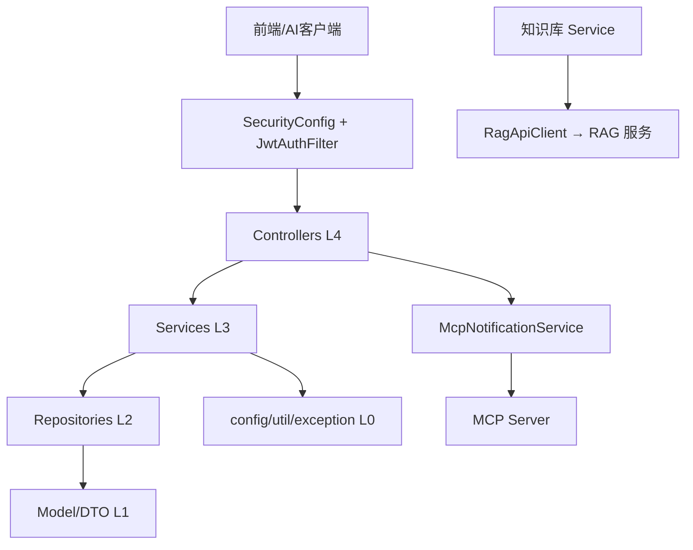

# 后端服务（Backend）

## 模块简介

后端是 CodingHub 的 **Java 17 / Spring Boot 3.2.5** 单体应用（`backend/`），监听 8082，承载全部业务领域：认证用户、工具广场、论坛、微课、知识库、统一互动、概览管理、MCP 服务，以及横切的基础设施与异常处理。它访问 MySQL（`ai_tool_square`，Flyway V1~V9）并对外暴露 REST API 与 MCP（SSE/Streamable HTTP）。

- 分层（单向依赖）：`controller`(L4) → `service`(L3) → `repository`(L2) → `model`/`dto`(L1)；`config`/`util`/`exception`(L0) 可被任意层依赖
- 子模块（9 个叶子模块，详见各模块文档）：
  1. [认证与用户模块](auth-user.md)
  2. [工具广场模块](tool-plaza.md)
  3. [论坛社区模块](forum.md)
  4. [微课视频模块](video.md)
  5. [知识库模块](knowledge-base.md)
  6. [统一互动服务模块](unified-services.md)
  7. [概览与管理模块](overview-admin.md)
  8. [MCP 服务模块](mcp-service.md)
  9. [基础设施与异常模块](infra.md)

## 架构图

## 分层约束与安全基座

- **禁止循环依赖**：`controller → service → repository → model`，反向禁止。
- **JWT 认证**：`Authorization: Bearer <token>`，access 15min / refresh 7d；`@AuthenticationPrincipal` 注入 `User`。
- **权限**：`USER` < `ADMIN` < `SUPER_ADMIN`；内容写操作遵循 `isOwner || isAdmin`。
- **软删除**：内容实体用 `status = NORMAL/DELETED`，不物理删除。
- **XSS**：用户输入经 `XssSanitizer.sanitize()`。
- **异常**：统一 `GlobalExceptionHandler` → `ApiResponse.error`。
- 详情见 [基础设施与异常模块](infra.md)。

## 数据库与迁移

- MySQL `ai_tool_square`；核心表 `user`/`category`/`tool`/`tool_file`/`tool_like`/`tool_comment`；论坛/微课/知识库/标签/通知/留言等表详见 [架构文档](https://www.codebuddy.ai/docs/zh/ide/User-guide/Overview) 与 `backend/.../docs/ARCHITECTURE.md`。
- 迁移脚本 Flyway V1~V9（`backend/src/main/resources/db/migration/`）。
- 统一互动采用 `TargetType`(TOOL/FORUM_POST/VIDEO) + `UnifiedLike`/`UnifiedComment`/`UnifiedFavorite` 表；热度 `score = viewCount*1 + likeCount*3 + commentCount*5`。

## API 入口点（http://localhost:8082）

| 前缀 | 说明 | 前缀 | 说明 |
|------|------|------|------|
| `/api/v1/auth` | 认证 | `/api/forum/posts` | 论坛帖子 |
| `/api/v1/tools` | 工具 CRUD+点赞 | `/api/forum/categories` | 论坛分类 |
| `/api/v1/categories` | 工具分类 | `/api/v1/post-favorites` | 帖子收藏 |
| `/api/v1/users` | 用户(profile/avatar) | `/api/overview` | 统计/排行 |
| `/api/v1/admin` | 管理(审批/用户) | `/mcp` `/sse` | MCP(18 tools) |
| `/api/v1/videos` | 微课 | `/api/v1/feedback` | 留言反馈 |
| `/api/v1/interactions` | 统一互动 | `/api/v1/notifications` | 通知 |
| `/api/v1/knowledge` | 知识库 | `/api/v1/tags` | 统一标签 |

## 模块间协作

- **统一互动**驱动工具/论坛/视频的点赞、评论、收藏计数（[统一互动服务模块](unified-services.md)）。
- **工具广场**创建/更新/删除触发 **MCP 通知**（[MCP 服务模块](mcp-service.md)）。
- **知识库**经 `RagApiClient` 调用 [RAG 知识库服务模块](rag-service.md) 做文档检索；文档管理由 [前端应用](frontend-app.md) 直连。
- **概览管理**复用各模块排行逻辑（热门 Top5/Top10）。

## 相关模块

- [前端应用](frontend-app.md) — REST API 调用方
- [RAG 知识库服务模块](rag-service.md) — 知识库检索后端
- 叶子模块文档见上方 9 个链接
