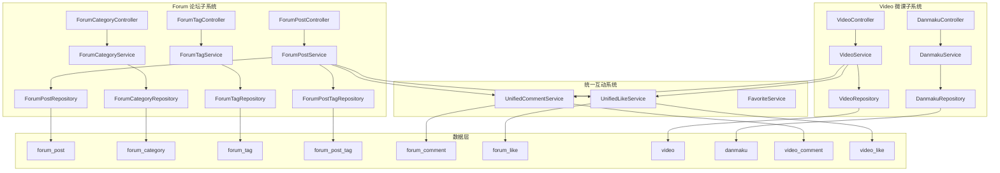

# 社区内容（论坛与微课）

## 模块简介

社区内容模块是 CodingHub 平台的核心社交层，涵盖**论坛（Forum）**和**微课（Video）**两大子系统。论坛为用户提供技术讨论、经验分享和问答交流的空间；微课模块支持视频上传、在线播放和弹幕互动，打造轻量级的知识传播平台。两个子系统共享统一互动系统（评论、点赞、收藏），在架构上实现了内容创作与社交互动的高度复用。

本模块后端包含控制器、服务层、数据模型和仓储层的完整分层结构，前端通过页面组件和通用组件提供用户交互界面。论坛与微课均支持标签管理、热度排序、置顶展示和管理员审核等企业级社区功能。

---

## 系统架构

---

## Forum 论坛子系统

### 数据模型

| 实体 | 字段 | 说明 |
|------|------|------|
| **ForumPost** | title, content, authorId, categoryId, viewCount, likeCount, commentCount, score, pinned, status, visibility | 论坛帖子，支持热度排序和管理员置顶 |
| **ForumCategory** | name, description | 帖子分类 |
| **ForumTag** | name, usageCount | 帖子标签，创建/删除时同步 usage 计数 |
| **ForumPostTag** | postId, tagId | 联合主键，帖子与标签的多对多关联 |
| **ForumPostStatus** | NORMAL / DELETED | 帖子状态枚举，软删除使用 DELETED |
| **ForumPostVisibility** | PUBLIC / PRIVATE | 帖子可见性控制 |

### 组件职责

#### 控制器层

| 控制器 | API 前缀 | 职责 |
|--------|----------|------|
| **ForumPostController** | `/api/forum/posts` | 帖子 CRUD、列表查询（支持 category/tag/keyword/sortBy 过滤）、我的帖子、置顶（ADMIN）、热门 Top5 |
| **ForumCategoryController** | `/api/forum/categories` | 分类 CRUD、分类列表 |
| **ForumTagController** | `/api/v1/tags` | 标签 CRUD、按类型查询 |

#### 服务层

| 服务 | 核心职责 |
|------|---------|
| **ForumPostService** | 帖子 CRUD、标签关联管理、热度排序（score 计算）、软删除、置顶逻辑、浏览量统计 |
| **ForumCategoryService** | 分类管理、校验分类存在性 |
| **ForumTagService** | 标签创建/删除、usageCount 同步、TOOL/FORUM/VIDEO 类型管理 |

#### 仓储层

| 仓储 | 说明 |
|------|------|
| **ForumPostRepository** | 25 个方法，含自定义排序查询（按 score 热度排序、按分类/标签/关键词过滤） |
| **ForumCategoryRepository** | 分类查询，支持按名称查找 |
| **ForumPostTagRepository** | 帖子-标签关联表操作 |
| **ForumTagRepository** | 标签查询，支持按类型和名称查找 |

### DTO 定义

| DTO | 用途 |
|-----|------|
| **ForumPostDTO** | 帖子响应数据，包含作者信息、分类、标签列表 |
| **ForumPostCreateRequest** | 创建帖子请求：title, content, categoryId, tagIds |
| **ForumCommentCreateRequest** | 发布评论请求：content, postId |
| **ForumLikeRequest** | 点赞/取消点赞请求 |
| **ForumCategoryDTO** | 分类响应数据 |
| **ForumTagDTO** | 标签响应数据 |

---

## Video 微课子系统

### 数据模型

| 实体 | 字段 | 说明 |
|------|------|------|
| **Video** | title, description, fileName, fileSize, filePath, coverUrl, duration, viewCount, likeCount, commentCount, score, pinned, status, danmakuEnabled, uploaderId | 微课视频，支持热度排序和弹幕开关 |
| **Danmaku** | videoId, content, time, color, type, userId | 弹幕，支持自定义颜色、位置和时间点 |
| **VideoStatus** | NORMAL / DELETED | 视频状态枚举，软删除使用 DELETED |

### 组件职责

#### 控制器层

| 控制器 | API 前缀 | 职责 |
|--------|----------|------|
| **VideoController** | `/api/v1/videos` | 视频列表、详情、上传（MP4）、更新、删除、流式播放（stream）、封面上传、我的视频、置顶、热门 Top5 |
| **DanmakuController** | `/api/v1/videos/{videoId}/danmaku` | 弹幕列表查询、发送弹幕 |

#### 服务层

| 服务 | 核心职责 |
|------|---------|
| **VideoService** | 视频上传（MP4 限制 1 GB）、文件存储路径管理、封面上传（JPEG/PNG 限制 5 MB）、标签关联、热度排序、软删除、流式播放 |
| **DanmakuService** | 弹幕发送与查询、时间轴过滤 |
| **UnifiedCommentService** | 统一评论服务，视频评论复用 |
| **UnifiedLikeService** | 统一点赞服务，视频点赞复用 |

#### 仓储层

| 仓储 | 说明 |
|------|------|
| **VideoRepository** | 24 个方法，含分页查询、热度排序、按上传者/分类/标签过滤 |
| **DanmakuRepository** | 弹幕查询，支持按视频 ID 和时间范围过滤 |

### DTO 定义

| DTO | 用途 |
|-----|------|
| **VideoResponse** | 视频详情响应，包含上传者信息、标签、统计数据 |
| **VideoListItem** | 视频列表项，精简字段用于列表展示 |
| **VideoUploadRequest** | 视频上传元数据：title, description, tagIds |
| **VideoUpdateRequest** | 视频更新请求 |
| **VideoCommentRequest** | 视频评论请求 |
| **VideoCommentResponse** | 视频评论响应 |
| **DanmakuDTO** | 弹幕数据：content, time, color, type |
| **SendDanmakuRequest** | 发送弹幕请求 |

---

## API 端点一览

### 论坛 API

| 方法 | 端点 | 说明 |
|------|------|------|
| GET | `/api/forum/posts` | 帖子列表（支持 category/tag/keyword/sortBy 参数） |
| GET | `/api/forum/posts/my` | 当前用户的帖子 |
| GET | `/api/forum/posts/{id}` | 帖子详情（自动增加 viewCount） |
| POST | `/api/forum/posts` | 创建帖子 |
| PUT | `/api/forum/posts/{id}` | 更新帖子 |
| DELETE | `/api/forum/posts/{id}` | 删除帖子（软删除，status=DELETED） |
| PUT | `/api/forum/posts/{id}/pin` | 置顶/取消置顶（仅 ADMIN） |
| GET | `/api/forum/posts/hot` | 热门帖子 Top 5（按 score 排序） |
| GET | `/api/forum/categories` | 分类列表 |
| POST | `/api/forum/categories` | 创建分类 |
| PUT | `/api/forum/categories/{id}` | 更新分类 |
| DELETE | `/api/forum/categories/{id}` | 删除分类 |

### 微课 API

| 方法 | 端点 | 说明 |
|------|------|------|
| GET | `/api/v1/videos` | 视频列表 |
| GET | `/api/v1/videos/{id}` | 视频详情 |
| POST | `/api/v1/videos/upload` | 上传视频（MP4，最大 1 GB） |
| PUT | `/api/v1/videos/{id}` | 更新视频信息 |
| DELETE | `/api/v1/videos/{id}` | 删除视频（软删除） |
| GET | `/api/v1/videos/{id}/stream` | 流式播放（支持 Range 请求） |
| POST | `/api/v1/videos/{id}/cover` | 上传封面（JPEG/PNG，最大 5 MB） |
| GET | `/api/v1/videos/my` | 我的视频列表 |
| PUT | `/api/v1/videos/{id}/pin` | 置顶/取消置顶 |
| GET | `/api/v1/videos/hot` | 热门视频 Top 5 |
| GET | `/api/v1/videos/{videoId}/danmaku` | 获取弹幕列表 |
| POST | `/api/v1/videos/{videoId}/danmaku` | 发送弹幕 |

---

## 关键特性与设计决策

### 热度排序机制

帖子和视频均通过 `score` 字段实现热度排序。`score` 综合考虑浏览量、点赞数和评论数等因素。置顶内容（`pinned=true`）始终在列表中优先展示，不受 score 影响。热门 Top5 接口直接按 score 降序返回前 5 条内容。

### 视频文件存储策略

视频上传采用两阶段存储策略：
1. 上传时先写入临时目录
2. 保存成功后移动到最终路径 `uploads/videos/{userId}/{videoId}/original.mp4`

这种设计避免了上传中断导致的残留文件问题。封面图片存储为 JPEG/PNG 格式，大小限制 5 MB。

### 弹幕系统

弹幕支持以下自定义属性：
- **颜色**：自定义 RGB 颜色值
- **位置类型**：顶部固定、底部固定、滚动弹幕
- **时间点**：精确到视频播放的秒级时间戳

播放时前端通过时间轴过滤，仅展示当前播放时间窗口内的弹幕。

### 标签管理

论坛帖子和微课视频均通过关联表（`ForumPostTag` / `VideoTag`）管理标签。标签创建或关联时同步更新 `usageCount` 计数器，删除关联时同步递减。标签系统通过 [统一标签服务](frontend-app.md) 提供 TOOL/FORUM/VIDEO 三种类型。

### 统一互动系统

评论和点赞功能通过 `UnifiedCommentService` 和 `UnifiedLikeService` 实现跨模块复用。论坛帖子和微课视频共享同一套评论/点赞基础设施，通过 `contentType` 字段区分不同内容类型。详见 [前端应用](frontend-app.md) 中的互动组件说明。

---

## 与其他模块的关联

- [前端应用](frontend-app.md)：提供论坛和微课的用户界面，包括帖子列表、视频播放器、弹幕覆盖层等组件
- [RAG 知识库服务](rag-service.md)：知识库与论坛/微课独立，但共享统一标签系统
- 统一互动系统：评论、点赞、收藏功能被论坛和微课共同复用
- 通知系统：帖子评论、视频互动等事件触发通知推送
