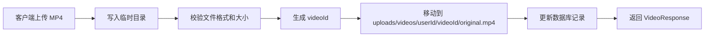

# 社区内容（论坛与微课）

## 模块简介

社区内容模块是 CodingHub 平台的核心社交功能层，涵盖 **论坛（Forum）** 和 **微课（Video）** 两大子系统。论坛子系统为用户提供技术帖子的发布、分类、标签管理、评论互动和内容排序能力；微课子系统则支持视频内容的上传、流式播放、弹幕互动和封面管理。两个子系统共享统一的互动体系（评论、点赞、收藏），并通过标签系统实现跨模块的内容组织。

本模块共计 165 个组件，后端采用 Spring Boot 分层架构（Controller → Service → Repository），前端通过 REST API 和 MCP 协议对外暴露服务。论坛帖子和微课视频均支持热度排序算法、置顶机制和软删除策略，确保内容运营的灵活性和数据安全性。

---

## 架构概览

```mermaid
graph TD
    subgraph Forum["Forum 子系统"]
        FPC[ForumPostController]
        FCC[ForumCategoryController]
        FTC[ForumTagController]
        FPS[ForumPostService]
        FCS[ForumCategoryService]
        FTS[ForumTagService]
        FPR[ForumPostRepository]
        FPTR[ForumPostTagRepository]
        FTR[ForumTagRepository]
    end

    subgraph Video["Video 子系统"]
        VC[VideoController]
        DC[DanmakuController]
        VS[VideoService]
        DS[DanmakuService]
        VR[VideoRepository]
        DR[DanmakuRepository]
        VTR[VideoTagRepository]
    end

    subgraph Shared["共享互动系统"]
        UCR[UnifiedCommentService]
        ULR[UnifiedLikeRepository]
        UFR[UnifiedFavoriteRepository]
        UR[UserRepository]
        TR[TagRepository]
    end

    subgraph MCP["MCP 工具层"]
        MCPH[IaihubToolHandler]
    end

    FPC --> FPS
    FCC --> FCS
    FTC --> FTS
    FPS --> FPR
    FPS --> FPTR
    FPS --> FTR
    FPS --> ULR
    FPS --> UFR
    FPS --> UR

    VC --> VS
    DC --> DS
    VS --> VR
    VS --> VTR
    VS --> TR
    VS --> ULR
    VS --> UFR
    VS --> UR
    DS --> DR

    MCPH --> FPS

    FPC -.->|REST /api/forum/posts| Client[客户端]
    VC -.->|REST /api/v1/videos| Client
    DC -.->|REST /api/v1/videos/danmaku| Client
```



---

## Forum 子系统

### Controllers

| Controller | 路由前缀 | 职责 |
|------------|----------|------|
| ForumPostController | `/api/forum/posts` | 帖子列表分页、我的帖子、帖子详情、CRUD 操作、置顶/取消置顶、热门 Top5 |
| ForumCategoryController | `/api/forum/categories` | 论坛分类的增删改查 |
| ForumTagController | `/api/forum/tags` | 论坛标签的增删改查 |

**ForumPostController 端点明细：**

- `GET /api/forum/posts` — 帖子列表（分页、按分类/标签筛选、热度排序）
- `GET /api/forum/posts/my` — 当前用户的帖子列表
- `GET /api/forum/posts/{id}` — 帖子详情（自增浏览数）
- `POST /api/forum/posts` — 创建帖子（关联标签）
- `PUT /api/forum/posts/{id}` — 更新帖子（owner 或 admin 权限）
- `DELETE /api/forum/posts/{id}` — 软删除帖子（status = DELETED）
- `PUT /api/forum/posts/{id}/pin` — 置顶/取消置顶
- `GET /api/forum/posts/hot` — 热门帖子 Top5（按 score 降序）

### Services

**ForumPostService** 是论坛子系统的核心业务逻辑层，承担以下职责：

- **帖子 CRUD**：创建时自动关联标签（通过 ForumPostTag 关联表），更新时校验 owner/admin 权限，删除采用软删除策略（status 字段置为 DELETED）
- **标签关联管理**：创建/更新帖子时同步维护 ForumPostTag 关联表，并更新对应标签的 usage 计数
- **热度排序**：基于 `score` 字段实现热度排序，置顶帖子始终排在最前
- **浏览计数**：每次查看详情时自增 viewCount
- **软删除**：删除操作仅修改 status 字段，列表查询默认过滤已删除记录

**ForumCategoryService** 管理论坛分类的层级结构，**ForumTagService** 管理论坛标签及其使用计数。

### Models

| 实体 | 关键字段 | 说明 |
|------|----------|------|
| ForumPost | title, content, authorId, categoryId, viewCount, likeCount, commentCount, score, pinned, status, visibility | 帖子主表，score 用于热度排序 |
| ForumCategory | name, description, sortOrder | 论坛分类 |
| ForumTag | name, color, usageCount | 论坛标签，usageCount 随帖子关联自动增减 |
| ForumPostTag | postId, tagId | 帖子-标签多对多关联表 |
| ForumPostStatus | 枚举: ACTIVE, DELETED | 帖子状态 |
| ForumPostVisibility | 枚举: PUBLIC, PRIVATE | 帖子可见性 |

### DTOs

| DTO | 用途 |
|-----|------|
| ForumPostDTO | 帖子响应体（含作者信息、标签列表、当前用户互动状态） |
| ForumPostCreateRequest | 创建帖子请求（title, content, categoryId, tagIds） |
| ForumCommentCreateRequest | 发表评论请求（复用统一评论系统） |
| ForumCategoryDTO | 分类响应体 |
| ForumTagDTO | 标签响应体 |

---

## Video 子系统

### Controllers

| Controller | 路由前缀 | 职责 |
|------------|----------|------|
| VideoController | `/api/v1/videos` | 视频列表、详情、上传 MP4、更新、删除、流式播放、封面管理、我的视频、置顶、热门 Top5 |
| DanmakuController | `/api/v1/videos/{videoId}/danmaku` | 弹幕列表获取、发送弹幕 |

**VideoController 端点明细：**

- `GET /api/v1/videos` — 视频列表（分页、热度排序）
- `GET /api/v1/videos/{id}` — 视频详情
- `POST /api/v1/videos/upload` — 上传视频（MP4 格式，最大 1GB）
- `PUT /api/v1/videos/{id}` — 更新视频信息
- `DELETE /api/v1/videos/{id}` — 软删除视频
- `GET /api/v1/videos/{id}/stream` — 流式播放（HTTP Range 请求支持）
- `POST /api/v1/videos/{id}/cover` — 上传封面图（JPEG/PNG，最大 5MB）
- `GET /api/v1/videos/my` — 当前用户的视频列表
- `PUT /api/v1/videos/{id}/pin` — 置顶/取消置顶
- `GET /api/v1/videos/hot` — 热门视频 Top5

**DanmakuController 端点明细：**

- `GET /api/v1/videos/{videoId}/danmaku` — 获取指定视频的弹幕列表
- `POST /api/v1/videos/{videoId}/danmaku` — 发送弹幕（支持自定义颜色、位置、时间点）

### Services

**VideoService** 是微课子系统的核心业务逻辑层，承担以下职责：

- **视频上传**：接收 MP4 文件（最大 1GB），先写入临时目录，上传完成后移动到最终存储路径 `uploads/videos/{userId}/{videoId}/original.mp4`
- **封面管理**：支持 JPEG/PNG 格式封面上传（最大 5MB），存储在视频目录下
- **标签关联**：通过 VideoTag 关联表管理视频标签，维护 Tag 的 usage 计数
- **热度排序**：基于 `score` 字段实现热度排序，置顶视频始终优先展示
- **软删除**：删除操作修改 status 字段为 DELETED，不物理删除文件

**DanmakuService** 管理弹幕的发送和查询，支持按视频 ID 和时间范围检索弹幕。

### Models

| 实体 | 关键字段 | 说明 |
|------|----------|------|
| Video | title, description, fileName, fileSize, filePath, coverUrl, duration, viewCount, likeCount, commentCount, score, pinned, status, danmakuEnabled | 视频主表 |
| Danmaku | videoId, content, time, color, type | 弹幕表，time 为视频播放时间点（秒），type 支持顶部/底部/滚动 |
| VideoStatus | 枚举: ACTIVE, DELETED | 视频状态 |

**视频文件存储结构：**

```
uploads/
  videos/
    {userId}/
      {videoId}/
        original.mp4    # 原始视频文件
        cover.jpg       # 封面图（可选）
```

### DTOs

| DTO | 用途 |
|-----|------|
| VideoResponse | 视频详情响应体（含完整元数据和作者信息） |
| VideoListItem | 视频列表项（精简字段，用于列表展示） |
| VideoUploadRequest | 视频上传请求（title, description, tagIds） |
| VideoUpdateRequest | 视频更新请求 |
| VideoCommentRequest | 视频评论请求 |
| VideoCommentResponse | 视频评论响应 |
| DanmakuDTO | 弹幕响应体（content, time, color, type） |
| SendDanmakuRequest | 发送弹幕请求（content, time, color, type） |

---

## 依赖关系

### 上游依赖（谁调用本模块）

| 被调用方 | 调用者 | 调用方式 | 说明 |
|----------|--------|----------|------|
| ForumPostService | ForumPostController | REST API | 标准 HTTP 请求入口 |
| ForumPostService | IaihubToolHandler | MCP 协议 | 通过 `post_search`、`post_get`、`post_create` 工具调用 |
| VideoService | VideoController | REST API | 标准 HTTP 请求入口 |
| VideoService | DanmakuController | REST API | 弹幕操作时间接调用 |

### 下游依赖（本模块调用谁）

| 调用方 | 被依赖组件 | 说明 |
|--------|-----------|------|
| ForumPostService | ForumPostRepository | 帖子数据持久化 |
| ForumPostService | ForumPostTagRepository | 帖子-标签关联表操作 |
| ForumPostService | ForumTagRepository | 标签查询和 usage 计数更新 |
| ForumPostService | UserRepository | 获取作者信息 |
| ForumPostService | UnifiedLikeRepository | 点赞状态查询 |
| ForumPostService | UnifiedFavoriteRepository | 收藏状态查询 |
| VideoService | VideoRepository | 视频数据持久化 |
| VideoService | DanmakuRepository | 弹幕数据持久化 |
| VideoService | VideoTagRepository | 视频-标签关联表操作 |
| VideoService | TagRepository | 统一标签查询和 usage 计数 |
| VideoService | UserRepository | 获取作者信息 |
| VideoService | UnifiedLikeRepository | 点赞状态查询 |
| VideoService | UnifiedFavoriteRepository | 收藏状态查询 |
| VideoService | VideoStorageConfig | 视频存储路径配置 |

### 变更影响分析

| 变更对象 | 影响范围 | 风险等级 |
|----------|----------|----------|
| ForumPost 实体字段变更 | ForumPostController 响应结构、MCP post_search/post_get 工具输出格式 | 高 |
| Video 实体字段变更 | VideoController 响应结构、前端 VideoCard/VideoPlayer 组件 | 高 |
| ForumTag/Tag 关联逻辑变更 | ForumPostService 和 VideoService 的标签同步逻辑、TagService usage 计数 | 中 |
| score 计算规则变更 | 热门 Top5 排行和默认排序结果 | 中 |
| 软删除策略变更 | 所有列表查询的过滤逻辑 | 中 |

---

## API 端点汇总

### Forum API

| 方法 | 端点 | 说明 |
|------|------|------|
| GET | `/api/forum/posts` | 帖子列表（分页） |
| GET | `/api/forum/posts/my` | 我的帖子 |
| GET | `/api/forum/posts/hot` | 热门 Top5 |
| GET | `/api/forum/posts/{id}` | 帖子详情 |
| POST | `/api/forum/posts` | 创建帖子 |
| PUT | `/api/forum/posts/{id}` | 更新帖子 |
| DELETE | `/api/forum/posts/{id}` | 删除帖子（软删除） |
| PUT | `/api/forum/posts/{id}/pin` | 置顶/取消置顶 |
| GET | `/api/forum/categories` | 分类列表 |
| POST | `/api/forum/categories` | 创建分类 |
| GET | `/api/forum/tags` | 标签列表 |
| POST | `/api/forum/tags` | 创建标签 |

### Video API

| 方法 | 端点 | 说明 |
|------|------|------|
| GET | `/api/v1/videos` | 视频列表（分页） |
| GET | `/api/v1/videos/my` | 我的视频 |
| GET | `/api/v1/videos/hot` | 热门 Top5 |
| GET | `/api/v1/videos/{id}` | 视频详情 |
| POST | `/api/v1/videos/upload` | 上传视频 |
| PUT | `/api/v1/videos/{id}` | 更新视频 |
| DELETE | `/api/v1/videos/{id}` | 删除视频（软删除） |
| GET | `/api/v1/videos/{id}/stream` | 流式播放 |
| POST | `/api/v1/videos/{id}/cover` | 上传封面 |
| PUT | `/api/v1/videos/{id}/pin` | 置顶/取消置顶 |
| GET | `/api/v1/videos/{videoId}/danmaku` | 弹幕列表 |
| POST | `/api/v1/videos/{videoId}/danmaku` | 发送弹幕 |

---

## 关键特性

### 热度排序算法

论坛帖子和微课视频均采用 `score` 字段进行热度排序。排序规则：
1. **置顶优先**：`pinned = true` 的记录始终排在最前
2. **按 score 降序**：非置顶记录按 score 字段降序排列
3. **分页支持**：结合 Spring Data 分页返回结果

### 视频文件存储流程



### 弹幕系统

弹幕支持以下自定义属性：
- **颜色**：自定义弹幕文字颜色
- **位置类型**：顶部固定（top）、底部固定（bottom）、滚动（scroll）
- **时间点**：精确到秒的视频播放时间戳，弹幕在对应时间点显示

### 统一互动系统复用

论坛帖子和微课视频的评论、点赞、收藏功能均复用平台的统一互动系统：
- **评论**：通过 [前端应用](frontend-app.md) 的 CommentSection 组件和 UnifiedCommentService 实现
- **点赞**：通过 UnifiedLikeRepository 统一管理，支持 TOOL/POST/VIDEO 三种目标类型
- **收藏**：通过 UnifiedFavoriteRepository 统一管理

### 标签管理

论坛和微课均通过关联表（ForumPostTag / VideoTag）管理标签关系：
- 创建内容时批量关联标签，对应标签的 usageCount 自增
- 删除内容时批量解除关联，对应标签的 usageCount 自减
- 标签 usage 计数由 TagService 统一维护

---

## 交叉引用

- 统一互动系统（评论/点赞/收藏）的详细说明参见平台核心模块文档
- 前端论坛和微课页面的组件设计参见 [前端应用](frontend-app.md)
- 标签系统的统一管理机制参见标签模块文档
- MCP 工具层对论坛帖子的调用方式参见 MCP 模块文档
- 知识库语义搜索能力参见 [RAG 知识库服务](rag-service.md)
