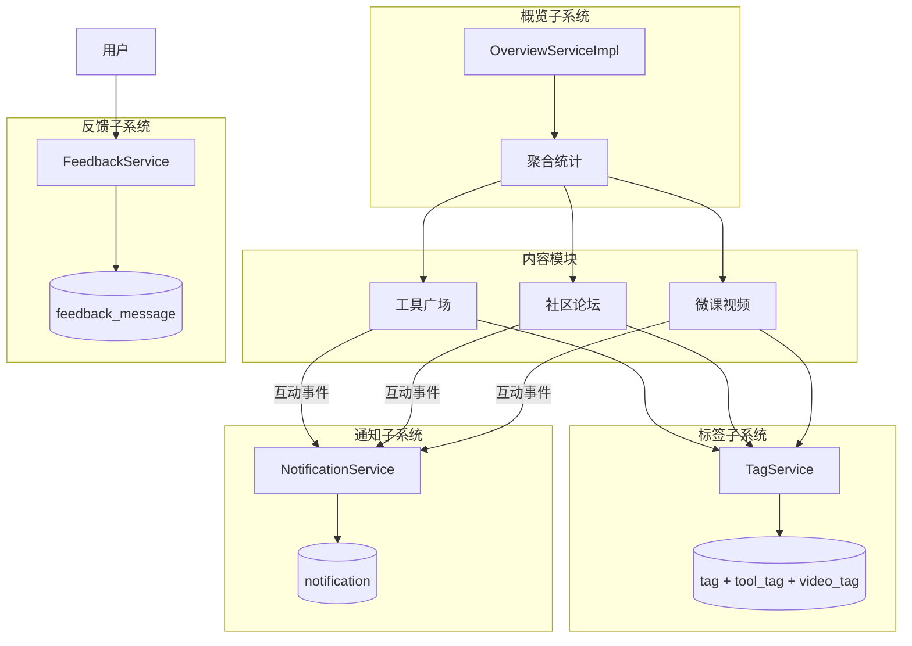
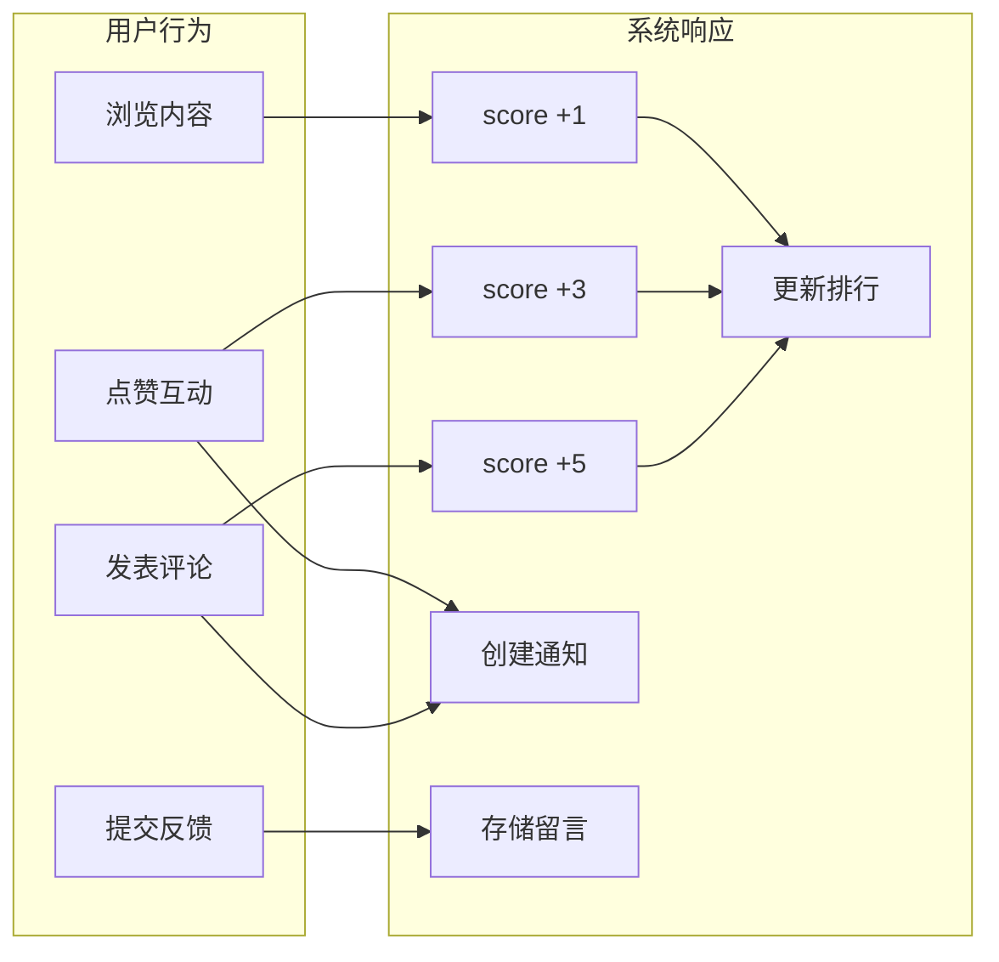

# 社区与概览（Community & Overview）

社区与概览模块是 CodingHub 平台的社交基础设施，包含 **108 个组件**，涵盖标签管理、消息通知、留言反馈和平台概览四大子系统。这些子系统为[工具广场](tool-plaza.md)、[知识库](knowledge-base.md)以及论坛、微课等内容模块提供通用的社交能力支撑。

标签系统实现了跨内容类型的统一标签管理；通知系统为用户提供实时的互动提醒；留言板收集用户反馈与建议；概览页面聚合展示全平台的统计数据和热门排行。

---

## 社交功能总览

---

## 标签子系统

标签系统提供跨内容类型的统一标签管理能力，支持 TOOL、FORUM、VIDEO 三种目标类型。

### 组件职责

| 组件 | 职责 |
|---|---|
| `TagController` | 标签 API 入口：按类型查标签、热门标签、创建标签 |
| `TagService` | 标签 CRUD；`getOrCreateTag` 幂等创建（名称+类型相同则复用）；使用计数管理（`incrementUsage` / `decrementUsage`） |
| `Tag` (Model) | name, tagType, usageCount |
| `TagType` (Enum) | TOOL, FORUM, VIDEO |
| `ToolTag` (Model) | toolId + tagId 联合主键 |
| `VideoTag` (Model) | videoId + tagId 联合主键 |
| `TagRepository` | 标签数据访问 |
| `ToolTagRepository` | 工具-标签关联数据访问 |
| `VideoTagRepository` | 视频-标签关联数据访问 |

### API 端点

| 方法 | 路径 | 说明 | 认证 |
|---|---|---|---|
| `GET` | `/api/v1/tags` | 按类型查标签（tagType=TOOL\|FORUM\|VIDEO） | 否 |
| `GET` | `/api/v1/tags/hot` | 热门标签（按 usageCount 排序） | 否 |
| `POST` | `/api/v1/tags` | 创建标签 | 是 |

### 关键特性

- **幂等创建**：`getOrCreateTag(name, tagType)` — 同名同类型的标签不会重复创建，直接返回已有标签
- **使用计数**：标签被关联时 `incrementUsage`，取消关联时 `decrementUsage`，用于热门标签排序
- **多对多关联**：通过 `tool_tag` 和 `video_tag` 关联表实现工具/视频与标签的多对多关系
- **论坛标签**：论坛模块有独立的 `forum_tag` 和 `forum_post_tag` 表，但共享统一的 Tag 模型

---

## 通知子系统

通知系统为用户提供互动消息的实时推送和管理能力。

### 组件职责

| 组件 | 职责 |
|---|---|
| `NotificationController` | 通知 API 入口：通知列表（分页）、未读计数、标记已读、全部已读 |
| `NotificationService` | 通知创建、查询、标记已读、未读计数统计 |
| `Notification` (Model) | userId, type, title, content, isRead, targetType, targetId |
| `NotificationType` (Enum) | 通知类型枚举 |
| `NotificationRepository` | 通知数据访问 |

### API 端点

| 方法 | 路径 | 说明 | 认证 |
|---|---|---|---|
| `GET` | `/api/v1/notifications` | 通知列表（分页） | 是 |
| `GET` | `/api/v1/notifications/unread-count` | 未读通知计数 | 是 |
| `PUT` | `/api/v1/notifications/{id}/read` | 标记单条通知已读 | 是 |
| `PUT` | `/api/v1/notifications/read-all` | 标记全部通知已读 | 是 |

### 关键特性

- **需认证**：所有通知接口均需要 JWT 认证，通知按 userId 隔离
- **未读计数**：前端通过 `unread-count` 接口获取未读数量，用于导航栏红点提示
- **批量已读**：支持单条标记和全部标记两种已读模式
- **目标关联**：通知包含 `targetType` 和 `targetId`，可跳转到对应的内容详情页

---

## 反馈子系统

留言板是用户向平台管理者提交反馈、建议和问题报告的渠道，支持匿名和已登录两种模式。

### 组件职责

| 组件 | 职责 |
|---|---|
| `FeedbackController` | 留言 API 入口：留言列表（公开、分页+分类过滤）、提交留言、管理员回复（ADMIN）、删除（ADMIN） |
| `FeedbackService` | 留言提交（支持匿名+已登录）；IP hash 匿名标识；XSS 净化；分类过滤；管理员回复；软删除 |
| `FeedbackMessage` (Model) | content, nickname, contact, category, userId, ipHash, adminReply, repliedBy, repliedAt, status |
| `FeedbackCategory` (Enum) | SUGGESTION, BUG, FEATURE 等分类 |
| `FeedbackMessageRepository` | 留言数据访问 |

### API 端点

| 方法 | 路径 | 说明 | 认证 |
|---|---|---|---|
| `GET` | `/api/v1/feedback` | 留言列表（公开，分页+分类过滤） | 否 |
| `POST` | `/api/v1/feedback` | 提交留言 | 可选（匿名用 IP hash） |
| `PUT` | `/api/v1/feedback/{id}/reply` | 管理员回复 | 是（ADMIN） |
| `DELETE` | `/api/v1/feedback/{id}` | 删除留言（软删除） | 是（ADMIN） |

### 关键特性

- **双模式提交**：已登录用户自动关联 userId；匿名用户使用 IP hash 标识，需提供 nickname 和 contact
- **分类过滤**：支持按 `FeedbackCategory`（SUGGESTION / BUG / FEATURE 等）过滤留言列表
- **管理员回复**：管理员可以对留言进行回复，回复内容存储在 `adminReply` 字段
- **XSS 防护**：留言内容经过 `XssSanitizer.sanitize()` 净化，防止跨站脚本攻击
- **软删除**：管理员删除留言时采用软删除策略（status = DELETED）

---

## 概览子系统

概览页面聚合展示全平台的统计数据和内容排行榜，为用户提供平台全局视角。

### 组件职责

| 组件 | 职责 |
|---|---|
| `OverviewController` | 概览 API 入口：统计数据、工具排行、帖子排行、视频排行 |
| `OverviewServiceImpl` | 统计用户/帖子/工具/视频总数；按 score 排序取 Top10 |

### API 端点

| 方法 | 路径 | 说明 | 认证 |
|---|---|---|---|
| `GET` | `/api/overview/stats` | 平台统计数据（用户/帖子/工具/视频总数） | 否 |
| `GET` | `/api/overview/tool-ranks` | 工具排行榜 Top10（按 score 排序） | 否 |
| `GET` | `/api/overview/post-ranks` | 帖子排行榜 Top10（按 score 排序） | 否 |
| `GET` | `/api/overview/video-ranks` | 视频排行榜 Top10（按 score 排序） | 否 |

### 关键特性

- **公开访问**：所有概览接口无需认证
- **统一排行算法**：排行榜基于 `score` 字段排序，与[工具广场](tool-plaza.md)的热度计算规则一致（浏览+1, 点赞+3, 评论+5, 下载+2）
- **跨模块聚合**：概览服务同时查询工具、帖子、视频三个内容模块的数据，提供统一的平台视角

---

## 数据流全景

---

## 与其他模块的关系

- **工具广场**：标签系统为工具提供分类标记能力；通知系统接收工具互动事件；概览页面聚合工具排行数据。详见 [工具广场](tool-plaza.md)。
- **知识库**：标签系统可为知识库提供分类标记。详见 [知识库](knowledge-base.md)。
- **论坛模块**：论坛帖子共享标签系统（通过 `forum_tag` / `forum_post_tag`）和通知系统。
- **微课模块**：微课视频通过 `video_tag` 关联标签，互动事件触发通知推送。

---

## 数据库表

| 表名 | 说明 |
|---|---|
| `tag` | 标签主表（name / tagType / usageCount） |
| `tool_tag` | 工具-标签关联表（联合主键 toolId + tagId） |
| `video_tag` | 视频-标签关联表（联合主键 videoId + tagId） |
| `notification` | 通知表（userId / type / title / content / isRead / targetType / targetId） |
| `feedback_message` | 留言反馈表（content / nickname / contact / category / userId / ipHash / adminReply / status） |

> 论坛相关标签表（`forum_tag` / `forum_post_tag`）属于论坛模块管理，但共享 Tag 模型定义。
