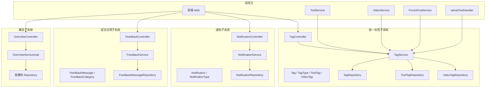
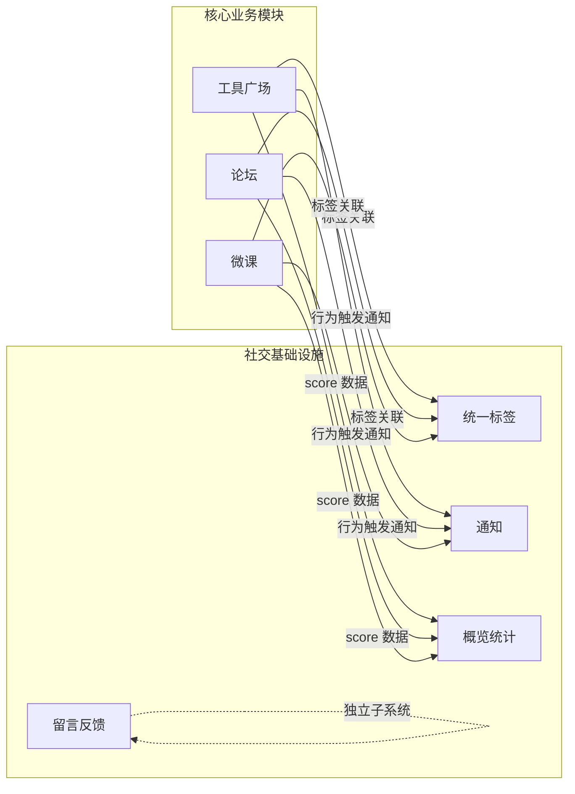

# 社交与概览（Community & Social）

## 模块简介

社交与概览模块是 CodingHub 的社区基础设施层，包含四个相对独立的子系统：统一标签、通知、留言反馈和平台概览。这些子系统为 [工具广场](tool-plaza.md)、论坛和微课等核心业务模块提供横切关注点——标签分类、消息通知、用户反馈和统计展示。

本模块涵盖 109 个组件，虽然各子系统功能聚焦且边界清晰，但它们的被依赖面非常广。统一标签系统服务于工具、帖子、视频三种内容类型，通知系统贯穿整个平台的用户行为链路，是 CodingHub 社区化能力的关键支撑。

## 架构概览

## 子系统详解

### 1. 统一标签子系统

#### 组件职责

| 组件 | 职责 |
|------|------|
| TagController | 按类型查标签（TOOL / FORUM / VIDEO）、热门标签、创建标签 |
| TagService | 标签 CRUD、getOrCreateTag（幂等创建）、使用计数 incrementUsage / decrementUsage |
| Tag | 标签实体：name, tagType, usageCount |
| TagType | 标签类型枚举：TOOL / FORUM / VIDEO |
| ToolTag | 工具-标签关联表 |
| VideoTag | 视频-标签关联表 |

#### API 端点

| 方法 | 端点 | 说明 | 权限 |
|------|------|------|------|
| GET | `/api/v1/tags` | 按类型查询标签列表 | 公开 |
| GET | `/api/v1/tags/hot` | 热门标签 | 公开 |
| POST | `/api/v1/tags` | 创建标签 | 需认证 |

#### 关键特性

- **幂等创建**：`getOrCreateTag` 方法先查询是否存在同名同类型标签，不存在才创建，避免重复
- **使用计数**：标签关联内容时调用 `incrementUsage`，取消关联时调用 `decrementUsage`，用于热门标签排序
- **跨模块共享**：同一套标签服务被工具、论坛、微课三个模块共用，通过 `TagType` 枚举区分

### 2. 通知子系统

#### 组件职责

| 组件 | 职责 |
|------|------|
| NotificationController | 通知列表（分页）、未读计数、标记已读、全部已读 |
| NotificationService | 通知创建 / 查询 / 标记已读、未读计数统计 |
| Notification | 通知实体：userId, type, title, content, isRead, targetType, targetId |
| NotificationType | 通知类型枚举 |

#### API 端点

| 方法 | 端点 | 说明 | 权限 |
|------|------|------|------|
| GET | `/api/v1/notifications` | 通知分页列表 | 需认证 |
| GET | `/api/v1/notifications/unread-count` | 未读通知计数 | 需认证 |
| PUT | `/api/v1/notifications/{id}/read` | 标记单条已读 | 需认证 |
| PUT | `/api/v1/notifications/read-all` | 全部标记已读 | 需认证 |

#### 关键特性

- **未读计数**：前端顶部导航栏的通知铃铛实时显示未读数量
- **关联跳转**：通知包含 targetType 和 targetId，点击可跳转到对应的工具 / 帖子 / 视频详情
- **批量已读**：支持一键全部标记已读，提升用户体验

### 3. 留言反馈子系统

#### 组件职责

| 组件 | 职责 |
|------|------|
| FeedbackController | 留言列表（公开）、提交留言（公开）、管理员回复（ADMIN）、删除（ADMIN） |
| FeedbackService | 留言提交（支持匿名 + 已登录）、IP hash、XSS 净化、分类过滤、管理员回复、软删除 |
| FeedbackMessage | 留言实体：content, nickname, contact, category, userId, ipHash, adminReply, status |
| FeedbackCategory | 留言分类枚举 |

#### API 端点

| 方法 | 端点 | 说明 | 权限 |
|------|------|------|------|
| GET | `/api/v1/feedback` | 留言列表（支持分类过滤） | 公开 |
| POST | `/api/v1/feedback` | 提交留言 | 公开（匿名/已登录） |
| PUT | `/api/v1/feedback/{id}/reply` | 管理员回复 | ADMIN |
| DELETE | `/api/v1/feedback/{id}` | 删除留言（软删除） | ADMIN |

#### 关键特性

- **匿名支持**：未登录用户也可留言，通过 nickname + contact 标识，IP hash 防刷
- **XSS 净化**：所有用户输入经过 `XssSanitizer.sanitize()` 处理
- **管理员回复**：管理员可对留言进行回复，回复内容存储在 `adminReply` 字段
- **分类过滤**：支持按 FeedbackCategory 分类筛选留言

### 4. 概览子系统

#### 组件职责

| 组件 | 职责 |
|------|------|
| OverviewController | 平台统计数据、工具 / 帖子 / 视频排行 |
| OverviewServiceImpl | 统计总数计算、按 score 排序 Top10 |

#### API 端点

| 方法 | 端点 | 说明 | 权限 |
|------|------|------|------|
| GET | `/api/overview/stats` | 平台统计数据（工具数、用户数、帖子数等） | 公开 |
| GET | `/api/overview/rankings` | 工具 / 帖子 / 视频 Top10 排行（按 score 降序） | 公开 |

#### 关键特性

- **聚合统计**：汇总各模块的核心指标，展示在平台首页的概览面板
- **排行算法**：基于各内容类型的 `score` 字段排序，与 [工具广场](tool-plaza.md) 的热度机制一致

## 依赖关系

### 上游依赖（谁调用本模块）

#### 标签子系统

| 调用方 | 调用方式 | 说明 |
|--------|----------|------|
| TagController | REST API | 前端标签管理页面 |
| ToolService | Service 调用 | 创建/更新工具时管理工具标签关联 |
| VideoService | Service 调用 | 视频标签管理 |
| ForumPostService | Service 调用 | 帖子标签管理 |
| IaihubToolHandler | MCP 协议 | AI 代理操作工具标签 |

#### 通知子系统

| 调用方 | 调用方式 | 说明 |
|--------|----------|------|
| NotificationController | REST API | 独占调用，前端通知面板 |

#### 反馈子系统

| 调用方 | 调用方式 | 说明 |
|--------|----------|------|
| FeedbackController | REST API | 独占调用，前端留言板页面 |

#### 概览子系统

| 调用方 | 调用方式 | 说明 |
|--------|----------|------|
| OverviewController | REST API | 独占调用，前端概览页面 |

### 下游依赖（本模块依赖谁）

| 子系统 | 依赖 | 类型 | 说明 |
|--------|------|------|------|
| 标签 | TagRepository | 数据访问 | 标签 CRUD |
| 标签 | ToolTagRepository | 数据访问 | 工具-标签关联表 |
| 标签 | VideoTagRepository | 数据访问 | 视频-标签关联表 |
| 通知 | NotificationRepository | 数据访问 | 通知 CRUD |
| 反馈 | FeedbackMessageRepository | 数据访问 | 留言 CRUD |
| 反馈 | XssSanitizer | 工具类 | XSS 输入净化 |
| 概览 | ToolRepository / ForumPostRepository / VideoRepository | 数据访问 | 各模块统计数据读取 |

### 变更影响分析

- **Tag 实体变更**：影响范围最广，波及 [工具广场](tool-plaza.md)（工具标签）、论坛（帖子标签）、微课（视频标签）三个业务模块以及 MCP 工具操作
- **TagType 枚举扩展**：如果新增内容类型，所有使用标签的模块需评估是否需要适配
- **Notification 实体变更**：影响前端通知铃铛组件的展示逻辑
- **FeedbackMessage 字段变更**：影响前端留言板的表单和展示，以及管理员后台
- **使用计数逻辑变更**：影响热门标签排序和各模块的标签关联/解除关联流程

## 子系统关联图

## 相关模块

- [工具广场](tool-plaza.md) — 统一互动系统（点赞/评论/收藏）与标签系统紧密协作
- [知识库](knowledge-base.md) — 知识库操作可触发通知
