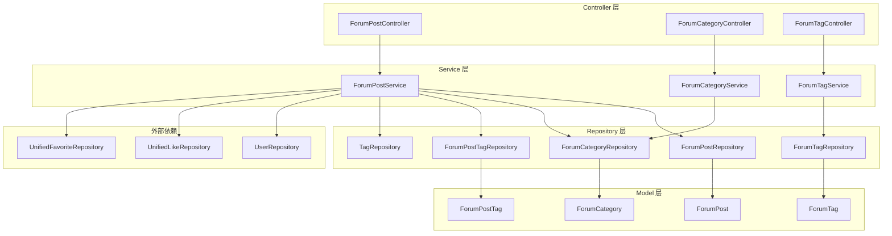
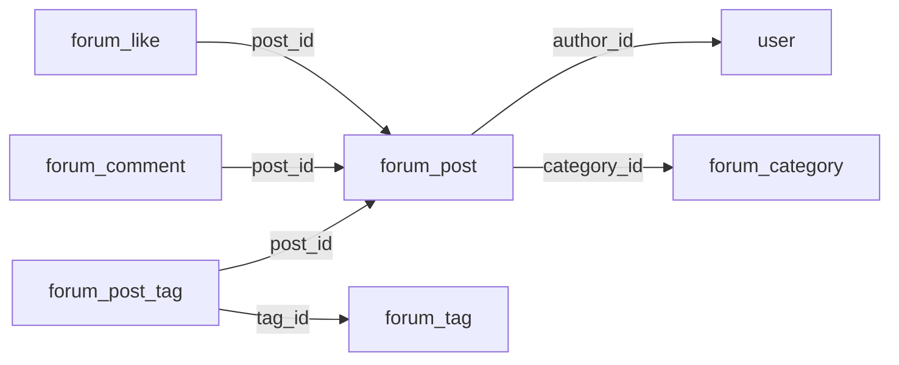

# 论坛模块 (Forum)

## 1. 模块概述

论坛模块是 CodingHub 平台的核心社区功能之一，为用户提供发布帖子、讨论交流、分类浏览和标签管理的完整社区体验。该模块实现了帖子的完整生命周期管理，包括创建、编辑、删除（软删除）、置顶、热度排行等功能，并支持帖子的公开/私密密级控制。

论坛模块与 [统一互动系统](unified-interactions.md) 深度集成，通过统一互动系统实现点赞和评论功能，避免重复建设。用户认证与权限管理依赖 [认证与用户模块](auth-user.md)。

### 技术栈

| 层级 | 技术 |
|------|------|
| 后端框架 | Spring Boot 3.2.5 / Java 17 |
| 数据访问 | Spring Data JPA + MySQL 8.x |
| 认证方式 | JWT + Spring Security |
| 事务管理 | Spring `@Transactional` |

---

## 2. 架构设计

### 2.1 模块架构图



### 2.2 依赖关系

论坛模块遵循项目分层架构规范：

- **Controller 层** -> Service 层 -> Repository 层 -> Model 层
- **禁止循环依赖**：单向依赖，不可反向调用
- 论坛帖子服务额外依赖 `UserRepository`（获取作者信息）和 `TagRepository`（统一标签管理）
- 点赞、评论功能通过 [统一互动系统](unified-interactions.md) 实现

---

## 3. 组件职责

### 3.1 Controller 层

#### [ForumPostController](../backend\src\main\java\com\iaihub\toolbox\controller\forum\ForumPostController.java)

- **路径前缀**: `/api/forum/posts`
- **职责**: 处理帖子相关的 HTTP 请求，包括帖子的 CRUD、置顶管理和热度排行
- **认证要求**: 创建/修改/删除操作需要登录认证；查看操作对公开帖子无需认证

| 方法 | 端点 | 功能 | 认证 |
|------|------|------|------|
| `GET` | `/api/forum/posts` | 获取帖子列表（支持分类/关键词/排序筛选） | 否 |
| `GET` | `/api/forum/posts/my` | 获取当前用户的帖子列表 | 是 |
| `GET` | `/api/forum/posts/{id}` | 获取帖子详情（自动增加浏览量） | 否* |
| `POST` | `/api/forum/posts` | 创建新帖子 | 是 |
| `PUT` | `/api/forum/posts/{id}` | 更新帖子（仅作者或管理员） | 是 |
| `DELETE` | `/api/forum/posts/{id}` | 软删除帖子（仅作者或管理员） | 是 |
| `POST` | `/api/forum/posts/{id}/pin` | 置顶帖子（仅管理员） | ADMIN |
| `DELETE` | `/api/forum/posts/{id}/pin` | 取消置顶（仅管理员） | ADMIN |
| `GET` | `/api/forum/posts/hot-top5` | 获取热度 Top 5 帖子 ID 列表 | 否 |

> *注：私密密级的帖子仅作者和管理员可查看。

#### [ForumCategoryController](../backend\src\main\java\com\iaihub\toolbox\controller\forum\ForumCategoryController.java)

- **路径前缀**: `/api/forum/categories`
- **职责**: 提供帖子分类的只读查询接口

| 方法 | 端点 | 功能 | 认证 |
|------|------|------|------|
| `GET` | `/api/forum/categories` | 获取所有分类列表（按排序权重升序） | 否 |

#### [ForumTagController](../backend\src\main\java\com\iaihub\toolbox\controller\forum\ForumTagController.java)

- **路径前缀**: `/api/forum/tags`
- **职责**: 提供论坛标签的查询和创建接口

| 方法 | 端点 | 功能 | 认证 |
|------|------|------|------|
| `GET` | `/api/forum/tags` | 获取所有论坛标签 | 否 |
| `GET` | `/api/forum/tags/hot` | 获取热门标签（按帖子数量排序，Top 10） | 否 |
| `POST` | `/api/forum/tags` | 创建新标签（不允许重复名称） | 是 |

### 3.2 Service 层

#### [ForumPostService](../backend\src\main\java\com\iaihub\toolbox\service\forum\ForumPostService.java)

帖子业务逻辑的核心实现，负责：

1. **帖子列表查询**：支持按分类、关键词搜索，支持"最新"和"热门"两种排序模式
   - `latest` 模式：按创建时间降序
   - `hot` 模式（默认）：按热度分数排序（`pinned DESC, score DESC`）
2. **帖子详情**：获取帖子时自动增加浏览量并更新热度分数
3. **帖子创建**：支持设置分类、标签和可见性（PUBLIC / PRIVATE）
4. **帖子更新**：支持修改标题、内容、分类、标签和可见性；标签更新时维护使用计数
5. **帖子删除**：软删除，将状态设为 `DELETED`
6. **置顶管理**：管理员可置顶/取消置顶帖子
7. **权限控制**：修改和删除操作执行 `isOwner || isAdmin` 权限校验

#### [ForumCategoryService](../backend\src\main\java\com\iaihub\toolbox\service\forum\ForumCategoryService.java)

- 提供分类列表查询，按 `sortOrder` 升序排列
- 将实体转换为 `ForumCategoryDTO`，包含 id、名称、描述、排序权重

#### [ForumTagService](../backend\src\main\java\com\iaihub\toolbox\service\forum\ForumTagService.java)

- 提供标签列表查询和热门标签（Top 10）查询
- 创建标签时进行唯一性校验，防止重复
- 支持标记标签为系统标签（`isSystem`）

### 3.3 Repository 层

| Repository | 主要查询方法 |
|-----------|-------------|
| `ForumPostRepository` | 按分类/状态/可见性查询、标题搜索（最新/热门）、置顶管理、热度 Top 5 |
| `ForumCategoryRepository` | 按排序权重查询所有分类 |
| `ForumPostTagRepository` | 按帖子 ID 查询标签关联、按帖子 ID 删除标签关联 |
| `ForumTagRepository` | 查询所有标签、按帖子数量排序查询热门标签 |

---

## 4. 数据模型

### 4.1 实体关系图



### 4.2 [ForumPost](../backend\src\main\java\com\iaihub\toolbox\model\forum\ForumPost.java)（帖子实体）

| 字段 | 类型 | 约束 | 说明 |
|------|------|------|------|
| `id` | `Long` | 主键，自增 | 帖子唯一标识 |
| `title` | `String(200)` | 非空 | 帖子标题 |
| `content` | `TEXT` | 非空 | 帖子正文内容 |
| `authorId` | `Long` | 非空 | 作者用户 ID |
| `categoryId` | `Long` | 非空 | 所属分类 ID |
| `viewCount` | `Integer` | 默认 0 | 浏览量 |
| `likeCount` | `Integer` | 默认 0 | 点赞数 |
| `commentCount` | `Integer` | 默认 0 | 评论数 |
| `status` | `ForumPostStatus` | 非空，默认 NORMAL | 状态（NORMAL / DELETED） |
| `score` | `BigDecimal(10,2)` | 默认 0 | 热度分数 |
| `pinned` | `Boolean` | 非空，默认 false | 是否置顶 |
| `visibility` | `ForumPostVisibility` | 非空，默认 PUBLIC | 可见性（PUBLIC / PRIVATE） |
| `createdAt` | `LocalDateTime` | 自动设置 | 创建时间 |
| `updatedAt` | `LocalDateTime` | 自动更新 | 最后更新时间 |

**数据库索引**：

| 索引名 | 列 |
|--------|---|
| `idx_forum_post_author` | `author_id` |
| `idx_forum_post_category` | `category_id` |
| `idx_forum_post_created` | `created_at` |

**热度分数计算公式**：

```
score = viewCount * 1 + likeCount * 3 + commentCount * 5
```

该公式在每次查看帖子详情时自动重新计算并持久化。

### 4.3 [ForumCategory](../backend\src\main\java\com\iaihub\toolbox\model\forum\ForumCategory.java)（帖子分类）

| 字段 | 类型 | 约束 | 说明 |
|------|------|------|------|
| `id` | `Long` | 主键，自增 | 分类唯一标识 |
| `name` | `String(50)` | 非空，唯一 | 分类名称 |
| `description` | `String(255)` | 可空 | 分类描述 |
| `sortOrder` | `Integer` | 默认 0 | 排序权重（升序） |
| `createdAt` | `LocalDateTime` | 自动设置 | 创建时间 |

### 4.4 [ForumTag](../backend\src\main\java\com\iaihub\toolbox\model\forum\ForumTag.java)（论坛标签）

| 字段 | 类型 | 约束 | 说明 |
|------|------|------|------|
| `id` | `Long` | 主键，自增 | 标签唯一标识 |
| `name` | `String(50)` | 非空，唯一 | 标签名称 |
| `postCount` | `Integer` | 默认 0 | 使用该标签的帖子数量 |
| `isSystem` | `Boolean` | 默认 false | 是否为系统预设标签 |
| `createdAt` | `LocalDateTime` | 自动设置 | 创建时间 |

> **注意**: 论坛模块同时使用自身的 `ForumTag` 和全局统一标签系统（`Tag`）。帖子的标签关联通过 `ForumPostTag` 与全局 `Tag` 实体关联。

### 4.5 [ForumPostTag](../backend\src\main\java\com\iaihub\toolbox\model\forum\ForumPostTag.java)（帖子-标签关联）

| 字段 | 类型 | 约束 | 说明 |
|------|------|------|------|
| `postId` | `Long` | 联合主键 | 帖子 ID |
| `tagId` | `Long` | 联合主键 | 标签 ID（引用全局 [Tag](../backend\src\main\java\com\iaihub\toolbox\model\tag\Tag.java)） |

采用 `@IdClass` 复合主键模式，实现帖子与标签的多对多关联。

### 4.6 枚举类型

#### [ForumPostStatus](../backend\src\main\java\com\iaihub\toolbox\model\forum\ForumPostStatus.java)

| 值 | 说明 |
|---|------|
| `NORMAL` | 正常状态 |
| `DELETED` | 已删除（软删除） |

#### [ForumPostVisibility](../backend\src\main\java\com\iaihub\toolbox\model\forum\ForumPostVisibility.java)

| 值 | 说明 |
|---|------|
| `PUBLIC` | 公开帖子，所有人可见 |
| `PRIVATE` | 私密密级，仅作者和管理员可见 |

---

## 5. API 详细设计

### 5.1 获取帖子列表

```
GET /api/forum/posts
```

**请求参数**：

| 参数 | 类型 | 必填 | 默认值 | 说明 |
|------|------|------|--------|------|
| `category` | `Long` | 否 | - | 按分类 ID 筛选 |
| `tag` | `Long` | 否 | - | 按标签 ID 筛选（预留） |
| `keyword` | `String` | 否 | - | 标题关键词搜索 |
| `sortBy` | `String` | 否 | `hot` | 排序方式：`hot`（热度）或 `latest`（最新） |
| `page` | `int` | 否 | `0` | 页码（从 0 开始） |
| `size` | `int` | 否 | `10` | 每页条数 |

**响应**: `Page<ForumPostDTO>` 分页结果

**查询逻辑**：

| sortBy | keyword | category | 查询方法 |
|--------|---------|----------|----------|
| `latest` | 有 | - | `searchByTitle` 按时间降序 |
| `latest` | - | 有 | `findByCategoryId...OrderByCreatedAtDesc` |
| `latest` | - | - | `findByStatus...OrderByCreatedAtDesc` |
| `hot` | 有 | - | `searchByTitleOrderByHot` |
| `hot` | - | 有 | `findByCategoryId...OrderByHot` |
| `hot` | - | - | `findByStatus...OrderByHot` |

所有查询均过滤 `status = NORMAL` 且 `visibility = PUBLIC` 的帖子。

### 5.2 创建帖子

```
POST /api/forum/posts
```

**请求体** (`ForumPostCreateRequest`)：

```json
{
  "title": "帖子标题",
  "content": "帖子内容（支持富文本）",
  "categoryId": 1,
  "tagIds": [1, 2, 3],
  "visibility": "PUBLIC"
}
```

**业务流程**：

1. 创建 `ForumPost` 实体并持久化
2. 遍历 `tagIds`，创建 `ForumPostTag` 关联记录
3. 对每个关联的标签执行 `Tag.incrementUsage()` 增加使用计数
4. 返回完整的帖子 DTO（包含作者信息、分类名称、标签列表）

### 5.3 获取帖子详情

```
GET /api/forum/posts/{id}
```

**业务流程**：

1. 查询帖子，不存在则抛出 `ResourceNotFoundException`
2. 若帖子为 `PRIVATE` 可见性：
   - 未登录用户抛出 `ForbiddenException`
   - 非作者且非管理员抛出 `ForbiddenException`
3. 浏览量 `viewCount + 1`
4. 重新计算热度分数 `score`
5. 持久化并返回帖子 DTO

### 5.4 更新帖子

```
PUT /api/forum/posts/{id}
```

**权限控制**：`isOwner || isAdmin`

**业务流程**：

1. 查询帖子并校验权限
2. 更新标题、内容、分类和可见性
3. 若提供了新的 `tagIds`：
   - 删除旧的标签关联，递减旧标签的使用计数
   - 创建新的标签关联，递增新标签的使用计数
4. 持久化并返回更新后的帖子 DTO

### 5.5 删除帖子

```
DELETE /api/forum/posts/{id}
```

**权限控制**：`isOwner || isAdmin`

**软删除机制**：将 `status` 设为 `DELETED`，不从数据库中物理删除记录。删除后的帖子在所有列表查询中自动过滤。

### 5.6 置顶与取消置顶

```
POST   /api/forum/posts/{id}/pin     # 置顶
DELETE /api/forum/posts/{id}/pin     # 取消置顶
```

**权限要求**：`@PreAuthorize("hasAnyRole('ADMIN', 'SUPER_ADMIN')")`

置顶操作通过 `@Modifying` JPQL 批量更新实现，直接在数据库层面设置 `pinned` 字段。

### 5.7 热度排行

```
GET /api/forum/posts/hot-top5
```

返回热度分数最高的前 5 个帖子 ID 列表。查询按 `score DESC` 排序。

---

## 6. DTO 结构

### [ForumPostDTO](../backend\src\main\java\com\iaihub\toolbox\dto\forum\ForumPostDTO.java)

帖子详情的数据传输对象，包含帖子的完整信息及其关联数据：

| 字段 | 类型 | 说明 |
|------|------|------|
| `id` | `Long` | 帖子 ID |
| `title` | `String` | 标题 |
| `content` | `String` | 正文内容 |
| `authorId` | `Long` | 作者用户 ID |
| `authorName` | `String` | 作者用户名 |
| `authorNickname` | `String` | 作者昵称 |
| `categoryId` | `Long` | 分类 ID |
| `categoryName` | `String` | 分类名称 |
| `viewCount` | `Integer` | 浏览量 |
| `likeCount` | `Integer` | 点赞数 |
| `commentCount` | `Integer` | 评论数 |
| `createdAt` | `LocalDateTime` | 创建时间 |
| `updatedAt` | `LocalDateTime` | 更新时间 |
| `score` | `BigDecimal` | 热度分数 |
| `pinned` | `Boolean` | 是否置顶 |
| `visibility` | `String` | 可见性（PUBLIC / PRIVATE） |
| `tags` | `List<TagDTO>` | 关联标签列表 |

### [ForumCategoryDTO](../backend\src\main\java\com\iaihub\toolbox\dto\forum\ForumCategoryDTO.java)

| 字段 | 类型 | 说明 |
|------|------|------|
| `id` | `Long` | 分类 ID |
| `name` | `String` | 分类名称 |
| `description` | `String` | 分类描述 |
| `sortOrder` | `Integer` | 排序权重 |
| `postCount` | `int` | 帖子数量（当前固定为 0） |

### [ForumTagDTO](../backend\src\main\java\com\iaihub\toolbox\dto\forum\ForumTagDTO.java)

| 字段 | 类型 | 说明 |
|------|------|------|
| `id` | `Long` | 标签 ID |
| `name` | `String` | 标签名称 |
| `postCount` | `Integer` | 使用该标签的帖子数量 |
| `isSystem` | `Boolean` | 是否为系统标签 |

---

## 7. 权限与安全

### 7.1 认证要求

| 操作类型 | 认证要求 |
|---------|---------|
| 浏览公开帖子、列表 | 无需认证 |
| 浏览私有帖子 | 需要认证，且必须是作者或管理员 |
| 创建帖子 | 需要登录认证 |
| 修改/删除帖子 | 需要登录认证 + 权限校验 |
| 置顶/取消置顶 | 需要 `ADMIN` 或 `SUPER_ADMIN` 角色 |

### 7.2 权限校验模型

修改和删除操作遵循统一的 `isOwner || isAdmin` 原则：

```java
boolean isOwner = post.getAuthorId().equals(user.getId());
boolean isAdmin = user.getRole() == Role.ADMIN || user.getRole() == Role.SUPER_ADMIN;
if (!isOwner && !isAdmin) {
    throw new ForbiddenException("无权操作此内容");
}
```

### 7.3 异常处理

| 异常类型 | 触发场景 |
|---------|---------|
| `ResourceNotFoundException` | 帖子不存在或已被删除 |
| `ForbiddenException` | 无权访问私有帖子或无权修改/删除 |
| `DuplicateResourceException` | 创建重复名称的标签 |

---

## 8. 与其他模块的集成

### 8.1 统一互动系统

论坛模块的点赞和评论功能通过 [统一互动系统](unified-interactions.md) 实现。`ForumPost` 实体中维护了 `likeCount` 和 `commentCount` 冗余计数字段，用于热度分数计算和列表展示，实际的点赞/评论记录存储在统一互动系统的表中。

### 8.2 统一标签系统

论坛帖子使用的标签关联到全局统一标签系统（`Tag` 实体），通过 `TagRepository` 和 `TagDTO` 与 [后端基础设施](backend-infra.md) 中的标签模块交互。创建帖子时递增标签使用计数，删除标签关联时递减使用计数。

### 8.3 用户模块

通过 `UserRepository` 获取帖子作者的用户名、昵称等展示信息。用户认证依赖 [认证与用户模块](auth-user.md) 提供的 JWT 令牌和 `@AuthenticationPrincipal` 注入。

### 8.4 微课模块

论坛模块与 [微课模块](video.md) 在以下方面共享设计模式：

- 相同的热度分数计算公式（`viewCount * 1 + likeCount * 3 + commentCount * 5`）
- 相同的软删除机制（`status = DELETED`）
- 相同的置顶功能（`pinned` 字段 + 管理员权限）
- 相同的热度 Top 5 API 设计
- 统一的互动系统和标签系统集成

---

## 9. 前端组件映射

| 前端目录/组件 | 对应后端接口 | 说明 |
|-------------|------------|------|
| `pages/forum/` | `ForumPostController` | 论坛页面集合 |
| `components/forum/` | - | 论坛相关组件（7 个） |
| `TagBadge` / `TagSelector` | `ForumTagController` | 标签展示与选择 |

---

## 10. 数据库迁移

论坛模块相关的数据库表通过 Flyway 迁移脚本管理，迁移文件位于 `backend/src/main/resources/db/migration/`，涉及版本 V1 至 V9。

相关表：

- `forum_category` - 帖子分类表
- `forum_tag` - 论坛标签表
- `forum_post` - 帖子主表
- `forum_post_tag` - 帖子-标签关联表
- `forum_comment` - 帖子评论表（由统一互动系统管理）
- `forum_like` - 帖子点赞表（由统一互动系统管理）

---

## 11. 设计决策与注意事项

### 11.1 热度排序

热度排序使用 `pinned DESC, score DESC` 组合，确保置顶帖子始终排在最前面，其余帖子按热度分数降序。热度分数在每次帖子被查看时重新计算，这意味着频繁访问的帖子会获得更高的热度排名。

### 11.2 标签双重体系

论坛模块同时维护了独立的 `ForumTag`（用于热门标签统计）和全局统一 `Tag`（用于帖子实际关联）。`ForumTag.postCount` 用于论坛内部的热门标签排行，而帖子的实际标签通过 `ForumPostTag` 关联到全局 `Tag` 体系。

### 11.3 私有帖子

`visibility` 字段支持 `PUBLIC` 和 `PRIVATE` 两种可见性。私有帖子在列表查询中自动过滤，仅在通过 ID 直接访问时由 Service 层进行权限校验。

### 11.4 分页参数

帖子列表和"我的帖子"接口默认每页 10 条，页码从 0 开始。前端传入的 `page` 参数直接传递给 Spring Data 的 `PageRequest.of(page, size)`。

---

## 12. 参考链接

- [后端基础设施](backend-infra.md) - 基础设施配置、异常处理、安全框架
- [认证与用户](auth-user.md) - JWT 认证、用户管理、角色权限
- [统一互动系统](unified-interactions.md) - 点赞、评论、收藏的统一实现
- [微课模块](video.md) - 具有相似设计模式的视频模块
- [架构详情](../docs/ARCHITECTURE.md) - 项目整体架构设计
- [Agent 导航地图](../agents.md) - 项目结构总览


<!-- crosslinks (auto-generated) -->
## Related Modules
- Depends on: [auth-user](auth-user.md), [auxiliary-services](auxiliary-services.md), [backend-infra](backend-infra.md)
- Used by: [auxiliary-services](auxiliary-services.md), [mcp-service](mcp-service.md), [unified-interactions](unified-interactions.md)
