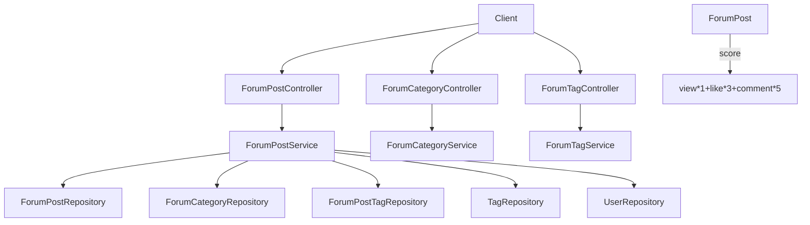

# 论坛社区模块（Forum）

## 模块简介

论坛社区模块提供 **帖子（ForumPost）的发布、检索、详情、编辑、删除、置顶**，以及**论坛分类、论坛标签**管理。它与工具广场共享“热度评分”与“统一标签”机制，是 CodingHub 的 UGC 讨论核心。

- 入口前缀：`/api/forum/posts`、`/api/forum/categories`、`/api/forum/tags`
- 核心分层：`ForumPostController` / `ForumCategoryController` / `ForumTagController`（L4）→ `ForumPostService` / `ForumCategoryService` / `ForumTagService`（L3）→ `ForumPostRepository` 等（L2）→ `ForumPost` / `ForumCategory` / `ForumTag` / `ForumPostTag`（L1）
- 与 [工具广场模块](tool-plaza.md) 高度同构：同样的 `score` 公式、`isOwner || isAdmin` 权限、软删除（`status = DELETED`）、置顶。

## 架构图

## 核心组件职责

### ForumPostController（`controller/forum/ForumPostController.java`）
- `GET /api/forum/posts` — 列表，`sortBy` 支持 `hot`（默认）/ `latest`；支持 `category`、`keyword`（`searchByTitle`）、`tag` 过滤。
- `GET /api/forum/posts/my` — 我的帖子（需登录，否则 401）。
- `GET /api/forum/posts/{id}` — 详情（带权限的私有帖校验 + 浏览量 +1 并刷新 score）。
- `POST /api/forum/posts` — 发布（需登录）。
- `PUT /api/forum/posts/{id}` / `DELETE /api/forum/posts/{id}` — 编辑/软删除（权限 `isOwner || isAdmin`）。
- `POST/DELETE /api/forum/posts/{id}/pin` — 置顶（管理员）。
- `GET /api/forum/posts/hot-top5` — 热门前 5。
- 注意：本控制器直接返回 `Page<ForumPostDTO>` / 原始响应，**未统一包裹 `ApiResponse`**（与 ToolController 风格不同）。

### ForumCategoryController / ForumTagController（`controller/forum/`）
- 分类：`GET /api/forum/categories` 全部分类。
- 标签：`GET /api/forum/tags`（全部）、`GET /api/forum/tags/hot`（热门）、`POST /api/forum/tags`（创建，含 `isSystem` 系统标签标识）。

### ForumPostService（`service/forum/ForumPostService.java`）
- **列表**：按 `sortBy` 与过滤条件分发到不同 Repository 方法（`searchByTitle`、`findByCategoryIdAndStatusAndVisibility` 等），仅查询 `status = NORMAL` 且 `visibility = PUBLIC`。
- **详情权限**：`PRIVATE` 帖子仅作者与管理员可见，未登录/非授权抛 `ForbiddenException`；浏览时 `viewCount++` 并 `updateScore()`。
- **发布/编辑**：`visibility` 默认 `PUBLIC`（`PUBLIC`/`PRIVATE`）；按 `tagIds` 建立 `ForumPostTag` 并 `Tag.incrementUsage`；编辑时替换标签关联（`decrementUsage` + `incrementUsage`）。
- **删除**：软删除 `status = DELETED`。

### 数据模型
- `ForumPost`（`model/forum/ForumPost.java`）：`title`、`content`（TEXT）、`authorId`、`categoryId`、`viewCount`/`likeCount`/`commentCount`、`status`（`NORMAL`/`DELETED`）、`score`（`BigDecimal`）、`pinned`、`visibility`（`PUBLIC`/`PRIVATE`）。`updateScore()` 复用 `view*1 + like*3 + comment*5`。
- `ForumCategory` / `ForumTag`：论坛分类与论坛标签实体。
- `ForumPostTag`（`ForumPostTag` + `ForumPostTagId` 联合主键）：帖子—标签关联。
- `ForumPostStatus` / `ForumPostVisibility`：枚举。

## 关键 API

| 方法 | 路径 | 说明 | 鉴权 |
|------|------|------|------|
| GET | `/api/forum/posts` | 帖子列表（分页/筛选/排序） | 否 |
| GET | `/api/forum/posts/my` | 我的帖子 | 是 |
| GET | `/api/forum/posts/{id}` | 帖子详情 | 私有帖需登录 |
| POST | `/api/forum/posts` | 发帖 | 是 |
| PUT | `/api/forum/posts/{id}` | 编辑 | 作者/管理员 |
| DELETE | `/api/forum/posts/{id}` | 删除 | 作者/管理员 |
| POST | `/api/forum/posts/{id}/pin` | 置顶 | 管理员 |
| GET | `/api/forum/categories` | 分类列表 | 否 |
| GET | `/api/forum/tags/hot` | 热门标签 | 否 |

## 依赖关系（🔗 CodeGraph 增强）

- **上游调用**：[统一互动服务模块](unified-services.md) 维护帖子 `likeCount`/`commentCount`；[概览与管理模块](overview-admin.md) 复用 `hot-top5`；前端 `services/forum.ts` 调用全部接口。
- **下游依赖**：`ForumPostService` → `ForumPostRepository` / `ForumCategoryRepository` / `ForumPostTagRepository` / `TagRepository`（统一标签）/ `UserRepository`。
- **变更影响**：修改 `ForumPost` 或 `score` 公式会影响论坛热门/首页；修改 `visibility` 权限逻辑影响私有帖可见性。

## 相关模块

- [工具广场模块](tool-plaza.md) — 同构的内容管理
- [统一互动服务模块](unified-services.md) — 点赞/评论/标签
- [概览与管理模块](overview-admin.md) — 热门排行
