# 前端应用

## 模块简介

前端应用是 CodingHub 平台的用户界面层，基于 **Vue 3.4 + TypeScript 5.4 + Vite 5.2** 技术栈构建，采用 Pinia 状态管理和 Composition API 开发模式。前端共计 138 个组件，包括 28 个页面（Pages）、36 个可复用组件（Components）、9 个 API 服务（Services）、3 个状态存储（Stores）、7 个类型定义（Types）和 2 个组合式函数（Composables）。

前端实现了双主题设计系统（Cyberpunk Dark / Glassmorphism Light），通过 CSS 变量和 `data-theme` 属性实现主题切换。所有后端 API 调用通过统一的 Axios 实例管理，JWT 令牌存储在内存中（非 localStorage），通过拦截器自动附加 `Authorization: Bearer` 请求头。开发环境通过 Vite 代理将 `/api` 请求转发到后端 `localhost:8082`，生产环境由 Nginx 统一代理。

---

## 架构概览

```mermaid
graph TD
    subgraph Pages["Pages 页面层 (28)"]
        HP[HomePage]
        TP[ToolPlazaPage]
        TDP[ToolDetailPage]
        UP[UploadPage]
        FLP[ForumListPage]
        PDP[PostDetailPage]
        VLP[VideoListPage]
        VDP[VideoDetailPage]
        KLP[KnowledgeListPage]
        OP[OverviewPage]
        PP[ProfilePage]
        LP[LoginPage]
        AP[AdminPage]
        FP[FeedbackPage]
    end

    subgraph Components["Components 组件层 (36)"]
        subgraph General["通用组件"]
            AH[AppHeader]
            AF[AppFooter]
            ME[MarkdownEditor]
            MR[MarkdownRenderer]
        end
        subgraph Common["业务通用组件"]
            TC[ToolCard]
            VC[VideoCard]
            PC[PostCard]
            TB[TagBadge]
            TS[TagSelector]
            LB[LikeButton]
            CS[CommentSection]
        end
        subgraph Domain["领域组件"]
            VP[VideoPlayer]
            DP[DanmakuPlayer]
            VUF[VideoUploadForm]
            PE[PostEditor]
            KbC[KbCard]
            DU[DocumentUpload]
        end
    end

    subgraph Services["Services 服务层 (9)"]
        API[api.ts - Axios实例]
        ToolSvc[toolService]
        VideoSvc[videoService]
        ForumSvc[forumService]
        KbSvc[knowledgeService]
        TagSvc[tagService]
    end

    subgraph Stores["Stores 状态层 (3)"]
        AuthStore[authStore]
        ThemeStore[themeStore]
        NotifStore[notificationStore]
    end

    subgraph Backend["后端 API"]
        REST[REST API :8082]
        RAGSvc[RAG 服务 :8000]
    end

    HP --> Components
    TP --> TC
    FLP --> PC
    VLP --> VC
    VDP --> VP
    VP --> DP
    KLP --> KbC
    PDP --> PE

    TC --> ToolSvc
    VC --> VideoSvc
    PC --> ForumSvc
    KbC --> KbSvc
    TagBadge --> TagSvc

    ToolSvc --> API
    VideoSvc --> API
    ForumSvc --> API
    KbSvc --> API
    KbSvc --> RAGSvc
    TagSvc --> API

    AH --> AuthStore
    AH --> ThemeStore
    AH --> NotifStore
    LP --> AuthStore

    API --> REST
```



---

## Pages（页面）

前端共 28 个页面，按功能域分组如下：

### 核心功能页面

| 页面 | 路由 | 职责 |
|------|------|------|
| HomePage | `/` | 首页，展示推荐工具、热门帖子、最新视频 |
| ToolPlazaPage | `/tools` | 工具广场，工具列表和分类筛选 |
| ToolDetailPage | `/tools/:id` | 工具详情，含评论区、点赞、下载 |
| UploadPage | `/upload` | 工具上传（需登录） |
| EditToolPage | `/tools/:id/edit` | 工具编辑（owner/admin） |

### 论坛页面

| 页面 | 路由 | 职责 |
|------|------|------|
| ForumListPage | `/forum` | 论坛帖子列表，分类筛选和热度排序 |
| PostDetailPage | `/forum/posts/:id` | 帖子详情，Markdown 渲染和评论 |
| CreatePostPage | `/forum/create` | 创建帖子，Markdown 编辑器 |

### 微课页面

| 页面 | 路由 | 职责 |
|------|------|------|
| VideoListPage | `/videos` | 视频列表，热度排序 |
| VideoDetailPage | `/videos/:id` | 视频播放，弹幕互动 |
| VideoUploadPage | `/videos/upload` | 视频上传（MP4，最大 1GB） |

### 知识库页面

| 页面 | 路由 | 职责 |
|------|------|------|
| KnowledgeListPage | `/knowledge` | 知识库列表 |
| KnowledgeDetailPage | `/knowledge/:id` | 知识库详情，文档管理和语义搜索 |

### 系统页面

| 页面 | 路由 | 职责 |
|------|------|------|
| OverviewPage | `/overview` | 平台统计概览和排行榜 |
| ProfilePage | `/profile` | 用户个人中心 |
| LoginPage | `/login` | 登录页 |
| RegisterPage | `/register` | 注册页 |
| AdminPage | `/admin` | 管理后台（ADMIN/SUPER_ADMIN） |
| FeedbackPage | `/feedback` | 留言反馈 |

---

## Components（组件）

### 通用组件（7 个）

| 组件 | 职责 |
|------|------|
| AppHeader | 顶部导航栏，含 Logo、导航链接、主题切换按钮、NotificationBell 通知铃铛、用户头像菜单 |
| AppFooter | 页脚信息 |
| MarkdownEditor | Markdown 编辑器（基于 textarea 或第三方库） |
| MarkdownRenderer | Markdown 渲染器（markdown-it + github-markdown-css） |
| Pagination | 分页组件 |
| SearchBar | 搜索输入框 |
| ConfirmDialog | 确认对话框 |

### 业务通用组件（9 个）

| 组件 | 职责 |
|------|------|
| ToolCard | 工具卡片（封面、标题、描述、标签、点赞数） |
| VideoCard | 视频卡片（封面、标题、播放量、时长） |
| PostCard | 帖子卡片（标题、摘要、作者、标签、互动数据） |
| CategoryFilter | 分类筛选器 |
| TagBadge | 标签徽章展示 |
| TagSelector | 标签选择器（支持搜索和多选） |
| LikeButton | 点赞按钮（含动画和状态切换） |
| FavoriteButton | 收藏按钮 |
| CommentSection | 评论区（复用统一评论 API） |

### 领域组件

| 子目录 | 组件 | 职责 |
|--------|------|------|
| forum (7) | PostList, PostEditor, PostComment, ForumCategoryNav 等 | 论坛列表、编辑器、评论、分类导航 |
| video (4) | VideoPlayer, DanmakuPlayer, VideoUploadForm, VideoCommentList | 视频播放器、弹幕层、上传表单、评论列表 |
| knowledge (7) | KbCard, DocumentList, DocumentUpload, StatusBadge, SearchPanel 等 | 知识库卡片、文档列表/上传、状态徽章、搜索面板 |
| feedback (2) | FeedbackForm, FeedbackList | 反馈表单和列表 |

---

## Services（API 服务层）

所有 API 服务均基于统一的 Axios 实例 `api.ts` 构建。

| 服务 | 文件 | 职责 |
|------|------|------|
| api.ts | `services/api.ts` | Axios 实例创建、JWT 拦截器、基础 URL 配置（`/api/v1`） |
| toolService | `services/toolService.ts` | 工具 CRUD、点赞、文件上传 |
| videoService | `services/videoService.ts` | 视频上传/列表/详情/流式播放 |
| forumService | `services/forumService.ts` | 帖子 CRUD、分类、标签 |
| categoryService | `services/categoryService.ts` | 工具分类管理 |
| feedbackService | `services/feedbackService.ts` | 留言反馈 |
| knowledgeService | `services/knowledgeService.ts` | 知识库 CRUD、文档管理（直连 RAG :8000） |
| notificationService | `services/notificationService.ts` | 通知列表、已读标记 |
| tagService | `services/tagService.ts` | 统一标签查询 |

### Axios 拦截器配置

```typescript
// 请求拦截器：自动附加 JWT Bearer token
api.interceptors.request.use(config => {
  const token = authStore.getToken()  // 从内存获取，非 localStorage
  if (token) {
    config.headers.Authorization = `Bearer ${token}`
  }
  return config
})

// 响应拦截器：处理 401 自动跳转登录页
api.interceptors.response.use(
  response => response,
  error => {
    if (error.response?.status === 401) {
      authStore.logout()
      router.push('/login')
    }
    return Promise.reject(error)
  }
)
```

---

## Stores（状态管理）

基于 Pinia 的 3 个全局状态存储：

| Store | 职责 | 关键状态 |
|-------|------|----------|
| authStore | 用户认证状态管理 | user, token（内存存储）, isAuthenticated; 方法: login(), logout(), refreshToken() |
| themeStore | 主题切换管理 | theme('dark'/'light'), data-theme 属性; 方法: toggleTheme(), 持久化到 localStorage |
| notificationStore | 通知状态管理 | unreadCount, notifications; 方法: fetchUnread(), markAsRead() |

### authStore JWT 管理策略

- **JWT 令牌存储在内存中**（非 localStorage），页面刷新后需通过 refreshToken 恢复
- Token 过期时间 15 分钟，refreshToken 有效期 7 天
- 登录成功后 token 存入内存，Axios 拦截器每次请求自动附加

### themeStore 双主题机制

- 默认亮色主题（Glassmorphism Light）
- 暗色主题（Cyberpunk Dark）通过 CSS 变量切换
- `<html data-theme="dark">` 属性控制主题生效
- 主题偏好持久化到 localStorage

---

## Types（类型定义）

| 文件 | 定义内容 |
|------|----------|
| tool.ts | Tool, ToolCreateRequest, ToolUpdateRequest, ToolComment, ToolLike |
| forum.ts | ForumPost, ForumCategory, ForumTag, ForumPostCreateRequest |
| video.ts | Video, Danmaku, VideoUploadRequest, VideoComment |
| knowledge.ts | KnowledgeBase, KbDocument, SearchRequest, SearchResult |
| feedback.ts | FeedbackMessage, FeedbackCreateRequest |
| overview.ts | OverviewStats, RankItem |
| index.ts | 公共类型导出、分页响应 PageResponse、用户 User |

---

## Composables（组合式函数）

| 函数 | 职责 |
|------|------|
| useAuth | 封装 authStore 的常用操作：登录状态检查、权限判断、路由守卫 |
| usePagination | 通用分页逻辑：页码、每页大小、总数、翻页计算 |

---

## 依赖关系

### 上游依赖（谁调用前端）

| 被调用方 | 调用者 | 说明 |
|----------|--------|------|
| 前端应用 | 用户浏览器 | SPA 入口，Vite dev server :5173 |

### 下游依赖（前端调用谁）

| 调用方 | 被依赖服务 | 协议 | 说明 |
|--------|-----------|------|------|
| api.ts (Axios) | Java 后端 | HTTP/REST | 所有 service 通过 api.ts 统一调用后端 :8082（开发环境 Vite 代理） |
| knowledgeService | RAG 服务 | HTTP/REST | 文档操作直连 RAG 服务 :8000，不经后端代理 |
| authStore | Java 后端 | HTTP/REST | 登录/注册/刷新 token |
| notificationStore | Java 后端 | HTTP/REST | 拉取通知列表和未读计数 |

### 组件间依赖链

| 依赖链 | 说明 |
|--------|------|
| VideoPlayer → DanmakuPlayer | 视频播放器内嵌弹幕层，DanmakuPlayer 作为 VideoPlayer 的子组件 |
| AppHeader → authStore | 导航栏读取登录状态决定菜单显示 |
| AppHeader → themeStore | 主题切换按钮绑定 themeStore |
| AppHeader → notificationStore | NotificationBell 显示未读计数 |
| App.vue → themeStore | 根组件通过 `data-theme` 属性应用主题 |
| PostCard → TagBadge | 帖子卡片展示标签列表 |
| ToolCard → TagBadge | 工具卡片展示标签列表 |
| VideoCard → TagBadge | 视频卡片展示标签列表 |

### 变更影响分析

| 变更对象 | 影响范围 | 风险等级 |
|----------|----------|----------|
| api.ts 基础配置变更 | 所有 service 的 API 请求地址和拦截器行为 | 高 |
| authStore token 管理逻辑变更 | 全局认证状态、Axios 拦截器、路由守卫 | 高 |
| 后端 REST API 接口变更 | 对应 service 文件和调用该 service 的组件 | 高 |
| RAG 服务 API 变更 | knowledgeService 和知识库相关页面 | 中 |
| 主题 CSS 变量变更 | 全局样式表现、AppHeader 主题切换 | 中 |
| Types 类型定义变更 | 所有引用该类型的组件和 service | 中 |

---

## API 调用关系

### 前端 → 后端 REST API（通过 Vite 代理）

| 前端 Service | 后端 API 前缀 | 说明 |
|-------------|--------------|------|
| toolService | `/api/v1/tools` | 工具 CRUD |
| forumService | `/api/forum/posts`, `/api/forum/categories` | 论坛操作 |
| videoService | `/api/v1/videos` | 视频操作 |
| categoryService | `/api/v1/categories` | 工具分类 |
| feedbackService | `/api/v1/feedback` | 留言反馈 |
| notificationService | `/api/v1/notifications` | 通知 |
| tagService | `/api/v1/tags` | 统一标签 |
| authStore | `/api/v1/auth` | 认证 |

### 前端 → RAG 服务（直连）

| 前端 Service | RAG API | 说明 |
|-------------|---------|------|
| knowledgeService | `:8000/api/collections` | 知识库配置 |
| knowledgeService | `:8000/api/documents` | 文档上传/列表/删除 |
| knowledgeService | `:8000/api/search` | 语义搜索 |

---

## 关键特性

### 双主题设计系统

前端实现了两套完整的视觉主题：

- **Glassmorphism Light（默认）**：毛玻璃效果亮色主题，柔和的背景模糊和透明卡片
- **Cyberpunk Dark**：赛博朋克暗色主题，霓虹高对比色和深色背景

主题通过 CSS 自定义属性（`--bg-primary`, `--text-primary` 等）实现，`data-theme` 属性挂载在 `<html>` 标签上。设计系统详细规范参见 `design-system/CodingHub/MASTER.md`。

### Vite 开发代理

```typescript
// vite.config.ts
server: {
  proxy: {
    '/api': {
      target: 'http://localhost:8082',
      changeOrigin: true
    },
    '/mcp': {
      target: 'http://localhost:8082',
      changeOrigin: true
    }
  }
}
```

### Markdown 渲染

- 使用 `markdown-it` 库解析 Markdown 语法
- 配合 `github-markdown-css` 实现 GitHub 风格渲染
- 应用于帖子内容展示和工具描述

### 视频播放与弹幕

- **VideoPlayer**：基于原生 HTML5 `<video>` 元素实现
- **DanmakuPlayer**：Canvas 或 DOM 弹幕层，覆盖在视频播放器上方
- 弹幕数据通过 videoService 从后端获取，按视频播放时间点渲染

### JWT 安全策略

- Token 存储在内存中，**不写入 localStorage 或 Cookie**
- 页面刷新后通过 refreshToken 机制恢复会话
- Axios 响应拦截器捕获 401 状态码，自动清除认证状态并跳转登录页

---

## 构建与开发

```bash
# 安装依赖
cd frontend && npm install

# 开发模式（:5173）
npm run dev

# 生产构建
npm run build

# 类型检查
npm run type-check

# Lint 检查
npm run lint
```

---

## 交叉引用

- 后端 API 接口详情参见 [社区内容](community-content.md)（论坛/微课 API）
- RAG 服务直连调用详情参见 [RAG 知识库服务](rag-service.md)
- 设计系统主题规范参见 `design-system/CodingHub/MASTER.md`
- 后端 MCP 工具层参见 MCP 模块文档
