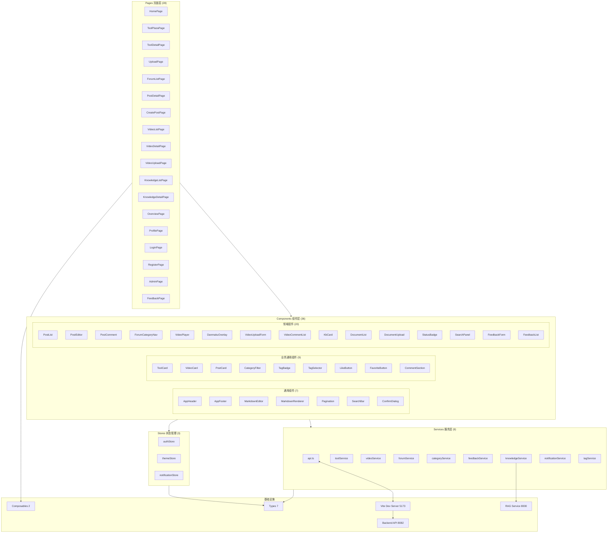

# 前端应用（Vue 3 + TypeScript + Vite）

## 模块简介

前端应用是 CodingHub 平台的用户界面层，基于 **Vue 3.4 + TypeScript 5.4 + Vite 5.2** 构建。采用 Composition API 和 Pinia 状态管理，实现了双主题（Cyberpunk 暗色 / Glassmorphism 亮色）设计系统。前端通过 Axios 封装与后端 REST API 通信，JWT 令牌在内存中管理（非 localStorage），视频播放使用原生 HTML5 video 结合弹幕覆盖层。

前端架构遵循严格的分层依赖规则：Pages 依赖 Components，Components 依赖 Services 和 Stores，Services 依赖 Types 和 API 基础设施。这种分层确保了组件的可复用性和代码的可维护性。

---

## 系统架构



---

## Pages 页面层

共 28 个页面组件，覆盖平台全部功能入口。

| 页面 | 路由 | 说明 |
|------|------|------|
| **HomePage** | `/` | 首页，展示热门工具、帖子、视频推荐 |
| **ToolPlazaPage** | `/tools` | 工具广场，分类浏览和搜索工具 |
| **ToolDetailPage** | `/tools/:id` | 工具详情页，含评论、点赞、下载 |
| **UploadPage** | `/upload` | 工具上传页，表单 + 文件上传 |
| **ForumListPage** | `/forum` | 论坛帖子列表，支持分类/标签/排序筛选 |
| **PostDetailPage** | `/forum/posts/:id` | 帖子详情，Markdown 渲染 + 评论区 |
| **CreatePostPage** | `/forum/create` | 发布/编辑帖子，MarkdownEditor 富文本编辑 |
| **VideoListPage** | `/videos` | 微课视频列表 |
| **VideoDetailPage** | `/videos/:id` | 视频详情页，VideoPlayer + DanmakuOverlay |
| **VideoUploadPage** | `/videos/upload` | 视频上传页 |
| **KnowledgeListPage** | `/knowledge` | 知识库列表 |
| **KnowledgeDetailPage** | `/knowledge/:id` | 知识库详情，文档管理 + 语义搜索 |
| **OverviewPage** | `/overview` | 平台概览，统计数据 + 排行榜 |
| **ProfilePage** | `/profile` | 个人中心，头像/昵称/密码修改 |
| **LoginPage** | `/login` | 登录页 |
| **RegisterPage** | `/register` | 注册页 |
| **AdminPage** | `/admin` | 管理后台（ADMIN/SUPER_ADMIN） |
| **FeedbackPage** | `/feedback` | 留言板 |

---

## Components 组件层

共 36 个可复用组件，分为通用、业务通用和领域专用三组。

### 通用组件（7 个）

| 组件 | 职责 |
|------|------|
| **AppHeader** | 全局顶栏：Logo、导航菜单、搜索框、通知铃铛、用户菜单、主题切换 |
| **AppFooter** | 全局底栏：版权信息、链接 |
| **MarkdownEditor** | Markdown 编辑器，支持实时预览、工具栏 |
| **MarkdownRenderer** | Markdown 渲染器，基于 markdown-it + github-markdown-css |
| **Pagination** | 通用分页组件 |
| **SearchBar** | 搜索输入框，支持防抖和关键词高亮 |
| **ConfirmDialog** | 确认对话框，用于删除等危险操作二次确认 |

### 业务通用组件（9 个）

| 组件 | 职责 |
|------|------|
| **ToolCard** | 工具卡片，展示标题、描述、分类、点赞数 |
| **VideoCard** | 视频卡片，展示封面、标题、时长、播放量 |
| **PostCard** | 帖子卡片，展示标题、摘要、标签、统计数据 |
| **CategoryFilter** | 分类筛选器，横向标签切换 |
| **TagBadge** | 标签徽章展示 |
| **TagSelector** | 标签选择器，支持搜索和多选 |
| **LikeButton** | 点赞按钮（含动画和计数） |
| **FavoriteButton** | 收藏按钮（含状态切换） |
| **CommentSection** | 评论区域，含评论列表和发布表单 |

### 领域组件（20 个）

**论坛组件（7 个）**：PostList、PostEditor、PostComment、ForumCategoryNav 等，提供论坛帖子的列表渲染、编辑、评论和分类导航功能。

**视频组件（4 个）**：VideoPlayer（HTML5 video 封装）、DanmakuOverlay（弹幕覆盖层）、VideoUploadForm（视频上传表单）、VideoCommentList（视频评论列表）。

**知识库组件（7 个）**：KbCard、DocumentList、DocumentUpload、StatusBadge、SearchPanel 等，提供知识库卡片、文档管理、上传和语义搜索界面。

**反馈组件（2 个）**：FeedbackForm（留言表单）、FeedbackList（留言列表，含管理员回复）。

---

## Services 服务层

9 个 API 服务模块，封装与后端的 HTTP 通信。

### API 基础设施 — `api.ts`

| 功能 | 说明 |
|------|------|
| Axios 实例 | 基础 URL `/api/v1`，通过 Vite 代理转发到后端 8082 端口 |
| 请求拦截器 | 自动从 authStore 获取 JWT 令牌，附加 `Authorization: Bearer <token>` 请求头 |
| 响应拦截器 | 统一错误处理，401 自动清除认证状态并跳转登录页 |
| XSS 防护 | 配合后端 XssSanitizer，前端对输入做基本转义 |

### 业务服务

| 服务 | API 前缀 | 说明 |
|------|----------|------|
| **toolService** | `/api/v1/tools` | 工具 CRUD、点赞、文件上传 |
| **videoService** | `/api/v1/videos` | 视频 CRUD、上传、流式播放、弹幕 |
| **forumService** | `/api/forum/posts` | 帖子 CRUD、热门、置顶 |
| **categoryService** | `/api/v1/categories` | 工具分类、论坛分类 |
| **feedbackService** | `/api/v1/feedback` | 留言反馈 CRUD |
| **knowledgeService** | `/api/v1/knowledge` | 知识库 CRUD（KB 操作走 Java 后端） |
| **notificationService** | `/api/v1/notifications` | 通知列表、未读计数、标记已读 |
| **tagService** | `/api/v1/tags` | 统一标签查询和管理 |

---

## Stores 状态管理

使用 Pinia 管理全局状态，共 3 个 store。

| Store | 职责 | 关键状态 |
|-------|------|---------|
| **authStore** | 用户认证状态管理 | user（用户信息）、token（JWT 令牌，存储在内存）、isAuthenticated |
| **themeStore** | 主题切换管理 | currentTheme（'light' / 'dark'）、通过 `data-theme` 属性切换 CSS 变量 |
| **notificationStore** | 通知状态管理 | unreadCount（未读计数）、notifications（通知列表） |

---

## Types 类型定义

7 个 TypeScript 类型文件，为前后端数据契约提供类型安全。

| 文件 | 内容 |
|------|------|
| **index.ts** | 公共类型：PaginatedResponse, ApiResponse, SortOption |
| **tool.ts** | Tool, ToolCreateRequest, ToolFile |
| **forum.ts** | ForumPost, ForumCategory, ForumTag, ForumPostCreateRequest |
| **video.ts** | Video, VideoUploadRequest, Danmaku, SendDanmakuRequest |
| **knowledge.ts** | KnowledgeBase, KbDocument, SearchRequest |
| **feedback.ts** | FeedbackMessage, FeedbackCreateRequest |
| **overview.ts** | OverviewStats, RankingItem |

---

## Composables 组合式函数

2 个可复用的组合式函数（Composition API hooks）。

| Composable | 职责 |
|------------|------|
| **useAuth** | 认证状态 hook：封装登录/登出/token 刷新逻辑，暴露 isAuthenticated、currentUser、login()、logout() |
| **usePagination** | 分页 hook：封装分页请求逻辑，暴露 data、loading、currentPage、totalPages、fetchPage() |

---

## 关键特性与设计决策

### 双主题系统

- **默认主题**：亮色（Glassmorphism Light）
- **暗色主题**：Cyberpunk Dark 风格
- **切换机制**：通过 `document.documentElement.setAttribute('data-theme', 'light' | 'dark')` 切换 CSS 变量
- **持久化**：主题偏好存储在 themeStore，页面加载时恢复上次选择
- **设计规范**：详见 `design-system/CodingHub/MASTER.md`

### JWT 认证流程

1. 用户登录成功后，后端返回 JWT 令牌（15 分钟有效期）和 refresh token（7 天有效期）
2. **令牌存储在内存中**（authStore），不写入 localStorage，防止 XSS 窃取
3. Axios 请求拦截器自动从 authStore 读取 token 并附加到请求头
4. 收到 401 响应时自动清除认证状态并跳转登录页

### API 代理配置

前端使用相对路径 `/api/v1` 发起请求，Vite 开发服务器通过 proxy 配置将请求转发到后端 `http://localhost:8082`。知识库文档操作（上传/搜索）直连 RAG 服务 `http://localhost:8000`。

```
浏览器 → Vite Dev Server (5173)
           ├── /api/* → Backend (8082)
           └── /rag/* → RAG Service (8000)
```

### Markdown 渲染

帖子内容支持 Markdown 格式，使用 `markdown-it` 库解析，配合 `github-markdown-css` 提供 GitHub 风格的渲染样式。MarkdownEditor 组件提供实时预览功能。

### 视频播放与弹幕

- 视频播放使用原生 HTML5 `<video>` 元素，通过后端流式接口 `/api/v1/videos/{id}/stream` 加载
- 弹幕通过 DanmakuOverlay 组件实现，作为绝对定位层覆盖在视频上方
- 弹幕按播放时间轴过滤，使用 requestAnimationFrame 驱动渲染

---

## 开发命令

| 命令 | 说明 |
|------|------|
| `npm install` | 安装前端依赖 |
| `npm run dev` | 启动 Vite 开发服务器（端口 5173） |
| `npm run build` | 生产构建 |
| `npm run preview` | 预览生产构建 |

---

## 与其他模块的关联

- [社区内容](community-content.md)：论坛帖子和微课视频的后端实现，前端通过 forumService 和 videoService 与之通信
- [RAG 知识库服务](rag-service.md)：知识库文档操作前端直连 RAG 服务（:8000），KB CRUD 通过 knowledgeService 走 Java 后端
- 后端 REST API：所有业务服务通过 api.ts 封装的 Axios 实例与后端 8082 端口通信
- 设计系统：双主题 CSS 变量定义在 `design-system/` 目录，前端通过 data-theme 属性切换
