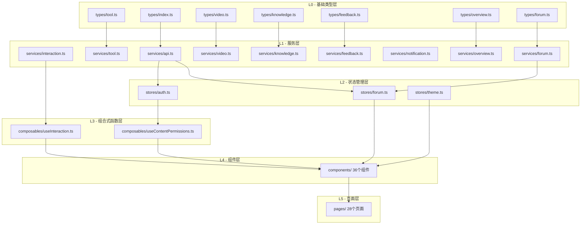

# 前端应用（frontend-app）

> 本文档详细描述 CodingHub 前端应用的架构设计、分层体系、API 客户端、主题系统与组合式函数模式。
> 相关文档：[backend-infra](backend-infra.md) | [tool-plaza](tool-plaza.md) | [forum](forum.md) | [video](video.md) | [knowledge-base](knowledge-base.md) | [unified-interactions](unified-interactions.md) | [auxiliary-services](auxiliary-services.md)

---

## 1. 模块概述

前端应用基于 **Vue 3.4 + TypeScript 5.4 + Vite 5.2** 构建，采用 Pinia 状态管理和 Element Plus 组件库，运行于 **5173** 端口，通过 Vite 开发代理连接后端（8082）和 RAG Python 服务（8000）。

前端承载了 CodingHub 的全部用户交互界面，包括：工具广场、论坛社区、微课视频、RAG 知识库、留言反馈、概览统计、通知系统和管理后台。整体设计遵循严格的分层架构，确保各层职责清晰、依赖方向单一。

### 核心设计原则

- **类型驱动**：所有 API 交互均有完整的 TypeScript 类型定义
- **分层隔离**：types -> services -> stores -> composables -> components -> pages，禁止跨层依赖
- **双主题支持**：Cyberpunk Dark 与 Glassmorphism Light 两套设计系统
- **统一交互模型**：点赞、收藏、评论通过 `useInteraction` 组合式函数统一管理

---

## 2. 架构总览



### 依赖规则

| 层级 | 目录 | 文件数 | 允许依赖 |
|------|------|--------|----------|
| L0 | `types/` | 7 | 无内部依赖 |
| L1 | `services/` | 9 | 仅 L0 |
| L2 | `stores/` | 3 | L0, L1 |
| L3 | `composables/` | 2 | L0, L1, L2 |
| L4 | `components/` | 36 | L0, L1, L2, L3 |
| L5 | `pages/` | 28 | L3（间接依赖 L0-L2） |

---

## 3. 构建配置（Vite）

### vite.config.ts 核心配置

| 配置项 | 值 | 说明 |
|--------|------|------|
| 插件 | `@vitejs/plugin-vue` | Vue 3 SFC 支持 |
| 路径别名 | `@` -> `src/` | 简化导入路径 |
| 开发端口 | `5173` | 前端开发服务器 |
| 监听地址 | `0.0.0.0` | 允许外部访问 |

### 开发代理规则

| 路径前缀 | 代理目标 | 说明 |
|----------|----------|------|
| `/api/v1` | `http://localhost:8082` | 核心后端 API |
| `/api/forum` | `http://localhost:8082` | 论坛 API（独立前缀） |
| `/api/overview` | `http://localhost:8082` | 概览统计 API |
| `/rag` | `http://172.53.3.98:8000`（重写去掉前缀） | RAG Python 服务 |

后端端口可通过环境变量 `BACKEND_PORT` 覆盖（默认 8082），RAG 端口可通过 `RAG_PORT` 覆盖（默认 8000）。

---

## 4. 类型系统（types/）

类型定义层是整个前端的契约基础，所有 API 请求和响应均有严格的 TypeScript 接口约束。

### 4.1 通用类型（types/index.ts）

跨模块共享的基础数据结构：

| 接口 | 用途 | 关键字段 |
|------|------|----------|
| `User` | 用户信息 | `id, username, nickname, avatarUrl, role, status` |
| `Category` | 工具分类 | `id, name, icon, sortOrder` |
| `Tag` | 统一标签 | `id, name, tagType, usageCount` |
| `ToolSummary` | 工具列表项 | 含上传者信息、统计计数、标签 |
| `ToolDetail` | 工具详情 | 增加 `content, updatedAt` |
| `PageResponse<T>` | 分页包装 | `content, totalElements, totalPages, page, size` |
| `ApiResponse<T>` | 标准响应 | `code, message, data` |

**请求/响应 DTO**：`LoginRequest`, `RegisterRequest`, `CreateToolRequest`, `UpdateToolRequest`, `ToolFile`, `FileUploadResponse`, `FileListResponse`, `PendingUser`, `AdminUser`, `ApprovalResponse`

### 4.2 论坛类型（types/forum.ts）

| 接口 | 用途 | 关键字段 |
|------|------|----------|
| `ForumPost` | 帖子实体 | `title, content, authorName, viewCount, likeCount, commentCount, score, pinned, visibility, tags, isFavorited, favoriteCount` |
| `ForumComment` | 评论实体 | `parentId, rootId`（支持嵌套评论） |
| `ForumCategory` | 论坛分类 | `name, description, postCount` |
| `ForumTag` | 论坛标签 | `name, postCount, isSystem` |
| `ForumLikeRequest` | 点赞请求 | `postId?` 或 `commentId?`（二选一） |

### 4.3 微课视频类型（types/video.ts）

| 接口 | 用途 | 关键字段 |
|------|------|----------|
| `VideoListItem` | 视频列表项 | `coverUrl, duration, viewCount, uploaderName, tags` |
| `VideoDetail` | 视频详情 | 增加 `userLiked, userFavorited, danmakuEnabled, fileSize` |
| `VideoComment` | 视频评论 | `content, userId, userNickname, userAvatarUrl` |
| `VideoUploadRequest` | 上传请求 | `title, description, tagIds` |
| `VideoInteractionResponse` | 交互响应 | `liked, favorited, likeCount, commentCount` |

### 4.4 知识库类型（types/knowledge.ts）

| 接口 | 用途 | 关键字段 |
|------|------|----------|
| `KnowledgeBase` | 知识库实体 | `name, ragCollection, ragBaseUrl, documentsUrl` |
| `DocumentStatus` | 文档状态枚举 | `UPLOADING / CONVERTING / CHUNKING / EMBEDDING / READY / FAILED` |
| `RagDocumentStatus` | RAG 文档元数据 | `collection, filename, status, chunk_count, chunk_mode, error_message` |
| `KbConfig` | RAG 配置 | `chunk_mode, chunk_size, chunk_overlap, rerank` |
| `KbSearchResult` | 搜索结果 | `text, source, score, chunkIndex` |
| `KbSearchRequest` | 搜索请求 | `query, topK, rerank, expandContext` |

知识库类型的特殊之处在于它需要同时与 Java 后端和 Python RAG 服务交互，`KnowledgeBase` 接口中的 `ragBaseUrl` 和 `documentsUrl` 字段用于直连 RAG 服务。

### 4.5 留言反馈类型（types/feedback.ts）

| 接口 | 用途 | 关键字段 |
|------|------|----------|
| `FeedbackCategory` | 反馈分类枚举 | `SUGGESTION / BUG_REPORT / PRAISE / OTHER` |
| `FeedbackMessage` | 留言实体 | `content, nickname, contact, category, adminReply, repliedAt` |
| `FeedbackCreateRequest` | 创建留言 | `content, nickname?, contact?, category?` |

### 4.6 概览类型（types/overview.ts）

| 接口 | 用途 | 关键字段 |
|------|------|----------|
| `StatsDto` | 全站统计 | `userCount, postCount, toolCount, videoCount` |
| `ToolRankDto` | 工具排行 | `category, toolName, score` |
| `PostRankDto` | 帖子排行 | `category, postTitle, score` |
| `VideoRankDto` | 视频排行 | `videoTitle, viewCount, likeCount` |

### 4.7 工具详情类型（types/tool.ts）

此文件为工具详情页提供独立的 DTO 类型，与通用 `ToolSummary` 形成列表-详情的对应关系：

| 接口 | 用途 | 额外字段 |
|------|------|----------|
| `ToolDetailDTO` | 工具详情 DTO | `isLiked`（当前用户点赞状态） |
| `ToolSummary` | 工具列表摘要（简化版） | 无上传者头像和昵称 |

---

## 5. 服务层（services/）

服务层封装所有 HTTP API 调用，对外暴露类型安全的函数接口。

### 5.1 API 客户端核心（services/api.ts）

`api.ts` 是整个前端的核心 Axios 实例，提供以下关键能力：

#### 基础配置

```typescript
baseURL: import.meta.env.VITE_API_BASE_URL || '/api/v1'
timeout: 60000  // 60 秒
headers: { 'Content-Type': 'application/json' }
```

#### 请求拦截器

自动从 `useAuthStore` 获取 `accessToken` 并注入到 `Authorization: Bearer <token>` 头部。

#### 响应拦截器与 Token 自动刷新

Token 刷新机制采用**队列化设计**，避免并发刷新：

1. 收到 401 响应时，检查是否已有刷新请求在进行中
2. 若已有刷新进行中，将当前请求加入 `refreshSubscribers` 等待队列
3. 若为第一个 401，调用 `/auth/refresh` 接口获取新 Token
4. 刷新成功后，重放队列中的所有请求
5. 刷新失败则执行登出并重定向到登录页，携带 `redirect` 参数保留原始路径

#### 错误处理策略

| HTTP 状态码 | 处理方式 |
|-------------|----------|
| 401 | Token 刷新 -> 失败则登出重定向 |
| 403 | `ElMessage.warning('没有权限执行此操作')`（非认证接口） |
| 其他 | `ElMessage.error(message)` 显示后端返回的错误消息 |

#### 文件上传 API（fileUploadApi）

| 方法 | 路径 | 说明 |
|------|------|------|
| `uploadFiles` | `POST /tools/{id}/files` | 多文件上传 + README，超时 10 分钟 |
| `getToolFiles` | `GET /tools/{id}/files` | 获取工具文件列表 |
| `deleteFile` | `DELETE /tools/{id}/files/{fileId}` | 删除单个文件 |
| `downloadFile` | `GET /tools/{id}/files/{fileId}/download` | Blob 下载 |

#### 统一标签 API（tagApi）

| 方法 | 路径 | 说明 |
|------|------|------|
| `getTags` | `GET /tags?type=` | 按类型获取标签 |
| `getHotTags` | `GET /tags/hot?type=&limit=` | 获取热门标签 |
| `createTag` | `POST /tags` | 创建新标签 |

### 5.2 工具服务（services/tool.ts）

| 方法 | 路径 | 说明 |
|------|------|------|
| `getToolDetail` | `GET /tools/{id}` | 获取工具详情（完整响应解析） |
| `getTool` | `GET /tools/{id}` | 获取工具详情（简化解析） |
| `pinTool` | `POST /tools/{id}/pin` | 置顶工具 |
| `unpinTool` | `DELETE /tools/{id}/pin` | 取消置顶 |
| `getHotTop5` | `GET /tools/hot-top5` | 获取热门 Top5 ID 列表 |

`ToolDetailVO` 扩展了 `ToolDetailDTO`，确保统计字段（`viewCount, likeCount, commentCount, score`）为非可选。

### 5.3 论坛服务（services/forum.ts）

论坛服务使用**独立 Axios 实例**（`forumApi`），`baseURL` 为 `/api/forum`，自行管理认证拦截器。

| 分类 | 方法 | 说明 |
|------|------|------|
| 帖子 | `getPostList, getMyPosts, getPostById` | 列表、我的、详情 |
| 帖子 | `createPost, updatePost, deletePost` | CRUD 操作 |
| 帖子 | `pinPost, unpinPost, getHotTop5` | 置顶与热门 |
| 分类 | `getCategories` | 获取论坛分类 |
| 标签 | `getTags, getHotTags, createTag` | 标签管理 |
| 评论 | `getComments, createComment, deleteComment` | 评论 CRUD |
| 点赞 | `like, unlike` | 帖子/评论点赞 |

### 5.4 微课视频服务（services/video.ts）

核心方法：`uploadVideo`（进度回调，超时 10 分钟）、`getVideoList`（分页 + `sortBy` 排序）、`getVideoDetail`（自动计数）、`getStreamUrl`（返回 `/api/v1/videos/{id}/stream`）、`updateVideo`、`uploadCover`、`deleteVideo`（软删除）、`getMyVideos`、`pinVideo / unpinVideo`（管理员置顶）、`getHotTop5`。

### 5.5 知识库服务（services/knowledge.ts）

知识库服务具有**双通道通信**的特殊架构：

```
前端 ---(Java 代理)--- 后端 /api/v1/knowledge/*
前端 ---(直连 RAG)----- Python RAG 服务（通过 documentsUrl / ragBaseUrl）
```

| 通道 | 方法 | 说明 |
|------|------|------|
| Java 代理 | `getList, getDetail, create, update, delete` | 知识库 CRUD |
| Java 代理 | `search` | 语义搜索（`POST /knowledge/{id}/search`） |
| 直连 RAG | `getDocuments` | 文档列表 |
| 直连 RAG | `batchUpload, uploadDocument` | 文档上传（批量/单个） |
| 直连 RAG | `deleteDocument` | 删除文档 |
| 直连 RAG | `getDocumentStatus, getSingleDocumentStatus` | 文档处理状态轮询 |
| 直连 RAG | `getConfig, updateConfig` | RAG 配置读写 |

文档上传支持进度回调，HTTP 传输阶段占 0-90%，后续处理阶段由状态轮询跟踪。文档处理经历 `UPLOADING -> CONVERTING -> CHUNKING -> EMBEDDING -> READY` 的完整生命周期，失败时进入 `FAILED` 状态。

### 5.6 反馈服务（services/feedback.ts）

方法：`getFeedbacks`（分页 + 分类过滤）、`createFeedback`、`replyFeedback`（管理员回复）、`deleteFeedback`。

### 5.7 通知服务（services/notification.ts）

方法：`getNotifications`（分页）、`getUnreadCount`、`markAsRead`、`markAllAsRead`。`NotificationItem` 接口内联定义于服务文件中，含 `type, targetType, targetId, message, actorId, actorName, isRead` 字段。

### 5.8 概览服务（services/overview.ts）

概览服务使用**独立的 Axios 实例**（无认证拦截器），`baseURL` 为 `/api`，因为统计数据为公开数据不需要认证：

| 方法 | 路径 | 说明 |
|------|------|------|
| `fetchStats` | `GET /overview/stats` | 全站统计数据 |
| `fetchToolRanks` | `GET /overview/tool-ranks` | 工具排行榜 |
| `fetchPostRanks` | `GET /overview/post-ranks` | 帖子排行榜 |
| `fetchVideoRanks` | `GET /overview/video-ranks` | 视频排行榜 |

### 5.9 统一交互服务（services/interaction.ts）

统一交互服务是前端的核心抽象之一，将 TOOL、FORUM_POST、VIDEO 三种内容类型的点赞、收藏、评论统一到同一套 API 接口：

**目标类型枚举**：`TargetType = 'TOOL' | 'FORUM_POST' | 'VIDEO'`

| 功能 | 方法 | 说明 |
|------|------|------|
| 点赞 | `toggleLike(targetType, targetId)` | 切换点赞状态，返回 `{ liked, likeCount }` |
| 点赞 | `getLikeStatus(targetType, targetId)` | 查询点赞状态 |
| 评论 | `getComments(targetType, targetId, page, size)` | 分页获取评论 |
| 评论 | `addComment(targetType, targetId, content, parentId?, userName?)` | 添加评论（支持嵌套） |
| 评论 | `deleteComment(commentId)` | 删除评论 |
| 收藏 | `toggleFavorite(targetType, targetId)` | 切换收藏状态 |
| 收藏 | `getMyFavorites(targetType, page, size)` | 获取我的收藏列表 |
| 收藏 | `getFavoriteStatus(targetType, targetId)` | 查询收藏状态 |

---

## 6. 状态管理（stores/）

使用 Pinia 进行状态管理，项目包含三个 Store：

### 6.1 Auth Store（stores/auth.ts）

认证状态管理（文件未在本次阅读范围内，但通过引用可知其职责）：
- 管理 `accessToken, refreshToken, user` 状态
- 提供 `isLoggedIn, isAdmin` 计算属性
- 提供 `setTokens, logout` 方法
- 被 API 拦截器和权限组合式函数依赖

### 6.2 Forum Store（stores/forum.ts）

论坛状态管理，使用 Options API 风格的 `defineStore`：

| 状态字段 | 类型 | 说明 |
|----------|------|------|
| `posts` | `ForumPost[]` | 帖子列表 |
| `currentPost` | `ForumPost / null` | 当前查看的帖子 |
| `categories` | `ForumCategory[]` | 论坛分类 |
| `tags` | `ForumTag[]` | 论坛标签 |
| `pagination` | 分页对象 | `page, size, totalElements, totalPages` |
| `loading` | `boolean` | 加载状态 |

**核心 Actions**：

| Action | 说明 |
|--------|------|
| `fetchPosts(params?)` | 获取帖子列表，支持分类/标签/关键词/排序/分页 |
| `fetchPostById(id)` | 获取帖子详情 |
| `fetchCategories` | 获取分类列表 |
| `fetchTags` | 获取标签列表 |
| `fetchMyPosts` | 获取我的帖子 |
| `deletePost(id)` | 删除帖子，返回 `{ success, errorCode? }` |

错误码映射：401 -> `AUTH`，403 -> `FORBIDDEN`，404 -> `NOT_FOUND`，其他 -> `UNKNOWN`。

### 6.3 Theme Store（stores/theme.ts）

主题状态管理，使用 Composition API 风格的 `defineStore`：

```
类型: Theme = 'dark' | 'light'
默认: 'light'（从 localStorage 恢复）
```

| 方法 | 说明 |
|------|------|
| `toggleTheme()` | 在 dark/light 间切换 |
| `setTheme(newTheme)` | 设置指定主题 |

**主题应用机制**：
- `light` 模式：`document.documentElement.setAttribute('data-theme', 'light')`
- `dark` 模式：`document.documentElement.removeAttribute('data-theme')`
- 通过 `watch` 监听主题变化，自动持久化到 `localStorage` 并应用到 DOM

---

## 7. 双主题设计系统

CodingHub 采用 **Cyberpunk Dark** 和 **Glassmorphism Light** 两套设计主题：

| 主题 | 风格 | CSS 机制 |
|------|------|----------|
| **Cyberpunk Dark**（默认） | 深色背景、霓虹高亮色、科技感 | 无 `data-theme` 属性时的默认样式 |
| **Glassmorphism Light** | 毛玻璃效果、透明层叠、明亮色调 | `data-theme="light"` 属性激活 |

主题切换通过 Theme Store 驱动，CSS 层使用 `design-system/CodingHub/MASTER.md` 中定义的变量和规则。所有组件均需兼容双主题渲染。

详细设计规范参见 `design-system/` 目录和 [设计系统文档](../design-system/CodingHub/MASTER.md)。

---

## 8. 组合式函数（composables/）

### 8.1 useInteraction - 统一交互组合式函数

这是前端最核心的组合式函数之一，将 `interactionApi` 封装为响应式的 Vue 组合式接口。

**函数签名**：`useInteraction(targetType: TargetType, targetId: number)`

**返回值一览**：

- **点赞**：`liked: Ref<boolean>`, `likeCount: Ref<number>`, `likeLoading: Ref<boolean>`, `loadLikeStatus()`, `toggleLike()`
- **收藏**：`favorited: Ref<boolean>`, `favoriteLoading: Ref<boolean>`, `loadFavoriteStatus()`, `toggleFavorite()`
- **评论**：`comments: Ref<CommentResponse[]>`, `commentsTotalElements`, `commentsTotalPages`, `commentsPage`, `commentsLoading`, `commentSubmitting`, `loadComments(page, size)`, `addComment(content, parentId?, userName?)`, `deleteComment(commentId)`

**设计模式**：
- 每个操作都有独立的 `loading` 标志，防止并发重复请求
- 评论的添加/删除完成后自动调用 `loadComments` 刷新列表
- `toggle` 方法在执行前检查 `loading` 状态实现简单防抖
- 收藏状态加载失败时静默忽略（兼容未登录场景）

### 8.2 useContentPermissions - 内容权限组合式函数

**函数签名**：`useContentPermissions(ownerId: () => number | undefined | null)`

返回 `canEdit` 和 `canDelete`（均为 `ComputedRef<boolean>`，当前权限相同）。判定逻辑：用户未登录或 ID 缺失 -> `false`；`userId === ownerId`（所有者）或 `authStore.isAdmin`（ADMIN / SUPER_ADMIN）-> `true`。这与后端的 `isOwner || isAdmin` 规则一致，参见 [backend-infra](backend-infra.md)。

---

## 9. Axios 实例策略与数据流

前端根据业务需求采用四种 Axios 实例策略：

| 策略 | 使用服务 | baseURL | 认证 |
|------|----------|---------|------|
| **共享主实例** | tool, video, knowledge, feedback, notification, interaction, fileUploadApi, tagApi | `/api/v1` | 自动注入 Bearer Token |
| **独立认证实例** | forum | `/api/forum` | 自行管理拦截器 |
| **无认证实例** | overview | `/api` | 无（公开数据） |
| **原生 Axios** | knowledge（直连 RAG） | 动态 URL | 无（RAG 无 JWT） |

### 典型数据流

```
Page -> Composable(如 useInteraction) -> Service(如 interactionApi)
  -> Axios 拦截器(认证/刷新/错误) -> 后端
  -> 响应返回 -> Composable 更新 Ref -> Vue 响应式渲染
```

Store 驱动模式（论坛）：`Page -> useForumStore().fetchPosts() -> forumService -> HTTP -> Store 更新 state -> 组件响应式渲染`

---

## 10. 跨模块引用关系

| 本文档章节 | 关联文档 |
|-----------|----------|
| 工具服务与类型 | [tool-plaza](tool-plaza.md) |
| 论坛服务、Store | [forum](forum.md) |
| 视频服务与类型 | [video](video.md) |
| 知识库服务与类型 | [knowledge-base](knowledge-base.md) |
| 统一交互与 useInteraction | [unified-interactions](unified-interactions.md) |
| 通知、反馈服务 | [auxiliary-services](auxiliary-services.md) |
| 后端 API 与数据库 | [backend-infra](backend-infra.md) |
