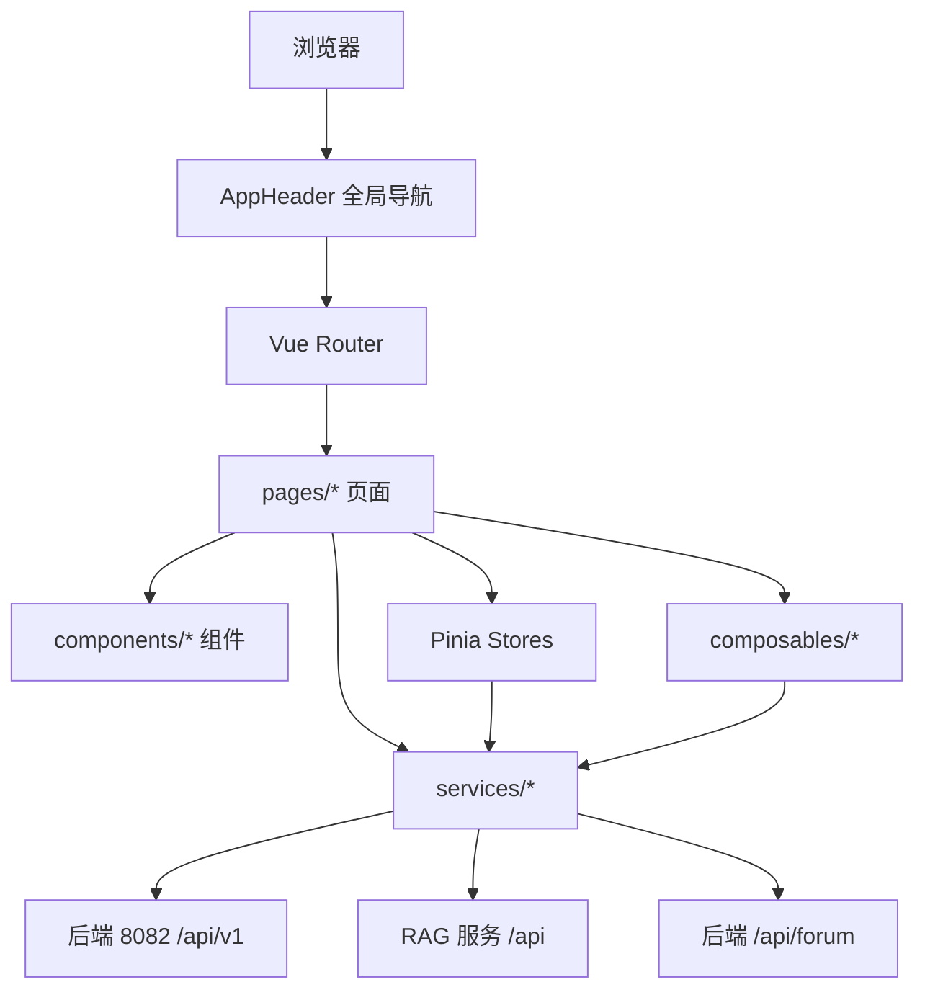
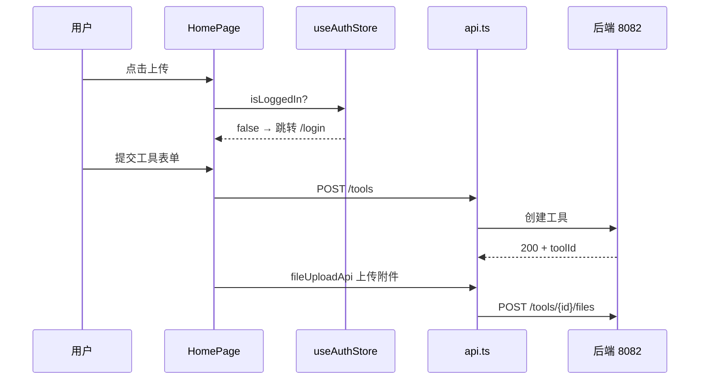

# 前端应用（Frontend）

## 模块简介

前端是 CodingHub 的 **Vue 3.4 + TypeScript 5.4 + Vite 5.2** 单页应用（SPA），承载全部用户界面：工具广场、论坛、微课、知识库、留言板、热榜、管理与个人中心。它通过 Axios 调用后端 REST API，并通过知识库模块直连 RAG 服务做文档管理。

- 技术栈：Vue 3 `<script setup>` + TypeScript + Vite 5.2 + Pinia（状态）+ Vue Router + Element Plus + lucide-vue + markdown-it
- 设计系统：双主题（Cyberpunk Dark / Glassmorphism Light），由 `theme` store 通过 `document.documentElement[data-theme]` 切换（浅色设 `light`，深色移除属性）
- 目录分层：`types`(L0) → `services`(L1) → `stores`(L2) → `composables`(L2) → `components`(L3) → `pages`(L4)，与后端反向依赖规则一致
- 跨模块：知识库文档/配置/状态操作**直连 RAG 服务**（见 [RAG 知识库服务模块](rag-service.md)），语义搜索经 [知识库模块](knowledge-base.md) 的 Java 代理

## 架构图

## 分层与核心组件

### 服务层 `services/`（L1）
统一封装 HTTP 调用，是前端与后端/ RAG 的唯一通信边界。

| 文件 | baseURL | 职责 |
|------|---------|------|
| `api.ts` | `/api/v1` | 主 Axios 实例；请求拦截器注入 `Bearer` 令牌，响应拦截器实现 **401 令牌刷新队列**（`isRefreshing` / `refreshSubscribers`）；另导出 `fileUploadApi`（multipart，超时 600s）与 `tagApi` |
| `tool.ts` | `/api/v1`（复用 api） | `getToolDetail` / `getTool` / `pinTool` / `unpinTool` / `getHotTop5` |
| `forum.ts` | `/api/forum` | 独立实例；帖子/分类/标签/评论/点赞 |
| `video.ts` | `/api/v1` | 视频上传（带进度）、列表、详情、流地址、封面、置顶、我的视频 |
| `knowledge.ts` | `/api/v1` + RAG 直连 | KB CRUD 经 Java；**文档列表/上传/删除/状态/配置直连 RAG**；搜索经 Java 代理 |
| `interaction.ts` | `/api/v1` | 统一点赞/评论/收藏（TargetType: TOOL/FORUM_POST/VIDEO） |
| `notification.ts` | `/api/v1` | 通知列表/未读计数/已读 |
| `overview.ts` | `/api` | 统计数据、工具/帖子/视频排行 |
| `feedback.ts` | `/api/v1` | 留言板列表/创建/回复/删除 |

> 令牌刷新：响应 401 时若非刷新请求，则挂起后续请求进入 `refreshSubscribers`，待 `POST /auth/refresh` 成功后批量重放；403 由 `ElMessage` 警告。

### 状态层 `stores/`（L2）
- `auth.ts`：保存 `accessToken`/`refreshToken`/`user` 至 `localStorage`；计算属性 `isLoggedIn` / `isAdmin`（ADMIN 或 SUPER_ADMIN）/ `isSuperAdmin`；`setTokens`/`setUser`/`logout`/`initFromStorage`。
- `theme.ts`：主题 `dark`/`light` 持久化与 `applyTheme`（设置/移除 `data-theme`）；`toggleTheme`/`setTheme`。
- `forum.ts`：论坛帖子分页/分类/标签/我的帖子缓存及删除错误码映射（AUTH/FORBIDDEN/NOT_FOUND）。

### 组合式函数 `composables/`（L2）
- `useInteraction.ts`：按 `targetType`+`targetId` 封装点赞/收藏/评论的统一状态机（`liked`/`likeCount`/`favorited`/`comments` 等），被详情页复用。
- `useContentPermissions.ts`：返回 `canEdit`/`canDelete` 计算属性，规则 `userId === ownerId || authStore.isAdmin`，与后端 `isOwner || isAdmin` 对齐。

### 类型层 `types/`（L0）
`index.ts` 定义通用类型（`User`/`Category`/`Tag`/`ToolSummary`/`ToolDetail`/`PageResponse`/`ApiResponse`/`LoginRequest` 等）；`tool.ts`/`forum.ts`/`video.ts`/`knowledge.ts`/`overview.ts`/`feedback.ts` 定义领域类型。

### 页面与组件（L3/L4）
- `pages/`（28）：根级 `HomePage`（工具广场）、`DetailPage`、`EditToolPage`、`UploadPage`、`LoginPage`、`RegisterPage`、`ProfilePage`、`OverviewPage`（热榜）、`AboutPage`、`QuickStartPage`、`NotFoundPage`；子目录 `forum/`、`video/`、`knowledge/`、`feedback/`、`admin/`。
- `components/`：根级 `AppHeader`（全局导航+主题切换+用户菜单+通知铃）、`AuthorBadge`、`UserAvatar`、`PostRankList`/`ToolRankList`/`VideoRankList`、`StatsCard`；`common/`（9 个通用组件如 `ConfirmDialog`、`SortTab`、`TagBadge`、`NotificationBell`）；`forum/`、`video/`、`knowledge/`、`feedback/` 领域组件。

## 关键交互流程（以工具广场为例）

## 双主题实现
- `theme` store 启动时从 `localStorage.theme` 读取，默认 `light`。
- `applyTheme('light')` 设置 `document.documentElement.setAttribute('data-theme','light')`；`'dark'` 移除属性。
- 所有组件样式通过 CSS 变量（`--text-primary`/`--border-color`/`--accent-1` 等）与 `[data-theme="light"]` 覆盖实现双主题，无需重新渲染。

## 依赖关系（🔗 CodeGraph 增强）

- **直接依赖**：`services/*` 是唯一网络边界；`knowledge.ts` 直连 [RAG 知识库服务模块](rag-service.md) 的 `/api/collections/...` 端点（`documentsUrl`/`ragBaseUrl` 来自后端 KB 详情）。
- **下游**：`pages/*` 依赖 `components/*` + `stores/*` + `composables/*`；`HomePage` 同时驱动工具列表、MCP 配置弹窗、上传弹窗。
- **安全对齐**：`useContentPermissions` 与后端 `isOwner || isAdmin` 规则一致；401 刷新逻辑与后端 `access 15min / refresh 7d` 时效配合。

## 相关模块

- [后端服务](backend.md) — 全部 REST API 提供方
- [知识库模块](knowledge-base.md) — `knowledge.ts` 搜索代理
- [RAG 知识库服务模块](rag-service.md) — `knowledge.ts` 文档/配置直连
- [统一互动服务模块](unified-services.md) — `interaction.ts` / `useInteraction`
- [概览与管理模块](overview-admin.md) — `overview.ts` 排行
