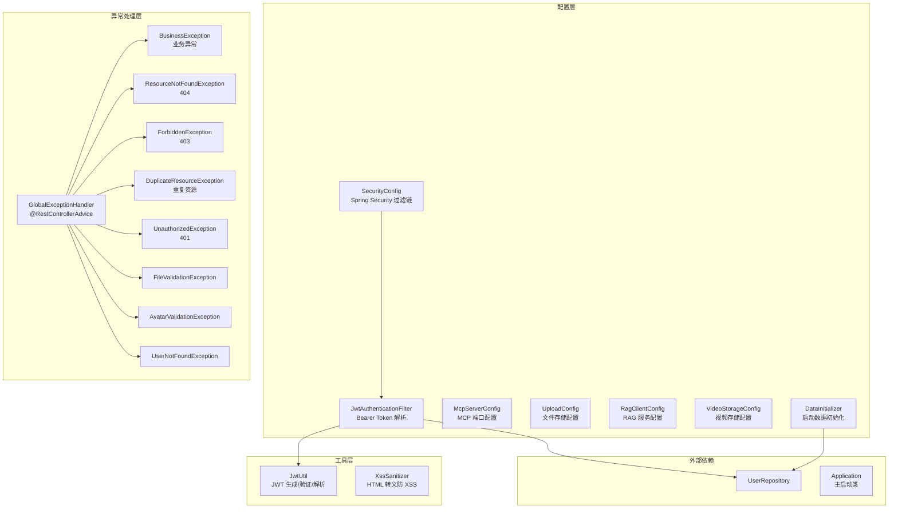
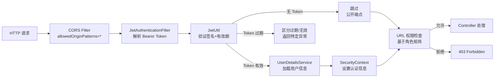
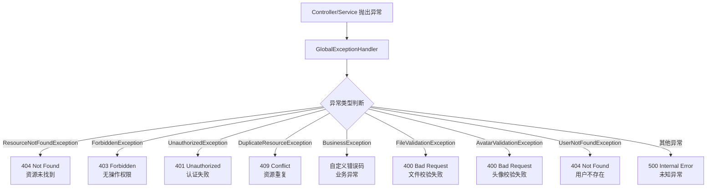

# 基础设施

## 模块简介

基础设施模块是 CodingHub 平台的底层支撑，为所有业务模块提供安全认证、异常处理、工具类和启动配置等核心能力。该模块以 Spring Security 过滤链为核心，结合 JWT 无状态认证、全局异常处理、XSS 防护和数据初始化等机制，构建了完整的应用安全与运维基础。

模块包含 59 个组件，涵盖 7 个配置类、9 个异常类、2 个工具类和 1 个主启动类。所有业务 Controller 和 Service 均直接或间接依赖本模块提供的能力。

---

## 架构总览

---

## 组件职责说明

### 配置类（Config）

| 组件 | 职责 |
|------|------|
| **SecurityConfig** | Spring Security 过滤链配置，定义 CORS 策略、Session 管理（STATELESS）、URL 权限矩阵、JWT Filter 注册 |
| **JwtAuthenticationFilter** | 拦截每个请求，从 `Authorization` 头提取 Bearer Token，调用 JwtUtil 验证并加载用户信息到 SecurityContext |
| **McpServerConfig** | MCP 服务端口与传输层配置 |
| **UploadConfig** | 文件上传存储路径、文件大小限制配置 |
| **RagClientConfig** | RAG Python 服务的连接 URL 配置 |
| **VideoStorageConfig** | 视频文件存储路径配置 |
| **DataInitializer** | 应用启动时初始化 super_admin 账号和默认分类数据 |

### 异常类（Exception）

| 异常类 | HTTP 状态码 | 使用场景 |
|--------|------------|----------|
| **BusinessException** | 由 `code` 字段决定 | 通用业务异常基类，携带业务错误码 |
| **ResourceNotFoundException** | 404 | 资源不存在（工具、帖子、视频等） |
| **ForbiddenException** | 403 | 无权执行操作（非 owner 且非 admin） |
| **DuplicateResourceException** | 409 | 重复资源（用户名、昵称已存在） |
| **UnauthorizedException** | 401 | 未认证或认证失败 |
| **FileValidationException** | 400 | 文件校验失败（类型、大小不合规） |
| **AvatarValidationException** | 400 | 头像校验失败 |
| **UserNotFoundException** | 404 | 用户不存在 |

**GlobalExceptionHandler** 通过 `@RestControllerAdvice` 统一拦截所有异常，转换为标准化的 JSON 错误响应，避免向客户端暴露内部堆栈信息。

### 工具类（Util）

| 组件 | 职责 |
|------|------|
| **JwtUtil** | JWT Token 的生成（access/refresh）、验证（有效期、签名）、解析（提取 username/role），使用 HMAC 签名算法 |
| **XssSanitizer** | 对用户输入的纯文本内容（评论、弹幕等）进行 HTML 实体转义，防止 XSS 注入攻击 |

---

## 安全架构

### URL 权限矩阵

SecurityConfig 定义了三级权限控制：

**公开端点（无需认证）：**
- `/api/v1/auth/**` — 认证相关（登录/注册/刷新）
- `/api/v1/tools` — 工具列表（GET）
- `/api/v1/categories/**` — 分类列表
- `/api/v1/videos` — 视频列表（GET）
- `/api/forum/**` — 论坛（只读）
- `/mcp/**` — MCP 服务
- `/api/v1/knowledge/**` — 知识库（只读）
- `/api/v1/feedback/**` — 留言反馈
- `/api/v1/tags/**` — 标签
- `/api/overview/**` — 概览统计

**需认证端点（登录即可）：**
- `/api/v1/tools` — 工具 CRUD（POST/PUT/DELETE）
- `/api/v1/users/**` — 个人中心
- `/api/v1/notifications/**` — 通知
- `/api/v1/knowledge/**` — 知识库写操作
- `/api/v1/interactions/**` — 互动操作

**需 ADMIN / SUPER_ADMIN 端点：**
- `/api/v1/admin/**` — 管理操作（SUPER_ADMIN）

### CORS 配置

- `allowedOriginPatterns = *`（全开放）
- 允许所有 HTTP 方法和请求头
- 允许携带凭据（`allowCredentials = true`）

---

## 异常处理流程

---

## 依赖关系

### 上游依赖（谁依赖本模块）

| 依赖方 | 依赖方式 | 说明 |
|--------|----------|------|
| 所有 Controller | 间接依赖 | SecurityConfig 定义的过滤链和权限规则控制所有 API 端点的访问 |
| 所有 Service | 异常引用 | 业务 Service 抛出本模块定义的异常类，由 GlobalExceptionHandler 统一处理 |
| [IaihubToolHandler](mcp-service.md) | 异常 + 工具 | MCP 工具处理器使用 XssSanitizer 和异常类 |
| 评论/弹幕相关 Service | XSS 防护 | ForumPostService、VideoService 在保存评论和弹幕时调用 XssSanitizer |

### 下游依赖（本模块依赖谁）

| 依赖项 | 类型 | 说明 |
|--------|------|------|
| [UserRepository](auth-user.md) | Repository | JwtAuthenticationFilter 通过 UserRepository 加载用户信息 |
| Spring Security | 框架依赖 | SecurityConfig 基于 Spring Security 构建过滤链 |
| JJWT 库 | 第三方依赖 | JwtUtil 基于 JJWT 实现 JWT 操作 |
| Flyway | 数据库迁移 | 数据库 Schema 版本管理（V1~V9） |
| MySQL | 数据库 | 连接 `ai_tool_square` 数据库 |

### 变更影响

> **SecurityConfig 是本模块中影响范围最大的组件。**

SecurityConfig 的权限规则变更会直接影响所有 API 端点的访问控制：

- **URL 权限规则变更** — 可能导致某些端点变得不可访问或暴露未授权访问风险
- **CORS 策略变更** — 影响前端跨域请求
- **Session 管理变更** — 影响 JWT 认证的无状态特性
- **Filter 链顺序变更** — 可能导致认证流程异常

JwtUtil 的变更影响同样广泛：

- **签名算法/密钥变更** — 所有已签发的 Token 失效，用户需重新登录
- **Token 有效期变更** — 影响用户体验和安全性平衡

---

## DataInitializer 初始化数据

应用启动时，DataInitializer 自动执行以下初始化：

1. **创建 super_admin 账号** — 如果不存在 `super_admin` 用户，自动创建（默认密码）
2. **创建默认分类** — 初始化工具分类和论坛分类数据

此机制确保首次部署后系统具有可用的管理员账号和基础分类结构。

---

## 应用配置（application.yml）

关键配置项：

| 配置项 | 值 | 说明 |
|--------|-----|------|
| 数据库 | MySQL `ai_tool_square` | 主数据库 |
| JPA ddl-auto | `update` | 自动更新 Schema |
| 上传限制 | 1GB | 单文件最大上传大小 |
| 服务端口 | 8082 | 后端服务端口 |

---

## XSS 防护机制

XssSanitizer 使用 HTML 实体转义策略，对以下用户生成内容进行防护：

- 工具评论
- 帖子评论
- 视频弹幕
- 留言板内容

转义规则：将 `<`、`>`、`&`、`"`、`'` 等特殊字符转换为对应的 HTML 实体编码，防止恶意脚本注入。

> **注意**：XssSanitizer 用于纯文本内容。对于富文本内容，需要采用白名单过滤策略（当前未实现）。

---

## 相关模块

- [认证与用户管理](auth-user.md) — UserService 提供认证业务逻辑，UserRepository 被 JwtAuthenticationFilter 使用
- [MCP 服务](mcp-service.md) — MCP 工具处理器使用本模块的异常类和 XssSanitizer
