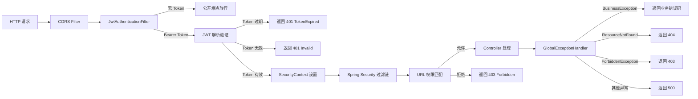
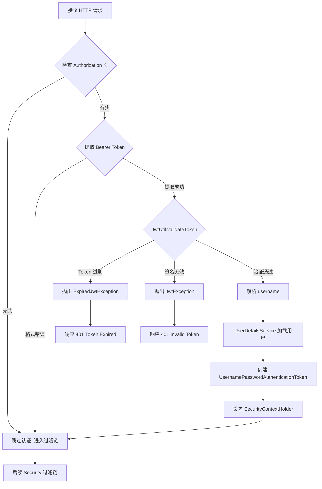

# 基础设施

基础设施模块为 CodingHub 平台提供底层支撑能力，涵盖安全配置、异常处理、通用工具和应用程序启动等核心功能。该模块不包含业务逻辑，而是作为横切关注点（cross-cutting concerns）服务于所有业务模块，确保整个应用的安全性、稳定性和可维护性。

本模块的组件分布在 `config`、`exception`、`util` 和根包下，共计 59 个组件。它们通过 Spring Boot 的自动配置和依赖注入机制，在应用启动时自动加载并生效。

## 安全架构



## 组件职责

### 配置类 (Config)

| 组件 | 职责说明 |
|------|----------|
| SecurityConfig | Spring Security 核心配置，定义 CORS 策略（全开放 `allowedOriginPatterns=*`）、Session 管理（`STATELESS`）、CSRF 禁用、URL 权限矩阵和过滤链顺序 |
| JwtAuthenticationFilter | 继承 `OncePerRequestFilter`，从请求头提取 `Authorization: Bearer <token>`，解析 JWT 并设置 `SecurityContext`；区分 Token 过期和 Token 无效两种错误场景 |
| McpServerConfig | MCP 服务端口和传输层配置，定义 Streamable HTTP 和 SSE 双传输通道 |
| UploadConfig | 文件存储配置，定义上传目录路径（`upload/`）和文件大小限制 |
| RagClientConfig | RAG 知识库 Python 服务的连接配置，定义 RAG API 的基础 URL |
| VideoStorageConfig | 视频文件存储路径配置，独立于普通上传目录 |
| DataInitializer | 应用启动时的数据初始化器，通过 `CommandLineRunner` 创建默认 `super_admin` 账号和系统默认分类 |

### 异常处理 (Exception)

| 组件 | HTTP 状态码 | 说明 |
|------|-------------|------|
| GlobalExceptionHandler | — | `@RestControllerAdvice` 全局异常拦截器，统一处理所有 Controller 层抛出的异常并格式化响应 |
| BusinessException | 自定义 | 通用业务异常，携带业务错误码（`code`）和描述信息 |
| ResourceNotFoundException | 404 | 资源未找到异常，用于工具、帖子、用户等实体不存在时 |
| ForbiddenException | 403 | 权限不足异常，当用户无权执行某操作时抛出 |
| DuplicateResourceException | 409 | 资源重复异常，如用户名或昵称已存在 |
| UnauthorizedException | 401 | 未认证异常，当用户未登录或令牌无效时抛出 |
| FileValidationException | 400 | 文件校验异常，用于上传文件类型或大小不合规 |
| AvatarValidationException | 400 | 头像校验异常，专门处理头像上传相关的校验失败 |
| UserNotFoundException | 404 | 用户未找到异常，`UserRepository` 查询失败时抛出 |

### 工具类 (Util)

| 组件 | 职责说明 |
|------|----------|
| JwtUtil | JWT 令牌工具类，提供 `generateAccessToken()`、`generateRefreshToken()`、`validateToken()`、`getUsernameFromToken()` 等方法，封装 JJWT 库操作 |
| XssSanitizer | XSS 防护工具类，对 HTML 特殊字符（`<`、`>`、`&`、`"`、`'`）进行转义，用于评论内容、弹幕文本等纯文本输入场景 |

### 应用程序入口

**CodingHubApplication** 是 Spring Boot 主启动类，位于 `com.iaihub.toolbox` 根包下，通过 `@SpringBootApplication` 注解启用自动配置、组件扫描和 Spring Boot 启动流程。

## GlobalExceptionHandler 统一异常响应

`GlobalExceptionHandler` 使用 `@RestControllerAdvice` 注解拦截所有 Controller 层抛出的异常，返回统一的 JSON 错误响应格式：

```json
{
  "code": "RESOURCE_NOT_FOUND",
  "message": "工具不存在: id=42",
  "timestamp": "2025-01-15T10:30:00"
}
```

### 异常映射表

| 异常类型 | HTTP 状态码 | 错误码 | 典型触发场景 |
|----------|-------------|--------|-------------|
| ResourceNotFoundException | 404 | RESOURCE_NOT_FOUND | 按 ID 查询工具/帖子/知识库不存在 |
| UserNotFoundException | 404 | USER_NOT_FOUND | 按用户名或 ID 查询用户不存在 |
| UnauthorizedException | 401 | UNAUTHORIZED | 未登录或令牌无效时访问受保护端点 |
| ForbiddenException | 403 | FORBIDDEN | 非 owner 尝试修改/删除他人内容 |
| DuplicateResourceException | 409 | DUPLICATE_RESOURCE | 注册时用户名/昵称已存在 |
| BusinessException | 自定义 | 业务定义 | 通用业务规则违反 |
| FileValidationException | 400 | FILE_VALIDATION_ERROR | 上传文件超过大小限制或类型不合规 |
| AvatarValidationException | 400 | AVATAR_VALIDATION_ERROR | 头像文件格式不支持或尺寸超限 |
| Exception（兜底） | 500 | INTERNAL_ERROR | 未预期的系统异常 |

## JwtAuthenticationFilter 内部流程



该过滤器继承 `OncePerRequestFilter`，确保每个请求只执行一次。关键行为：

- 无 `Authorization` 头的请求直接放行，由后续 Security 规则决定是否允许匿名访问
- Token 过期和 Token 无效返回不同的错误信息，帮助客户端区分处理策略（过期应刷新，无效应重新登录）
- 认证成功后将用户信息存入 `SecurityContextHolder`，后续 Controller 可通过 `SecurityContextHolder.getContext().getAuthentication()` 获取当前用户

## URL 权限矩阵

SecurityConfig 定义了完整的 URL 访问控制规则，分为三个层级：

### 公开端点（无需认证）

| URL 模式 | 说明 |
|----------|------|
| `/api/v1/auth/**` | 认证相关（登录、注册、刷新令牌） |
| `/api/v1/tools` (GET) | 工具列表浏览 |
| `/api/v1/categories/**` | 分类列表 |
| `/api/v1/videos` (GET) | 视频列表浏览 |
| `/api/forum/**` (GET) | 论坛帖子和分类浏览 |
| `/mcp/**` | MCP 服务端点（SSE / Streamable HTTP） |
| `/api/v1/knowledge/**` (GET) | 知识库只读访问 |
| `/api/v1/feedback/**` (GET) | 留言反馈浏览 |
| `/api/v1/tags/**` | 标签查询 |
| `/api/overview/**` | 统计数据（公开） |

### 需认证端点（登录用户）

| URL 模式 | 说明 |
|----------|------|
| `/api/v1/tools/**` (POST/PUT/DELETE) | 工具创建、修改、删除 |
| `/api/v1/users/**` | 个人中心操作 |
| `/api/v1/notifications/**` | 通知管理 |
| `/api/v1/knowledge/**` (POST/PUT/DELETE) | 知识库写入操作 |
| `/api/v1/interactions/**` | 互动操作（点赞、评论） |

### 需 ADMIN/SUPER_ADMIN 端点

| URL 模式 | 说明 |
|----------|------|
| `/api/v1/admin/**` | 管理后台操作（仅 SUPER_ADMIN） |

## 关键特性

### CORS 全开放策略

当前配置 `allowedOriginPatterns=*`，允许所有来源的跨域请求。这是开发阶段的便利配置，生产环境应限制为具体的前端域名。

```
CORS 配置要点：
- allowedOriginPatterns: *（全开放）
- allowedMethods: GET, POST, PUT, DELETE, OPTIONS
- allowedHeaders: *（包含 Authorization）
- allowCredentials: true
```

### Stateless Session 管理

Session 创建策略设为 `SessionCreationPolicy.STATELESS`，服务端不创建或依赖 HTTP Session。所有认证状态通过 JWT 令牌在客户端维护，符合 RESTful 无状态设计原则。

### XSS 防护机制

`XssSanitizer` 对以下纯文本内容进行 HTML 实体转义：

- 工具评论（`ToolComment`）
- 论坛评论（`ForumComment`）
- 视频弹幕（`Danmaku`）
- 视频评论（`VideoComment`）
- 留言反馈（`FeedbackMessage`）

转义规则：`<` → `&lt;`、`>` → `&gt;`、`&` → `&amp;`、`"` → `&quot;`、`'` → `&#x27;`

### DataInitializer 启动初始化

应用每次启动时，`DataInitializer` 会检查并创建以下初始数据：

1. **super_admin 账号**：用户名 `super_admin`，密码 `123456`（BCrypt 加密），角色 `SUPER_ADMIN`，状态 `ACTIVE`
2. **默认工具分类**：如分类表为空则创建系统预设分类
3. **默认论坛分类**：如论坛分类表为空则创建系统预设分类

## application.yml 关键配置

| 配置项 | 值 | 说明 |
|--------|-----|------|
| `spring.datasource.url` | `jdbc:mysql://localhost:3306/ai_tool_square` | MySQL 数据库连接 |
| `spring.jpa.hibernate.ddl-auto` | `update` | JPA 自动更新表结构（开发模式） |
| `spring.servlet.multipart.max-file-size` | `1GB` | 单文件上传大小限制 |
| `spring.servlet.multipart.max-request-size` | `1GB` | 单次请求总大小限制 |
| `server.port` | `8082` | 后端服务端口 |
| `jwt.secret` | 配置项 | JWT 签名密钥 |
| `jwt.access-token-expiration` | `900000`（15min） | Access Token 过期时间（毫秒） |
| `jwt.refresh-token-expiration` | `604800000`（7天） | Refresh Token 过期时间（毫秒） |

## Flyway 数据库迁移

数据库表结构通过 Flyway 进行版本化管理，迁移脚本位于 `backend/src/main/resources/db/migration/` 目录：

| 版本 | 文件名模式 | 说明 |
|------|-----------|------|
| V1 | V1__init_schema.sql | 初始化核心表：user, category, tool, tool_file, tool_like, tool_comment |
| V2 | V2__forum_tables.sql | 论坛模块表：forum_category, forum_post, forum_comment, forum_like, forum_tag, forum_post_tag |
| V3 | V3__video_tables.sql | 微课模块表：video, video_comment, video_like, video_favorite, danmaku |
| V4 | V4__knowledge_base.sql | 知识库表：knowledge_base, kb_document |
| V5 | V5__tag_system.sql | 统一标签系统：tag, tool_tag, video_tag |
| V6 | V6__notification.sql | 通知系统：notification 表 |
| V7 | V7__feedback.sql | 留言反馈：feedback_message 表 |
| V8 | V8__post_favorite.sql | 帖子收藏：post_favorite 表 |
| V9 | V9__indexes.sql | 性能索引优化 |

Flyway 在应用启动时自动执行未应用的迁移脚本，确保数据库结构与代码版本一致。

> 注意：当前 `ddl-auto` 设置为 `update`，JPA 会自动根据实体类调整表结构。这在开发阶段提供便利，但生产环境应改为 `validate` 或 `none`，完全依赖 Flyway 管理表结构。

## 部署与运维

### 启动命令

```bash
# 通过 Makefile 启动
make backend     # 仅启动后端 (端口 8082)
make run         # 同时启动后端 + 前端
make db          # 创建数据库并初始化 Flyway 迁移

# 直接 Gradle 启动
./gradlew bootRun -p backend
```

### 环境依赖

| 依赖 | 版本要求 | 说明 |
|------|----------|------|
| JDK | 17+ | Java 运行时 |
| MySQL | 8.x | 数据库，字符集 utf8mb4 |
| Gradle | 8.5+ | 构建工具（项目内置 wrapper） |
| Python | 3.9+ | RAG 知识库服务（可选） |

### 配置文件

- 主配置：`backend/src/main/resources/application.yml`
- 环境配置：`harness/config/environment.json`
- MCP 配置：通过 `McpServerConfig` Java 类管理
- 前端 API 代理：Vite 配置中转发 `/api` 和 `/mcp` 到 `localhost:8082`

### 健康检查

应用启动后可通过以下方式验证服务状态：

- 访问 `http://localhost:8082/api/v1/categories` 验证 REST API 正常
- 访问 `http://localhost:8082/mcp/sse` 验证 MCP SSE 端点可用
- 查看控制台日志确认 Flyway 迁移和 DataInitializer 初始化成功

## 与其他模块的关系

- **认证与用户管理**：本模块的 `SecurityConfig` 和 `JwtAuthenticationFilter` 为 [认证与用户管理](auth-user.md) 模块提供请求级认证和权限控制
- **MCP 服务**：`McpServerConfig` 为 [MCP 服务](mcp-service.md) 提供传输层配置；`XssSanitizer` 用于 MCP 工具输入消毒
- **所有业务模块**：`GlobalExceptionHandler` 统一处理所有 Controller 抛出的异常；`XssSanitizer` 被评论、弹幕等业务 Service 调用
- **数据库**：Flyway 迁移脚本（V1~V9）位于 `backend/src/main/resources/db/migration/`，管理表结构版本演进
