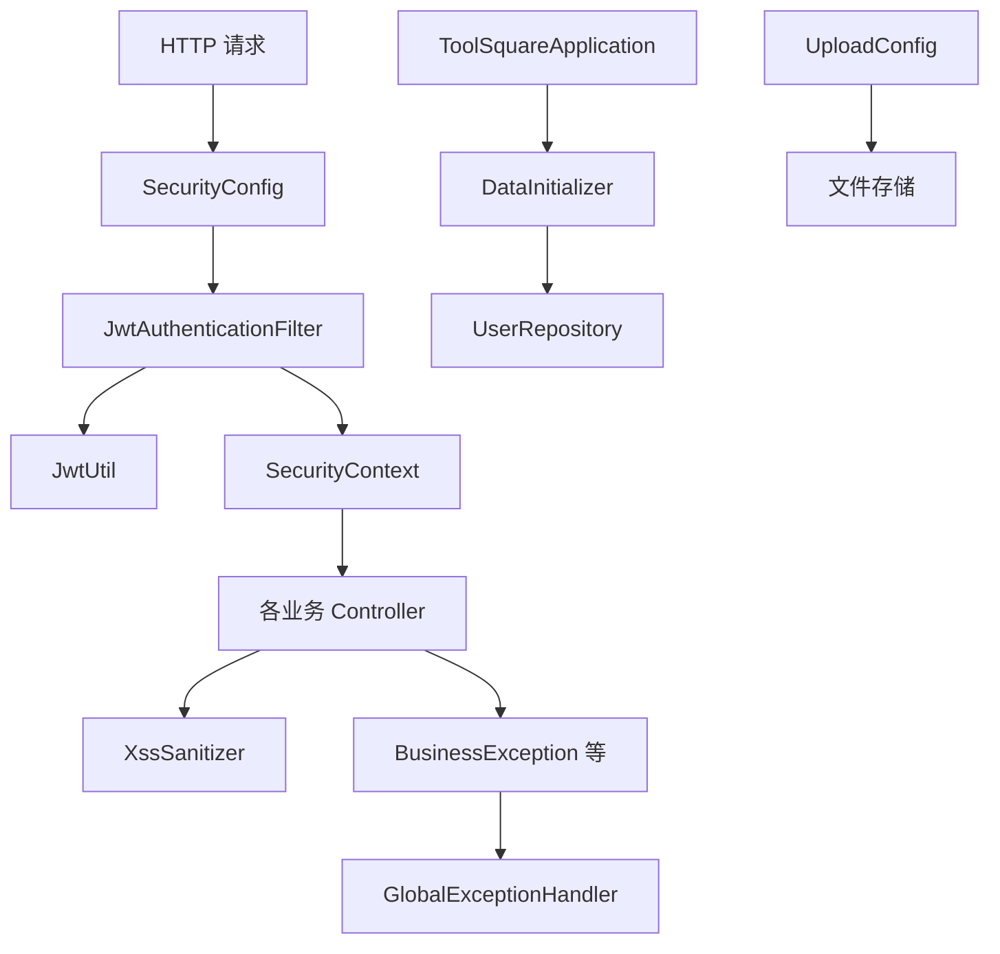

# 基础设施与异常模块（Infrastructure & Exceptions）

## 模块简介

基础设施与异常模块是 CodingHub 的**横切基座**：安全过滤链、JWT 工具、全局异常处理、XSS 清洗、文件上传配置、启动数据初始化与应用入口。它支撑所有业务模块的安全与健壮性约束。

- 关键组件：`SecurityConfig`、`JwtAuthenticationFilter`、`JwtUtil`、`GlobalExceptionHandler`、`XssSanitizer`、`UploadConfig`、`VideoStorageConfig`、`RagClientConfig`、`McpServerConfig`、`DataInitializer`、`ToolSquareApplication`、`BusinessException` 等
- 设计约束（来自 AGENTS.md）：JWT `Authorization: Bearer <token>`（access 15min / refresh 7d）；权限 `USER`/`ADMIN`/`SUPER_ADMIN`；内容操作 `isOwner || isAdmin`；禁止 null 返回；XSS 经 `XssSanitizer.sanitize()`。

## 架构图

## 核心组件职责

### SecurityConfig（`config/SecurityConfig.java`）
Spring Security 过滤器链（`@EnableWebSecurity`）：
- **无状态**：`SessionCreationPolicy.STATELESS`，禁用 CSRF。
- **CORS**：`AllowedOriginPatterns("*")` + `AllowCredentials(true)`，`maxAge=3600`。
- **公开端点**：认证（`/api/v1/auth/**`）、内容 GET（tools/videos/forum/KB/标签/互动评论与点赞）、静态资源（`/api/v1/static/avatars/**`）、MCP（`/sse/**`、`/mcp/**`）、视频流与封面、知识库搜索、反馈提交等。
- **需认证**：`/api/v1/interactions/favorites/**`、通知、知识库写操作、工具/视频/用户写操作。
- **角色约束**：审批/封禁/删除用户等归 `SUPER_ADMIN`；其余管理归 `ADMIN`/`SUPER_ADMIN`。
- **认证入口**：返回 `TOKEN_REQUIRED` / `TOKEN_EXPIRED`（401 JSON）。
- `JwtAuthenticationFilter` 在 `UsernamePasswordAuthenticationFilter` 之前执行；`PasswordEncoder` 为 `BCryptPasswordEncoder`。
- 注意：文件上传 `POST /api/v1/tools/{toolId}/files` 被设为 `permitAll`（支持 MCP 免认证上传），属有意设计但需关注越权风险。

### JwtUtil / JwtAuthenticationFilter
- `JwtUtil`：基于 JJWT 签发/校验 access（15min）与 refresh（7d）令牌，解析 `userId`/`username`。
- `JwtAuthenticationFilter`：拦截请求、解析 `Authorization` 头、写入 `SecurityContext`；过期时设置 `request.setAttribute("jwt.expired", true)`。

### GlobalExceptionHandler（`exception/GlobalExceptionHandler.java`）
`@RestControllerAdvice` 统一异常→`ApiResponse.error(code, msg)`：
- `BusinessException`（带状态码）→ 原样返回 code；
- `MethodArgumentNotValidException` → 400，拼接字段错误信息；
- `ForbiddenException` → 403；
- `IllegalArgumentException` → 400；
- `Exception` → 500 内部错误。
- 异常族：`BusinessException` / `ResourceNotFoundException` / `DuplicateResourceException` / `ForbiddenException` / `UnauthorizedException` / `UserNotFoundException` / `FileValidationException` / `AvatarValidationException`。

### XssSanitizer（`util/XssSanitizer.java`）
- `sanitize`：`escapeHtml4` + 移除 `javascript:` 与 `on\w+=` 事件处理器模式（保留 Markdown 语法由前端 markdown-it 安全渲染）。
- `sanitizePlainText`：仅 HTML 转义。
- 被 [统一互动服务模块](unified-services.md) 的 `FeedbackService`、评论等调用。

### DataInitializer（`config/DataInitializer.java`）
`CommandLineRunner`：启动时若 `app.super-admin.username`（默认 `admin`）不存在则创建 `SUPER_ADMIN`（密码默认 `Cloud@1234`），角色 `ACTIVE`。

### 其他配置
- `UploadConfig`：文件/头像上传根目录与大小限制（avatar 默认 2MB，详见 [认证与用户模块](auth-user.md)）。
- `VideoStorageConfig`：视频/封面存储路径（`videoStoragePath` / `uploadBaseDir`）。
- `RagClientConfig`：RAG 服务 HTTP 客户端与超时。
- `McpServerConfig`：早期 SSE transport 配置。
- `ToolSquareApplication`：Spring Boot 入口（`@SpringBootApplication`）。

## 安全约束速查

| 约束 | 实现 |
|------|------|
| 无状态认证 | `SessionCreationPolicy.STATELESS` + JWT |
| 令牌时效 | access 15min / refresh 7d |
| 角色 | USER < ADMIN < SUPER_ADMIN |
| 内容权限 | `isOwner || isAdmin`（`ForbiddenException`） |
| XSS | `XssSanitizer.sanitize()` |
| 异常 | 统一 `ApiResponse.error` |

## 依赖关系（🔗 CodeGraph 增强）

- **被依赖方**：所有业务 Controller 间接依赖 `SecurityConfig` 的放行/鉴权规则与 `JwtAuthenticationFilter` 的 `User` 主体注入（`@AuthenticationPrincipal`）。
- **下游**：`GlobalExceptionHandler` 兜底所有 Service 抛出的业务异常；`XssSanitizer` 被反馈/评论等输入清洗调用。
- **变更影响**：修改 `SecurityConfig` 放行规则会直接改变各接口可达性；修改 `JwtUtil` 时效影响全站登录体验；修改异常类型需同步 `GlobalExceptionHandler`。

## 相关模块

- [认证与用户模块](auth-user.md) — JWT 签发与账号状态
- [统一互动服务模块](unified-services.md) — XSS 与异常使用方
- 全部业务模块 — 均依赖本模块的安全基座
