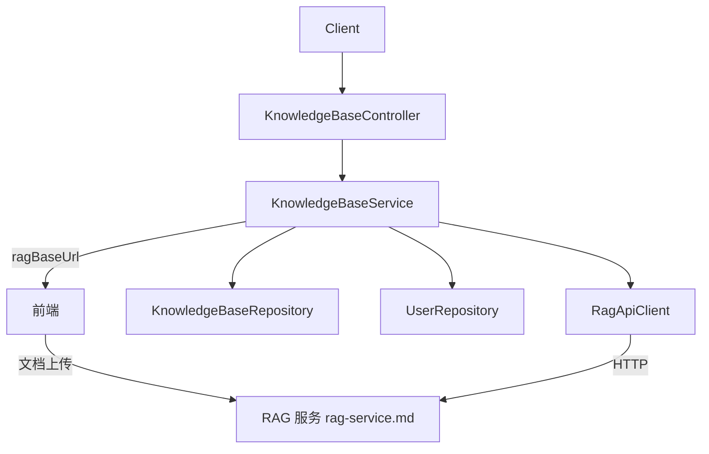

# 知识库模块（Knowledge Base / RAG）

## 模块简介

知识库模块是 CodingHub 的 **RAG（检索增强生成）能力入口**：管理知识库（KnowledgeBase）的元数据 CRUD、配置与语义搜索代理。真正的文档解析、向量化、存储与检索由独立的 **[RAG 知识库服务](rag-service.md)（Python）** 承担，本模块通过 `RagApiClient` 以 HTTP 调用与之交互。

- 入口前缀：`/api/v1/knowledge`
- 核心分层：`KnowledgeBaseController`（L4）→ `KnowledgeBaseService`（L3）→ `KnowledgeBaseRepository`（L2）→ `KnowledgeBase`（L1）
- 外部依赖：`RagApiClient` → RAG 服务（`app.rag.base-url` 内部地址；`app.rag.public-url` 供前端直连文档上传）
- 配置注入：`RagClientConfig`（`config/RagClientConfig.java`）

## 架构图

## 核心组件职责

### KnowledgeBaseController（`controller/kb/KnowledgeBaseController.java`）
- `GET /api/v1/knowledge` — 列表（`latest` 默认 / `hot`），支持 `ownerId` 过滤。
- `GET /api/v1/knowledge/{id}` — 详情（返回 `ragBaseUrl` 与 `documentsUrl`）。
- `POST /api/v1/knowledge` — 创建（需登录）。
- `PUT /api/v1/knowledge/{id}` — 更新（权限 `isOwner || isAdmin`）。
- `DELETE /api/v1/knowledge/{id}` — 软删除（`status = DELETED`）并 best-effort 删除 RAG collection。
- `POST /api/v1/knowledge/{id}/search` — 语义搜索（代理到 RAG 服务）。

### KnowledgeBaseService（`service/kb/KnowledgeBaseService.java`）
- **创建**：名称唯一校验；生成 ASCII 安全的 `ragCollection` 名（zvec 拒绝非 ASCII，规则 `小写 + 非[a-z0-9-]转- + 折叠 + 去首尾-`，空则回退 `kb`，再追加 `-{id}` 保证唯一）；写入 MySQL 后调用 `RagApiClient.configureCollection` 初始化分块配置（`chunk_mode`/`chunk_size`/`chunk_overlap`/`rerank`）。RAG 配置失败**容忍**（仅 warn）。
- **更新**：名称唯一校验 + `owner||admin` 权限；描述变更同步到 RAG config。
- **删除**：软删除 + `RagApiClient.deleteCollection`（容错）。
- **搜索**：`RagApiClient.search(collection, query, topK, rerank, expandContext)`，结果映射为 `KbSearchResultResponse`（`text`/`source`/`score`/`chunkIndex`）。
- **响应构造**：`toKbResponse` 注入 `ownerNickname`、`ragBaseUrl`（`app.rag.public-url`）、`documentsUrl`（`{publicUrl}/api/collections/{collection}/documents`，前端据此**直连 RAG 服务**上传/管理文档）。

### RagApiClient（`service/RagApiClient.java`）
基于 `java.net.http.HttpClient` 的轻量 RAG 代理，封装：
- `configureCollection`（`PUT /api/collections/{name}/config`）
- `getCollectionConfig`（`GET .../config`）
- `deleteCollection`（`DELETE /api/collections/{name}`）
- `search`（`POST .../search`，解析 `text`/`source`/`score`/`chunk_index`）
- `getDocumentStatus` / `getDocumentStatusById`（`GET .../documents/status`）

所有写操作对 RAG 不可用做异常/容错处理；超时 10~60s。

### 数据模型
- `KnowledgeBase`（`model/kb/KnowledgeBase.java`）：`name`、`description`、`ownerId`、`ragCollection`（RAG 集合名，ASCII）、`status`（`NORMAL`/`DELETED`，软删除）。
- `KbStatus`：枚举 `NORMAL` / `DELETED`。
- 注意：表 `kb_document` 在 schema 中存在，但文档元数据主要由 RAG 服务持有，后端此处仅管理库级元数据与搜索代理。

## 关键 API

| 方法 | 路径 | 说明 | 鉴权 |
|------|------|------|------|
| GET | `/api/v1/knowledge` | 知识库列表 | 否 |
| GET | `/api/v1/knowledge/{id}` | 知识库详情 | 否 |
| POST | `/api/v1/knowledge` | 创建知识库 | 是 |
| PUT | `/api/v1/knowledge/{id}` | 更新 | 所有者/管理员 |
| DELETE | `/api/v1/knowledge/{id}` | 删除 | 所有者/管理员 |
| POST | `/api/v1/knowledge/{id}/search` | 语义搜索 | 否 |

## 依赖关系（🔗 CodeGraph 增强）

- **上游调用**：前端 `services/knowledge.ts` 通过 `documentsUrl` 直连 [RAG 知识库服务](rag-service.md) 上传文档；[MCP 服务模块](mcp-service.md) 的 KB 工具复用搜索代理。
- **下游依赖**：`KnowledgeBaseService` → `KnowledgeBaseRepository` / `UserRepository` / `RagApiClient`；`RagApiClient` → RAG 服务 HTTP。
- **变更影响**：修改 `ragCollection` 命名规则会影响 RAG 集合对应；修改 `app.rag.*` 配置影响全链路可用性；`RagApiClient` 接口变更需同步 RAG 服务版本。

## 相关模块

- [RAG 知识库服务](rag-service.md) — 文档解析/向量化/检索
- [统一互动服务模块](unified-services.md) — 标签
- [MCP 服务模块](mcp-service.md) — KB 检索工具
