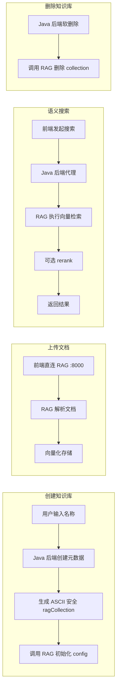

# 知识库（Knowledge Base）

## 模块简介

知识库模块是 CodingHub 的 RAG（检索增强生成）知识管理平台，为用户提供文档知识库的创建、管理和语义搜索能力。本模块采用双服务架构——Java 后端管理知识库元数据（存储在 MySQL 中），Python RAG 服务负责文档解析、向量化存储和语义检索，两者通过 HTTP API 协同工作。

本模块包含 41 个组件，虽然体量相对精简，但承担了平台级的知识管理能力，同时通过 MCP 协议向 AI 代理开放知识库操作接口，是 CodingHub 智能化能力的核心支撑。

## 架构概览

```mermaid
graph TD
    subgraph Frontend[前端]
        KBList[知识库列表页]
        KBDetail[知识库详情页]
        KBDocMgr[文档管理组件]
        KBSearch[语义搜索组件]
    end

    subgraph JavaBackend[Java 后端 :8082]
        subgraph Controllers[控制器层]
            KBCtrl[KnowledgeBaseController]
        end

        subgraph Services[业务逻辑层]
            KBService[KnowledgeBaseService]
            RagClient[RagApiClient]
        end

        subgraph Data[数据访问层]
            KBRepo[KnowledgeBaseRepository]
            UserRepo[UserRepository]
        end
    end

    subgraph PythonRAG[Python RAG 服务 :8000]
        CollectionAPI[Collection 管理 API]
        SearchAPI[语义搜索 API]
        DocAPI[文档管理 API]
        VectorDB[(向量数据库)]
    end

    subgraph MCP[MCP 协议]
        MCPHandler[IaihubToolHandler]
    end

    subgraph Storage[(存储)]
        MySQL[(MySQL)]
    end

    KBList --> KBCtrl
    KBDetail --> KBCtrl
    KBDocMgr --> PythonRAG
    KBSearch --> KBCtrl

    KBCtrl --> KBService
    KBService --> KBRepo
    KBService --> UserRepo
    KBService --> RagClient

    KBRepo --> MySQL
    RagClient -->|HTTP| CollectionAPI
    RagClient -->|HTTP| SearchAPI

    MCPHandler --> KBService

    DocAPI --> VectorDB
    SearchAPI --> VectorDB
    CollectionAPI --> VectorDB
```

## 组件职责

### Controller（控制器）

| 控制器 | 路径 | 职责 |
|--------|------|------|
| KnowledgeBaseController | `/api/v1/knowledge` | 知识库列表（分页，支持 sortBy=hot/latest、ownerId 过滤）、知识库详情、创建知识库（自动生成 ASCII 安全的 ragCollection 名，初始化 RAG 配置）、更新知识库（同步描述到 RAG）、删除知识库（软删除 + 删除 RAG collection）、语义搜索（代理到 RAG 服务，支持 topK / rerank / expandContext） |

### Service（业务逻辑）

| 服务 | 核心职责 |
|------|----------|
| KnowledgeBaseService | 知识库 CRUD 核心逻辑：名称唯一性校验、权限检查（isOwner / isAdmin）、RAG collection 生命周期管理、语义搜索代理 |
| RagApiClient | HTTP 客户端，封装与 Python RAG 服务的全部通信 |

### RagApiClient 接口详情

RagApiClient 是 Java 后端与 Python RAG 服务之间的桥梁，封装了以下 HTTP 调用：

| 方法 | RAG 服务端点 | 说明 |
|------|-------------|------|
| 配置 collection | `PUT /api/collections/{name}/config` | 初始化或更新 collection 配置 |
| 获取配置 | `GET /api/collections/{name}/config` | 查询 collection 当前配置 |
| 删除 collection | `DELETE /api/collections/{name}` | 删除 collection 及其向量数据 |
| 语义搜索 | `POST /api/collections/{name}/search` | 执行语义搜索查询 |
| 文档状态 | `GET /api/collections/{name}/documents/status` | 查询文档处理状态 |

### Model（数据模型）

| 模型 | 关键字段 |
|------|----------|
| KnowledgeBase | name, description, ownerId, ragCollection, status |

### DTOs（数据传输对象）

| DTO | 说明 |
|-----|------|
| KbCreateRequest | 创建知识库请求（name, description） |
| KbUpdateRequest | 更新知识库请求（description） |
| KbResponse | 知识库信息响应 |
| KbSearchRequest | 语义搜索请求（query, topK, rerank, expandContext） |
| KbSearchResultResponse | 语义搜索结果响应 |
| KbConfigRequest | RAG 配置请求 |

## API 端点列表

| 方法 | 端点 | 说明 | 权限 |
|------|------|------|------|
| GET | `/api/v1/knowledge` | 知识库分页列表（sortBy: hot/latest, ownerId 过滤） | 公开 |
| GET | `/api/v1/knowledge/{id}` | 知识库详情 | 公开 |
| POST | `/api/v1/knowledge` | 创建知识库 | 需认证 |
| PUT | `/api/v1/knowledge/{id}` | 更新知识库 | 拥有者/管理员 |
| DELETE | `/api/v1/knowledge/{id}` | 删除知识库（软删除 + 删除 RAG collection） | 拥有者/管理员 |
| POST | `/api/v1/knowledge/{id}/search` | 语义搜索（代理到 RAG 服务） | 公开 |

> **注意**：文档上传与管理操作由前端直连 Python RAG 服务（`:8000`），不经过 Java 后端。

## 关键特性

### 双服务架构

知识库采用 Java + Python 双服务分离设计：

- **Java 后端（:8082）**：管理知识库元数据（名称、描述、所有者、状态），存储在 MySQL 中，提供统一的 REST API
- **Python RAG 服务（:8000）**：负责文档解析、向量化、存储和语义检索，使用专业的向量数据库

这种分离使得文档处理的重计算任务不影响主业务服务，同时 Java 后端可以统一管理多个知识库的元数据。

### ragCollection 命名策略

创建知识库时，用户输入的名称（可能包含中文）需要转换为 ASCII 安全的 collection 名称：

1. 将中文名转换为 ASCII 安全字符串（去除/替换非 ASCII 字符）
2. 追加知识库 ID 保证唯一性
3. 例如：`"技术文档"` → `"tech-docs-42"`

这一策略确保 RAG 服务的 collection 名称兼容各种底层存储系统。

### 语义搜索

语义搜索通过 Java 后端代理转发到 Python RAG 服务，支持以下参数：

| 参数 | 说明 |
|------|------|
| query | 搜索查询文本 |
| topK | 返回结果数量上限 |
| rerank | 是否启用重排序（提高相关性） |
| expandContext | 是否扩展上下文（返回更多周边文本） |

### 生命周期管理

- **创建**：Java 后端创建元数据记录 → 调用 RAG 服务初始化 collection 配置
- **更新**：Java 后端更新描述 → 同步更新 RAG 服务中的 collection 配置
- **删除**：Java 后端软删除元数据（status=DELETED）→ 调用 RAG 服务删除 collection 及其向量数据

## 依赖关系

### 上游依赖（谁调用本模块）

| 调用方 | 调用方式 | 说明 |
|--------|----------|------|
| KnowledgeBaseController | REST API | 前端 Web 界面直接调用 |
| IaihubToolHandler | MCP 协议 | AI 代理通过 MCP 的 `kb_*` 系列工具操作知识库 |

### 下游依赖（本模块依赖谁）

| 依赖 | 类型 | 说明 |
|------|------|------|
| KnowledgeBaseRepository | 数据访问 | 知识库元数据 CRUD |
| RagApiClient → Python RAG 服务 | HTTP 远程调用 | 文档向量化与语义检索（:8000） |
| UserRepository | 数据访问 | 用户信息查询与验证 |

### 变更影响分析

- **KnowledgeBase 实体变更**：同时影响 REST API（KnowledgeBaseController）和 MCP 工具（IaihubToolHandler 的 kb_* 系列）两条调用路径
- **RagApiClient 接口变更**：需要与 Python RAG 服务同步更新，属于跨服务变更，影响面较大
- **collection 命名策略变更**：影响已有知识库的 ragCollection 名称映射，需谨慎处理数据迁移
- **语义搜索参数变更**：前端搜索组件和 MCP 工具均需同步适配

## 数据流图



## 相关模块

- [工具广场](tool-plaza.md) — 共享用户体系，工具可通过标签关联知识库
- [社交与概览](community-social.md) — 通知系统可在知识库操作完成后发送通知
