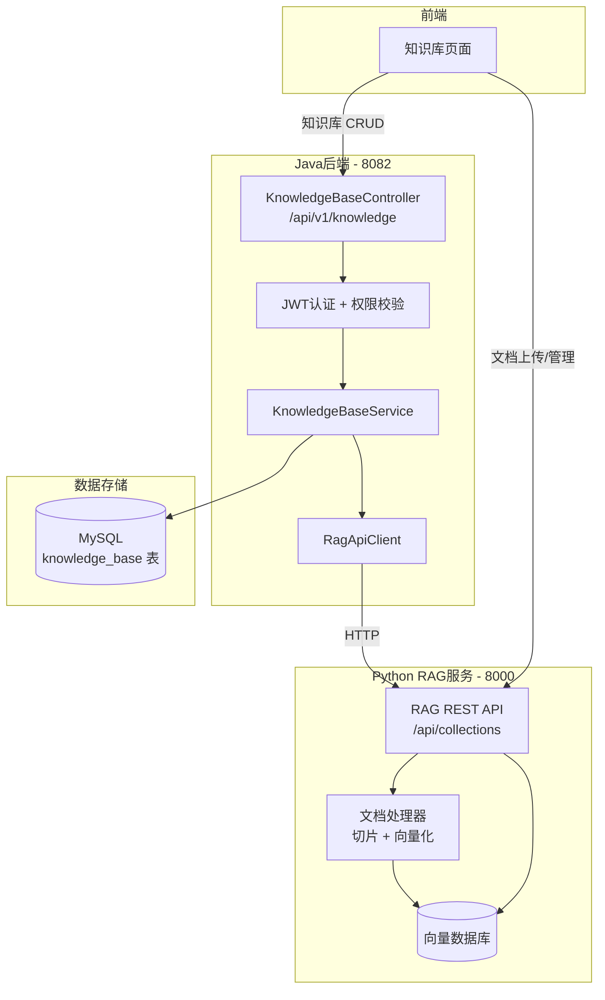
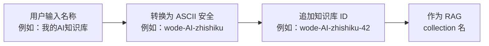

# 知识库（Knowledge Base）

知识库是 CodingHub 平台的文档管理与语义搜索模块，包含 **41 个组件**。该模块采用 Java + Python 双服务架构：Java 后端负责知识库元数据管理（CRUD、权限、生命周期），Python RAG 服务负责文档处理、向量化存储和语义搜索。

用户可以在平台上创建知识库，上传文档（PDF、Markdown 等），系统自动将文档切片、向量化并存入向量数据库。其他用户可以通过语义搜索在知识库中查找相关内容，搜索结果支持 rerank 排序和上下文扩展，为 AI 工具提供可靠的知识检索能力。

---

## 双服务架构



上图展示了知识库模块的双服务架构。前端根据操作类型分别与 Java 后端和 Python RAG 服务通信：

- **知识库 CRUD**（创建/更新/删除/列表/搜索）→ Java 后端（:8082）
- **文档管理**（上传/删除/状态查询）→ Python RAG 服务（:8000，前端直连或通过 Nginx 代理 `/rag`）

---

## 组件职责说明

### Controller

#### KnowledgeBaseController (`/api/v1/knowledge`)

| 方法 | 路径 | 说明 | 认证 |
|---|---|---|---|
| `GET` | `/api/v1/knowledge` | 知识库列表（分页，sortBy=hot\|latest，ownerId 过滤） | 否 |
| `GET` | `/api/v1/knowledge/{id}` | 知识库详情 | 否 |
| `POST` | `/api/v1/knowledge` | 创建知识库（自动生成 ASCII 安全的 ragCollection 名，初始化 RAG 配置） | 是 |
| `PUT` | `/api/v1/knowledge/{id}` | 更新知识库（同步描述到 RAG 服务） | 是（owner/admin） |
| `DELETE` | `/api/v1/knowledge/{id}` | 删除知识库（软删除 + 删除 RAG collection） | 是（owner/admin） |
| `POST` | `/api/v1/knowledge/{id}/search` | 语义搜索（代理到 RAG 服务，支持 topK / rerank / expandContext） | 否 |

### Service

#### KnowledgeBaseService

核心业务逻辑服务，职责包括：

- **知识库 CRUD**：创建时自动生成 `ragCollection` 名称，更新时同步描述到 RAG 服务，删除时同时清理 MySQL 记录和 RAG collection
- **名称唯一性校验**：通过 `existsByNameAndStatus` 确保活跃知识库名称不重复
- **权限检查**：`isOwner || isAdmin` 模式，与[工具广场](tool-plaza.md)的权限模型一致
- **RAG collection 生命周期管理**：创建时初始化 collection 配置（chunk_mode / chunk_size / chunk_overlap / rerank），删除时清理远端资源
- **语义搜索代理**：将前端搜索请求转发到 Python RAG 服务，返回结构化结果

### RagApiClient

HTTP 客户端，负责 Java 后端与 Python RAG 服务之间的通信：

| 方法 | 端点 | 说明 |
|---|---|---|
| `PUT` | `/api/collections/{name}/config` | 配置 collection（chunk_mode / chunk_size / chunk_overlap / rerank） |
| `GET` | `/api/collections/{name}/config` | 获取 collection 配置 |
| `DELETE` | `/api/collections/{name}` | 删除 collection |
| `POST` | `/api/collections/{name}/search` | 语义搜索 |
| `GET` | `/api/collections/{name}/documents/status` | 文档状态列表 |
| `GET` | `/api/collections/{name}/documents/{docId}/status` | 单文档状态 |

### Model

#### KnowledgeBase

| 字段 | 类型 | 说明 |
|---|---|---|
| `name` | String | 知识库名称（唯一性约束） |
| `description` | String | 知识库描述 |
| `ownerId` | Long | 创建者用户 ID |
| `ragCollection` | String | RAG collection 名称（ASCII 安全） |
| `status` | Enum | 状态（ACTIVE / DELETED） |

### DTOs

| DTO | 用途 |
|---|---|
| `KbCreateRequest` | 创建知识库请求（name + description） |
| `KbUpdateRequest` | 更新知识库请求 |
| `KbResponse` | 知识库信息响应 |
| `KbSearchRequest` | 语义搜索请求（query + topK + rerank + expandContext） |
| `KbSearchResultResponse` | 语义搜索结果响应 |
| `KbConfigRequest` | RAG 配置请求（chunk 参数） |

---

## ragCollection 名称生成规则

创建知识库时，系统需要将用户输入的名称（可能包含中文）转换为 ASCII 安全的 collection 名称：



生成步骤：

1. **中文转拼音/ASCII**：将非 ASCII 字符转换为对应的拼音或移除
2. **特殊字符清理**：仅保留字母、数字、连字符
3. **追加 ID 后缀**：使用数据库自增 ID 保证唯一性，避免名称冲突

---

## 关键特性

### 双服务通信模式

知识库模块的通信分为两条路径：

**路径 A — Java 后端代理**（知识库元数据 + 语义搜索）：
- 前端 → Java Backend (:8082) → Python RAG (:8000)
- 适用场景：知识库 CRUD、语义搜索
- 优势：统一的认证和权限校验

**路径 B — 前端直连 RAG 服务**（文档管理）：
- 前端 → Python RAG (:8000) 或 Nginx 代理 `/rag`
- 适用场景：文档上传、文档删除、文档状态查询
- 优势：大文件上传不经过 Java 层，减少中间环节开销

### 语义搜索参数

| 参数 | 类型 | 说明 |
|---|---|---|
| `query` | String | 搜索查询文本 |
| `topK` | Integer | 返回结果数量（默认值由 RAG 服务决定） |
| `rerank` | Boolean | 是否启用 rerank 重排序 |
| `expandContext` | Boolean | 是否扩展上下文（返回更多周边内容） |

### 配置信息

| 配置项 | 值 | 说明 |
|---|---|---|
| `ragBaseUrl` | `http://172.53.3.98:8000` | RAG 服务内部地址 |
| `publicUrl` | `/rag` | Nginx 代理路径（前端文档管理使用） |

### 软删除与级联清理

删除知识库时执行两步操作：
1. **MySQL 软删除**：将知识库 status 设为 DELETED
2. **RAG collection 清理**：调用 `DELETE /api/collections/{name}` 删除向量数据库中的 collection 及其所有文档和向量数据

---

## 与其他模块的关系

- **工具广场**：知识库与工具广场共享权限模型（isOwner / isAdmin）和软删除策略。工具广场的统一互动系统可为知识库提供评论和点赞支持。详见 [工具广场](tool-plaza.md)。
- **社区模块**：知识库可通过标签系统进行分类标记。详见 [社区与概览](community-social.md)。
- **MCP 集成**：RAG 知识库的能力同时作为 MCP 工具暴露，AI 助手可通过 MCP 协议直接搜索知识库内容。

---

## 错误处理

知识库模块在双服务通信中需要处理多种异常场景：

| 场景 | 处理方式 |
|---|---|
| 知识库名称重复 | 通过 `existsByNameAndStatus` 校验，返回 400 错误提示用户更换名称 |
| 无操作权限 | 非 owner 且非 admin 操作时返回 403 |
| RAG 服务不可用 | `RagApiClient` HTTP 请求超时或失败时，Java 后端返回 502 并记录错误日志 |
| RAG collection 删除失败 | 软删除 MySQL 记录后尝试清理 RAG 端资源，失败时记录警告日志但不阻塞主流程 |
| 语义搜索参数异常 | 前端传入的 topK / rerank 等参数由 Java 层校验后转发 |

---

## 部署与运维

### 服务依赖

知识库模块正常运行需要以下服务同时可用：

1. **MySQL 8.x** — 存储知识库元数据
2. **Python RAG 服务** — 文档处理与向量搜索（默认地址 `http://172.53.3.98:8000`）
3. **向量数据库** — 由 RAG 服务管理，Java 后端不直接访问

### Nginx 代理配置

前端文档管理操作通过 Nginx 代理直连 RAG 服务，避免大文件上传经过 Java 层：

```
location /rag/ {
    proxy_pass http://172.53.3.98:8000/;
}
```

### 健康检查

可通过以下方式验证知识库模块状态：
- Java 后端：`GET /api/v1/knowledge`（返回空列表即表示服务正常）
- RAG 服务：通过 `RagApiClient` 的 collection 配置接口验证连通性

---

## 数据库表

| 表名 | 说明 |
|---|---|
| `knowledge_base` | 知识库主表（name / description / ownerId / ragCollection / status） |
| `kb_document` | 知识库文档表（与 RAG 服务同步的文档元数据） |

> 文档的实际内容（文本、向量）存储在 Python RAG 服务的向量数据库中，Java 后端仅维护文档的元数据引用。数据库迁移由 Flyway 管理，知识库相关表结构在 V7~V9 版本中引入。
