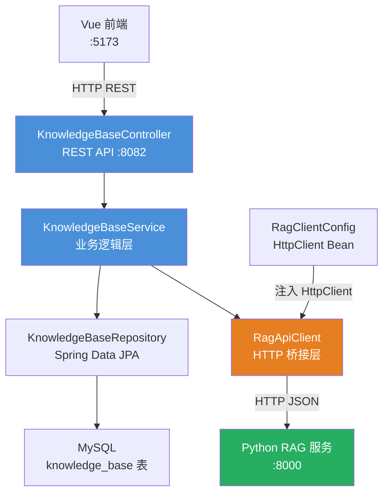
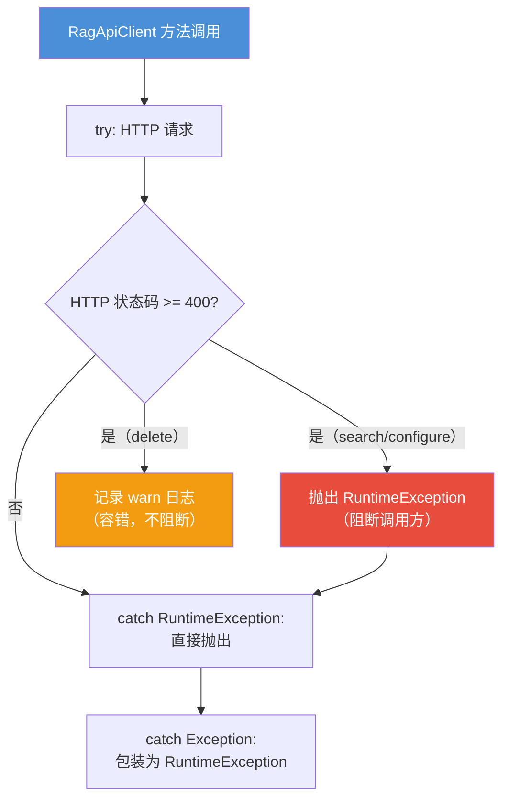

# 知识库模块 (knowledge-base)

> Java 后端知识库管理模块，作为前端与 Python RAG 服务之间的桥梁层，负责知识库的 CRUD 管理、权限控制、以及语义搜索代理转发。

## 目录

- [1. 模块概述](#1-模块概述)
- [2. 架构总览](#2-架构总览)
- [3. 组件职责](#3-组件职责)
- [4. 数据模型](#4-数据模型)
- [5. API 端点](#5-api-端点)
- [6. 桥接模式：RagApiClient](#6-桥接模式ragapiclient)
- [7. 数据流](#7-数据流)
- [8. 权限与安全](#8-权限与安全)
- [9. 配置说明](#9-配置说明)
- [10. 跨模块引用](#10-跨模块引用)

---

## 1. 模块概述

知识库模块是 CodingHub 平台的**文档管理与语义搜索**子系统。Java 后端承担**管理平面**的角色——维护知识库元数据（MySQL）、用户权限校验、以及请求路由；而实际的文档解析、向量化、语义检索等**数据平面**操作则委托给独立的 Python [rag-service](rag-service.md) 处理。

### 核心设计理念

- **前后端分离**：前端通过 REST API 操作知识库，无需感知后端 RAG 服务的存在
- **桥接模式**：`RagApiClient` 封装了 Java → Python 的 HTTP 通信，对上层屏蔽 RAG 服务细节
- **软删除**：知识库使用 `status = DELETED` 标记删除，不物理删除 MySQL 记录
- **容错设计**：RAG 服务的配置/删除操作失败时，Java 层记录警告但不阻断主流程

### 技术栈

| 组件 | 技术 |
|------|------|
| 框架 | Spring Boot 3.2.5 |
| ORM | Spring Data JPA (Hibernate) |
| HTTP 客户端 | Java 17 `HttpClient` |
| 数据库 | MySQL 8.x |
| 配置注入 | `@Value` + `RagClientConfig` |

---

## 2. 架构总览



### 分层关系

```
Controller (L4)  →  Service (L3)  →  Repository (L2)  →  Model (L1)
                        ↓
                   RagApiClient (L3, 跨域桥接)
                        ↓
                   Python RAG 服务 (外部)
```

本模块遵循项目的分层架构约束：Controller 只调用 Service，Service 依赖 Repository 和 [RagApiClient](../backend\src\main\java\com\iaihub\toolbox\service\RagApiClient.java)，Repository 只操作 Model。

---

## 3. 组件职责

### 3.1 [KnowledgeBaseController](../backend\src\main\java\com\iaihub\toolbox\controller\kb\KnowledgeBaseController.java)

**文件路径**：`backend/src/main/java/com/iaihub/toolbox/controller/kb/KnowledgeBaseController.java`

REST 控制器，挂载在 `/api/v1/knowledge` 前缀下，负责：

- 接收前端 HTTP 请求并做参数校验（`@Valid`）
- 委托 `KnowledgeBaseService` 处理业务逻辑
- 封装统一响应格式（`ApiResponse<T>`）
- 注入当前认证用户（`@AuthenticationPrincipal User`）

**不包含**任何业务逻辑、数据库访问或 RAG 调用。

### 3.2 [KnowledgeBaseService](../backend\src\main\java\com\iaihub\toolbox\service\kb\KnowledgeBaseService.java)

**文件路径**：`backend/src/main/java/com/iaihub/toolbox/service/kb/KnowledgeBaseService.java`

核心业务逻辑层，职责包括：

| 职责 | 说明 |
|------|------|
| CRUD 管理 | 知识库的创建、查询、更新、软删除 |
| 名称唯一性 | 创建和更新时校验 `name + NORMAL` 组合唯一 |
| 权限校验 | `isOwner \|\| isAdmin` 模式 |
| RAG 集合命名 | 生成 ASCII 安全的 `ragCollection` 名称（zvec 不支持非 ASCII） |
| 搜索代理 | 将前端搜索请求转发到 RAG 服务并格式化返回 |
| 响应组装 | 查询 owner 昵称、拼接 RAG 文档管理 URL |

#### ragCollection 命名规则

由于 RAG 服务底层使用 zvec 向量数据库（仅支持 ASCII 名称），创建知识库时会将中文名称转换为安全的 ASCII 标识：

```
原始名称: "前端技术指南"
     ↓ toLowerCase + 替换非 ASCII 为 "-"
安全名称: "kb"（纯中文降级为默认值）
     ↓ 追加 ID 确保唯一
最终名称: "kb-42"
```

转换规则：
1. 转为小写
2. 非 `[a-z0-9-]` 字符替换为 `-`
3. 合并连续 `-`，去除首尾 `-`
4. 空字符串降级为 `"kb"`
5. 追加 `-{id}` 确保全局唯一

### 3.3 [KnowledgeBaseRepository](../backend\src\main\java\com\iaihub\toolbox\repository\kb\KnowledgeBaseRepository.java)

**文件路径**：`backend/src/main/java/com/iaihub/toolbox/repository/kb/KnowledgeBaseRepository.java`

Spring Data JPA 接口，提供以下查询方法：

| 方法 | 说明 |
|------|------|
| `findByStatusOrderByCreatedAtDesc` | 按状态分页、时间倒序 |
| `findByStatusOrderByHot` | 按热度排序（当前实现等同时间倒序） |
| `findByOwnerIdAndStatusOrderByCreatedAtDesc` | 按 owner 筛选 |
| `findByIdAndStatus` | 按 ID + 状态精确查找 |
| `findByNameAndStatus` | 按名称 + 状态查找 |
| `existsByNameAndStatus` | 名称唯一性校验 |

所有查询都带上 `status = NORMAL` 条件，自动排除已软删除的记录。

### 3.4 [RagClientConfig](../backend\src\main\java\com\iaihub\toolbox\config\RagClientConfig.java)

**文件路径**：`backend/src/main/java/com/iaihub/toolbox/config/RagClientConfig.java`

Spring 配置类，注册 `HttpClient` Bean：

```java
@Bean
public HttpClient ragHttpClient() {
    return HttpClient.newBuilder()
            .connectTimeout(Duration.ofSeconds(10))
            .build();
}
```

- 使用 Java 17 内置 `HttpClient`，无第三方依赖
- 连接超时 10 秒，请求超时在各调用方法内单独设置

---

## 4. 数据模型

### 4.1 [KnowledgeBase](../backend\src\main\java\com\iaihub\toolbox\model\kb\KnowledgeBase.java) 实体

**文件路径**：`backend/src/main/java/com/iaihub/toolbox/model/kb/KnowledgeBase.java`

对应 MySQL `knowledge_base` 表，核心字段：

| 字段 | 类型 | 约束 | 说明 |
|------|------|------|------|
| `id` | `Long` | `@Id`, 自增 | 主键 |
| `name` | `String(100)` | `NOT NULL` | 知识库名称 |
| `description` | `String(500)` | 可选 | 知识库描述 |
| `ownerId` | `Long` | `NOT NULL` | 创建者用户 ID |
| `ragCollection` | `String(100)` | `NOT NULL` | RAG 服务中的集合标识 |
| `status` | `KbStatus` | `NOT NULL`, 默认 NORMAL | 状态枚举 |
| `createdAt` | `LocalDateTime` | `NOT NULL`, 不可更新 | 创建时间 |
| `updatedAt` | `LocalDateTime` | `NOT NULL` | 更新时间 |

#### 索引定义

```
idx_kb_owner_status    → (owner_id, status)         -- 按用户查询
idx_kb_status_created  → (status, created_at DESC)   -- 列表排序
idx_kb_name_status     → (name, status)              -- 唯一性校验
```

#### 生命周期钩子

- `@PrePersist`：自动设置 `createdAt`、`updatedAt`，默认 `status = NORMAL`
- `@PreUpdate`：自动更新 `updatedAt`

### 4.2 [KbStatus](../backend\src\main\java\com\iaihub\toolbox\model\kb\KbStatus.java) 枚举

**文件路径**：`backend/src/main/java/com/iaihub/toolbox/model/kb/KbStatus.java`

```java
public enum KbStatus {
    NORMAL,   // 正常状态
    DELETED   // 软删除
}
```

与项目中 [Tool](../backend\src\main\java\com\iaihub\toolbox\model\Tool.java)、[ForumPost](../backend\src\main\java\com\iaihub\toolbox\model\forum\ForumPost.java)、[Video](../backend\src\main\java\com\iaihub\toolbox\model\video\Video.java) 等实体的软删除模式一致。

---

## 5. API 端点

所有端点挂载在 `/api/v1/knowledge` 前缀下：

### 5.1 知识库 CRUD

| 方法 | 路径 | 说明 | 认证 |
|------|------|------|------|
| `GET` | `/` | 分页列表 | 否 |
| `GET` | `/{id}` | 获取详情 | 否 |
| `POST` | `/` | 创建知识库 | JWT |
| `PUT` | `/{id}` | 更新知识库 | JWT |
| `DELETE` | `/{id}` | 删除知识库（软删除） | JWT |

#### GET / — 分页列表

**查询参数**：

| 参数 | 类型 | 默认值 | 说明 |
|------|------|--------|------|
| `page` | int | 0 | 页码（从 0 开始） |
| `size` | int | 20 | 每页条数（上限 100） |
| `sortBy` | String | "latest" | 排序方式："latest" 或 "hot" |
| `ownerId` | Long | 无 | 按创建者筛选 |

**响应**：`ApiResponse<PageResponse<KbResponse>>`

#### POST / — 创建知识库

**请求体**（`KbCreateRequest`）：

```json
{
  "name": "前端技术指南",
  "description": "收录前端开发相关文档",
  "chunkMode": "structural",
  "chunkSize": 800,
  "chunkOverlap": 50,
  "rerank": true
}
```

**创建流程**：
1. 校验名称唯一性
2. 生成 ASCII 安全的 `ragCollection` 名称
3. 插入 MySQL 记录（两次 save：首次获取 ID，二次写入带 ID 的集合名）
4. 调用 RAG 服务初始化集合配置（失败不阻断）

#### PUT /{id} — 更新知识库

**权限**：`isOwner || isAdmin`

可更新字段：`name`（需重新校验唯一性）、`description`（同步到 RAG 配置）

#### DELETE /{id} — 删除知识库

**权限**：`isOwner || isAdmin`

执行软删除（`status → DELETED`），并尝试删除 RAG 服务中的对应集合（best-effort，失败不报错）。

### 5.2 语义搜索

| 方法 | 路径 | 说明 | 认证 |
|------|------|------|------|
| `POST` | `/{id}/search` | 语义搜索代理 | 否 |

**请求体**（`KbSearchRequest`）：

```json
{
  "query": "如何实现响应式布局",
  "topK": 5,
  "rerank": true,
  "expandContext": 1
}
```

**响应**（`List<KbSearchResultResponse>`）：

```json
[
  {
    "text": "响应式布局的核心是使用 CSS Grid 和 Flexbox...",
    "source": "css-guide.md",
    "score": 0.87,
    "chunkIndex": 12
  }
]
```

---

## 6. 桥接模式：[RagApiClient](../backend\src\main\java\com\iaihub\toolbox\service\RagApiClient.java)

**文件路径**：`backend/src/main/java/com/iaihub/toolbox/service/RagApiClient.java`

### 设计意图

`RagApiClient` 是 Java 后端与 Python RAG 服务之间的**桥接层**（Bridge Pattern）。它封装了所有跨语言 HTTP 通信细节，对上层 Service 暴露简洁的方法接口。

### 通信协议

- **传输层**：HTTP/1.1（Java 17 `HttpClient`）
- **数据格式**：JSON（Jackson `ObjectMapper` 序列化/反序列化）
- **URL 编码**：集合名称使用 `URLEncoder.encode(name, UTF-8)` 防止中文路径问题

### 封装的 RAG API 端点

| Java 方法 | HTTP 请求 | RAG 端点 | 超时 | 说明 |
|-----------|-----------|----------|------|------|
| `configureCollection` | `PUT` | `/api/collections/{name}/config` | 30s | 初始化/更新集合配置 |
| `getCollectionConfig` | `GET` | `/api/collections/{name}/config` | 10s | 获取当前配置 |
| `deleteCollection` | `DELETE` | `/api/collections/{name}` | 30s | 删除整个集合 |
| `search` | `POST` | `/api/collections/{name}/search` | 60s | 语义搜索 |
| `getDocumentStatus` | `GET` | `/api/collections/{name}/documents/status` | 10s | 查询所有文档状态 |
| `getDocumentStatusById` | `GET` | `/api/collections/{name}/documents/{id}/status` | 10s | 查询单个文档状态 |

### 错误处理策略



**关键设计**：
- `configureCollection`、`search` 等核心操作失败时抛出异常，阻断调用方
- `deleteCollection` 失败时仅记录警告，不阻断删除流程（因为 MySQL 软删除已完成）
- `KnowledgeBaseService.createKnowledgeBase` 中，RAG 配置失败也被容忍（`try-catch` 包裹）

### 响应映射

`search` 方法将 RAG 服务的 JSON 数组响应映射为 Java `List<Map<String, Object>>`：

| RAG 返回字段 | Java Map Key | 类型 |
|-------------|-------------|------|
| `text` | `text` | `String` |
| `source` | `source` | `String` |
| `score` | `score` | `Double` |
| `chunk_index` | `chunkIndex` | `Integer` |

---

## 7. 数据流

### 7.1 创建知识库

```
用户 POST /api/v1/knowledge
  │
  ├─ 1. Controller 接收请求，注入 @AuthenticationPrincipal
  │
  ├─ 2. Service 校验名称唯一性 (existsByNameAndStatus)
  │
  ├─ 3. Service 生成 ASCII 安全的 ragCollection 名称
  │
  ├─ 4. Repository.save(kb) — 第一次保存获取 ID
  │
  ├─ 5. kb.ragCollection += "-" + id — 追加 ID 确保唯一
  │
  ├─ 6. Repository.save(kb) — 第二次保存写入完整集合名
  │
  └─ 7. RagApiClient.configureCollection() — 通知 RAG 服务初始化配置
         （失败时记录警告，不阻断创建流程）
```

### 7.2 语义搜索

```
用户 POST /api/v1/knowledge/{id}/search
  │
  ├─ 1. Controller 接收请求，@Valid 校验参数
  │
  ├─ 2. Service.findActiveKb(id) — 查找 NORMAL 状态的知识库
  │
  ├─ 3. RagApiClient.search(collection, query, topK, rerank, expandContext)
  │     │
  │     └─ HTTP POST → RAG 服务 /api/collections/{name}/search
  │        │
  │        └─ RAG 服务执行：embed query → vector search → rerank → 返回结果
  │
  └─ 4. Service 将 RAG 结果映射为 KbSearchResultResponse 列表返回
```

### 7.3 删除知识库

```
用户 DELETE /api/v1/knowledge/{id}
  │
  ├─ 1. Service.findActiveKb(id)
  │
  ├─ 2. checkOwnerOrAdmin(kb, user) — 权限校验
  │
  ├─ 3. kb.status = DELETED → Repository.save — MySQL 软删除
  │
  └─ 4. RagApiClient.deleteCollection(collection)
         │
         └─ HTTP DELETE → RAG 服务 /api/collections/{name}
            （best-effort，失败仅记录 warn 日志）
```

---

## 8. 权限与安全

### 8.1 认证

- 列表和详情接口（`GET /`、`GET /{id}`、`POST /{id}/search`）不需要认证
- 创建、更新、删除接口（`POST`、`PUT`、`DELETE`）需要 JWT Bearer Token

### 8.2 授权

采用 `isOwner || isAdmin` 模式：

```java
private void checkOwnerOrAdmin(KnowledgeBase kb, User user) {
    boolean isOwner = kb.getOwnerId().equals(user.getId());
    boolean isAdmin = user.getRole() == Role.ADMIN
                   || user.getRole() == Role.SUPER_ADMIN;
    if (!isOwner && !isAdmin) {
        throw new ForbiddenException("无权操作此知识库");
    }
}
```

- **创建**：任何已认证用户
- **更新/删除**：知识库所有者 或 ADMIN/SUPER_ADMIN

### 8.3 XSS 防护

知识库名称和描述通过项目统一的 `XssSanitizer.sanitize()` 进行 XSS 过滤（在 DTO 层处理）。

### 8.4 异常处理

| 异常 | 触发条件 | HTTP 状态码 |
|------|---------|------------|
| `ResourceNotFoundException` | 知识库不存在或已删除 | 404 |
| `DuplicateResourceException` | 知识库名称重复 | 409 |
| `ForbiddenException` | 无权操作 | 403 |

---

## 9. 配置说明

### 9.1 应用配置

在 `application.yml`（或 `application.properties`）中需配置：

```yaml
app:
  rag:
    base-url: "http://localhost:8000"     # RAG 服务内部地址（Java → Python）
    public-url: "http://localhost:8000"   # RAG 服务公开地址（返回给前端）
```

| 配置项 | 说明 |
|--------|------|
| `app.rag.base-url` | `RagApiClient` 使用的后端 HTTP 地址，用于 Java → Python 通信 |
| `app.rag.public-url` | 返回给前端的 RAG 服务地址，用于拼接文档管理 URL |

### 9.2 [KbResponse](../backend\src\main\java\com\iaihub\toolbox\dto\kb\KbResponse.java) 中的 URL 构建

`KnowledgeBaseService.toKbResponse` 使用 `ragPublicUrl` 为前端构建直接访问 RAG 服务的 URL：

```java
KbResponse.builder()
    .ragBaseUrl(ragPublicUrl)
    .documentsUrl(ragPublicUrl + "/api/collections/" + kb.getRagCollection() + "/documents")
    .build();
```

前端可直接使用 `documentsUrl` 调用 RAG 服务的文档管理接口（上传、删除、查看状态），无需经过 Java 后端代理。

### 9.3 HttpClient 配置

由 [backend-infra](backend-infra.md) 中的 `RagClientConfig` 提供：

- 连接超时：10 秒
- 请求超时：在各 `RagApiClient` 方法内设置（10s ~ 60s）
- 无线程池：使用 `HttpClient` 默认配置

---

## 10. 跨模块引用

| 相关模块 | 关系 | 说明 |
|----------|------|------|
| [rag-service](rag-service.md) | 被调用 | Python RAG 服务提供实际的文档处理和语义搜索能力 |
| [mcp-service](mcp-service.md) | 并列 | MCP 服务也通过 `service.py` 调用 RAG 能力，与本模块共享同一后端 |
| [backend-infra](backend-infra.md) | 依赖 | 提供 JWT 认证、XSS 防护、统一异常处理等基础设施 |

### 前端直连 RAG 的设计

本模块的一个关键设计决策是**前端可直连 RAG 服务**进行文档操作：

```
前端 → Java 后端：知识库 CRUD、搜索
前端 → RAG 服务（直连）：文档上传/删除/状态查询
```

`KbResponse.documentsUrl` 字段告诉前端文档管理接口的完整 URL，前端直接使用此 URL 与 RAG 服务交互。这种设计：

- 减轻 Java 后端的代理负担（文档上传涉及大文件传输）
- 降低延迟（减少一跳）
- RAG 服务自带 CORS 中间件支持跨域访问

---

*本模块代码位于 `backend/src/main/java/com/iaihub/toolbox/` 下的 `controller/kb/`、`service/kb/`、`service/RagApiClient.java`、`model/kb/`、`repository/kb/`、`config/RagClientConfig.java`。*


<!-- crosslinks (auto-generated) -->
## Related Modules
- Depends on: [auth-user](auth-user.md), [backend-infra](backend-infra.md)
- Used by: [mcp-service](mcp-service.md)
