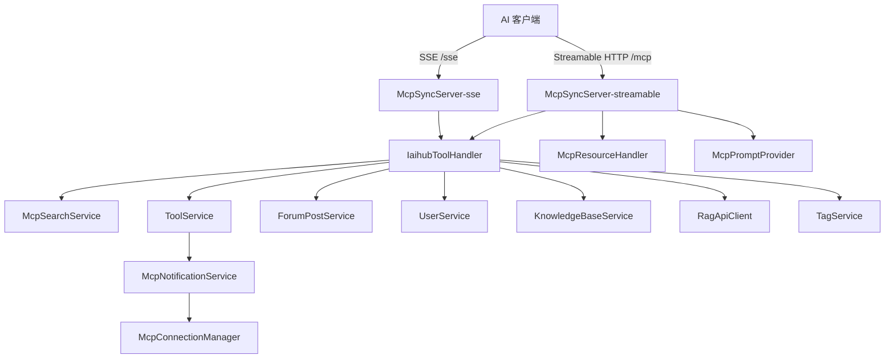

# MCP 服务模块（MCP Server）

## 模块简介

MCP 服务模块把 CodingHub 的内容能力以 **Model Context Protocol** 暴露给 AI 客户端（如 Claude Desktop、Cursor 等）。基于官方 Java MCP SDK 2.0.0，同时提供 **Streamable HTTP（`/mcp`）** 与 **SSE（`/sse` + `/sse/message`）** 两种传输，两个 `McpSyncServer` 实例注册**相同的能力**。

- 入口前缀：`/mcp`（HTTP）、`/sse`（SSE）、`/mcp/health`（健康检查）
- 能力规模：**18 个工具** + **3 个 Resource** + **6 个 Prompt**
- 核心组件：`McpSdkServerConfig`（L0 配置）、`IaihubToolHandler`（工具实现）、`McpResourceHandler`、`McpPromptProvider`、`McpConnectionManager`、`McpNotificationService`、`McpController`、`McpServerConfig`
- 认证：写操作（create/modify/delete）要求传入 `username` + `password`（MCP 客户端传其所在系统的登录账号，默认密码 `123456`）。

## 架构图

## 核心组件职责

### McpSdkServerConfig（`mcp/McpSdkServerConfig.java`）
Spring 配置，构建两套传输与两个 Server 实例（`@Primary` 为 streamable 实例）：
- `streamableTransportProvider` + `streamableServletBean` → `/mcp`、`/mcp/*`
- `sseTransportProvider` + `sseServletBean` → `/sse`、`/sse/message`
- `streamableMcpServer` / `sseMcpServer`：各自 `registerAllTools` / `registerAllResources` / `registerAllPrompts`，日志声明 “18 tools, 3 resources, 6 prompts”。

### IaihubToolHandler（`mcp/IaihubToolHandler.java`）
18 个工具的处理实现，按域分组：

**工具域（Tool）：**
- `h3_coding_hub_tool_search` — 搜索工具（关键词/分类/limit）
- `h3_coding_hub_tool_get` — 工具详情（含 markdown `content` 与标签）
- `h3_coding_hub_tool_files` — 工具文件列表
- `h3_coding_hub_tool_download` — 文件下载链接（返回相对路径，需拼接 `http://mcp_server_ip:8082`）
- `h3_coding_hub_tool_create` — 创建工具（认证；成功后返回 toolId 供上传文件）
- `h3_coding_hub_tool_modify` — 修改工具（认证；版本号末位自动 +1；仅更新传入字段）
- `h3_coding_hub_tool_file_upload` — 返回文件上传 REST 接口信息（`POST /api/v1/tools/{toolId}/files`，multipart，免认证，单文件 ≤50MB / 总 ≤200MB）
- `h3_coding_hub_tool_file_delete` — 删除工具文件（认证；仅限本人工具）

**论坛域（Post）：**
- `h3_coding_hub_post_search` — 搜帖
- `h3_coding_hub_post_get` — 帖子详情（markdown）
- `h3_coding_hub_post_create` — 发帖（认证）

**知识库域（KB）：**
- `h3_coding_hub_kb_list` / `kb_search` / `kb_create` / `kb_update` / `kb_delete`（create/update/delete 需认证）
- `h3_coding_hub_kb_upload_document` — 返回 RAG 服务批量上传端点（绝对 URL，支持 md/txt/pdf/docx/pptx/xlsx/py/js/ts/java/go，单次 ≤20 文件，异步处理）
- `h3_coding_hub_kb_document_status` — 文档处理状态（UPLOADING→CONVERTING→CHUNKING→EMBEDDING→READY/FAILED）

### 资源与提示
- `McpResourceHandler`：`codinghub://tools/catalog`（全量目录）、`codinghub://tools/recent`（最近更新）、`codinghub://tool/{id}`（单工具详情模板，3 个资源）。
- `McpPromptProvider`：6 个工作流 Prompt 模板（buildAll）。
- `McpConnectionManager`：基于 `SseEmitter` 维护 SSE 长连接，向订阅客户端推送工具变更通知。
- `McpNotificationService`：工具增删改时 `notifyToolCreated/Updated/Deleted` → `McpConnectionManager` 推送。
- `McpController`：`GET /mcp/health` 健康检查（`status=ok`）。
- `McpServerConfig`：早期 SSE transport 配置（兼容层）。

## 关键端点

| 传输 | 端点 | 说明 |
|------|------|------|
| Streamable HTTP | `POST/GET /mcp` | 主协议端点（2025-03-26） |
| SSE | `/sse` + `/sse/message` | 兼容旧客户端 |
| 健康检查 | `GET /mcp/health` | 状态探针 |

## 依赖关系（🔗 CodeGraph 增强）

- **上游调用**：AI 客户端（Claude/Cursor 等）经 MCP 协议调用；[工具广场模块](tool-plaza.md) 的 `ToolController` 在增删改时触发 `McpNotificationService` 推送变更。
- **下游依赖**：`IaihubToolHandler` → `McpSearchService` / `ToolService` / `ToolFileService` / `ForumPostService` / `UserService` / `KnowledgeBaseService` / `RagApiClient` / `TagService`。
- **变更影响**：修改 `McpSdkServerConfig` 注册的工具/资源/提示会直接影响所有 AI 客户端能力；修改写操作的认证默认密码（`123456`）属安全敏感项。

## 相关模块

- [工具广场模块](tool-plaza.md) — 工具域工具的数据源
- [论坛社区模块](forum.md) — 帖子域工具的数据源
- [知识库模块](knowledge-base.md) — KB 域工具的数据源
- [基础设施与异常模块](infra.md) — 传输与安全配置
