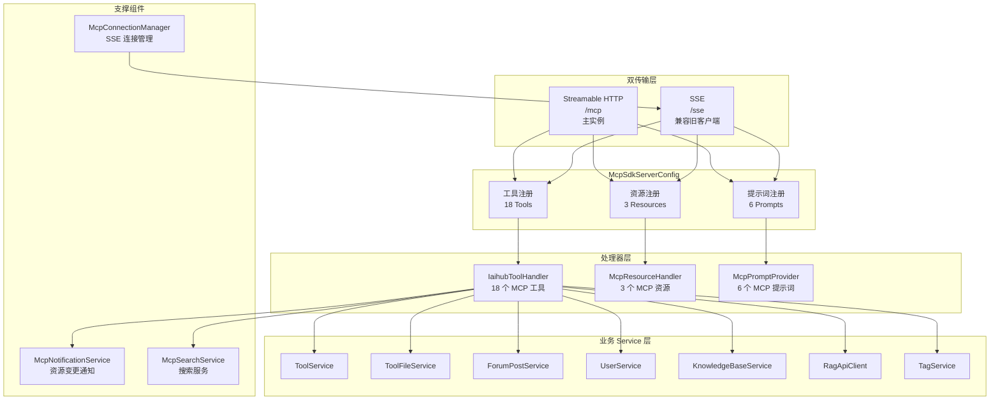
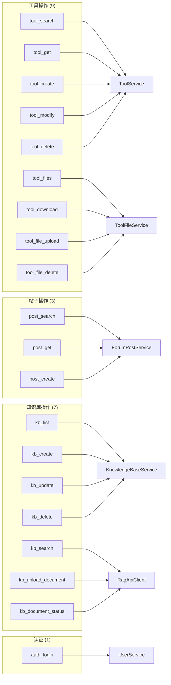

# MCP 服务

## 模块简介

MCP（Model Context Protocol）服务模块是 CodingHub 平台的 AI 能力网关，通过标准化的 MCP 协议将平台的工具管理、论坛发帖、知识库操作等功能暴露给 AI 助手。该模块实现了双传输层架构——Streamable HTTP（主实例）和 SSE（兼容旧客户端），使外部 AI 代理能够通过统一的协议接口与 CodingHub 进行交互。

模块包含 93 个组件，是项目中组件最多的模块之一。核心包括 MCP SDK 服务器配置、18 个工具处理器、3 个资源定义、6 个提示词模板，以及连接管理和通知服务。其中 `IaihubToolHandler` 是整个项目中影响范围最大的单一组件（影响 156 个符号），充当 MCP 协议与业务逻辑层之间的枢纽。

---

## 架构总览

---

## 组件职责说明

### McpSdkServerConfig（服务器配置）

MCP SDK 2.0.0 服务器配置类，负责创建和配置 MCP 服务器实例。

**双传输层配置：**

| 传输层 | 端点 | 说明 |
|--------|------|------|
| Streamable HTTP | `/mcp` | 主实例，支持 HTTP 流式传输 |
| SSE | `/sse` | 兼容旧客户端的 Server-Sent Events 传输 |

两个传输层注册完全相同的 18 个工具、3 个资源和 6 个提示词。

**Server Capabilities：**
- `tools` — listChanged = true
- `resources` — subscribe = true, listChanged = true
- `prompts` — listChanged = true
- `logging` — 日志能力

### IaihubToolHandler（工具处理器）

核心工具处理器，实现 18 个 MCP 工具，是 MCP 协议与业务逻辑的桥梁。

**工具操作（9 个）：**

| 工具名 | 功能 | 调用的 Service |
|--------|------|---------------|
| `tool_search` | 搜索工具（按名称/描述/分类） | ToolService, McpSearchService |
| `tool_get` | 获取工具详情 | ToolService |
| `tool_files` | 获取工具文件列表 | ToolFileService |
| `tool_download` | 下载工具文件 | ToolFileService |
| `tool_create` | 创建新工具 | ToolService |
| `tool_modify` | 修改已有工具 | ToolService |
| `tool_delete` | 删除工具（软删除） | ToolService |
| `tool_file_upload` | 上传工具文件 | ToolFileService |
| `tool_file_delete` | 删除工具文件 | ToolFileService |

**帖子操作（3 个）：**

| 工具名 | 功能 | 调用的 Service |
|--------|------|---------------|
| `post_search` | 搜索论坛帖子 | ForumPostService |
| `post_get` | 获取帖子详情 | ForumPostService |
| `post_create` | 创建新帖子 | ForumPostService |

**知识库操作（7 个）：**

| 工具名 | 功能 | 调用的 Service |
|--------|------|---------------|
| `kb_list` | 列出所有知识库 | KnowledgeBaseService |
| `kb_search` | 语义搜索知识库内容 | RagApiClient |
| `kb_create` | 创建知识库 | KnowledgeBaseService |
| `kb_update` | 更新知识库信息 | KnowledgeBaseService |
| `kb_delete` | 删除知识库 | KnowledgeBaseService |
| `kb_upload_document` | 上传文档到知识库 | RagApiClient |
| `kb_document_status` | 查询文档处理状态 | RagApiClient |

**认证工具（1 个）：**

| 工具名 | 功能 | 调用的 Service |
|--------|------|---------------|
| `auth_login` | 用户登录认证 | UserService |

### McpResourceHandler（资源处理器）

提供 3 个 MCP 资源，供 AI 客户端订阅和读取：

| 资源 URI | 说明 |
|----------|------|
| `codinghub://tools/catalog` | 工具全量目录——返回所有工具的精简列表 |
| `codinghub://tools/recent` | 最近更新工具——返回近期更新/新增的工具 |
| `codinghub://tool/{id}` | 单工具详情模板——按 ID 获取工具的完整信息 |

### McpPromptProvider（提示词模板）

提供 6 个预定义的提示词模板，帮助 AI 客户端更有效地与 CodingHub 交互：

| 提示词名 | 用途 |
|----------|------|
| `search-tools` | 搜索工具的提示词模板 |
| `install-tool` | 安装工具的引导提示词 |
| `check-versions` | 检查工具版本的提示词模板 |
| `publish-tool` | 发布新工具的引导提示词 |
| `update-tool` | 更新已有工具的引导提示词 |
| `forum-post` | 论坛发帖的引导提示词 |

### 支撑组件

| 组件 | 职责 |
|------|------|
| **McpConnectionManager** | 管理 SSE 连接的生命周期（建立、维护、断开） |
| **McpNotificationService** | 工具 CRUD 操作后发送 `resources/list_changed` 和 `resources/updated` 通知，确保客户端资源缓存同步 |
| **McpSearchService** | 为 MCP 工具搜索提供优化的查询逻辑 |

---

## MCP 工具→服务映射

---

## API 端点列表

### MCP 传输端点

| 方法 | 路径 | 说明 |
|------|------|------|
| POST | `/mcp` | Streamable HTTP 主传输端点 |
| GET | `/sse` | SSE 事件流端点（建立连接） |
| POST | `/sse` | SSE 消息发送端点 |

### MCP 协议交互

MCP 协议通过上述传输端点进行 JSON-RPC 2.0 通信，主要方法包括：

| 方法 | 说明 |
|------|------|
| `tools/list` | 列出所有可用工具及其参数描述 |
| `tools/call` | 调用指定工具，传入参数 |
| `resources/list` | 列出所有可用资源 |
| `resources/read` | 读取指定资源内容 |
| `resources/subscribe` | 订阅资源变更通知 |
| `prompts/list` | 列出所有提示词模板 |
| `prompts/get` | 获取指定提示词模板 |
| `notifications/resources/list_changed` | 服务器→客户端：资源列表已变更 |
| `notifications/resources/updated` | 服务器→客户端：特定资源已更新 |

---

## 依赖关系

### 上游依赖（谁依赖本模块）

| 依赖方 | 依赖方式 | 说明 |
|--------|----------|------|
| McpSdkServerConfig | 配置注册 | 服务器配置类注册 IaihubToolHandler 的所有工具 |
| REST API 层 | 共享 Service | [ToolController](auth-user.md) 和 [UserController](auth-user.md) 与 MCP 工具共享相同的 Service 层 |
| 外部 AI 客户端 | MCP 协议 | Claude、Cursor 等 AI 助手通过 MCP 协议调用工具 |

### 下游依赖（本模块依赖谁）

| 依赖项 | 类型 | 说明 |
|--------|------|------|
| [ToolService](auth-user.md) | Service | 工具 CRUD 业务逻辑 |
| ToolFileService | Service | 工具文件管理 |
| ForumPostService | Service | 论坛帖子业务逻辑 |
| [UserService](auth-user.md) | Service | 用户认证和信息查询 |
| KnowledgeBaseService | Service | 知识库管理 |
| RagApiClient | Service | RAG 语义搜索和文档处理（调用 Python 服务） |
| TagService | Service | 统一标签管理 |
| McpSearchService | Service | MCP 搜索优化 |
| McpNotificationService | Service | 资源变更通知 |

### 变更影响

> **IaihubToolHandler 是整个项目中影响范围最大的组件（影响 156 个符号）。**

作为 MCP 协议与业务逻辑的枢纽，IaihubToolHandler 的任何变更都会产生广泛影响：

- **工具签名变更**（参数增删、类型修改） — 所有使用该工具的 AI 客户端需适配
- **工具逻辑变更** — 影响通过 MCP 暴露的所有功能
- **新增/删除工具** — 需同步更新 McpSdkServerConfig 的注册配置
- **Service 调用变更** — 影响对应的业务功能
- **认证逻辑变更** — 影响所有 MCP 工具的安全性

McpSdkServerConfig 变更影响：

- **传输层配置变更** — 可能导致 AI 客户端连接失败
- **能力声明变更** — 影响客户端对服务器能力的感知

---

## 认证机制

MCP 工具操作采用独立的用户名/密码认证方式（非 JWT）：

1. AI 客户端在调用工具时传入 `username` 和 `password` 参数
2. `auth_login` 工具调用 [UserService](auth-user.md) 验证凭据
3. 默认密码为 `123456`
4. 认证成功后返回 Token，后续工具调用基于此 Token 执行

> **安全提示**：生产环境应修改默认密码，并考虑引入 API Key 或 OAuth2 等更安全的认证机制。

---

## 资源变更通知机制

McpNotificationService 在以下场景发送通知：

1. **工具创建/修改/删除后** — 发送 `resources/list_changed` 通知，告知客户端工具目录已变更
2. **特定工具更新后** — 发送 `resources/updated` 通知，附带变更的资源 URI

此机制确保订阅了资源变更的 AI 客户端能够及时更新本地缓存，保持数据一致性。

---

## 双传输层设计

双传输层共用完全相同的工具、资源和提示词注册，区别仅在于传输协议：

| 特性 | Streamable HTTP (`/mcp`) | SSE (`/sse`) |
|------|-------------------------|--------------|
| 协议 | HTTP 流式传输 | Server-Sent Events |
| 适用场景 | 新客户端，高性能场景 | 旧版 MCP 客户端兼容 |
| 连接方式 | 请求-响应（支持流式） | 长连接 + 事件推送 |
| 工具/资源/提示词 | 相同 | 相同 |

McpConnectionManager 专门管理 SSE 连接的建立、心跳维持和断开清理。

---

## 相关模块

- [认证与用户管理](auth-user.md) — UserService 提供 MCP auth_login 认证、用户信息查询
- [基础设施](infra.md) — SecurityConfig 放行 `/mcp/**` 端点（公开访问），异常处理类供工具处理器使用
