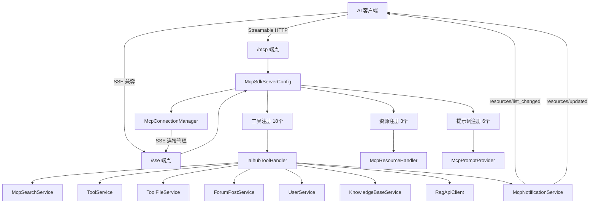

# MCP 服务

MCP（Model Context Protocol）服务模块是 CodingHub 平台的 AI 能力网关，基于 MCP SDK 2.0.0 构建，将平台的核心业务能力以标准化协议暴露给 AI 客户端（如 Claude Desktop、Cursor、QoderWork 等）。该模块支持 Streamable HTTP 和 SSE 双传输层，提供 18 个工具（Tools）、3 个资源（Resources）和 6 个提示词（Prompts），使 AI 助手能够直接操作 CodingHub 的工具广场、论坛和知识库。

MCP 服务独立于传统 REST API 运行，但复用相同的业务 Service 层，确保数据一致性。所有 MCP 工具操作均需要独立认证（通过 `auth_login` 工具传入用户名密码），不依赖 HTTP Session 或 JWT 令牌。

## MCP 服务架构



## 组件职责

### 核心配置

| 组件 | 职责说明 |
|------|----------|
| McpSdkServerConfig | MCP 服务器核心配置类，配置双传输层（Streamable HTTP `/mcp` + SSE `/sse`），注册 18 个工具、3 个资源和 6 个提示词到每个传输层。设置 Server Capabilities 声明 |

### 工具处理器

| 组件 | 职责说明 |
|------|----------|
| IaihubToolHandler | MCP 工具的统一入口，实现 `ToolSpecification` 和 `ToolCallHandler`，处理全部 18 个工具调用，将 MCP 请求参数映射到对应的 Service 方法 |

### 资源与提示词

| 组件 | 职责说明 |
|------|----------|
| McpResourceHandler | 提供 3 个 MCP Resource，暴露工具目录和详情数据供 AI 客户端主动拉取 |
| McpPromptProvider | 提供 6 个 MCP Prompt，预定义常用操作的提示词模板，降低 AI 客户端的使用门槛 |

### 连接与通知

| 组件 | 职责说明 |
|------|----------|
| McpConnectionManager | SSE 连接管理器，维护活跃 SSE 连接列表，处理连接建立和断开 |
| McpNotificationService | MCP 通知服务，在工具 CRUD 操作后向已连接客户端发送 `resources/list_changed` 和 `resources/updated` 通知 |

## MCP 工具清单

### 工具操作（8 个）

| 工具名 | 说明 | 认证要求 |
|--------|------|----------|
| `tool_search` | 搜索工具，支持关键词和分类过滤 | 否 |
| `tool_get` | 获取单个工具详情 | 否 |
| `tool_files` | 获取工具的附件文件列表 | 否 |
| `tool_download` | 下载工具附件 | 否 |
| `tool_create` | 创建新工具（名称、描述、分类等） | 是（username + password） |
| `tool_modify` | 修改已有工具信息 | 是（username + password） |
| `tool_delete` | 删除工具（软删除） | 是（username + password） |
| `tool_file_upload` | 上传工具附件文件 | 是（username + password） |

### 帖子操作（3 个）

| 工具名 | 说明 | 认证要求 |
|--------|------|----------|
| `post_search` | 搜索论坛帖子 | 否 |
| `post_get` | 获取帖子详情 | 否 |
| `post_create` | 创建论坛帖子 | 是（username + password） |

### 知识库操作（7 个）

| 工具名 | 说明 | 认证要求 |
|--------|------|----------|
| `kb_list` | 列出所有知识库 | 否 |
| `kb_search` | 在知识库中语义搜索（调用 RAG 服务） | 否 |
| `kb_create` | 创建新知识库 | 是（username + password） |
| `kb_update` | 更新知识库信息 | 是（username + password） |
| `kb_delete` | 删除知识库 | 是（username + password） |
| `kb_upload_document` | 上传文档到知识库 | 是（username + password） |
| `kb_document_status` | 查询文档处理状态 | 否 |

### 认证工具（1 个）

| 工具名 | 说明 | 认证要求 |
|--------|------|----------|
| `auth_login` | MCP 独立认证，传入 username 和 password 获取会话凭证 | 否（自身用于认证） |

## MCP Resources

| Resource URI | 说明 |
|-------------|------|
| `codinghub://tools/catalog` | 全量工具目录，返回所有工具的精简信息列表 |
| `codinghub://tools/recent` | 最近更新工具列表，返回近期新增或修改的工具 |
| `codinghub://tool/{id}` | 单工具详情模板，根据工具 ID 返回完整信息 |

## MCP Prompts

| Prompt 名称 | 说明 |
|-------------|------|
| `search-tools` | 搜索工具的提示词模板，引导 AI 按关键词或分类查找工具 |
| `install-tool` | 安装/下载工具的提示词模板 |
| `check-versions` | 检查工具版本的提示词模板 |
| `publish-tool` | 发布新工具的提示词模板，引导填写必要字段 |
| `update-tool` | 更新工具信息的提示词模板 |
| `forum-post` | 论坛发帖的提示词模板 |

## Server Capabilities

MCP 服务器声明以下能力，供 AI 客户端发现和利用：

| 能力 | 配置 | 说明 |
|------|------|------|
| tools | `listChanged=true` | 支持工具列表变更通知 |
| resources | `subscribe=true`, `listChanged=true` | 支持资源订阅和列表变更通知 |
| prompts | `listChanged=true` | 支持提示词列表变更通知 |
| logging | 启用 | 支持日志级别控制 |

## 关键特性

### 双传输层架构

MCP 服务同时支持两种传输协议，确保兼容性：

- **Streamable HTTP (`/mcp`)**：MCP 2.0 主传输方式，基于 HTTP POST + Server-Sent Events，适用于新客户端
- **SSE (`/sse`)**：兼容旧版 MCP 客户端（如早期 Claude Desktop），基于长连接 SSE 流

两个传输层注册完全相同的工具、资源和提示词，行为一致。

### MCP 独立认证机制

MCP 工具的认证独立于 REST API 的 JWT 机制：

1. AI 客户端首先调用 `auth_login` 工具，传入 `username` 和 `password`
2. 系统验证凭据后返回会话凭证
3. 后续写操作（create/modify/delete/upload）需携带有效凭证
4. 只读操作（search/get/list）无需认证
5. 默认管理员密码为 `123456`（由 `DataInitializer` 初始化）

### 资源变更通知

当通过 MCP 工具执行 CRUD 操作后，`McpNotificationService` 会自动向已连接的客户端发送通知：

- **工具创建/删除**：发送 `resources/list_changed` 通知，提示客户端刷新工具目录
- **工具修改**：发送 `resources/updated` 通知，携带具体资源 URI，提示客户端更新缓存

### 依赖的 Service 层

`IaihubToolHandler` 作为 MCP 工具的统一处理器，依赖以下业务 Service：

| Service | 用途 |
|---------|------|
| McpSearchService | 工具搜索和聚合查询 |
| ToolService | 工具 CRUD 业务逻辑 |
| ToolFileService | 工具附件文件管理 |
| ForumPostService | 论坛帖子操作 |
| UserService | 用户认证和查询 |
| KnowledgeBaseService | 知识库管理 |
| RagApiClient | RAG 知识库 Python 服务调用（语义搜索、文档处理） |

## 与其他模块的关系

- **基础设施**：MCP 服务依赖 [基础设施](infra.md) 中的 `McpServerConfig` 进行传输层配置，使用 `XssSanitizer` 对工具输入进行消毒
- **认证与用户管理**：MCP 的 `auth_login` 工具调用 [认证与用户管理](auth-user.md) 中的 `UserService` 进行用户认证，复用 BCrypt 密码验证逻辑
- **业务 Service 层**：MCP 工具处理器直接调用各业务 Service，与 REST Controller 共享相同的数据访问和业务逻辑层
- **RAG Python 服务**：知识库相关工具（`kb_search`、`kb_upload_document`、`kb_document_status`）通过 `RagApiClient` 调用 `rag/` 目录下的 Python MCP 服务

## 客户端接入指南

### Streamable HTTP 方式

```
POST /mcp
Content-Type: application/json

{
  "jsonrpc": "2.0",
  "method": "tools/list",
  "id": 1
}
```

### SSE 方式

```
GET /sse
Accept: text/event-stream

→ 建立 SSE 连接后，通过 event stream 接收响应
→ 通过 POST 请求发送工具调用
```

### 典型使用流程

1. 连接 MCP 端点（`/mcp` 或 `/sse`）
2. 调用 `auth_login` 获取认证凭证（如需写操作）
3. 使用 `tool_search` / `kb_search` 等只读工具探索平台内容
4. 使用 `tool_create` / `post_create` 等写操作工具进行内容管理
5. 通过 MCP Resources 主动拉取工具目录数据
