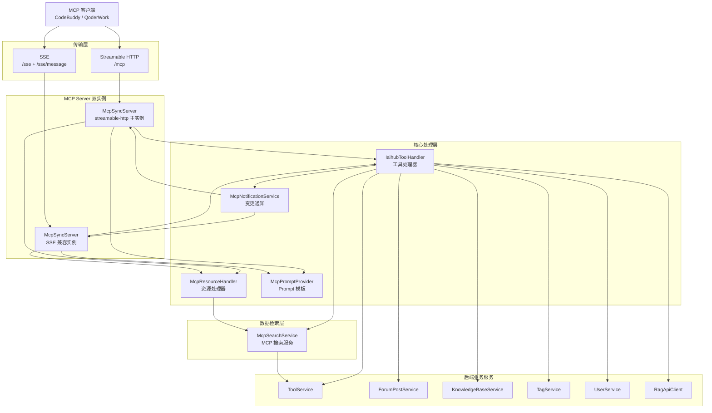
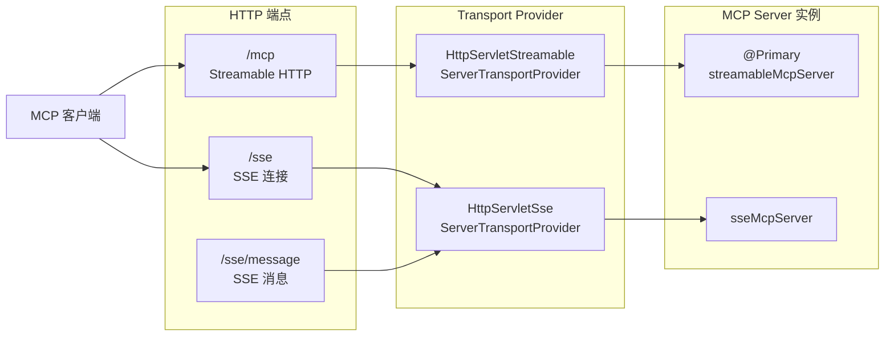
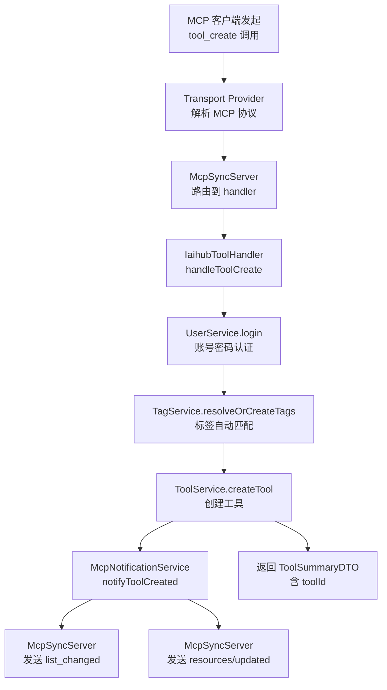
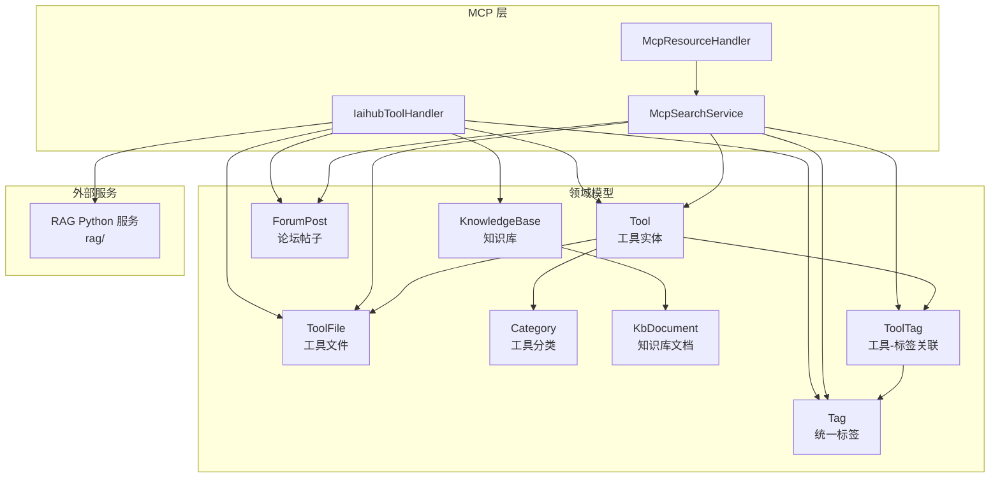

# MCP 服务模块 (mcp-service)

## 1. 模块概述

MCP 服务模块是 CodingHub 平台对外暴露 AI 能力的核心接口层，基于 [Model Context Protocol](https://modelcontextprotocol.io)（MCP）标准，将工具广场、社区论坛、知识库等平台资源封装为 **18 个标准化工具**、**3 个资源端点** 和 **6 个工作流 Prompt 模板**，供外部 MCP 客户端（如 CodeBuddy、QoderWork 等）直接调用。

模块同时支持两种传输协议：

- **Streamable HTTP**（`/mcp`）— MCP 协议 2025-03-26 版本，单一端点同时处理 POST 和 GET
- **SSE**（`/sse` + `/sse/message`）— 旧版传输协议，兼容不支持 Streamable HTTP 的客户端

两个 McpServer 实例各自注册相同的 18 个工具，客户端通过任一传输协议均可完成全部操作。

### 相关模块

| 关联模块 | 关系说明 |
|---------|---------|
| [backend-infra](backend-infra.md) | Spring Security 配置、JWT 认证、XSS 防护等基础设施 |
| [tool-plaza](tool-plaza.md) | 工具广场的 CRUD、文件管理、分类体系等核心业务 |
| [rag-service](rag-service.md) | RAG 知识库 Python 服务，提供文档向量化与语义搜索能力 |
| [unified-interactions](unified-interactions.md) | 点赞、评论、收藏等统一互动功能 |
| [auxiliary-services](auxiliary-services.md) | 留言反馈、通知、标签、概览统计等辅助服务 |

---

## 2. 架构设计

### 2.1 整体架构图



### 2.2 组件职责一览

| 组件 | 源文件 | 职责 |
|------|--------|------|
| `McpController` | `controller/McpController.java` | HTTP 健康检查端点（`/mcp/health`），实际协议由 SDK Transport 处理 |
| `McpServerConfig` | `config/McpServerConfig.java` | MCP Server 配置属性（端口、主机、最大连接数、超时） |
| `McpSdkServerConfig` | `mcp/McpSdkServerConfig.java` | 核心配置类 — 创建双传输实例，注册 18 个工具、3 个资源、6 个 Prompt |
| `IaihubToolHandler` | `mcp/IaihubToolHandler.java` | 工具调用处理器 — 接收 MCP 请求并分发到后端业务服务 |
| `McpResourceHandler` | `mcp/McpResourceHandler.java` | MCP 资源处理器 — 将工具广场数据暴露为标准 MCP Resource |
| `McpPromptProvider` | `mcp/McpPromptProvider.java` | Prompt 模板提供者 — 封装 6 个工作流提示词 |
| `McpNotificationService` | `mcp/McpNotificationService.java` | 资源变更通知 — 工具增删改时向客户端推送通知 |
| `McpConnectionManager` | `mcp/McpConnectionManager.java` | （已废弃）自定义 SSE 连接管理器，现由 SDK 内部处理 |
| `McpSearchService` | `service/McpSearchService.java` | 数据检索服务 — 封装工具和帖子的查询逻辑 |

---

## 3. MCP 工具清单（18 个）

所有工具名称以 `h3_coding_hub_` 为前缀，分为五大功能域：

### 3.1 工具域（[Tool](../backend\src\main\java\com\iaihub\toolbox\model\Tool.java)）— 6 个

| 工具名 | 说明 | 需要认证 |
|--------|------|---------|
| `h3_coding_hub_tool_search` | 搜索工具列表，支持关键词和分类过滤 | 否 |
| `h3_coding_hub_tool_get` | 获取工具详情，包含完整 markdown 文档和标签 | 否 |
| `h3_coding_hub_tool_files` | 获取工具关联的文件列表及下载路径 | 否 |
| `h3_coding_hub_tool_download` | 获取指定文件的下载链接（相对路径，需拼接 MCP 服务器地址） | 否 |
| `h3_coding_hub_tool_create` | 创建新工具，返回 toolId，支持标签自动匹配 | 是 |
| `h3_coding_hub_tool_modify` | 修改已有工具，仅更新传入字段，版本号可自动递增 | 是 |

### 3.2 文件域（File）— 2 个

| 工具名 | 说明 | 需要认证 |
|--------|------|---------|
| `h3_coding_hub_tool_file_upload` | 返回文件上传的 REST API 接口信息，客户端通过 HTTP Multipart POST 直接上传 | 否（已放通权限） |
| `h3_coding_hub_tool_file_delete` | 删除指定工具下的文件，同时移除物理文件和数据库记录 | 是 |

### 3.3 帖子域（Post）— 2 个

| 工具名 | 说明 | 需要认证 |
|--------|------|---------|
| `h3_coding_hub_post_search` | 搜索社区帖子，按标题关键词过滤 | 否 |
| `h3_coding_hub_post_get` | 获取帖子详情，包含完整 markdown 内容 | 否 |
| `h3_coding_hub_post_create` | 创建新帖子到指定论坛分类 | 是 |

### 3.4 知识库域（Knowledge Base）— 7 个

| 工具名 | 说明 | 需要认证 |
|--------|------|---------|
| `h3_coding_hub_kb_list` | 获取知识库列表，支持分页和热度排序 | 否 |
| `h3_coding_hub_kb_search` | 对指定知识库执行语义搜索，支持重排序和上下文扩展 | 否 |
| `h3_coding_hub_kb_create` | 创建新知识库，可配置分块模式和 RAG 参数 | 是 |
| `h3_coding_hub_kb_update` | 更新知识库的名称、描述和 RAG 配置参数 | 是 |
| `h3_coding_hub_kb_delete` | 删除知识库 | 是 |
| `h3_coding_hub_kb_upload_document` | 返回 RAG 服务批量文档上传端点 URL（绝对地址） | 否 |
| `h3_coding_hub_kb_document_status` | 查询知识库文档的处理状态（异步流水线进度） | 否 |

### 3.5 工具参数详解

#### 搜索类工具

**`h3_coding_hub_tool_search`** 参数：

| 参数 | 类型 | 必填 | 说明 |
|------|------|------|------|
| `query` | string | 否 | 搜索关键词 |
| `category` | string | 否 | 分类名称 |
| `limit` | integer | 否 | 返回数量限制，默认 20 |

**`h3_coding_hub_tool_get`** 参数：

| 参数 | 类型 | 必填 | 说明 |
|------|------|------|------|
| `toolId` | integer | 是 | 工具 ID |

**`h3_coding_hub_kb_search`** 参数：

| 参数 | 类型 | 必填 | 说明 |
|------|------|------|------|
| `kbId` | integer | 是 | 知识库 ID |
| `query` | string | 是 | 搜索关键词 |
| `topK` | integer | 否 | 返回结果数量，默认 5 |
| `rerank` | boolean | 否 | 是否启用重排序 |
| `expandContext` | integer | 否 | 上下文扩展块数，默认 0 |

#### 创建类工具

**`h3_coding_hub_tool_create`** 参数：

| 参数 | 类型 | 必填 | 说明 |
|------|------|------|------|
| `name` | string | 是 | 工具名称 |
| `categoryId` | integer | 是 | 分类 ID |
| `content` | string | 是 | 工具文档（markdown，1000 字符以内） |
| `version` | string | 是 | 版本号，如 `1.0.0` |
| `description` | string | 否 | 简短描述，最大 200 字符 |
| `tags` | string[] | 否 | 标签名列表，系统自动匹配或创建 |
| `username` | string | 是 | 登录账号 |
| `password` | string | 是 | 登录密码，默认 `123456` |

**`h3_coding_hub_kb_create`** 参数：

| 参数 | 类型 | 必填 | 说明 |
|------|------|------|------|
| `name` | string | 是 | 知识库名称 |
| `description` | string | 否 | 知识库描述 |
| `chunkMode` | string | 否 | 分块模式，默认 `structural` |
| `chunkSize` | integer | 否 | 分块大小，默认 800 |
| `chunkOverlap` | integer | 否 | 分块重叠，默认 50 |
| `rerank` | boolean | 否 | 是否启用重排序，默认 true |
| `username` | string | 是 | 登录账号 |
| `password` | string | 是 | 登录密码 |

### 3.6 认证机制

需要认证的工具（创建、修改、删除操作）要求 MCP 客户端在工具参数中传入 `username` 和 `password`。处理器内部通过调用 `UserService.login()` 完成认证，获取 `userId` 后执行业务操作。

```
MCP 客户端 → h3_coding_hub_tool_create(username, password, ...)
                ↓
         IaihubToolHandler.handleToolCreate()
                ↓
         UserService.login(username, password) → LoginResponse → userId
                ↓
         ToolService.createTool(request, userId)
                ↓
         McpNotificationService.notifyToolCreated(toolId, name)
```

### 3.7 版本号自动递增

当调用 `h3_coding_hub_tool_modify` 未传入 `version` 参数时，系统自动在当前版本号最后一位 +1：

- `1.0.0` → `1.0.1`
- `1.0.0-beta` → `1.0.1-beta`
- `1.0.alpha` → `1.0.alpha.1`

---

## 4. MCP 资源（3 个）

MCP Resource 将工具广场数据暴露为标准资源 URI，客户端可主动拉取或监听变更通知：

| 资源 URI | 类型 | 说明 |
|----------|------|------|
| `codinghub://tools/catalog` | 静态资源 | 工具广场全量目录（最多 200 条工具摘要） |
| `codinghub://tools/recent` | 静态资源 | 最近更新的工具（前 20 条） |
| `codinghub://tool/{id}` | Resource Template | 单个工具详情，URI 中 `{id}` 为工具 ID |

### 资源变更通知

当工具发生新增、更新、删除操作时，`McpNotificationService` 会向所有 McpServer 实例发送以下通知：

1. **`notifications/resources/list_changed`** — 通知客户端工具列表整体有变化
2. **`notifications/resources/updated`** — 通知指定 URI 的资源内容已更新

```
工具新增:
  → list_changed（全量列表变化）
  → updated: codinghub://tools/catalog（目录更新）
  → updated: codinghub://tool/{id}（新工具详情）

工具更新:
  → list_changed
  → updated: codinghub://tools/catalog
  → updated: codinghub://tool/{id}

工具删除:
  → list_changed
  → updated: codinghub://tools/catalog
```

> **循环依赖处理**：`McpNotificationService` 使用 `@Lazy` 注解注入 `List<McpSyncServer>`，以打破 `streamableMcpServer → IaihubToolHandler → McpNotificationService → List<McpSyncServer>` 的循环依赖链。

---

## 5. MCP Prompt 模板（6 个）

Prompt 模板将 CodingHub 的典型工作流封装为标准 MCP Prompt，用户无需安装 CodingHub Skill 即可通过 MCP 客户端直接使用：

| Prompt 名称 | 标题 | 参数 | 说明 |
|-------------|------|------|------|
| `search-tools` | 搜索工具 | `query`（可选） | 在工具广场搜索可用工具 |
| `install-tool` | 安装工具 | `toolName`（必填） | 从工具广场获取 Skill 并安装到本地项目 |
| `check-versions` | 版本检查 | 无 | 检查本地已安装工具是否有版本更新 |
| `publish-tool` | 发布工具 | `skillName`（必填） | 将本地 Skill 发布到工具广场 |
| `update-tool` | 更新工具 | `skillName`（必填）, `version`（可选） | 更新已发布工具的新版本 |
| `forum-post` | 论坛发帖 | `filePath`（可选）, `title`（可选） | 将 Markdown 内容发布到论坛 |

每个 Prompt 被调用时会生成一段结构化的用户指令（`USER` 角色消息），指导 AI 按步骤完成工作流。例如 `install-tool` 会指导 AI 依次调用 `tool_search` → `tool_get` → `tool_files` → `tool_download` 完成安装。

---

## 6. 传输协议与连接管理

### 6.1 双传输架构



**Streamable HTTP 传输**（主实例）：
- 端点：`/mcp`
- 使用 `HttpServletStreamableServerTransportProvider`
- MCP 协议 2025-03-26 标准
- 通过 `ServletRegistrationBean` 注册到 `/mcp` 和 `/mcp/*`

**SSE 传输**（兼容实例）：
- SSE 端点：`/sse`
- 消息端点：`/sse/message`
- 使用 `HttpServletSseServerTransportProvider`
- 兼容不支持 Streamable HTTP 的旧客户端
- 通过 `ServletRegistrationBean` 注册到 `/sse` 和 `/sse/message`

### 6.2 [McpConnectionManager](../backend\src\main\java\com\iaihub\toolbox\mcp\McpConnectionManager.java)（已废弃）

`McpConnectionManager` 是早期自定义的 SSE 连接管理器，现已标记为 `@Deprecated`。其功能包括：

- 注册/注销 SSE 连接（`SseEmitter`）
- 广播事件到所有连接
- 连接超时管理（30 分钟）
- 心跳检测

当前连接管理完全由 MCP SDK 的 `HttpServletSseServerTransportProvider` 内部处理，`McpConnectionManager` 保留仅为向后兼容。

### 6.3 服务器配置

通过 `McpServerConfig`（`@ConfigurationProperties(prefix = "mcp.server")`）管理以下配置：

| 属性 | 默认值 | 说明 |
|------|--------|------|
| `mcp.server.port` | `8082` | 服务端口 |
| `mcp.server.host` | `0.0.0.0` | 绑定地址 |
| `mcp.server.enabled` | `true` | 是否启用 |
| `mcp.server.maxConnections` | `10` | 最大连接数 |
| `mcp.server.connectionTimeoutMs` | `30000` | 连接超时（毫秒） |

---

## 7. 数据检索层

### 7.1 [McpSearchService](../backend\src\main\java\com\iaihub\toolbox\service\McpSearchService.java)

`McpSearchService` 封装了 MCP 工具所需的所有数据检索操作，作为 `IaihubToolHandler` 和 `McpResourceHandler` 的公共数据源：

| 方法 | 说明 |
|------|------|
| `searchTools(query, category, limit)` | 搜索已审批的工具，批量解析标签避免 N+1 查询 |
| `getToolById(toolId)` | 获取单个工具详情（含分类关联） |
| `getToolFiles(toolId)` | 获取工具关联的文件列表（正常状态） |
| `getToolFile(toolId, fileId)` | 获取单个文件详情 |
| `getToolTags(toolId)` | 获取工具的标签列表 |
| `searchPosts(query, limit)` | 搜索公开帖子（按标题过滤，仅正常状态） |
| `getPostById(postId)` | 获取单个帖子详情 |

### 7.2 标签批量解析优化

`searchTools` 方法内部实现了标签批量解析机制，避免逐个工具查询标签导致的 N+1 查询问题：

```
1. 获取所有工具 ID 列表
2. 批量查询所有 ToolTag 关联记录
3. 收集所有不重复的 Tag ID
4. 一次性批量查询所有 Tag 实体
5. 将 Tag 映射回各工具
```

---

## 8. 工具处理流程

### 8.1 工具注册流程

`McpSdkServerConfig` 在 Spring 启动时完成以下初始化：

```
1. 创建 McpJsonMapper（基于 Jackson）
2. 创建 Streamable HTTP Transport Provider
3. 创建 SSE Transport Provider
4. 分别为两个 Provider 创建 McpSyncServer 实例
5. 在每个 Server 实例上注册：
   a. 18 个工具（registerAllTools）
   b. 3 个资源（registerAllResources）
   c. 6 个 Prompt（registerAllPrompts）
6. 注册 ServletRegistrationBean 映射 URL 路径
```

### 8.2 工具调用流程

以 `h3_coding_hub_tool_create` 为例的完整调用链：



### 8.3 文件上传流程

MCP 协议不直接支持二进制文件传输，文件上传通过 REST API 桥接：

```
1. 客户端调用 h3_coding_hub_tool_create → 获取 toolId
2. 客户端调用 h3_coding_hub_tool_file_upload(toolId) → 获取 REST 上传端点
3. 客户端通过 HTTP Multipart POST 上传文件到 /api/v1/tools/{toolId}/files
   - 表单字段：files（必填，多文件）、readme（可选，markdown）
   - 限制：单文件 50MB，总大小 200MB
4. 上传完成后，可通过 h3_coding_hub_tool_files 验证文件列表
```

### 8.4 知识库文档上传流程

知识库文档上传通过 RAG Python 服务完成：

```
1. 客户端调用 h3_coding_hub_kb_create → 获取 kbId 和 ragCollection
2. 客户端调用 h3_coding_hub_kb_upload_document(kbId) → 获取 RAG 服务批量上传 URL
   - URL 从配置 app.rag.base-url 实时构造
   - 格式：{ragBaseUrl}/api/collections/{collection}/documents/batch
3. 客户端通过 HTTP Multipart POST 上传文件到 RAG 服务（无需认证）
   - 单次最多 20 个文件
   - 支持：md, txt, pdf, docx, pptx, xlsx, py, js, ts, java, go
4. 上传后异步处理，客户端调用 h3_coding_hub_kb_document_status 查询进度
```

文档处理状态流水线：

```
UPLOADING → CONVERTING → CHUNKING → EMBEDDING → READY
                                              ↘ FAILED
```

---

## 9. API 端点汇总

| HTTP 方法 | 路径 | 说明 | 认证 |
|-----------|------|------|------|
| `GET` | `/mcp/health` | MCP 服务健康检查 | 否 |
| `POST` | `/mcp` | Streamable HTTP MCP 协议交互 | MCP 协议 |
| `GET` | `/sse` | SSE 长连接建立 | MCP 协议 |
| `POST` | `/sse/message` | SSE 消息发送 | MCP 协议 |

---

## 10. 数据模型关系



---

## 11. 关键设计决策

### 11.1 双 Server 实例策略

系统创建两个独立的 `McpSyncServer` 实例（Streamable HTTP 和 SSE），各自注册相同的工具、资源和 Prompt。这确保：

- 新客户端可使用更高效的 Streamable HTTP 协议
- 旧客户端仍可通过 SSE 协议正常工作
- 两个传输层完全独立，互不干扰

### 11.2 MCP 与 REST 的边界

MCP 协议负责：
- 工具/帖子/知识库的查询和元数据操作
- 工作流编排（Prompt 模板）
- 资源订阅与变更通知

REST API 负责：
- 二进制文件上传/下载
- 前端页面交互
- 用户认证（JWT）

### 11.3 标签自动创建

MCP 工具创建时支持传入标签名列表（`tags`），系统通过 `TagService.resolveOrCreateTags()` 自动完成：

1. 按名称查找已有标签
2. 不存在的标签自动创建
3. 处理并发场景：捕获唯一约束冲突后回退查询
4. 返回标签 ID 列表用于关联

---

## 12. 错误处理

所有工具调用统一使用以下错误处理模式：

- **成功**：返回 `CallToolResult`，`isError=false`，内容为 JSON 格式的业务数据
- **失败**：返回 `CallToolResult`，`isError=true`，内容为 `{"error": "错误描述"}`

工具处理器内部通过 try-catch 捕获所有异常，避免未处理异常导致 MCP 连接中断。

---

## 13. 依赖关系

### 13.1 内部依赖

| 组件 | 依赖的服务 |
|------|-----------|
| `IaihubToolHandler` | [McpSearchService](../backend\src\main\java\com\iaihub\toolbox\service\McpSearchService.java), [ToolService](../backend\src\main\java\com\iaihub\toolbox\service\ToolService.java), [ToolFileService](../backend\src\main\java\com\iaihub\toolbox\service\ToolFileService.java), [ForumPostService](../backend\src\main\java\com\iaihub\toolbox\service\forum\ForumPostService.java), [UserService](../backend\src\main\java\com\iaihub\toolbox\service\UserService.java), [KnowledgeBaseService](../backend\src\main\java\com\iaihub\toolbox\service\kb\KnowledgeBaseService.java), [RagApiClient](../backend\src\main\java\com\iaihub\toolbox\service\RagApiClient.java), [TagService](../backend\src\main\java\com\iaihub\toolbox\service\tag\TagService.java), [McpNotificationService](../backend\src\main\java\com\iaihub\toolbox\mcp\McpNotificationService.java) |
| `McpResourceHandler` | [McpSearchService](../backend\src\main\java\com\iaihub\toolbox\service\McpSearchService.java) |
| `McpNotificationService` | List&lt;McpSyncServer&gt;（@Lazy） |
| `McpSearchService` | [ToolRepository](../backend\src\main\java\com\iaihub\toolbox\repository\ToolRepository.java), [ToolFileRepository](../backend\src\main\java\com\iaihub\toolbox\repository\ToolFileRepository.java), [ForumPostRepository](../backend\src\main\java\com\iaihub\toolbox\repository\forum\ForumPostRepository.java), [UserRepository](../backend\src\main\java\com\iaihub\toolbox\repository\UserRepository.java), [ToolTagRepository](../backend\src\main\java\com\iaihub\toolbox\repository\tag\ToolTagRepository.java), [TagRepository](../backend\src\main\java\com\iaihub\toolbox\repository\tag\TagRepository.java) |

### 13.2 外部依赖

| 库 | 版本 | 用途 |
|----|------|------|
| `io.modelcontextprotocol:mcp` | 2.0.0 | MCP SDK — 协议实现与传输层 |
| `io.modelcontextprotocol:mcp-jackson` | 2.0.0 | MCP JSON 序列化（Jackson 适配器） |
| Spring Boot | 3.2.5 | Web 框架与 Servlet 容器 |

---

## 14. 运维与监控

### 14.1 健康检查

```bash
curl http://localhost:8082/mcp/health
```

返回示例：
```json
{
  "status": "ok",
  "version": "1.0.0",
  "mcpServer": "H3CodingHub-MCP-Server",
  "timestamp": "2025-01-15T10:30:00Z"
}
```

### 14.2 日志关键标记

| 日志前缀 | 含义 |
|----------|------|
| `MCP Server (...) initialized` | Server 实例初始化完成 |
| `MCP tool search:` | 工具搜索调用 |
| `MCP get tool:` | 工具详情查询 |
| `MCP create tool:` | 工具创建操作 |
| `MCP notify:` | 资源变更通知发送 |
| `Registered N MCP resources` | 资源注册完成 |


<!-- crosslinks (auto-generated) -->
## Related Modules
- Depends on: [auth-user](auth-user.md), [auxiliary-services](auxiliary-services.md), [forum](forum.md), [knowledge-base](knowledge-base.md), [tool-plaza](tool-plaza.md)
- Used by: [tool-plaza](tool-plaza.md)
