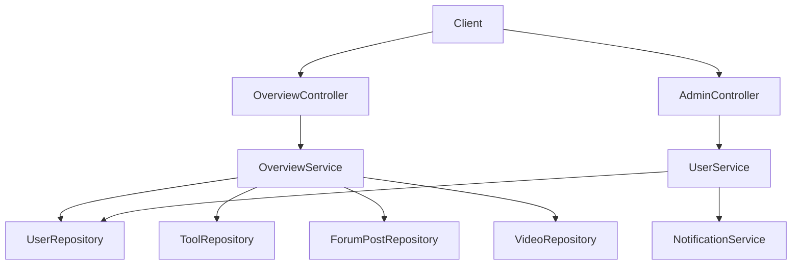

# 概览与管理模块（Overview & Admin）

## 模块简介

概览与管理模块提供 **全站数据统计、内容排行** 与 **用户审批/管理后台** 两类能力。概览数据驱动首页展示，管理后台由管理员操作，依赖 [认证与用户模块](auth-user.md) 的 `UserService` 完成审批与状态变更。

- 入口前缀：`/api/overview`、`/api/v1/admin`
- 核心分层：`OverviewController` / `AdminController`（L4）→ `OverviewService` / `OverviewServiceImpl`（L3）→ `UserRepository` / `ToolRepository` / `ForumPostRepository` / `VideoRepository`（L2）
- 数据契约：`StatsDto` / `ToolRankDto` / `PostRankDto` / `VideoRankDto`

## 架构图

## 核心组件职责

### OverviewController（`controller/OverviewController.java`）
- `GET /api/overview/stats` — 全站统计（`StatsDto`：userCount / postCount / toolCount / videoCount）。
- `GET /api/overview/tool-ranks` — 工具 Top10（按 `score` 降序）。
- `GET /api/overview/post-ranks` — 帖子 Top10（按 `score` 降序）。
- `GET /api/overview/video-ranks` — 视频 Top10（按 `viewCount` 降序，仅 `NORMAL`）。

### OverviewServiceImpl（`service/OverviewServiceImpl.java`）
- `getStats`：四表 `count()` 汇总。
- 排行：工具/帖子通过 `findAll()` 在内存中按 `score` 排序取前 10（注意：全表加载，数据量大时可优化为数据库排序）；视频改用 `findTop20ByStatusOrderByViewCountDesc` 后取前 10。
- 实现 `OverviewService` 接口。

### AdminController（`controller/AdminController.java`）
全部委托 `UserService`（管理后台，需 ADMIN/SUPER_ADMIN 角色由 Spring Security 保护）：
- `GET /api/v1/admin/pending-users` — 待审批 ADMIN 列表。
- `POST /api/v1/admin/approve/{id}` / `reject/{id}` — 审批通过/拒绝（通过后应触发 [统一互动服务模块](unified-services.md) 的 `createAdminNotification` 通知用户）。
- `GET /api/v1/admin/users` — 用户分页列表（按 `role` / `status` / `keyword` 过滤）。
- `PUT /api/v1/admin/users/{id}/status` — 更新账号状态（`DISABLED` 封禁 / 其他解禁）。
- `DELETE /api/v1/admin/users/{id}` — 删除用户（禁止操作 `SUPER_ADMIN`）。

## 关键 API

| 方法 | 路径 | 说明 | 鉴权 |
|------|------|------|------|
| GET | `/api/overview/stats` | 全站统计 | 否 |
| GET | `/api/overview/tool-ranks` | 工具排行 | 否 |
| GET | `/api/overview/video-ranks` | 视频排行 | 否 |
| GET | `/api/v1/admin/pending-users` | 待审批列表 | 管理员 |
| POST | `/api/v1/admin/approve/{id}` | 审批通过 | 管理员 |
| GET | `/api/v1/admin/users` | 用户管理 | 管理员 |
| PUT | `/api/v1/admin/users/{id}/status` | 封禁/解禁 | 管理员 |
| DELETE | `/api/v1/admin/users/{id}` | 删除用户 | 管理员 |

## 依赖关系（🔗 CodeGraph 增强）

- **上游调用**：[前端应用](frontend-app.md) 首页（`HomePage`/`QuickStartPage`）调用 `/api/overview/*`；管理后台页（`pages/admin`）调用 `/api/v1/admin/*`。
- **下游依赖**：`OverviewServiceImpl` → 四个 Repository；`AdminController` → `UserService`（审批/状态/删除）→ `UserRepository` + `NotificationService`。
- **变更影响**：`score` 公式调整会影响 `tool-ranks`/`post-ranks`；`StatsDto` 字段变更影响首页统计卡片。

## 相关模块

- [认证与用户模块](auth-user.md) — 审批与状态变更实现
- [统一互动服务模块](unified-services.md) — 审批结果通知
- [工具广场模块](tool-plaza.md) / [论坛社区模块](forum.md) / [微课视频模块](video.md) — 排行数据源
