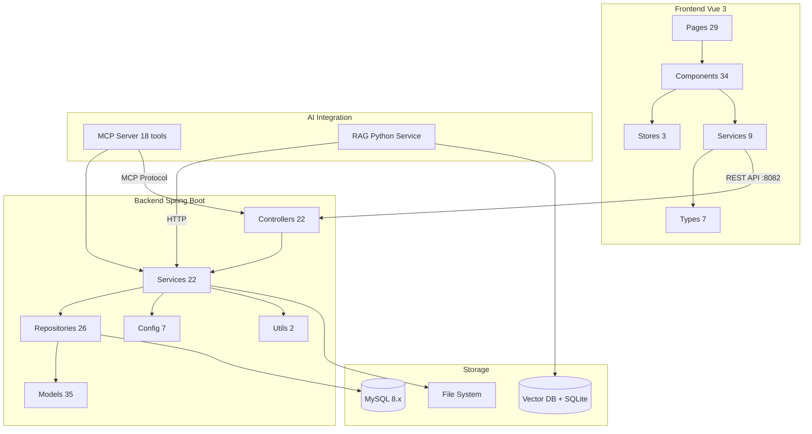
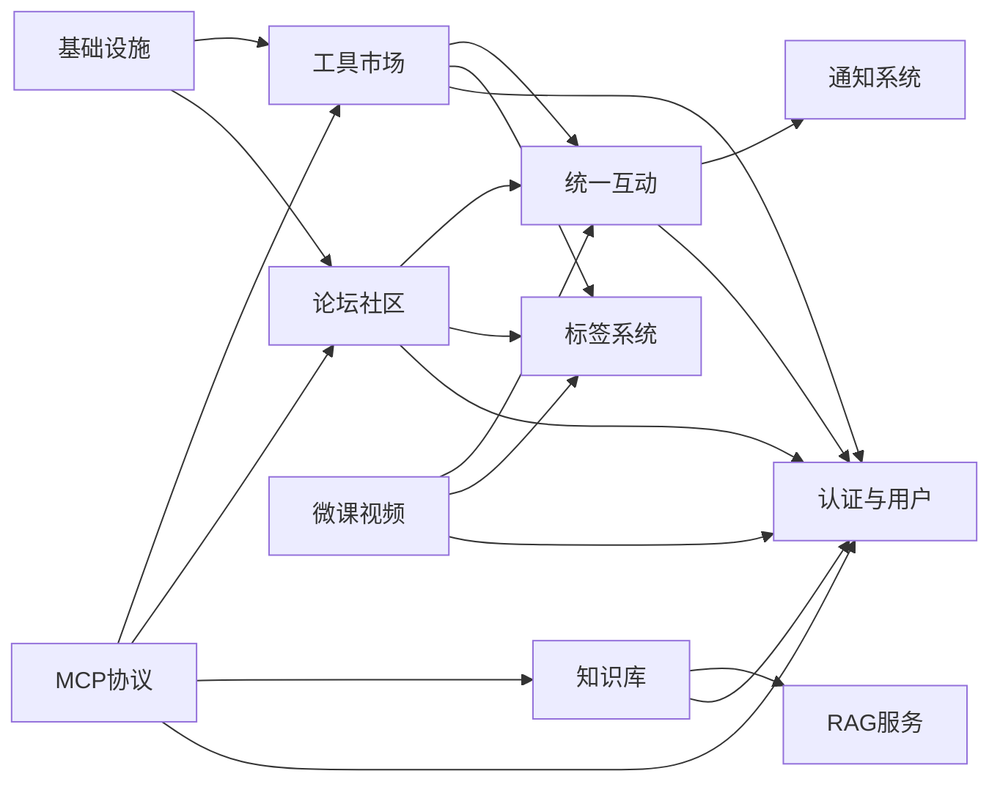

# CodingHub 仓库总览

## 项目简介

CodingHub（ai-tool-square）是一个 AI 工具市场与知识分享平台，采用 **Java 17 / Spring Boot 3.2.5**（后端）+ **Vue 3.4 / TypeScript 5.4 / Vite 5.2**（前端）技术栈构建。平台提供 AI 工具发布与发现、论坛社区讨论、微课视频分享、RAG 知识库、留言反馈等核心功能，并通过 MCP（Model Context Protocol）协议将平台资源暴露给外部 AI 代理。

## 端到端架构图



## 模块文档

### 核心业务模块

| 模块 | 文档 | 说明 |
|------|------|------|
| [工具市场](工具市场.md) | 工具 CRUD、文件管理、分类、热度排行 | 135 组件 |
| [论坛社区](论坛社区.md) | 帖子发布、分类、标签、可见性、置顶 | 87 组件 |
| [微课视频](微课视频.md) | 视频上传、流式播放、弹幕、封面管理 | 80 组件 |
| [知识库](知识库.md) | RAG 知识库 CRUD、文档管理、语义搜索 | 68 组件 |

### 跨模块基础设施

| 模块 | 文档 | 说明 |
|------|------|------|
| [统一互动](统一互动.md) | 跨内容类型的点赞、评论、收藏 | 71 组件 |
| [标签系统](标签系统.md) | 统一标签创建、关联、热度排行 | 46 组件 |
| [通知系统](通知系统.md) | 站内消息推送、未读计数 | 28 组件 |
| [留言反馈](留言反馈.md) | 匿名/登录留言、管理员回复 | 35 组件 |

### 平台基础

| 模块 | 文档 | 说明 |
|------|------|------|
| [认证与用户](认证与用户.md) | JWT 认证、三级角色、用户管理 | 93 组件 |
| [基础设施](基础设施.md) | 异常处理、XSS 防护、概览统计 | 63 组件 |
| [前端基础](前端基础.md) | API 客户端、主题系统、类型定义 | 45 组件 |

### AI 集成

| 模块 | 文档 | 说明 |
|------|------|------|
| [MCP协议](MCP协议.md) | 双传输 MCP Server、18 个工具 | 111 组件 |
| [RAG服务](RAG服务.md) | Python 向量检索、文档处理、语义搜索 | 77 组件 |

## 技术架构要点

### 后端分层

严格遵循 Controller → Service → Repository → Model 单向依赖：

- **L0 配置/工具**：SecurityConfig、JwtAuthenticationFilter、XssSanitizer、异常类
- **L1 模型**：35 个 JPA 实体 + 61 个 DTO
- **L2 数据访问**：26 个 Spring Data JPA Repository
- **L3 业务逻辑**：22 个 Service 类
- **L4 API/MCP**：22 个 REST Controller + 4 个 MCP 类

### 前端分层

- **L0 类型/工具**：7 个类型文件 + 2 个 Composables
- **L1 服务层**：9 个 API Service
- **L2 状态管理**：3 个 Pinia Store
- **L3 组件**：34 个 Vue 组件
- **L4 页面**：29 个页面

### 数据库

- **MySQL 8.x**：主数据库，Flyway 管理 9 个迁移文件
- **SQLite**：RAG 服务文档状态跟踪
- **Vector DB**：RAG 服务向量存储

### 安全模型

- **JWT 无状态认证**：15 分钟访问令牌 + 7 天刷新令牌
- **三级角色**：USER / ADMIN（需审批）/ SUPER_ADMIN（受保护）
- **URL + Filter + Service 三层授权**
- **XSS 防护**：所有用户输入统一消毒

### 热度排行系统

工具、帖子、视频共享统一的热度分数公式：

`score = viewCount × 1 + likeCount × 3 + commentCount × 5`

每次浏览/点赞/评论时自动重算，支撑 "hot" 排序和 Top5 排行。

### 软删除模式

所有主要内容实体（Tool、ForumPost、Video、KnowledgeBase、FeedbackMessage）使用 `status` 枚举（NORMAL/DELETED）实现软删除，查询自动过滤已删除记录。

## 端口与服务

| 服务 | 端口 | 技术 |
|------|------|------|
| Spring Boot 后端 | 8082 | Java 17 + Gradle 8.5 |
| Vite 前端 | 5173 | Vue 3.4 + TypeScript 5.4 |
| MySQL | 3306 | MySQL 8.x |
| RAG 服务 | 配置可变 | Python + Starlette + FastMCP |

## 模块依赖关系



## 快速开始

```bash
make db              # 创建数据库并初始化表结构
make install         # 安装前端依赖
make backend         # 启动后端 (8082)
make frontend        # 启动前端 (5173)
make run             # 同时启动后端+前端
```