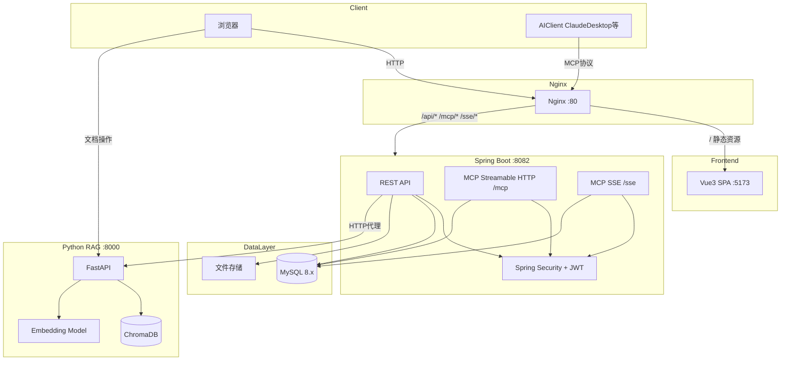
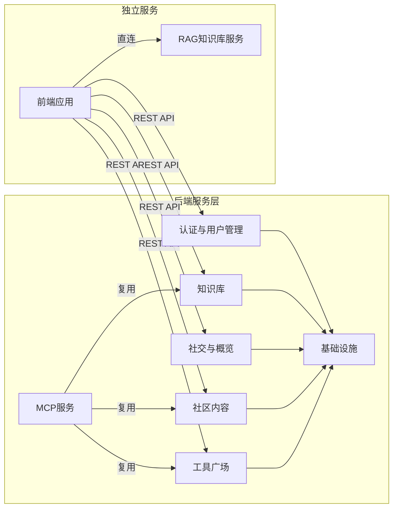
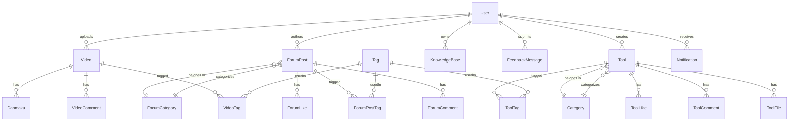

# CodingHub 仓库总览

CodingHub（ai-tool-square）是一个面向 AI 工具生态的全栈平台，集工具广场、技术论坛、微课视频、知识库于一体。平台旨在为开发者和 AI 从业者提供工具分享、技术交流和知识管理的统一环境，同时通过 MCP（Model Context Protocol）协议将平台能力开放给 AI 客户端，实现人机协作的新范式。

项目采用 Java 17 + Spring Boot 3.2.5 作为后端，Vue 3.4 + TypeScript 5.4 + Vite 5.2 作为前端，Python FastAPI 提供 RAG 知识库服务，三层架构各司其职。

## 端到端架构



## 模块结构

CodingHub 按业务领域划分为 9 个核心模块，后端遵循 Controller → Service → Repository → Model 的严格分层架构，前端采用 Pages → Components → Services/Stores 的分层模式。



### 模块文档索引

| 模块 | 组件数 | 说明 | 文档 |
|------|--------|------|------|
| 认证与用户管理 | 56 | JWT 双令牌认证、用户注册审批、三级角色权限、头像管理 | [auth-user.md](auth-user.md) |
| 工具广场 | 226 | 工具 CRUD、文件上传下载、分类体系、统一互动系统（点赞/评论/收藏） | [tool-plaza.md](tool-plaza.md) |
| 社区内容 | 165 | 论坛帖子与评论、微课视频与弹幕、热度排序、标签关联 | [community-content.md](community-content.md) |
| 知识库 | 41 | 知识库 CRUD、语义搜索代理、RAG 服务集成 | [knowledge-base.md](knowledge-base.md) |
| MCP 服务 | 93 | 18 个 MCP 工具、3 个资源、6 个提示词、双传输层（Streamable HTTP + SSE） | [mcp-service.md](mcp-service.md) |
| 社交与概览 | 108 | 统一标签系统、通知推送、留言反馈、平台统计与排行 | [community-social.md](community-social.md) |
| 基础设施 | 59 | Spring Security 配置、全局异常处理、XSS 防护、文件上传配置、数据初始化 | [infra.md](infra.md) |
| 前端应用 | 138 | Vue 3 页面与组件、双主题系统、API 服务层、状态管理 | [frontend-app.md](frontend-app.md) |
| RAG 知识库服务 | 80 | Python FastAPI、语义分块、向量嵌入、ChromaDB、MCP 工具 | [rag-service.md](rag-service.md) |

## 技术栈

| 层级 | 技术 | 版本 |
|------|------|------|
| 后端语言 | Java | 17 |
| 后端框架 | Spring Boot | 3.2.5 |
| 构建工具 | Gradle | 8.5 |
| 数据库 | MySQL | 8.x |
| ORM | Spring Data JPA + Hibernate | — |
| 认证 | Spring Security + JWT (jjwt) | — |
| MCP SDK | modelcontextprotocol/sdk | 2.0.0 |
| 前端框架 | Vue | 3.4 |
| 前端语言 | TypeScript | 5.4 |
| 构建工具 | Vite | 5.2 |
| 状态管理 | Pinia | — |
| RAG 服务 | Python + FastAPI + FastMCP | — |
| 向量数据库 | ChromaDB | — |
| 嵌入模型 | all-MiniLM-L6-v2 / Qwen3-Embedding | — |
| 反向代理 | Nginx | 1.16.3 |

## 数据模型概览



## 部署架构

CodingHub 采用本地裸机部署，无 Docker 或 CI/CD 流水线：

- **Nginx** (:80) 作为反向代理，静态资源指向 Vue dist/ 目录，API/MCP/SSE 请求代理到后端 :8082
- **Spring Boot** (:8082) 提供 REST API 和 MCP 端点，通过 JPA ddl-auto:update 管理数据库 Schema
- **Python RAG** (:8000) 独立服务，前端文档操作直连，后端通过 RagApiClient 代理搜索请求
- **MySQL** (:3306) 存储所有业务数据，数据库名 ai_tool_square

## 快速开始

```bash
# 创建数据库
make db

# 安装前端依赖
make install

# 启动后端 + 前端
make run

# 访问
# 前端：http://localhost:5173
# 后端 API：http://localhost:8082
# MCP SSE：http://localhost:8082/sse
# MCP Streamable HTTP：http://localhost:8082/mcp
```
