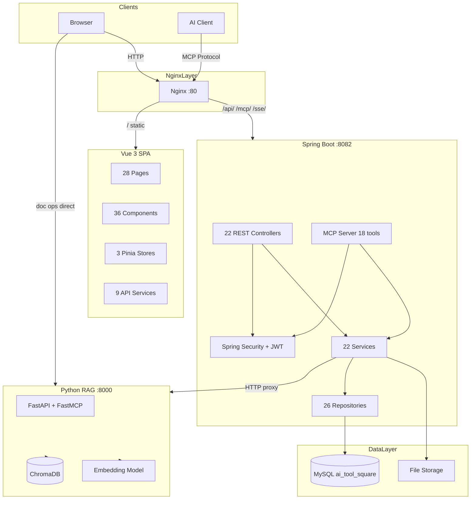
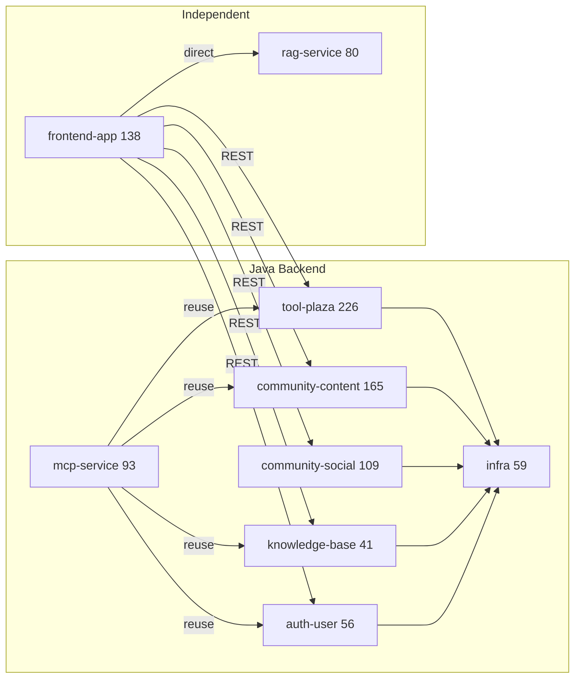
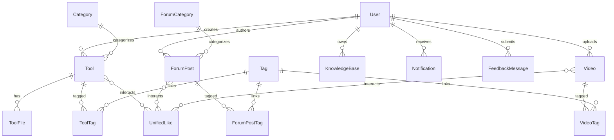

# CodingHub 仓库总览

CodingHub（ai-tool-square）是一个面向 AI 工具生态的全栈协作平台，集工具广场、技术论坛、微课视频、RAG 知识库于一体。平台为开发者和 AI 从业者提供工具分享、技术交流和知识管理的统一环境，同时通过 MCP（Model Context Protocol）协议将核心业务能力标准化暴露给 AI 客户端（Claude Desktop、Cursor、QoderWork 等），实现人机协作新范式。

项目采用 Java 17 + Spring Boot 3.2.5 后端、Vue 3.4 + TypeScript 5.4 + Vite 5.2 前端、Python FastAPI RAG 服务的三层架构。CodeGraph 索引覆盖 374 个源文件、6230 个代码符号和 11869 条调用边。

## 端到端架构



## 模块结构

CodingHub 按业务领域划分为 9 个核心模块。后端遵循 Controller → Service → Repository → Model 的严格分层架构（禁止循环依赖），前端采用 Pages → Components → Services/Stores 的分层模式。



### 模块文档索引

| 模块 | 组件数 | 核心符号影响 | 说明 | 文档 |
|------|--------|-------------|------|------|
| 认证与用户管理 | 56 | User 实体影响全平台 | JWT 双令牌认证、注册审批、三级角色 | [auth-user.md](auth-user.md) |
| 工具广场 | 226 | ToolService 被 3 处调用 | 工具 CRUD、文件管理、统一互动系统 | [tool-plaza.md](tool-plaza.md) |
| 社区内容 | 165 | ForumPostService 被 MCP 调用 | 论坛帖子、微课视频、弹幕 | [community-content.md](community-content.md) |
| 知识库 | 41 | KBService 双路径(REST+MCP) | 知识库 CRUD、语义搜索、RAG 集成 | [knowledge-base.md](knowledge-base.md) |
| MCP 服务 | 93 | IaihubToolHandler 影响 156 符号 | 18 工具 + 3 资源 + 6 提示词 | [mcp-service.md](mcp-service.md) |
| 社交与概览 | 109 | TagService 跨 3 模块 | 标签、通知、反馈、统计排行 | [community-social.md](community-social.md) |
| 基础设施 | 59 | SecurityConfig 影响全局 | 安全配置、异常处理、XSS 防护 | [infra.md](infra.md) |
| 前端应用 | 138 | — | Vue 3 页面组件、双主题、状态管理 | [frontend-app.md](frontend-app.md) |
| RAG 服务 | 80 | — | Python FastAPI、语义分块、ChromaDB | [rag-service.md](rag-service.md) |

## 技术栈

| 层级 | 技术 | 版本 |
|------|------|------|
| 后端语言 | Java | 17 |
| 后端框架 | Spring Boot | 3.2.5 |
| 构建工具 | Gradle | 8.5 |
| 数据库 | MySQL | 8.x |
| ORM | Spring Data JPA + Hibernate | ddl-auto:update |
| 认证 | Spring Security + JWT (jjwt) | access 15min / refresh 7d |
| MCP SDK | modelcontextprotocol/sdk | 2.0.0 |
| 前端框架 | Vue | 3.4 |
| 前端语言 | TypeScript | 5.4 |
| 构建工具 | Vite | 5.2 |
| 状态管理 | Pinia | — |
| RAG 框架 | FastAPI + FastMCP | — |
| 向量数据库 | ChromaDB | — |
| 嵌入模型 | all-MiniLM-L6-v2 (384d) | — |
| 反向代理 | Nginx | 1.16.3 |

## 数据模型概览



## 部署架构

本地裸机部署，无 Docker / CI：

- **Nginx** (:80)：静态资源 → Vue dist/，API/MCP/SSE → :8082，`proxy_buffering off`（SSE），`client_max_body_size 120m`
- **Spring Boot** (:8082)：REST API + MCP 端点（/mcp Streamable HTTP + /sse SSE）
- **Python RAG** (:8000)：独立 FastAPI 服务，前端文档操作直连
- **MySQL** (:3306)：数据库 ai_tool_square

## 快速开始

```bash
make db          # 创建数据库并初始化
make install     # 安装前端依赖
make run         # 启动后端 + 前端
# 前端: http://localhost:5173
# API:  http://localhost:8082
# MCP:  http://localhost:8082/mcp (Streamable HTTP)
# SSE:  http://localhost:8082/sse
```
