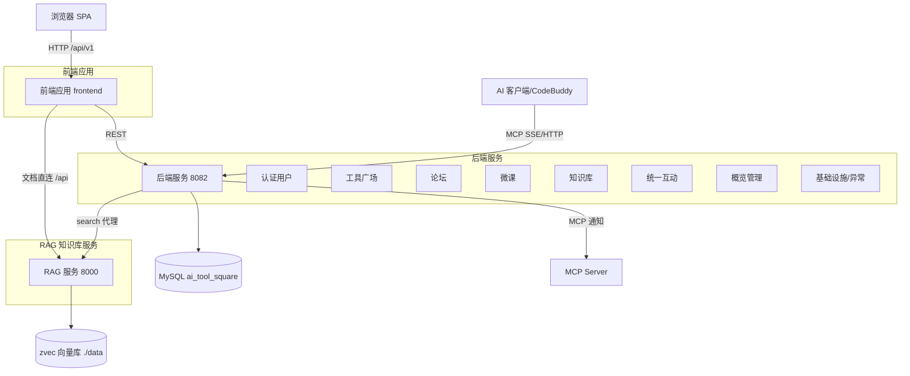

# CodingHub Wiki 总览（Repository Overview）

> CodingHub（ai-tool-square）是一个 AI 工具广场 + 社区（论坛/微课/知识库）+ 管理后台的全栈应用，并内置 RAG 知识库服务与 MCP Server。本文档是仓库级入口，聚合各模块详细 Wiki。

## 技术栈

| 层 | 技术 | 端口 |
|----|------|------|
| 前端 | Vue 3.4 / TypeScript 5.4 / Vite 5.2 / Pinia / Vue Router / Element Plus | 5173 |
| 后端 | Java 17 / Spring Boot 3.2.5 / Gradle 8.5 | 8082 |
| 数据库 | MySQL 8.x（`ai_tool_square`）+ Flyway V1~V9 | 3306 |
| RAG 服务 | Python（FastMCP + Starlette + zvec + sentence-transformers） | 8000 |
| MCP | Java MCP SDK 2.0.0（Streamable HTTP `/mcp` + SSE `/sse`） | 8082 |

## 端到端架构图



## 模块索引

### 后端服务（[backend.md](backend.md)）
| 模块 | 文档 | 关键职责 |
|------|------|----------|
| 认证与用户 | [auth-user.md](auth-user.md) | 注册/登录/刷新/审批/角色 |
| 工具广场 | [tool-plaza.md](tool-plaza.md) | 工具 CRUD/置顶/热度/文件 |
| 论坛社区 | [forum.md](forum.md) | 帖子/分类/标签/评论/点赞 |
| 微课视频 | [video.md](video.md) | 视频流(Range)/上传/弹幕 |
| 知识库 | [knowledge-base.md](knowledge-base.md) | KB 实体/搜索代理 RagApiClient |
| 统一互动 | [unified-services.md](unified-services.md) | 统一点赞/评论/收藏/标签/通知/反馈 |
| 概览与管理 | [overview-admin.md](overview-admin.md) | 统计/排行/审批管理 |
| MCP 服务 | [mcp-service.md](mcp-service.md) | 18 tools / 3 resources / 6 prompts |
| 基础设施与异常 | [infra.md](infra.md) | Security/JWT/XSS/异常/初始化 |

### 前端应用（[frontend-app.md](frontend-app.md)）
Vue 3 SPA：双主题、Pinia 状态、Axios（含 401 刷新队列）、9 个 service、3 个 store、2 个 composable、28 个页面、36+ 组件。

### RAG 知识库服务（[rag-service.md](rag-service.md)）
Python 微服务：FastMCP 12 工具 + Starlette REST；zvec 向量库 + all-MiniLM 嵌入 + bge-reranker 精排；异步处理流水线。

## 核心设计模式

- **统一互动**：`TargetType`(TOOL/FORUM_POST/VIDEO) 抽象点赞/评论/收藏，避免每个内容域重复实现（见 [统一互动服务模块](unified-services.md)）。
- **热度评分**：`score = viewCount*1 + likeCount*3 + commentCount*5`，驱动首页/热榜/搜索排序。
- **软删除 + 权限**：内容 `status=DELETED`；操作需 `isOwner || isAdmin`。
- **MCP 双通道**：AI 客户端经 MCP 检索/管理；RAG 服务既作 MCP Server 又作 REST 服务（前端直连文档管理）。
- **双主题**：CSS 变量 + `data-theme` 属性切换，零重渲染。

## 快速开始

```bash
make db          # 创建数据库并初始化
make install     # 安装前端依赖
make backend     # 启动后端 (8082)
make frontend    # 启动前端 (5173)
make run         # 同时启动后端+前端
```

> 知识库检索需单独启动 RAG 服务（`rag/` 目录，默认 `python server.py --mode streamable-http`）。MCP 默认口令 `123456`。

## 相关文档

- 架构详情：`docs/ARCHITECTURE.md`
- 开发指南：`docs/DEVELOPMENT.md`
- 设计系统：`design-system/CodingHub/MASTER.md`
- RAG 服务：`rag/README_CN.md`
