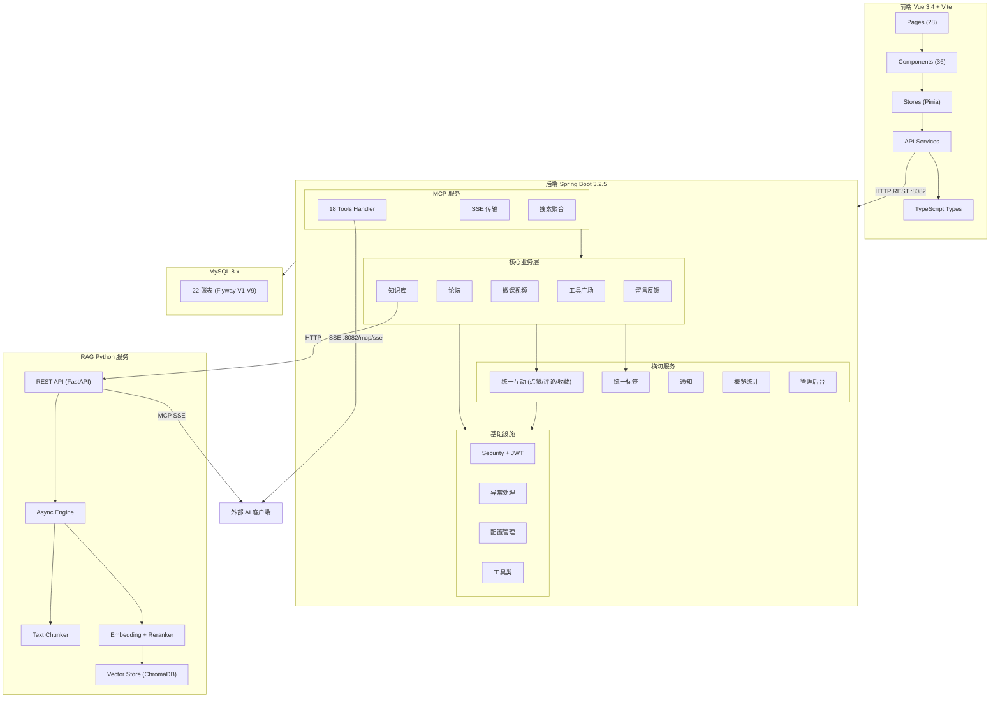

# CodingHub 仓库总览

## 1. 项目简介

CodingHub（ai-tool-square）是一个**AI 工具分享与知识协作平台**，面向开发者社区提供工具发布、技术论坛、微课视频、RAG 知识库等核心能力，并通过 MCP（Model Context Protocol）将平台资源暴露给外部 AI 客户端调用。

技术栈：Java 17 / Spring Boot 3.2.5（后端）、Vue 3.4 / TypeScript 5.4 / Vite 5.2（前端）、Python（RAG 服务）、MySQL 8.x + Flyway 迁移。部署端口：后端 8082、前端 5173、MySQL 3306。

## 2. 端到端架构

## 3. 模块清单

### 后端模块

| 模块 | 说明 | 文档 |
|------|------|------|
| [backend-infra](backend-infra.md) | 启动入口、安全框架 (JWT + Spring Security)、全局异常处理、配置管理、工具类 (XSS 防护/头像) | 核心基座 |
| [auth-user](auth-user.md) | 用户认证 (登录/注册/Token 刷新)、个人资料管理、头像上传、管理员审批 | 用户体系 |
| [tool-plaza](tool-plaza.md) | 工具 CRUD、分类管理、文件上传下载、置顶、热度排序、评分算法 | 核心业务 |
| [unified-interactions](unified-interactions.md) | 统一点赞/评论/收藏，通过 [TargetType](../backend\src\main\java\com\iaihub\toolbox\model\TargetType.java) 枚举支持 TOOL/FORUM_POST/VIDEO | 横切能力 |
| [forum](forum.md) | 论坛帖子 CRUD、分类、标签、全文搜索、评论嵌套、热度排序 | 社区内容 |
| [video](video.md) | 微课视频上传/流式播放、弹幕系统、评论、点赞、播放计数 | 多媒体 |
| [knowledge-base](knowledge-base.md) | 知识库管理，Java 后端通过 [RagApiClient](../backend\src\main\java\com\iaihub\toolbox\service\RagApiClient.java) 桥接 Python RAG 服务 | 知识管理 |
| [mcp-service](mcp-service.md) | MCP 协议实现，18 个工具 + SSE 连接管理 + Prompt 模板 + 资源暴露 | AI 集成 |
| [rag-service](rag-service.md) | Python RAG 服务：文档分块 → 向量化 → ChromaDB 存储 → 语义检索 + Reranker | 独立服务 |
| [auxiliary-services](auxiliary-services.md) | 留言反馈、系统通知、统一标签、概览统计、管理员后台 | 辅助功能 |

### 前端模块

| 模块 | 说明 | 文档 |
|------|------|------|
| [frontend-app](frontend-app.md) | Vue 3.4 SPA：TypeScript 类型定义、API 服务层、Pinia 状态管理、Composables、双主题设计系统 | 前端架构 |

## 4. 关键架构决策

**统一互动模式**：评论/收藏/点赞功能通过 `TargetType` 枚举 + 通用 Service 实现，所有模块（工具、论坛、视频）复用同一套实现，禁止为新模块重复造轮子。详见 [unified-interactions](unified-interactions.md)。

**MCP 双传输**：MCP 服务同时支持 Java 原生 SSE（`McpServerConfig`）和 MCP SDK 标准（`McpSdkServerConfig`），对外暴露 18 个工具覆盖工具搜索、论坛交互、知识库管理等场景。详见 [mcp-service](mcp-service.md)。

**RAG 桥接架构**：Java 后端通过 `RagApiClient`（HTTP REST）与 Python RAG 服务通信，知识库元数据存 MySQL，向量索引存 ChromaDB，实现语义搜索能力。详见 [knowledge-base](knowledge-base.md) 和 [rag-service](rag-service.md)。

**双主题设计**：前端支持 Cyberpunk Dark 和 Glassmorphism Light 两套主题，通过 Pinia `useThemeStore` 管理切换。详见 [frontend-app](frontend-app.md)。

## 5. 数据库概览

数据库 `ai_tool_square` 共 22 张表，按领域分为：

- **核心**：user, category, tool, tool_file, tool_like, tool_comment
- **论坛**：forum_category, forum_tag, forum_post, forum_post_tag, forum_comment, forum_like
- **微课**：video, video_comment, video_like, video_favorite, danmaku
- **知识库**：knowledge_base, kb_document
- **标签**：tag, tool_tag, video_tag
- **通知**：notification
- **留言**：feedback_message
- **收藏**：post_favorite

迁移脚本：Flyway V1~V9（`backend/src/main/resources/db/migration/`）

## 6. API 入口速查

| 前缀 | 说明 | 前缀 | 说明 |
|------|------|------|------|
| `/api/v1/auth` | 认证 | `/api/forum/posts` | 论坛帖子 |
| `/api/v1/tools` | 工具 CRUD | `/api/forum/categories` | 论坛分类 |
| `/api/v1/categories` | 工具分类 | `/api/v1/post-favorites` | 帖子收藏 |
| `/api/v1/users` | 用户管理 | `/api/overview` | 统计排行 |
| `/api/v1/admin` | 管理后台 | `/mcp/sse` | MCP 工具 |
| `/api/v1/videos` | 微课视频 | `/api/v1/feedback` | 留言反馈 |
| `/api/v1/interactions` | 统一互动 | `/api/v1/notifications` | 通知 |
| `/api/v1/knowledge` | 知识库 | `/api/v1/tags` | 统一标签 |
