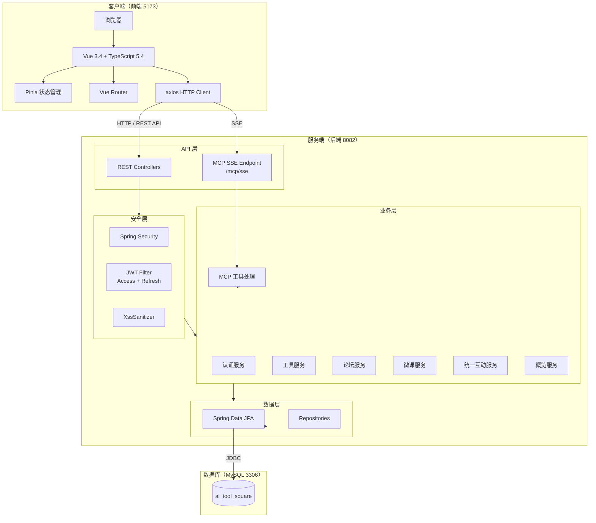
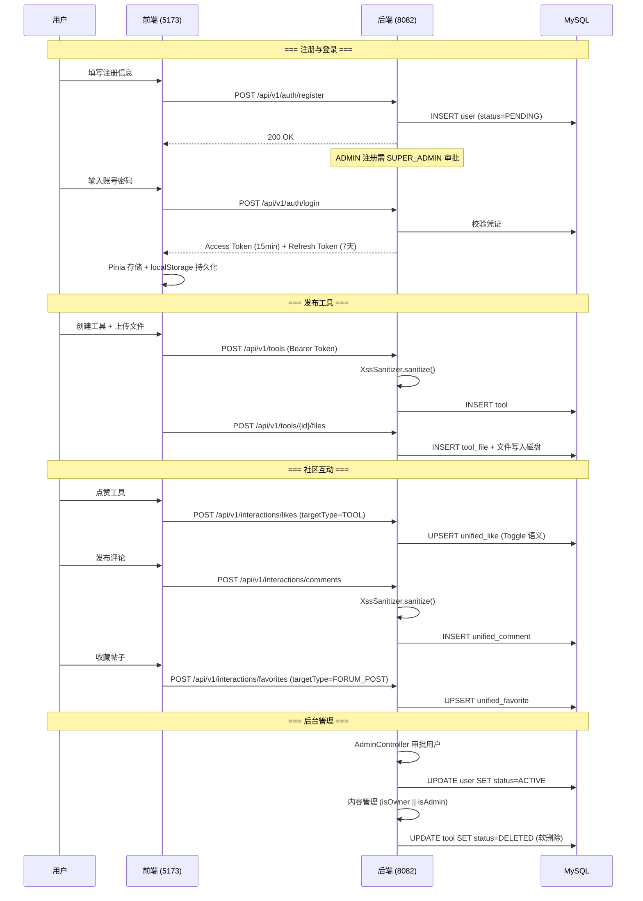
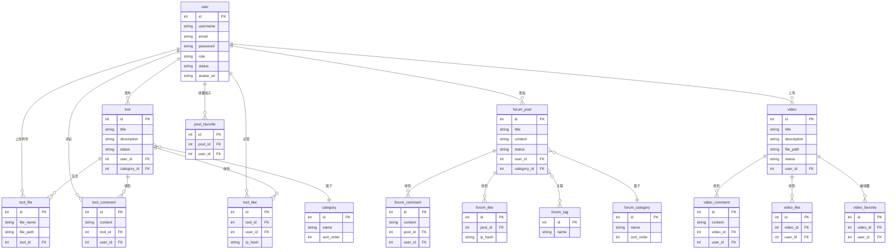

# CodingHub 项目总览

> CodingHub（ai-tool-square）是一个全栈 AI 工具广场平台，集成工具市场、技术论坛、微课视频三大业务模块，通过统一互动层实现跨模块点赞、评论、收藏，并借助 MCP 协议向外部 AI 助手开放 11 个标准化工具接口。

---

## 1. 项目简介

CodingHub 是一个面向开发者和技术爱好者的 AI 工具分享与社区平台。项目采用 **Java 17 / Spring Boot 3.2.5** 构建后端服务，**Vue 3.4 / TypeScript 5.4 / Vite 5.2** 构建前端应用，**MySQL 8.x** 作为持久化存储，整体架构遵循前后端分离的经典 B/S 模式。平台涵盖工具发布与文件管理、技术论坛交流、微课视频分享三大核心场景，并通过统一互动模型（Unified Interaction）将点赞、评论、收藏能力收敛为通用实现，大幅降低跨模块的代码冗余。此外，项目基于 MCP（Model Context Protocol）协议，通过 SSE 传输机制对外暴露标准化工具接口，支持与外部 AI 助手无缝集成。

---

## 2. 技术架构总览



---

## 3. 模块清单

| 模块 | 文档 | 一句话描述 | 后端组件数 | 前端组件数 |
|------|------|-----------|-----------|----------|
| 认证与用户 | [认证与用户.md](认证与用户.md) | 基于 Spring Security + JWT 双令牌机制实现用户注册、登录、头像管理和后台审批 | Controller 3, Service 2, Repository 2, Model 3, DTO 8 | Store 1, Page 3, Component 2 |
| 工具市场 | [工具市场.md](工具市场.md) | 提供 AI 工具/脚本/插件的发布、分类、搜索、文件管理与互动功能 | Controller 3, Service 2, Repository 3, Model 4, DTO 10 | Page 2, Component 3, Service 1 |
| 论坛社区 | [论坛社区.md](论坛社区.md) | 技术交流论坛，支持帖子 CRUD、多级评论、标签、分类、点赞与收藏 | Controller 5, Service 5, Repository 6, Model 7, DTO 7 | Page 5, Component 8, Store 1, Service 1 |
| 微课视频 | [微课视频.md](微课视频.md) | 视频上传（最大 1 GB）、HTTP Range 流式播放、互动与软删除 | Controller 2, Service 2, Repository 4, Model 5, DTO 7 | Page 4, Component 3, Service 1 |
| 统一互动 | [统一互动.md](统一互动.md) | 通过 targetType 多态字段为 Tool / ForumPost / Video 提供统一的点赞、评论、收藏 | Controller 1, Service 3, Repository 3, Model 3, DTO 5 | Composable 1, Service 1 |
| MCP 协议 | [MCP协议.md](MCP协议.md) | 基于 MCP 规范通过 SSE 向 AI 助手暴露 11 个标准化工具接口 | MCP 模块 4（SDK、配置、处理器、资源） | — |
| 基础设施 | [基础设施.md](基础设施.md) | 应用启动、数据初始化、安全配置、全局异常处理、XSS 防护、统一响应封装 | Config 6, Exception 9, Util 3, Controller 1 | — |
| 前端应用 | [前端应用.md](前端应用.md) | Vue 3 + TypeScript + Vite 前端工程，含路由守卫、并发 Token 刷新锁、角色权限校验 | — | Page 23, Component 21, Service 5, Store 3, Type 5 |

---

## 4. 核心业务流程



---

## 5. 数据库设计概览



> **统一互动表**（新方案）：`unified_like`、`unified_comment`、`unified_favorite` 通过 `targetType`（TOOL / FORUM_POST / VIDEO）+ `targetId` 多态关联，逐步替代上述各模块独立的互动表。

---

## 6. API 路由前缀总览

| 路由前缀 | 方法 | 说明 | 认证要求 |
|----------|------|------|----------|
| `/api/v1/auth/register` | POST | 用户注册 | 无 |
| `/api/v1/auth/login` | POST | 用户登录 | 无 |
| `/api/v1/auth/refresh` | POST | 刷新 Access Token | Refresh Token |
| `/api/v1/tools` | GET/POST/PUT/DELETE | 工具 CRUD | 写操作需 Bearer |
| `/api/v1/tools/{id}/files` | GET/POST/DELETE | 工具文件上传/下载/删除 | 写操作需 Bearer |
| `/api/v1/categories` | GET/POST/PUT/DELETE | 工具分类管理 | 写操作需 ADMIN |
| `/api/v1/users` | GET/PUT | 个人资料与头像 | Bearer |
| `/api/v1/admin` | GET/PUT/DELETE | 后台用户审批与管理 | ADMIN / SUPER_ADMIN |
| `/api/forum/posts` | GET/POST/PUT/DELETE | 论坛帖子 CRUD | 写操作需 Bearer |
| `/api/forum/categories` | GET/POST/PUT/DELETE | 论坛分类管理 | 写操作需 ADMIN |
| `/api/forum/tags` | GET/POST/DELETE | 论坛标签管理 | 写操作需 Bearer |
| `/api/forum/likes` | POST | 论坛帖子点赞 | 支持匿名（IP 哈希） |
| `/api/v1/post-favorites` | POST | 帖子收藏 | Bearer |
| `/api/v1/videos` | GET/POST/PUT/DELETE | 微课视频 CRUD | 写操作需 Bearer |
| `/api/v1/interactions/likes` | POST | 统一点赞（Toggle） | 支持匿名 |
| `/api/v1/interactions/comments` | GET/POST/DELETE | 统一评论 | 写操作需 Bearer |
| `/api/v1/interactions/favorites` | POST | 统一收藏（Toggle） | Bearer |
| `/api/overview` | GET | 平台统计与排行 | 无 |
| `/mcp/sse` | SSE | MCP 协议连接端点 | 无（写操作需凭证） |
| `/mcp/message` | POST | MCP JSON-RPC 消息 | 无（写操作需凭证） |

---

## 7. 部署信息

| 服务 | 端口 | 说明 |
|------|------|------|
| 前端（Vite Dev Server） | **5173** | Vue 3.4 + TypeScript 5.4，开发模式热更新 |
| 后端（Spring Boot） | **8082** | Java 17，内嵌 Tomcat |
| MySQL | **3306** | 数据库名 `ai_tool_square`，账号 root/root |

**部署模式**：本地裸机部署，无 Docker / CI。

**快速命令**：

```bash
make db              # 创建数据库并初始化表结构
make install         # 安装前端依赖
make backend         # 启动后端 (8082)
make frontend        # 启动前端 (5173)
make run             # 同时启动后端 + 前端
make stop            # 停止所有服务
make lint            # lint-arch + lint-quality + lint-deps
```

---

## 8. 项目亮点

### 8.1 统一互动模型

通过引入 `targetType` 多态枚举（TOOL / FORUM_POST / VIDEO），将原本分散在 9 张独立表中的点赞、评论、收藏逻辑收敛为 3 张统一表（`unified_like`、`unified_comment`、`unified_favorite`）。所有互动操作统一收敛到 `/api/v1/interactions/*` 端点，前端通过 `useInteraction` composable 调用，无需为不同内容类型维护独立代码。新增内容类型时只需扩展枚举值和 Repository，零冗余接入。

### 8.2 MCP 协议集成

基于 MCP（Model Context Protocol）规范构建，服务器名称 `H3CodingHub-MCP-Server`（v2.0.0），通过 SSE 传输机制向外部 AI 助手暴露 **11 个标准化工具**，涵盖工具检索、工具管理、帖子管理、文件操作等核心能力。采用 JSON-RPC 2.0 消息格式，写操作要求 MCP 客户端传入用户凭证进行认证，兼顾开放性与安全性。

### 8.3 JWT 双令牌机制

采用 Access Token + Refresh Token 双令牌认证方案：

- **Access Token**：短期有效（15 分钟），用于常规 API 请求鉴权
- **Refresh Token**：长期有效（7 天），用于无感刷新 Access Token
- 前端实现**并发 Token 刷新锁**机制，避免多请求同时触发刷新导致的竞态问题

### 8.4 三级权限体系

| 角色 | 说明 |
|------|------|
| USER | 普通用户，注册后可直接使用全部基础功能 |
| ADMIN | 管理员，注册后需 SUPER_ADMIN 审批，可管理他人内容 |
| SUPER_ADMIN | 超级管理员，拥有全部管理权限 |

内容操作遵循 `isOwner || isAdmin` 原则，兼顾内容自主权与平台治理。

### 8.5 安全防护

- **XSS 防护**：所有用户输入经 `XssSanitizer.sanitize()` 清洗
- **文件安全校验**：上传文件严格校验类型和大小
- **全局异常处理**：`GlobalExceptionHandler` 统一异常响应格式
- **软删除机制**：Tool / ForumPost / Video 采用 `status = DELETED` 软删除，数据可恢复

### 8.6 微课视频流式播放

基于 HTTP Range 协议实现视频流式播放，使用 `RandomAccessFile` 精确 seek，每次最多传输 1 MB 数据块，支持大文件（最大 1 GB）分片上传与断点续传。

---

## 9. 文档导航

| 文档 | 说明 |
|------|------|
| [认证与用户.md](认证与用户.md) | 用户注册、登录、JWT 令牌管理、头像上传、后台用户审批 |
| [工具市场.md](工具市场.md) | 工具 CRUD、分类管理、文件上传/下载、搜索筛选 |
| [论坛社区.md](论坛社区.md) | 帖子管理、多级评论、标签系统、分类、点赞、收藏 |
| [微课视频.md](微课视频.md) | 视频上传、HTTP Range 流式播放、互动功能、软删除 |
| [统一互动.md](统一互动.md) | 跨模块统一点赞/评论/收藏，多态 targetType 设计 |
| [MCP协议.md](MCP协议.md) | MCP SDK 集成、11 个标准化工具、SSE 传输、JSON-RPC 2.0 |
| [基础设施.md](基础设施.md) | 安全配置、全局异常处理、XSS 防护、统一响应封装、概览统计 |
| [前端应用.md](前端应用.md) | Vue 3 + TypeScript 工程结构、路由守卫、Token 刷新锁、API 封装 |

---

*本文档由 CodeWiki 自动生成，基于项目 8 个模块文档与 agents.md 汇总而成。*
