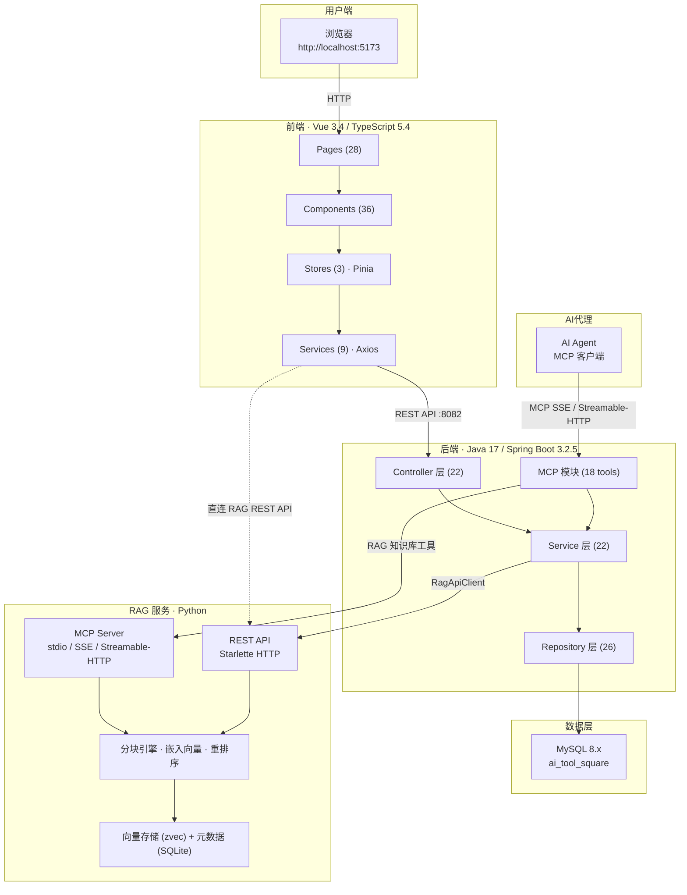

## CodingHub 项目文档

CodingHub（ai-tool-square）是一个面向 AI 工具分享与技术交流的综合性平台，由 Java 后端、Vue 前端和 Python RAG 知识库引擎三大子系统协同构成，提供 AI 工具管理、社区论坛、微课视频、智能知识库、留言反馈等完整功能。

---

## 项目概述

| 维度 | 说明 |
|------|------|
| 项目名称 | CodingHub (ai-tool-square) |
| 后端 | Java 17 / Spring Boot 3.2.5，端口 8082，22 个控制器、22 个服务、26 个数据仓库、35 个实体模型 |
| 前端 | Vue 3.4 / TypeScript 5.4 / Vite 5.2，端口 5173，28 个页面、36 个组件、9 个 API 服务 |
| RAG 服务 | Python 独立进程，双协议架构（MCP Server + REST API），提供文档导入、智能分块、向量存储与语义检索 |
| 数据库 | MySQL 8.x（ai_tool_square），Flyway 迁移 V1~V9 |
| 构建工具 | Gradle 8.5（后端）+ npm（前端） |
| 部署方式 | 本地裸机，无 Docker/CI |
| 设计系统 | 双主题——Cyberpunk Dark / Glassmorphism Light |

---

## 系统架构



### 子系统交互说明

| 通信链路 | 协议 | 说明 |
|----------|------|------|
| 前端 → 后端 | HTTP REST (Axios) | 前端通过 9 个 API 服务模块调用后端 :8082 的 REST 接口 |
| 前端 → RAG 服务 | HTTP REST (直连) | 知识库文档管理采用旁路设计，前端直连 RAG Python 服务 |
| 后端 → MySQL | JDBC | 所有业务数据持久化到 MySQL 8.x，通过 Spring Data JPA 访问 |
| 后端 → RAG 服务 | HTTP REST ([RagApiClient](../backend/src/main/java/com/iaihub/toolbox/service/RagApiClient.java)) | 知识库元数据与语义搜索通过 [RagApiClient](../backend/src/main/java/com/iaihub/toolbox/service/RagApiClient.java) 桥接 RAG 服务 |
| AI 代理 → 后端 MCP | MCP SSE / Streamable-HTTP | 18 个 AI 代理工具通过 MCP 协议对外暴露 |
| 后端 MCP → RAG 服务 | MCP / REST | MCP 模块中的知识库工具通过 RAG 服务实现语义检索 |

---

## 模块导航

| 模块 | 说明 | 核心能力 |
|------|------|----------|
| [后端](后端.md) | Java 17 / Spring Boot 3.2.5 后端服务，11 个子模块覆盖完整业务域 | 认证与安全（JWT + RBAC）、AI 工具 CRUD 与分类、社区论坛（帖子/评论/标签）、微课视频（上传/流播放/弹幕）、RAG 知识库集成、统一互动系统（点赞/评论/收藏）、留言反馈、标签与通知、MCP AI 代理工具（18 个）、后台管理与统计概览 |
| [前端](前端.md) | Vue 3.4 / TypeScript 5.4 SPA，5 层架构（Types → Services → Stores → Components → Pages） | 28 个页面路由入口、36 个 UI 组件（通用/论坛/视频/知识库/反馈）、9 个 API 服务、3 个 Pinia Store（论坛/主题/认证）、双主题设计系统 |
| [RAG 服务](RAG服务.md) | Python 独立 RAG 知识库引擎，双协议架构 | 文档导入（md/txt/py/pdf/docx 等）、智能分块（递归/语义/结构化）、向量检索（zvec + Cross-Encoder 重排序）、异步处理引擎、MCP + REST 双协议接入 |

---

## 技术栈总览

### 后端技术

| 技术 | 版本 | 用途 |
|------|------|------|
| Java | 17 | 运行时 |
| Spring Boot | 3.2.5 | 应用框架 |
| Spring Security | - | 认证与授权（JWT + RBAC） |
| Spring Data JPA | - | 数据访问 |
| Gradle | 8.5 | 构建工具 |
| Flyway | - | 数据库迁移（V1~V9） |
| MCP SDK | 2.0.0 | AI 代理工具协议（SSE + Streamable-HTTP） |

### 前端技术

| 技术 | 版本 | 用途 |
|------|------|------|
| Vue | 3.4 | UI 框架 |
| TypeScript | 5.4 | 类型安全 |
| Vite | 5.2 | 构建与开发服务器 |
| Pinia | - | 状态管理 |
| Axios | - | HTTP 客户端 |
| Vue Router | - | 路由管理 |

### RAG 服务技术

| 技术 | 用途 |
|------|------|
| Python | 运行时 |
| Starlette | REST API 框架 |
| MCP Server | AI 代理协议服务 |
| zvec | 向量存储引擎 |
| SQLite (WAL) | 元数据存储 |
| Cross-Encoder | 搜索结果重排序 |

---

## 数据库设计

数据库采用 MySQL 8.x，库名 `ai_tool_square`，通过 Flyway 管理迁移脚本（V1~V9），位于 `backend/src/main/resources/db/migration/`。

### 核心数据表

| 领域 | 数据表 |
|------|--------|
| 核心 | `user`, `category`, `tool`, `tool_file`, `tool_like`, `tool_comment` |
| 论坛 | `forum_category`, `forum_tag`, `forum_post`, `forum_post_tag`, `forum_comment`, `forum_like` |
| 微课 | `video`, `video_comment`, `video_like`, `video_favorite`, `danmaku` |
| 知识库 | `knowledge_base`, `kb_document` |
| 标签 | `tag`, `tool_tag`, `video_tag` |
| 通知 | `notification` |
| 留言 | `feedback_message` |
| 其他 | `post_favorite` |

> RAG 服务使用独立的存储方案：zvec 向量存储 + SQLite 元数据库，与 MySQL 数据库解耦。

---

## API 入口点

后端运行在 `http://localhost:8082`，主要 API 前缀如下：

| 前缀 | 说明 | 前缀 | 说明 |
|------|------|------|------|
| `/api/v1/auth` | 认证 | `/api/forum/posts` | 论坛帖子 |
| `/api/v1/tools` | 工具 CRUD + 点赞 | `/api/forum/categories` | 论坛分类 |
| `/api/v1/categories` | 工具分类 | `/api/v1/post-favorites` | 帖子收藏 |
| `/api/v1/users` | 用户（profile/avatar） | `/api/overview` | 统计 / 排行 |
| `/api/v1/admin` | 管理（审批/用户） | `/mcp/sse` | MCP（18 tools, SSE） |
| `/api/v1/videos` | 微课 | `/api/v1/feedback` | 留言反馈 |
| `/api/v1/interactions` | 统一互动 | `/api/v1/notifications` | 通知 |
| `/api/v1/knowledge` | 知识库 | `/api/v1/tags` | 统一标签 |

---

## 快速命令

```bash
make db          # 创建数据库并初始化
make install     # 安装前端依赖
make backend     # 启动后端 (8082)
make frontend    # 启动前端 (5173)
make run         # 同时启动后端 + 前端
make stop        # 停止所有服务
make lint        # lint-arch + lint-quality + lint-deps
```

---

## 约束规则

- **分层依赖**: 禁止循环依赖，单向依赖 controller → service → repository → model
- **XSS 防护**: 全局 `XssSanitizer.sanitize()` 过滤用户输入
- **JWT 认证**: `Authorization: Bearer <token>`，access token 15 分钟过期，refresh token 7 天
- **权限模型**: USER / ADMIN / SUPER_ADMIN 三级角色，内容操作 `isOwner || isAdmin`
- **空值处理**: 禁止返回 null，须抛异常或返回 Optional
- **软删除**: `status = DELETED`（[Tool](../backend/src/main/java/com/iaihub/toolbox/model/Tool.java) / [ForumPost](../backend/src/main/java/com/iaihub/toolbox/model/forum/ForumPost.java) / [Video](../backend/src/main/java/com/iaihub/toolbox/model/video/Video.java)）
- **Git 规范**: Conventional Commits，单次提交不超过 1000 行，禁止私自提交
