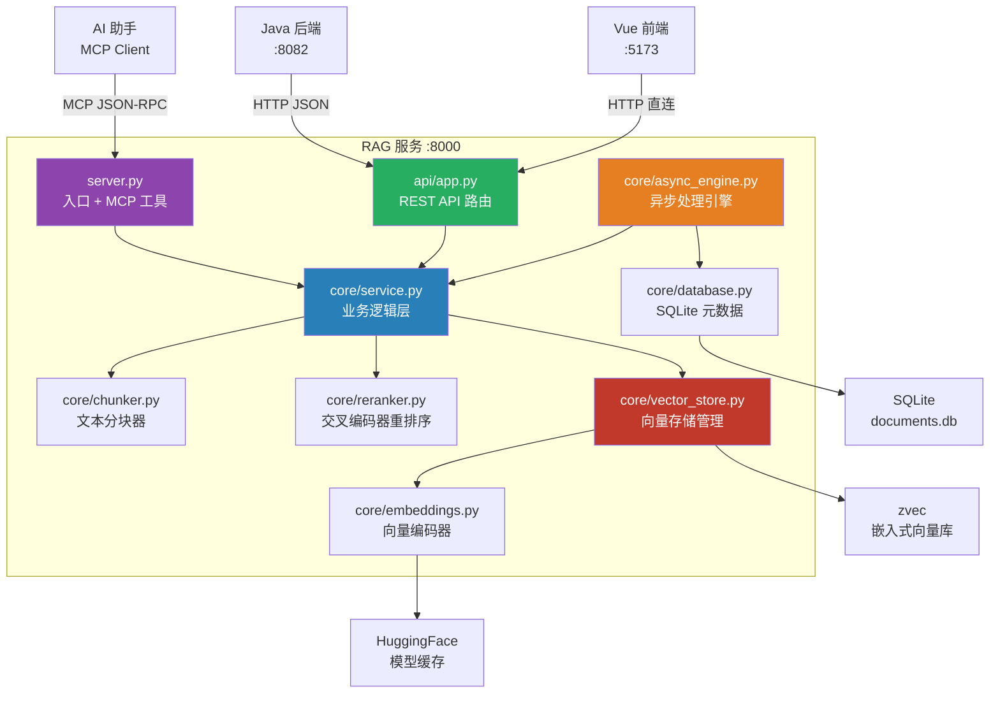
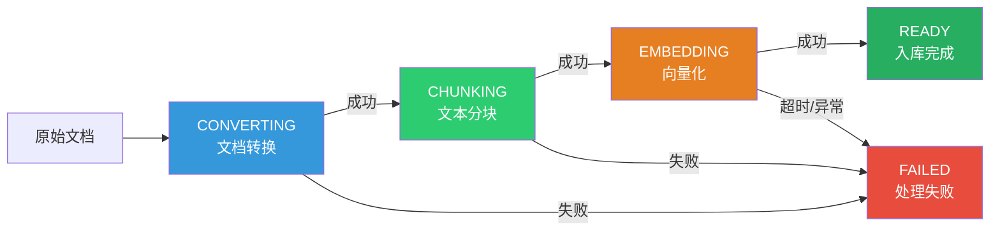
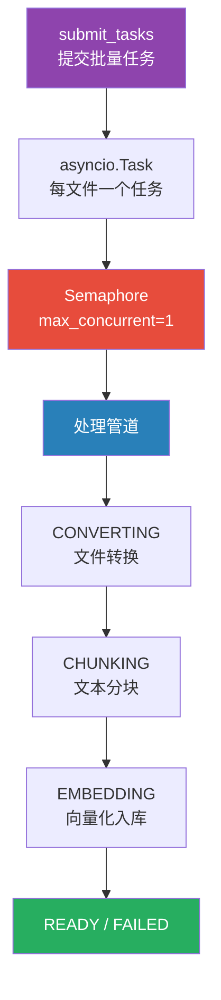

# RAG Python 服务 (rag-service)

> 独立的 Python RAG（检索增强生成）知识库服务，基于 zvec 嵌入式向量数据库和 sentence-transformers 模型，同时提供 MCP 工具接口和 REST API，支持文档导入、语义搜索、异步批处理等完整的知识库管理能力。

## 目录

- [1. 服务概述](#1-服务概述)
- [2. 架构总览](#2-架构总览)
- [3. RAG 管道](#3-rag-管道)
- [4. 组件职责](#4-组件职责)
- [5. MCP 工具接口](#5-mcp-工具接口)
- [6. REST API](#6-rest-api)
- [7. 异步引擎](#7-异步引擎)
- [8. 数据模型与存储](#8-数据模型与存储)
- [9. 配置与环境变量](#9-配置与环境变量)
- [10. 启动与运行模式](#10-启动与运行模式)
- [11. 跨模块引用](#11-跨模块引用)

---

## 1. 服务概述

RAG 服务是 CodingHub 的**文档智能处理引擎**，负责将原始文档转化为可搜索的向量知识库。它作为独立 Python 进程运行，与 Java 后端通过 HTTP 通信，同时也可通过 MCP 协议被 AI 助手直接调用。

### 核心能力

| 能力 | 说明 |
|------|------|
| 文档导入 | 支持文本文件（md, txt, py, js 等）和二进制文档（pdf, docx, pptx, xlsx） |
| 文本分块 | 三种策略：递归字符分割、语义分块、结构化分块 |
| 向量化 | 基于 sentence-transformers 模型（默认 all-MiniLM-L6-v2） |
| 语义搜索 | 向量相似度检索 + 可选的交叉编码器重排序 |
| 异步处理 | 基于 asyncio + Semaphore 的并发控制引擎 |
| MCP 集成 | 12 个 MCP 工具，可被 AI 助手直接调用 |
| REST API | 完整的 HTTP 接口，供 Web 前端和 Java 后端调用 |

### 技术栈

| 组件 | 技术 |
|------|------|
| Web 框架 | Starlette（无 FastAPI 依赖） |
| MCP 框架 | FastMCP |
| 向量数据库 | zvec（嵌入式，本地文件存储） |
| Embedding 模型 | sentence-transformers/all-MiniLM-L6-v2（可配置） |
| 重排序模型 | BAAI/bge-reranker-v2-m3（可选） |
| 文档转换 | markitdown + openpyxl |
| 元数据存储 | SQLite（WAL 模式） |

---

## 2. 架构总览



### 双入口设计

RAG 服务拥有两个入口，共享同一套业务逻辑：

| 入口 | 协议 | 调用方 | 说明 |
|------|------|--------|------|
| `server.py` MCP 工具 | MCP JSON-RPC | AI 助手（QoderWork、Claude Desktop） | 12 个工具函数 |
| `api/app.py` REST API | HTTP JSON | Java 后端、Vue 前端 | 12 个 HTTP 端点 |

两者通过 `core/service.py` 共享所有业务逻辑，确保行为一致性。

---

## 3. RAG 管道

RAG 管道是服务的核心，涵盖从文档导入到搜索检索的完整链路。

### 3.1 导入管道（Ingest Pipeline）



#### 阶段 1：文档转换（CONVERTING）

将各类文档格式转换为纯文本：

| 文件类型 | 处理方式 |
|----------|---------|
| 文本文件（.md, .py, .txt 等） | 直接读取（UTF-8） |
| .pdf, .docx, .pptx | markitdown 转换为 Markdown |
| .xlsx, .xls | openpyxl 直接读取，转为 Markdown 表格 |

xlsx 文件由自定义 `_convert_xlsx` 函数处理（因 markitdown 0.0.2 对 xlsx 存在 hang 问题）。每个 sheet 转为一个 Markdown 表格，空行自动过滤。

#### 阶段 2：文本分块（CHUNKING）

提供三种分块策略，由集合配置中的 `chunk_mode` 决定：

**递归字符分割（recursive）**
- 按段落 → 句子 → 字符逐层递归分割
- 支持中英文标点句子边界检测（`。！？.!?`）
- 相邻块之间保留 `chunk_overlap` 字符重叠
- 默认策略，适合通用文本

**语义分块（semantic）**
- 使用 embedding 模型编码每个句子
- 计算相邻句子的余弦相似度
- 动态阈值 = 均值 - 1 倍标准差
- 相似度低于阈值处切分
- 过大的组回退到递归字符分割
- 适合主题多样的长文档

**结构化分块（structural）**
- 识别 Markdown 标题、围栏代码块、表格作为结构边界
- 每个块保留其所属标题前缀，确保 LLM 获得章节上下文
- 过大的结构块回退到递归字符分割
- 适合技术文档、Markdown 知识库

每种策略生成的 `Chunk` 对象包含：

```python
@dataclass
class Chunk:
    text: str          # 文本内容
    source: str        # 源文件路径
    chunk_index: int   # 在文档中的位置索引
    doc_id: str        # sha256(source)[:16]
```

#### 阶段 3：向量化与入库（EMBEDDING）

1. 调用 `EmbeddingService.encode()` 将文本块批量编码为归一化向量
2. 构建 zvec `DocList`，每个文档包含向量 + 元数据字段
3. 分批插入（每批最多 1024 条，zvec 限制）
4. 注册到 `_registry.json`（记录 chunk_count、file_hash）

### 3.2 搜索管道（Search Pipeline）


#### 查询编码

`encode_query` 在查询文本前添加 `"query: "` 前缀，这是 Qwen3-Embedding 等模型推荐的非对称检索模式（短查询 vs 长文档），可提升检索相关性。

#### 向量检索

使用 zvec 的 `query` 方法执行近似最近邻搜索。当启用过滤或重排序时，会先获取更多候选（`fetch_k = max(top_k * 5, 20)`），后续再裁剪。

#### 源文件过滤

支持 glob 模式过滤（如 `*.md`、`**/docs/*`），使用 Python `fnmatch` 模块匹配 `source` 字段。

#### 重排序（Rerank）

可选的交叉编码器重排序，使用 `BAAI/bge-reranker-v2-m3` 模型：

1. 构建 `(query, text)` 对
2. CrossEncoder 对每个对打分
3. 按 rerank_score 降序排列
4. 截取 top_n 结果

重排序比双编码器余弦相似度更精确，但速度较慢，适合对结果质量要求高的场景。

#### 上下文扩展（expand_context）

当 `expand_context > 0` 时，为每个搜索结果获取前后各 N 个相邻块：

1. 根据 `doc_id` 和 `chunk_index` 计算邻居 ID（如 `doc_id_11`, `doc_id_12`, `doc_id_13`）
2. 使用 zvec `fetch` 批量获取邻居块
3. 合并去重，按 `chunk_index` 排序
4. 拼接为扩展文本，为 LLM 提供更完整的上下文

---

## 4. 组件职责

### 4.1 server.py — 服务入口与 MCP 工具

**文件路径**：`rag/server.py`

服务的主入口文件，负责：

- 解析命令行参数（`--mode`、`--host`、`--port`、`--api`）
- 创建 FastMCP 实例并注册 12 个 MCP 工具
- 在 SSE/Streamable HTTP 模式下创建组合 ASGI 应用（REST API + MCP 共享端口）
- 配置日志（输出到 stderr，stdout 保留给 MCP JSON-RPC）

#### MCP 工具注册

每个工具使用 `@mcp.tool()` 装饰器注册，内部委托给 `core/service.py` 的同名函数。工具返回值为格式化字符串（MCP 协议要求）。

### 4.2 core/service.py — 业务逻辑层

**文件路径**：`rag/core/service.py`

MCP 工具和 REST API 共享的核心业务层，职责包括：

| 职责 | 函数 |
|------|------|
| 文件导入 | `ingest_file`, `ingest_content` |
| 文档管理 | `delete_document`, `download_document`, `list_documents` |
| 集合管理 | `list_collections`, `delete_collection` |
| 语义搜索 | `search` |
| 配置管理 | `get_collection_config`, `set_collection_config` |
| 文件读取 | `read_file_content` |
| 变更检测 | `_compute_file_hash`, `_get_registry_hash` |
| 配置解析 | `_resolve_config` |

#### 变更检测机制

`ingest_file` 在导入前计算文件 SHA256 哈希，与 `_registry.json` 中存储的哈希比对：

- 哈希一致 → 跳过导入（返回 `status: "skipped"`）
- 哈希不同或 `force=True` → 删除旧块，重新导入

这避免了对未变更文件的重复处理，显著提升批量导入效率。

#### 单例管理

`service.py` 维护两个全局单例：

- `VectorStore _store`：向量存储管理器
- `MarkItDown _markitdown`：文档转换器

通过 `get_store()` 和 `_get_markitdown()` 延迟初始化。

### 4.3 core/chunker.py — 文本分块器

**文件路径**：`rag/core/chunker.py`

三种分块策略的实现：

| 函数 | 策略 | 适用场景 |
|------|------|---------|
| `chunk_text` | 递归字符分割 | 通用文本 |
| `semantic_chunk_text` | 语义相似度分块 | 主题多样的长文档 |
| `structural_chunk_text` | 文档结构分块 | Markdown/技术文档 |

辅助函数：

| 函数 | 说明 |
|------|------|
| `compute_doc_id` | 基于文件路径 SHA256 前 16 位计算稳定文档 ID |
| `_recursive_split` | 段落 → 行 → 句子 → 字符的递归分割 |
| `_merge_segments` | 将小段合并为块，大段递归分割 |
| `_dynamic_threshold` | 语义分块的动态断点阈值（mean - 1*std） |
| `_parse_structural_blocks` | 解析 Markdown 结构（标题、代码块、表格） |

### 4.4 core/embeddings.py — 向量编码器

**文件路径**：`rag/core/embeddings.py`

基于 sentence-transformers 的 embedding 服务：

- **单例模式**：`__new__` + `_load_lock` 双重检查锁确保线程安全
- **延迟加载**：模型在首次调用时从 HuggingFace 下载并缓存到 `~/.cache/huggingface/`
- **HuggingFace 镜像**：自动设置 `HF_ENDPOINT=https://hf-mirror.com`，加速国内下载
- **归一化向量**：所有输出向量经过 L2 归一化，点积等价于余弦相似度
- **自动维度检测**：通过编码测试句子检测实际向量维度

| 方法 | 说明 |
|------|------|
| `encode(texts, batch_size)` | 批量编码文本为归一化向量 |
| `encode_query(query)` | 编码查询（添加 `"query: "` 前缀） |
| `dimension` | 返回模型向量维度 |

### 4.5 core/reranker.py — 交叉编码器重排序

**文件路径**：`rag/core/reranker.py`

基于 CrossEncoder 的重排序服务：

- **单例 + 延迟加载**：与 [EmbeddingService](../rag\core\embeddings.py) 相同模式
- **模型**：默认 `BAAI/bge-reranker-v2-m3`
- **输入**：`(query, text)` 对
- **输出**：每个候选文档附加 `rerank_score`，按分数降序排列

### 4.6 core/vector_store.py — 向量存储管理

**文件路径**：`rag/core/vector_store.py`

zvec 向量数据库的封装层，管理所有集合的向量存储与检索：

| 方法 | 说明 |
|------|------|
| `ingest_chunks` | 批量插入文本块向量（每批 1024 条） |
| `search` | 语义搜索（向量近邻查询） |
| `fetch_neighbors` | 获取指定块的相邻块（上下文扩展） |
| `delete_document` | 删除文档的所有向量块 |
| `delete_collection` | 删除整个集合目录 |
| `register_document` | 注册文档到 `_registry.json` |
| `get/set_collection_config` | 集合配置管理（`_config.json`） |

#### 集合存储布局

```
data/
├── {collection_name}/
│   ├── db/                    # zvec 向量数据
│   ├── _registry.json         # 文档注册表（path → chunk_count, doc_id, file_hash）
│   └── _config.json           # 集合配置（chunk_mode, chunk_size 等）
└── _uploads/
    └── {collection_name}/     # 上传文件存储
```

#### zvec Schema

每个集合的向量 schema：

| 字段 | 类型 | 说明 |
|------|------|------|
| `embedding` | VECTOR_FP32 | 向量（维度由 embedding 模型决定） |
| `text` | STRING | 文本块内容 |
| `source` | STRING | 源文件路径 |
| `chunk_index` | INT64 | 在文档中的位置索引 |

文档 ID 格式：`{doc_id}_{chunk_index}`（如 `a3f2c1d8e9b74506_12`）

### 4.7 core/database.py — SQLite 元数据存储

**文件路径**：`rag/core/database.py`

文档处理状态的持久化层，使用 SQLite WAL 模式支持并发读写：

| 职责 | 说明 |
|------|------|
| 状态追踪 | UPLOADING → CONVERTING → CHUNKING → EMBEDDING → READY/FAILED |
| 批处理限制 | 单次最多 20 个文件（`MAX_BATCH_FILES`） |
| 崩溃恢复 | 启动时将中间状态的文档恢复或标记为失败 |
| 线程安全 | 线程本地连接 + WAL 模式 |

### 4.8 api/app.py — REST API 路由

**文件路径**：`rag/api/app.py`

基于 Starlette 的 HTTP 路由层，详见 [第 6 节](#6-rest-api)。

---

## 5. MCP 工具接口

`server.py` 通过 FastMCP 注册 12 个工具，可被 AI 助手直接调用：

| 工具 | 说明 |
|------|------|
| `search` | 语义搜索，支持过滤、重排序、上下文扩展 |
| `ingest_file` | 导入单个文件 |
| `ingest_directory` | 批量导入目录下所有文件 |
| `ingest_url` | 从 URL 下载文件并导入 |
| `upload_info` | 返回 HTTP 上传端点信息和使用说明 |
| `document_status` | 查询文档处理状态 |
| `list_collections` | 列出所有集合 |
| `list_documents` | 列出集合中的所有文档 |
| `delete_document` | 删除单个文档及其向量块 |
| `delete_collection` | 删除整个集合 |
| `configure_collection` | 配置集合默认参数 |
| `get_collection_config` | 查看集合配置 |

### MCP 传输模式

| 模式 | 说明 |
|------|------|
| `stdio` | 标准输入/输出，适用于 QoderWork/Claude Desktop |
| `sse` | Server-Sent Events，适用于远程连接 |
| `streamable-http` | Streamable HTTP，新一代 MCP 传输 |

---

## 6. REST API

REST API 通过 Starlette 路由提供 HTTP 接口，在 SSE/Streamable HTTP 模式下与 MCP 共享同一端口。

### 6.1 端点列表

| 方法 | 路径 | 说明 |
|------|------|------|
| `GET` | `/api/health` | 健康检查 |
| `GET` | `/api/collections` | 列出所有集合 |
| `GET` | `/api/collections/{name}/documents` | 列出文档（向量库注册表） |
| `POST` | `/api/collections/{name}/documents` | 单文件上传（同步） |
| `POST` | `/api/collections/{name}/documents/batch` | 批量上传（异步，返回 202） |
| `GET` | `/api/collections/{name}/documents/status` | 所有文档处理状态 |
| `GET` | `/api/collections/{name}/documents/{id}/status` | 单个文档状态 |
| `DELETE` | `/api/collections/{name}/documents` | 删除文档 |
| `GET` | `/api/collections/{name}/documents/download` | 下载源文件 |
| `DELETE` | `/api/collections/{name}` | 删除整个集合 |
| `POST` | `/api/collections/{name}/search` | 语义搜索 |
| `GET` | `/api/collections/{name}/config` | 获取集合配置 |
| `PUT` | `/api/collections/{name}/config` | 更新集合配置 |

### 6.2 单文件上传（同步）

`POST /api/collections/{name}/documents`

- 接受 `multipart/form-data`，字段名 `file`
- 可选查询参数：`chunk_size`、`chunk_mode`
- 文本文件直接解码导入；二进制文件先保存到 `_uploads/`，再通过 markitdown 转换
- 同步处理，返回导入结果

### 6.3 批量上传（异步）

`POST /api/collections/{name}/documents/batch`

- 接受多个 `files` 字段
- 单次最多 20 个文件（`MAX_BATCH_FILES`）
- 返回 202 Accepted，包含文档 ID 和初始 `UPLOADING` 状态
- 文件由 `AsyncEngine` 在后台异步处理
- 客户端通过状态端点轮询处理进度

### 6.4 语义搜索

`POST /api/collections/{name}/search`

**请求体**：

```json
{
  "query": "如何实现 RAG 检索增强",
  "top_k": 5,
  "rerank": true,
  "filter": "*.md",
  "expand_context": 1
}
```

**响应**：

```json
[
  {
    "id": "a3f2c1d8_12",
    "score": 0.87,
    "text": "RAG 通过将文档分块并向量化...",
    "source": "docs/rag-guide.md",
    "chunk_index": 12,
    "rerank_score": 0.95
  }
]
```

### 6.5 CORS 配置

通过环境变量 `RAG_CORS_ORIGINS` 配置允许的源（默认 `*`），支持 GET/POST/PUT/DELETE/OPTIONS 方法。

### 6.6 文件名编码修复

`_fix_filename_encoding` 函数处理 Windows curl 上传时常见的编码问题：

- 中文 Windows curl 发送 GBK 编码文件名
- HTTP multipart 解析器按 Latin-1 解释字节
- 导致乱码（如 `'ÊÛÇ°¼¼ÊõÖ¸ÄÏ'`）
- 自动尝试 Latin-1 → GBK → UTF-8 解码修复

---

## 7. 异步引擎

### 7.1 设计目标

`AsyncEngine` 解决批量文件上传时的资源竞争问题。Embedding 模型（all-MiniLM-L6-v2 或更大的模型）是 CPU/GPU 密集型操作，不受限的并发会导致：

- CPU 饱和，小文件也可能超时
- 内存溢出（OOM）
- 所有任务互相争抢资源，全部失败

### 7.2 架构



### 7.3 并发控制

- **Semaphore 限制**：默认 `max_concurrent=1`（通过 `RAG_MAX_CONCURRENT` 环境变量配置）
- **单文档超时**：默认 600 秒（通过 `RAG_PROCESS_TIMEOUT` 配置）
- **线程池桥接**：CPU 密集操作通过 `asyncio.to_thread` 在后台线程执行，不阻塞事件循环

### 7.4 处理管道

每个文件经历以下阶段，状态实时更新到 SQLite：

| 阶段 | 状态 | 操作 | 执行方式 |
|------|------|------|---------|
| 1 | CONVERTING | 读取并转换文件内容 | `asyncio.to_thread` |
| 2 | CHUNKING | 文本分块 | `asyncio.to_thread` |
| 3 | EMBEDDING | 向量化 + 插入 zvec | `asyncio.to_thread` |
| 4 | READY | 成功完成 | — |
| — | FAILED | 任何阶段失败或超时 | — |

### 7.5 崩溃恢复

服务启动时，`Database.mark_stale_as_failed()` 扫描处于中间状态的文档：

- 源文件仍存在 → 重置为 `UPLOADING`，重新提交到 [AsyncEngine](../rag\core\async_engine.py)
- 源文件已丢失 → 标记为 `FAILED`（"服务重启，源文件已丢失"）

恢复的文档在首次 API 请求时延迟提交（`_flush_recovery`），确保事件循环已启动。

---

## 8. 数据模型与存储

### 8.1 SQLite documents 表

| 字段 | 类型 | 说明 |
|------|------|------|
| `id` | INTEGER PK | 自增主键 |
| `collection` | TEXT NOT NULL | 集合名称 |
| `filename` | TEXT NOT NULL | 原始文件名 |
| `filepath` | TEXT NOT NULL | 存储路径 |
| `file_size` | INTEGER | 文件大小（字节） |
| `uploader` | TEXT | 上传者 |
| `status` | TEXT NOT NULL | 处理状态 |
| `chunk_count` | INTEGER | 分块数量 |
| `chunk_mode` | TEXT | 使用的分块策略 |
| `error_message` | TEXT | 失败原因 |
| `created_at` | DATETIME | 创建时间 |
| `updated_at` | DATETIME | 更新时间 |

**唯一约束**：`(collection, filepath)` — 同集合内路径唯一。

**索引**：
- `idx_doc_collection_status` → `(collection, status)`
- `idx_doc_created` → `(collection, created_at DESC)`

### 8.2 文档状态机

```
UPLOADING → CONVERTING → CHUNKING → EMBEDDING → READY
    ↓           ↓            ↓           ↓
  FAILED     FAILED       FAILED      FAILED
```

- 中间状态（UPLOADING ~ EMBEDDING）在服务重启时自动恢复
- 终态（READY / FAILED）不受重启影响

### 8.3 _registry.json

每个集合维护一个文档注册表，用于：

- 变更检测（存储 `file_hash`）
- 快速计算待删除的 chunk ID 列表（存储 `chunk_count`）
- 列出文档及其分块数

```json
{
  "/abs/path/to/file.md": {
    "chunk_count": 42,
    "doc_id": "a3f2c1d8e9b74506",
    "file_hash": "sha256hex..."
  }
}
```

### 8.4 _config.json

每个集合的配置文件，默认值：

```json
{
  "chunk_mode": "structural",
  "chunk_size": 800,
  "chunk_overlap": 50,
  "rerank": true,
  "description": ""
}
```

---

## 9. 配置与环境变量

| 环境变量 | 默认值 | 说明 |
|----------|--------|------|
| `RAG_MCP_MODE` | `stdio` | MCP 传输模式 |
| `RAG_MCP_HOST` | `127.0.0.1` | 绑定地址 |
| `RAG_MCP_PORT` | `8000` | 绑定端口 |
| `RAG_DATA_DIR` | `./data/` | 数据存储目录 |
| `RAG_EMBEDDING_MODEL` | `sentence-transformers/all-MiniLM-L6-v2` | Embedding 模型 |
| `RAG_RERANKER_MODEL` | `BAAI/bge-reranker-v2-m3` | 重排序模型 |
| `RAG_MAX_CONCURRENT` | `1` | 最大并发处理数 |
| `RAG_PROCESS_TIMEOUT` | `600` | 单文档处理超时（秒） |
| `RAG_EMBEDDING_BATCH_SIZE` | `32` | 编码批大小 |
| `RAG_CORS_ORIGINS` | `*` | 允许的 CORS 源 |
| `HF_ENDPOINT` | `https://hf-mirror.com` | HuggingFace 镜像 |

---

## 10. 启动与运行模式

### 10.1 命令行用法

```bash
# stdio 模式（默认，用于 QoderWork/Claude Desktop）
python server.py

# SSE + REST API
python server.py --mode sse

# SSE 模式，禁用 REST API
python server.py --mode sse --no-api

# Streamable HTTP + REST API，绑定所有接口
python server.py --mode streamable-http --host 0.0.0.0
```

### 10.2 组合应用架构

在 SSE/Streamable HTTP + API 模式下，`_create_combined_app` 创建统一的 Starlette ASGI 应用：

```
http://host:port/
├── /api/*          → REST API 路由（api/app.py）
├── /mcp            → MCP Streamable HTTP
├── /sse            → MCP SSE
└── /messages/      → MCP SSE 消息端点
```

所有路由共享同一端口，通过 CORS 中间件支持跨域访问。

### 10.3 与 Java 后端的集成

Java 后端通过 [knowledge-base](knowledge-base.md) 模块的 `RagApiClient` 调用 RAG 服务的 REST API：

| 场景 | 调用方 | 端点 |
|------|--------|------|
| 创建知识库时初始化配置 | Java `RagApiClient` | `PUT /api/collections/{name}/config` |
| 删除知识库时清理集合 | Java `RagApiClient` | `DELETE /api/collections/{name}` |
| 前端搜索代理 | Java `RagApiClient` | `POST /api/collections/{name}/search` |
| 文档上传/管理 | Vue 前端（直连） | `POST /api/collections/{name}/documents/batch` |

---

## 11. 跨模块引用

| 相关模块 | 关系 | 说明 |
|----------|------|------|
| [knowledge-base](knowledge-base.md) | 被调用 | Java 后端通过 `RagApiClient` 调用本服务的 REST API |
| [mcp-service](mcp-service.md) | 并列 | Java 后端的 MCP 模块提供工具搜索等能力，可与本服务的 MCP 工具互补 |
| [backend-infra](backend-infra.md) | 配置依赖 | Java 端的 `RagClientConfig` 和 `app.rag.*` 配置决定了与本服务的连接方式 |

### 调用关系总结

```
┌─────────────────────────────────────────────────────┐
│                    CodingHub 平台                     │
│                                                       │
│  ┌──────────┐     ┌─────────────┐    ┌───────────┐  │
│  │ Vue 前端  │────→│ Java 后端   │───→│ RAG 服务  │  │
│  │  :5173   │     │   :8082     │    │  :8000    │  │
│  └────┬─────┘     └─────────────┘    └─────┬─────┘  │
│       │                                     │        │
│       │         文档上传（直连）              │        │
│       └─────────────────────────────────────→│        │
│                                              │        │
│  ┌──────────┐     MCP JSON-RPC              │        │
│  │ AI 助手  │───────────────────────────────→│        │
│  └──────────┘                                │        │
└─────────────────────────────────────────────────────┘
```

---

*本服务代码位于 `rag/` 目录下：`server.py`（入口）、`api/app.py`（REST API）、`core/`（核心模块）。*
