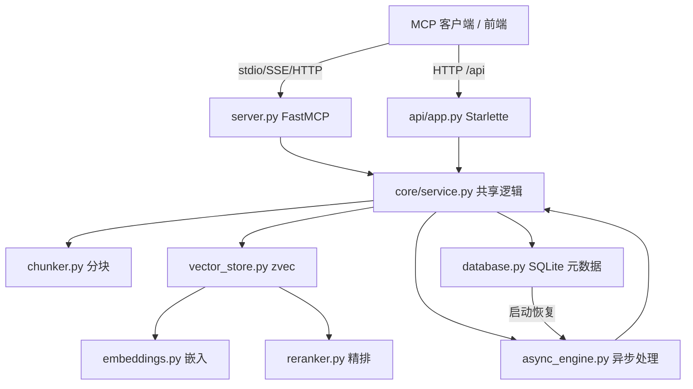

# RAG 知识库服务（RAG Knowledge Base）

## 模块简介

RAG 服务是独立的 **Python** 微服务（`rag/`），为 CodingHub 提供检索增强生成（RAG）能力：将文档切分、向量化、存入嵌入式向量库，并提供语义搜索与文档管理。它以 **MCP Server** 形式对外（供 AI 客户端检索）并暴露 **REST API**（供前端 [前端应用](frontend-app.md) [知识库模块](knowledge-base.md) 直接管理文档）。

- 技术栈：FastMCP（MCP SDK）+ Starlette（REST）+ [zvec](https://github.com/alibaba/zvec) 嵌入式向量库 + sentence-transformers（嵌入/Reranker）
- 入口：`server.py`（MCP 工具定义 + 组合 ASGI）；`api/app.py`（REST 路由）；`core/*`（业务逻辑）
- 传输模式：`stdio`（默认，AI 客户端）/ `sse` / `streamable-http`（后两者启用 REST API，默认端口 8000）
- 嵌入模型：默认 `sentence-transformers/all-MiniLM-L6-v2`（384 维，CPU 友好，可经 `RAG_EMBEDDING_MODEL` 切换）；Reranker：`BAAI/bge-reranker-v2-m3`（cross-encoder）

## 架构图

## 核心组件职责

### `server.py` — MCP 入口与组合 ASGI
- 用 FastMCP 注册 **12 个 MCP 工具**：`search`、`ingest_file`、`ingest_directory`、`ingest_url`、`upload_info`、`document_status`、`list_collections`、`list_documents`、`delete_document`、`delete_collection`、`configure_collection`、`get_collection_config`。
- `_create_combined_app()`：将 REST 路由与 MCP 路由（`/mcp` 或 `/sse`）合并到同一 Starlette 应用，共用 `/api/*` 与 MCP 端口。
- `main()`：按 `--mode`（stdio/sse/streamable-http）与 `--api/--no-api` 选择启动方式；`--mode sse`/`streamable-http` 下默认启用 REST API。

### `api/app.py` — REST API（Starlette）
路由（前缀 `/api`）：
- `GET /api/health` 健康检查（首次请求触发崩溃恢复）
- `GET /api/collections` 列出集合
- `GET|POST|DELETE /api/collections/{name}/documents` 文档列表/单文件上传(同步)/删除
- `POST /api/collections/{name}/documents/batch` 批量上传（**异步**，返回 202 + UPLOADING 状态）
- `GET /api/collections/{name}/documents/status` 与 `/{doc_id}/status` 状态查询
- `GET /api/collections/{name}/documents/download` 下载（含路径穿越防护）
- `DELETE /api/collections/{name}` 删除集合
- `POST /api/collections/{name}/search` 语义搜索
- `GET|PUT /api/collections/{name}/config` 配置读写
- `_fix_filename_encoding()`：修复中文 Windows curl 以 GBK 发送的乱码文件名（Latin-1→GBK/UTF-8 探测）。
- `get_cors_middleware()`：由 `RAG_CORS_ORIGINS`（默认 `*`）控制跨域。

### `core/service.py` — 共享业务逻辑
- 持有 `VectorStore` 单例（`get_store()`），提供 `ingest_file`/`ingest_content`/`delete_document`/`search`/`list_*`/`delete_collection`/`*_collection_config`，供 MCP 与 REST 共用。
- **变更检测**：`_compute_file_hash`（SHA256）对比 `_registry.json` 中 `file_hash`，未变更则 `skipped`（可由 `force=True` 强制）。
- `search()`：解析 `rerank`→拉取更多候选→`filter` glob 过滤→可选 `RerankerService.rerank`→`expand_context` 取相邻 chunk 扩展上下文。
- 文件读取：`read_file_content()` 文本直接读；二进制（PDF/DOCX/PPTX/XLSX）经 markitdown；XLSX 用 openpyxl 自实现（规避 markitdown 0.0.2 卡死）；`download_document()` 用 `os.path.realpath` 防路径穿越。

### `core/vector_store.py` — zvec 封装
- `VectorStore` 线程安全（`threading.Lock`）；每集合存于 `data/{name}/`（schema：`embedding` VECTOR_FP32 + `text`/`source`/`chunk_index` STRING/INT64）。
- `ingest_chunks()`：按 zvec 上限 1024 分批插入；`search()` 用 `query: ` 前缀编码查询；`fetch_neighbors()` 供上下文扩展；`delete_document()` 用 `doc_id_` 前缀批量删除（fast path 走 registry，slow path 探测）。
- 集合配置 `_config.json`（默认 `structural`/`800`/`50`/`rerank=True`）；崩溃后自动重建损坏集合目录（Windows 空目录特例处理）。

### `core/embeddings.py` 与 `core/reranker.py`
- `EmbeddingService` / `RerankerService` 均为**懒加载单例**，首次调用从 HuggingFace 下载并缓存（`HF_ENDPOINT=https://hf-mirror.com` 适配国内）。
- 嵌入：`encode()` 批量（默认 batch 32，`normalize_embeddings=True`）；`encode_query()` 加 `query: ` 前缀做非对称检索。

### `core/chunker.py` — 三种分块策略
- `chunk_text`（递归字符：段→句→字符）、`semantic_chunk_text`（句向量相似度动态阈值 `mean-1σ` 断点）、`structural_chunk_text`（识别 Markdown 标题/代码块/表格，chunk 带标题前缀）。
- `compute_doc_id()`：`sha256(normpath(abspath))[:16]`，稳定文档 ID。

### `core/async_engine.py` 与 `core/database.py`
- `AsyncEngine`：`asyncio.Semaphore` 控制并发（CPU 仅嵌入，`MAX_CONCURRENT` 默认 1，避免 CPU 争用超时）；文档流水线 `CONVERTING→CHUNKING→EMBEDDING→READY/FAILED`，单文档超时 `RAG_PROCESS_TIMEOUT`（默认 600s）。
- `Database`：SQLite（`documents.db`，WAL 模式）存文档元数据与状态；`mark_stale_as_failed()` 启动时将中间态文档恢复（源文件存在→重置 UPLOADING 重投，丢失→FAILED）；`MAX_BATCH_FILES=20`。

## 关键 API（REST 摘要）

| 方法 | 路径 | 说明 |
|------|------|------|
| POST | `/api/collections/{name}/documents/batch` | 批量上传（异步，返回 202） |
| POST | `/api/collections/{name}/documents` | 单文件上传（同步） |
| POST | `/api/collections/{name}/search` | 语义搜索（`query`/`top_k`/`rerank`/`filter`/`expand_context`） |
| GET | `/api/collections/{name}/documents/status` | 文档处理状态 |
| PUT | `/api/collections/{name}/config` | 更新集合配置 |

> 文档状态枚举：`UPLOADING → CONVERTING → CHUNKING → EMBEDDING → READY | FAILED`。

## 环境变量速查

| 变量 | 说明 | 默认 |
|---|---|---|
| `RAG_MCP_MODE` | stdio/sse/streamable-http | `stdio` |
| `RAG_MCP_HOST` / `RAG_MCP_PORT` | 绑定地址/端口 | `127.0.0.1` / `8000` |
| `RAG_EMBEDDING_MODEL` / `RAG_RERANKER_MODEL` | 模型名 | all-MiniLM-L6-v2 / bge-reranker-v2-m3 |
| `RAG_DATA_DIR` | 向量数据目录 | `./data` |
| `RAG_CORS_ORIGINS` | 允许跨域来源 | `*` |
| `RAG_MAX_CONCURRENT` / `RAG_PROCESS_TIMEOUT` | 并发/超时(秒) | `1` / `600` |

## 依赖关系（🔗 CodeGraph 增强）

- **被依赖方**：[前端应用](frontend-app.md) 的 `knowledge.ts` 直连本服务做文档管理/配置/状态（搜索经 [知识库模块](knowledge-base.md) Java 代理）；[MCP 服务模块](mcp-service.md) 经 `/mcp` 或 `/sse` 调用 `search` 等工具。
- **下游**：`service.py` → `chunker`/`vector_store`/`database`；`vector_store` → `embeddings`/`reranker`；`async_engine` → `database`+`service`。
- **变更影响**：改变 `DEFAULT_COLLECTION_CONFIG` 默认值影响所有新集合分块；改 `_registry.json` 并发安全（Roadmap 计划加文件锁）可能影响高并发上传。

## 相关模块

- [知识库模块](knowledge-base.md) — Java 侧 KB 实体与搜索代理
- [前端应用](frontend-app.md) — `knowledge.ts` 直连调用方
- [MCP 服务模块](mcp-service.md) — `rag_search`/`rag_ingest` 等工具代理
