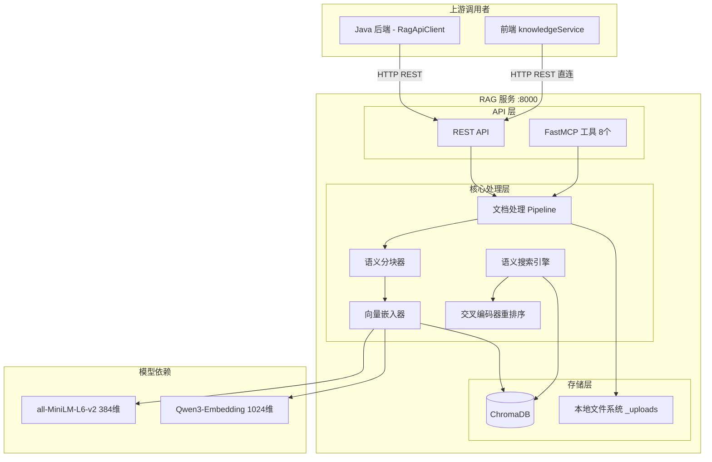
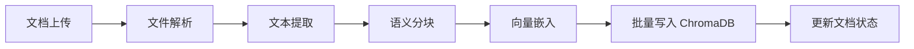
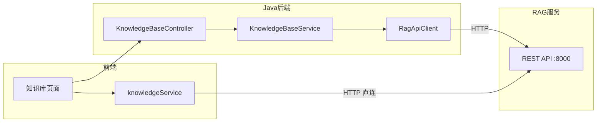

# RAG 知识库服务

## 模块简介

RAG（Retrieval-Augmented Generation）知识库服务是 CodingHub 平台的独立 Python 微服务，基于 **FastAPI + FastMCP** 框架构建，运行在端口 8000。该服务为平台提供文档智能管理能力，包括文档解析、语义分块、向量嵌入、语义搜索和交叉编码器重排序（Rerank）等完整的 RAG 处理流水线。

本模块共计 80 个组件，通过 REST API 和 MCP 协议（8 个工具）双通道对外暴露服务。Java 后端通过 RagApiClient 代理知识库的 CRUD 和搜索请求，而前端在文档操作场景下直连 RAG 服务。服务使用 ChromaDB 作为向量数据库，默认采用 all-MiniLM-L6-v2 模型（384 维）进行文本向量化，可选切换至 Qwen3-Embedding-0.6B（1024 维）获得更高精度。

---

## 架构概览



---

## 核心服务

### 文档处理 Pipeline

文档处理流水线是 RAG 服务的核心能力，将原始文档转化为可检索的向量表示：



**处理阶段说明：**

| 阶段 | 说明 | 技术细节 |
|------|------|----------|
| 文件解析 | 根据文件类型提取原始内容 | 文本文件直接读取，二进制文件写入 `_uploads` 目录，XLSX 使用 openpyxl |
| 文本提取 | 将非结构化文件转为纯文本 | 支持 TXT、MD、PDF、DOCX、XLSX 等格式 |
| 语义分块 | 按语义边界切分文本 | mean-1σ 阈值算法，Markdown 默认 chunk_size=800, overlap=50 |
| 向量嵌入 | 将文本块转为向量表示 | 默认 all-MiniLM-L6-v2（384 维），可选 Qwen3-Embedding-0.6B（1024 维） |
| 批量写入 | 向量数据持久化到 ChromaDB | 批量插入 1024 条/批次，失败降级逐条插入 + 重试机制 |
| 状态更新 | 标记文档处理完成 | 状态流转: PENDING → PROCESSING → COMPLETED / FAILED |

### 语义分块策略

语义分块器采用基于统计的自适应切分策略：

- **算法**：mean-1σ 阈值 — 计算文本段落长度的均值和标准差，以 `mean - 1σ` 作为切分边界
- **默认参数**：`chunk_size = 800`（字符数），`overlap = 50`（重叠字符数）
- **Markdown 特殊处理**：按标题层级优先分割，保持章节结构完整性
- **适用场景**：长文档处理时比固定长度分块更能保持语义完整性

### 向量嵌入

| 模型 | 维度 | 说明 |
|------|------|------|
| all-MiniLM-L6-v2 | 384 | 默认模型，轻量高效，适合通用场景 |
| Qwen3-Embedding-0.6B | 1024 | 可选模型，更高精度，适合专业领域文档 |

- 模型通过 HuggingFace 加载，使用 `hf-mirror.com` 作为镜像源
- 模型首次使用时自动下载并缓存到本地

### 交叉编码器重排序（Rerank）

搜索结果的二次精排机制：

1. 首先通过向量相似度检索获取候选文档集
2. 使用交叉编码器（Cross-Encoder）对查询-文档对进行相关性打分
3. 按相关性分数重新排序，返回 Top-K 结果

Rerank 显著提升搜索精度，尤其在查询与文档表面相似度低但语义相关的场景下效果明显。

### ChromaDB 向量数据库

- **批量写入策略**：每批 1024 条文档向量，写入失败时自动降级为逐条插入 + 重试
- **集合管理**：每个知识库对应一个 ChromaDB Collection，支持独立的嵌入模型配置
- **元数据存储**：向量数据附带文档 ID、块序号、原始文本等元数据

---

## API 接口

### REST API

| 方法 | 端点 | 说明 |
|------|------|------|
| PUT | `/api/collections/{name}/config` | 创建/更新知识库集合配置（嵌入模型、分块参数） |
| GET | `/api/collections/{name}/config` | 获取知识库集合配置 |
| POST | `/api/search` | 语义搜索（支持 Rerank） |
| POST | `/api/documents` | 上传文档（触发处理 Pipeline） |
| GET | `/api/documents` | 文档列表 |
| DELETE | `/api/documents` | 删除文档（同时清除向量数据） |
| GET | `/api/documents/{id}/status` | 查询文档处理状态 |

### MCP 工具（8 个）

RAG 服务通过 FastMCP 框架暴露 8 个工具，可通过 MCP 协议调用：

| 工具名 | 功能 |
|--------|------|
| `kb_search` | 在指定知识库中执行语义搜索 |
| `kb_list_collections` | 列出所有知识库集合 |
| `kb_create_collection` | 创建新的知识库集合 |
| `kb_upload_document` | 上传文档到知识库 |
| `kb_list_documents` | 列出知识库中的文档 |
| `kb_delete_document` | 从知识库删除文档 |
| `kb_get_document_status` | 查询文档处理状态 |
| `kb_config_collection` | 配置知识库集合参数 |

---

## 文件处理

### 支持的文件类型

| 文件类型 | 处理方式 |
|----------|----------|
| 文本文件（TXT, MD, CSV） | 直接读取文本内容 |
| 二进制文件（PDF, DOCX） | 写入 `_uploads` 临时目录，使用专用库解析 |
| 表格文件（XLSX） | 使用 openpyxl 库读取并转为文本 |

### 文件存储

- 上传的原始文件存储在 `_uploads` 目录
- 文件处理完成后，向量数据存入 ChromaDB，原始文件保留用于溯源
- 删除文档时同时清除 ChromaDB 向量数据和 `_uploads` 原始文件

---

## 依赖关系

### 上游依赖（谁调用本服务）

| 被调用方 | 调用者 | 协议 | 说明 |
|----------|--------|------|------|
| RAG REST API | Java 后端 RagApiClient | HTTP | 知识库 CRUD 和搜索请求的代理层 |
| RAG REST API | 前端 knowledgeService | HTTP | 文档操作（上传/列表/删除）直连，不经后端 |
| RAG MCP 工具 | MCP 客户端 | MCP/SSE | 通过 FastMCP 协议调用 8 个知识库工具 |

### 下游依赖（本服务调用谁）

| 被依赖组件 | 类型 | 说明 |
|-----------|------|------|
| ChromaDB | 向量数据库 | 存储和检索文档向量，持久化到本地磁盘 |
| all-MiniLM-L6-v2 | HuggingFace 模型 | 默认文本嵌入模型（384 维） |
| Qwen3-Embedding-0.6B | HuggingFace 模型 | 可选高精度嵌入模型（1024 维） |
| 交叉编码器模型 | HuggingFace 模型 | 搜索结果 Rerank 重排序 |
| 本地文件系统 | 存储 | `_uploads` 目录存储上传的原始文件 |
| hf-mirror.com | 网络 | HuggingFace 模型镜像下载源 |

### 独立性说明

RAG 服务是 **完全独立的 Python 微服务**，不直接依赖 Java 后端的任何符号或模块。两个服务之间仅通过 HTTP REST API 进行松耦合通信。

### 变更影响分析

| 变更对象 | 影响范围 | 风险等级 |
|----------|----------|----------|
| RAG REST API 接口变更 | Java 后端 RagApiClient 调用方式、前端 knowledgeService 直连代码 | 高 |
| 向量嵌入模型切换 | ChromaDB 中已有向量数据失效，需重新索引所有文档 | 高 |
| 分块参数变更 | 新上传文档的分块策略变化，已有文档不受影响 | 中 |
| ChromaDB 版本升级 | 向量数据格式兼容性、批量写入性能 | 中 |
| MCP 工具定义变更 | MCP 客户端调用方式 | 中 |
| `_uploads` 目录路径变更 | 文件上传和清理逻辑 | 低 |

---

## 配置

### 运行时配置

| 配置项 | 默认值 | 说明 |
|--------|--------|------|
| 端口 | 8000 | HTTP 服务监听端口 |
| CORS | 允许所有来源 | 跨域配置，支持前端直连 |
| HuggingFace 镜像 | hf-mirror.com | 模型下载镜像源 |
| PROCESS_TIMEOUT | 600s | 单个文档处理超时时间 |
| MAX_CONCURRENT | 1 | 最大并发处理文档数（避免内存溢出） |
| 批量写入大小 | 1024 | ChromaDB 每批插入向量数 |
| 嵌入模型 | all-MiniLM-L6-v2 | 默认文本嵌入模型 |
| chunk_size | 800 | 语义分块大小（字符数） |
| overlap | 50 | 分块重叠大小（字符数） |

### 知识库集合配置

每个知识库（Collection）支持独立配置：

```json
{
  "embedding_model": "all-MiniLM-L6-v2",
  "chunk_size": 800,
  "chunk_overlap": 50,
  "rerank_enabled": true,
  "search_top_k": 10
}
```

---

## 关键特性

### 处理超时与并发控制

- **单文档处理超时**：600 秒（PROCESS_TIMEOUT），超时后标记为 FAILED 状态
- **并发限制**：MAX_CONCURRENT = 1，同一时刻仅处理一个文档，避免大文档处理导致内存溢出
- **处理队列**：并发请求进入等待队列，按顺序处理

### 容错与降级

- **批量写入降级**：ChromaDB 批量插入失败时，自动降级为逐条插入 + 重试
- **文档状态追踪**：每个文档经历 PENDING → PROCESSING → COMPLETED / FAILED 状态流转
- **状态查询**：通过 `/api/documents/{id}/status` 可实时查看处理进度

### 与 Java 后端的集成模式



**双通道调用模式：**
- **后端代理通道**：知识库元数据 CRUD（创建/删除知识库）通过 Java 后端 → RagApiClient → RAG 服务
- **前端直连通道**：文档操作（上传/列表/删除/搜索）由前端 knowledgeService 直连 RAG 服务，减少后端中转开销

---

## 启动与运维

```bash
# 进入 RAG 服务目录
cd rag/

# 安装依赖
pip install -r requirements.txt

# 启动服务
python main.py
# 或使用 uvicorn
uvicorn main:app --host 0.0.0.0 --port 8000

# 服务启动后
# REST API: http://localhost:8000/api/...
# MCP 端点: http://localhost:8000/mcp/sse
```

---

## 交叉引用

- Java 后端知识库 Controller 和 Service 详见核心模块文档
- 前端知识库页面组件详见 [前端应用](frontend-app.md)
- 论坛帖子的语义搜索能力参见 [社区内容](community-content.md)
- MCP 工具层集成详见 MCP 模块文档
