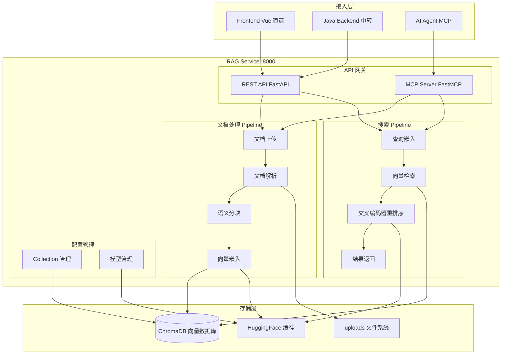
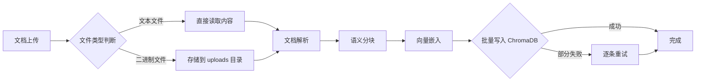

# RAG 知识库服务（Python FastAPI + FastMCP）

## 模块简介

RAG（Retrieval-Augmented Generation）知识库服务是 CodingHub 平台的独立 Python 微服务，负责文档的智能处理、语义索引和检索增强。该服务基于 **FastAPI + FastMCP** 构建，集成了语义分块、向量嵌入、交叉编码器重排序（Rerank）和 ChromaDB 向量数据库等核心能力，同时提供 REST API 和 MCP 工具两种接入方式。

服务默认使用 `all-MiniLM-L6-v2`（384 维）作为嵌入模型，可选 `Qwen3-Embedding-0.6B`（1024 维，需 GPU）实现更高精度。语义分块算法基于文本语义相似度动态切分，相比固定大小分块能更好地保留上下文完整性。前端可直连 RAG 服务（:8000）进行文档操作，知识库元数据的 CRUD 则通过 Java 后端中转。

---

## 系统架构



---

## 文档处理 Pipeline

文档处理是 RAG 服务的核心能力，采用流水线式处理架构：



### 阶段说明

| 阶段 | 说明 |
|------|------|
| **文档上传** | 接收文件并判断类型，文本文件（MD/TXT 等）直接读取内容不存原文件，二进制文件（PDF/DOCX 等）存储到 `_uploads` 目录 |
| **文档解析** | 根据文件类型选择解析器：PDF 用 PyPDF2/pdfplumber，DOCX 用 python-docx，XLSX 用 openpyxl，MD/TXT 直接读取 |
| **语义分块** | 基于语义相似度的智能分块算法，阈值为 mean - 1σ；Markdown 默认 chunk_size=800、overlap=50 |
| **向量嵌入** | 使用嵌入模型将文本块转换为向量，默认 all-MiniLM-L6-v2（384 维），可选 Qwen3-Embedding-0.6B（1024 维） |
| **写入 ChromaDB** | 批量插入（1024 条/批次），失败时降级为逐条插入 + 重试机制 |

---

## REST API 端点

### Collection 配置管理

| 方法 | 端点 | 说明 |
|------|------|------|
| PUT | `/api/collections/{name}/config` | 创建或更新 collection 配置（嵌入模型、分块参数等） |
| GET | `/api/collections/{name}/config` | 查询 collection 配置 |

### 文档操作

| 方法 | 端点 | 说明 |
|------|------|------|
| POST | `/api/collections/{name}/documents` | 上传文档（触发解析-分块-嵌入 pipeline） |
| GET | `/api/collections/{name}/documents` | 文档列表 |
| DELETE | `/api/collections/{name}/documents` | 删除文档（同步清除向量数据） |
| GET | `/api/collections/{name}/documents/{id}/status` | 查询文档处理状态 |

### 语义搜索

| 方法 | 端点 | 说明 |
|------|------|------|
| POST | `/api/collections/{name}/search` | 语义搜索（支持 top_k、rerank 参数） |

---

## MCP 工具接口

通过 FastMCP 框架暴露 8 个 MCP 工具，供 AI Agent 直接调用：

| 工具 | 说明 |
|------|------|
| **create_collection** | 创建知识库 collection |
| **delete_collection** | 删除知识库 collection |
| **list_collections** | 列出所有 collection |
| **upload_document** | 上传文档到指定 collection |
| **list_documents** | 列出 collection 中的文档 |
| **delete_document** | 删除指定文档 |
| **search_knowledge** | 语义搜索知识库 |
| **get_collection_config** | 获取 collection 配置 |

MCP 工具通过 SSE（Server-Sent Events）协议通信，与 Java 后端的 MCP 模块集成，实现 AI Agent 对知识库的自然语言操作。

---

## 核心组件

### 嵌入模型管理

| 配置项 | 默认值 | 可选值 | 说明 |
|--------|--------|--------|------|
| 嵌入模型 | `all-MiniLM-L6-v2` | `Qwen3-Embedding-0.6B` | 默认 384 维，Qwen3 需 GPU |
| 模型来源 | `hf-mirror.com` | `huggingface.co` | 国内环境使用 hf-mirror 镜像 |
| 缓存路径 | `~/.cache/huggingface/` | — | 模型下载缓存目录 |

**注意**：切换嵌入模型需要删除现有 collection 并重建，因为不同模型的向量维度不兼容（384 维 vs 1024 维）。

### 语义分块器

语义分块是 RAG 服务的核心差异化能力：

- **算法原理**：计算相邻句子间的语义相似度，当相似度低于阈值（mean - 1σ）时进行切分
- **参数配置**：
  - Markdown 文档：默认 chunk_size=800 字符，overlap=50 字符
  - 其他文档：根据内容类型自动调整
- **优势**：相比固定大小分块，语义分块能更好地保留段落主题完整性，减少上下文截断导致的信息丢失

### 交叉编码器重排序（Reranker）

搜索结果返回前，使用交叉编码器对候选文档进行二次排序：

- **作用**：提升搜索精度，将最相关的结果排在前面
- **性能**：首次加载约 39 秒（需要下载模型），后续请求使用缓存
- **配置**：可通过搜索请求参数启用/禁用

### ChromaDB 向量数据库

| 配置项 | 值 | 说明 |
|--------|-----|------|
| 批量插入 | 1024 条/批次 | 大批量写入提高吞吐量 |
| 失败策略 | 逐条重试 | 批量失败时降级为逐条插入 |
| 存储模式 | 持久化 | 数据存储在本地文件系统 |

---

## 配置与环境

### 服务配置

| 配置项 | 值 | 说明 |
|--------|-----|------|
| 端口 | 8000 | 服务监听端口 |
| CORS | 环境变量配置 | 允许的前端域名列表 |
| PROCESS_TIMEOUT | 600 秒 | 单个文档处理超时时间 |
| MAX_CONCURRENT | 1 | 最大并发处理数（避免内存溢出） |
| PyTorch | CPU-only | 默认 CPU 推理模式 |

### HuggingFace 镜像

国内环境默认使用 `hf-mirror.com` 镜像加速模型下载：

```
HF_ENDPOINT=https://hf-mirror.com
```

模型首次使用时自动下载并缓存到 `~/.cache/huggingface/`，后续使用本地缓存。

### 文件存储

| 类型 | 处理方式 | 存储位置 |
|------|---------|---------|
| 文本文件（MD/TXT 等） | 直接读取内容，不保存原文件 | — |
| PDF/DOCX 等 | 存储原文件 | `_uploads/` 目录 |
| XLSX | openpyxl 解析 | `_uploads/` 目录 |
| 向量数据 | ChromaDB 持久化 | ChromaDB 数据目录 |
| 模型缓存 | HuggingFace Hub | `~/.cache/huggingface/` |

---

## 关键特性与设计决策

### 前端直连架构

知识库的文档操作（上传、搜索、状态查询）由前端直连 RAG 服务（:8000），无需经过 Java 后端中转。这种设计减少了网络跳转延迟，适合大文件上传和流式搜索响应。知识库的元数据 CRUD（创建/列表/删除 KB）仍通过 Java 后端的 `/api/v1/knowledge` 接口管理。

```
前端 → Java Backend (8082) → KB 元数据 CRUD
前端 → RAG Service (8000)   → 文档上传/搜索/状态
```

### 语义分块 vs 固定分块

语义分块算法通过计算相邻文本段的语义相似度来决定切分点，避免了固定大小分块可能导致的：
- 段落中间截断，破坏语义完整性
- 跨段落拼接，引入无关上下文

默认阈值采用 mean - 1σ（均值减一个标准差），在大多数文档类型上表现良好。

### 模型切换约束

切换嵌入模型时必须删除现有 collection 并重建，原因：
- 不同模型的向量维度不同（384 维 vs 1024 维）
- ChromaDB collection 创建时固定维度，不支持后续变更
- 已有向量数据无法跨维度迁移

### 处理并发控制

`MAX_CONCURRENT=1` 限制同时只处理一个文档，配合 `PROCESS_TIMEOUT=600s` 超时控制。这是为了避免在 CPU-only 环境下多个大型文档同时处理导致内存溢出或处理超时。

---

## 部署与运维

### 启动命令

```bash
cd rag
pip install -r requirements.txt
python main.py
```

服务启动后监听 `http://0.0.0.0:8000`。

### 监控要点

| 指标 | 说明 |
|------|------|
| Reranker 首次加载 | 约 39 秒（模型下载），后续使用缓存 |
| 文档处理状态 | 通过 `/documents/{id}/status` 查询处理进度 |
| ChromaDB 存储 | 检查向量数据库磁盘占用 |
| 模型缓存 | `~/.cache/huggingface/` 目录大小 |

---

## 与其他模块的关联

- [前端应用](frontend-app.md)：前端 knowledgeService 直连 RAG 服务（:8000）进行文档上传和语义搜索
- [社区内容](community-content.md)：知识库与论坛/微课独立运行，但共享统一标签系统
- Java 后端 MCP 模块：Java 后端通过 `/mcp/sse` 暴露 17 个 MCP 工具，其中部分工具调用 RAG 服务实现知识库操作
- Java 后端 KB Controller：知识库元数据 CRUD 通过 `/api/v1/knowledge` 管理，文档操作通过 RAG 服务直连
