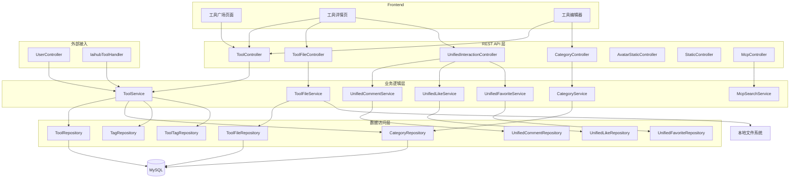
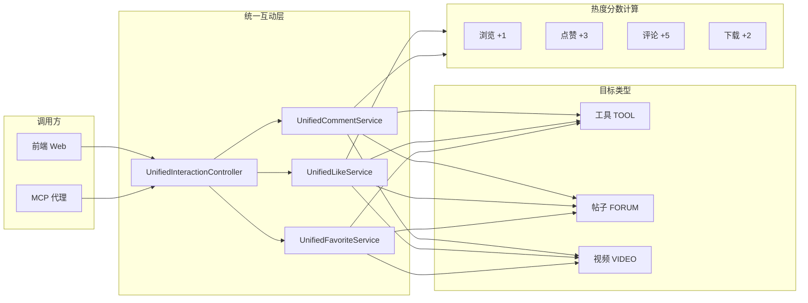

# 工具广场（Tool Plaza）

## 模块简介

工具广场是 CodingHub 项目的核心业务模块，承载了平台上所有 AI 工具的发布、浏览、下载与互动功能。作为用户进入平台后最先接触的功能区域，工具广场提供了完整的工具生命周期管理能力——从创建、发布、版本迭代到文件分发，配合统一互动系统实现点赞、评论、收藏等社区功能。

本模块涵盖 226 个组件，是项目中规模最大、交互最复杂的业务模块。它不仅为前端 Web 界面提供 REST API，还通过 MCP 协议向 AI 代理开放工具操作能力，是整个 CodingHub 生态的基石。

## 架构概览

## 组件职责

### Controllers（控制器层）

| 控制器 | 路径 | 职责 |
|--------|------|------|
| ToolController | `/api/v1/tools` | 工具 CRUD、置顶（pin/unpin，ADMIN 权限）、热门 Top5、分页列表（支持 categoryId / keyword / sortBy 等过滤） |
| ToolFileController | `/api/v1/tools/{toolId}/files` | 文件上传（multipart，多文件）、文件列表、文件删除、文件下载（流式响应） |
| CategoryController | `/api/v1/categories` | 分类列表查询 |
| UnifiedInteractionController | `/api/v1/interactions` | 统一点赞（toggleLike）、评论 CRUD、收藏（toggleFavorite）、我的收藏列表，支持匿名点赞（IP hash） |
| AvatarStaticController | — | 头像静态资源服务 |
| StaticController | — | README 静态资源服务 |
| McpController | `/mcp/health` | MCP 健康检查端点 |

### Services（业务逻辑层）

| 服务 | 核心职责 |
|------|----------|
| ToolService | 工具 CRUD 核心逻辑：创建 / 更新 / 软删除（status=DELETED）、版本管理、置顶、热度排序（score）、关联标签管理 |
| ToolFileService | 文件上传（多文件，大小限制 50 MB/文件、200 MB 总计）、文件存储（按 toolId 组织目录）、下载流式返回、支持 README 保存 |
| CategoryService | 分类 CRUD |
| UnifiedCommentService | 评论管理，支持 TOOL / FORUM / VIDEO 三种目标类型，IP hash 匿名评论，XSS 净化 |
| UnifiedLikeService | 统一点赞（支持多种 TargetType），匿名点赞（IP hash），热度分数更新 |
| UnifiedFavoriteService | 收藏管理（支持多种 TargetType），需认证 |
| McpSearchService | MCP 搜索服务，为 MCP 工具提供搜索能力 |

### Models（数据模型）

| 模型 | 关键字段 |
|------|----------|
| Tool | name, content, version, category, score, pinned, status |
| ToolFile | toolId, fileName, filePath, fileSize |
| Category | name, description |
| UnifiedComment | targetType, targetId, userId, content, ipHash |
| UnifiedLike | targetType, targetId, userId, ipHash |
| UnifiedFavorite | targetType, targetId, userId |
| TargetType | 枚举值：TOOL / FORUM / VIDEO |

### DTOs（数据传输对象）

- ToolSummaryDTO — 工具列表摘要
- ToolDetailDTO — 工具完整详情
- CreateToolRequest — 创建工具请求
- UpdateToolRequest — 更新工具请求
- InteractionRequest / InteractionResponse — 互动请求与响应
- ApiResponse — 通用 API 响应包装
- PageResponse — 分页响应包装

## API 端点列表

### 工具管理

| 方法 | 端点 | 说明 | 权限 |
|------|------|------|------|
| GET | `/api/v1/tools` | 工具分页列表 | 公开 |
| GET | `/api/v1/tools/hot` | 热门工具 Top5 | 公开 |
| GET | `/api/v1/tools/{id}` | 工具详情 | 公开 |
| POST | `/api/v1/tools` | 创建工具 | 需认证 |
| PUT | `/api/v1/tools/{id}` | 更新工具 | 拥有者/管理员 |
| DELETE | `/api/v1/tools/{id}` | 删除工具（软删除） | 拥有者/管理员 |
| POST | `/api/v1/tools/{id}/pin` | 置顶工具 | ADMIN |
| DELETE | `/api/v1/tools/{id}/pin` | 取消置顶 | ADMIN |

### 文件管理

| 方法 | 端点 | 说明 | 权限 |
|------|------|------|------|
| POST | `/api/v1/tools/{toolId}/files` | 上传文件（multipart） | 拥有者/管理员 |
| GET | `/api/v1/tools/{toolId}/files` | 文件列表 | 公开 |
| DELETE | `/api/v1/tools/{toolId}/files/{fileId}` | 删除文件 | 拥有者/管理员 |
| GET | `/api/v1/tools/{toolId}/files/{fileId}/download` | 下载文件（流式） | 公开 |

### 分类

| 方法 | 端点 | 说明 | 权限 |
|------|------|------|------|
| GET | `/api/v1/categories` | 分类列表 | 公开 |

### 统一互动

| 方法 | 端点 | 说明 | 权限 |
|------|------|------|------|
| POST | `/api/v1/interactions/like` | 点赞 / 取消点赞 | 公开（匿名 IP hash） |
| GET | `/api/v1/interactions/{targetType}/{targetId}/comments` | 评论列表 | 公开 |
| POST | `/api/v1/interactions/comments` | 发表评论 | 公开（匿名 IP hash） |
| PUT | `/api/v1/interactions/comments/{commentId}` | 编辑评论 | 拥有者 |
| DELETE | `/api/v1/interactions/comments/{commentId}` | 删除评论 | 拥有者/管理员 |
| POST | `/api/v1/interactions/favorite` | 收藏 / 取消收藏 | 需认证 |
| GET | `/api/v1/interactions/favorites` | 我的收藏列表 | 需认证 |

## 关键特性

### 热度排序机制

工具的热度基于 `score` 字段，由用户行为累加计算：

| 行为 | 分数变化 |
|------|----------|
| 浏览 | +1 |
| 点赞 | +3 |
| 评论 | +5 |
| 下载 | +2 |

排序支持 `hot`（按 score 降序）和 `latest`（按创建时间降序）两种模式，置顶工具始终排在最前。

### 统一互动系统

统一互动系统通过 `TargetType` 枚举（TOOL / FORUM / VIDEO）将点赞、评论、收藏逻辑统一到一套服务中，避免为每种内容类型重复实现互动逻辑。前端通过 `targetType + targetId` 组合定位具体的互动对象。

### 匿名互动

点赞和评论支持匿名操作，通过客户端 IP 地址的 hash 值（ipHash）标识匿名身份，防止同一 IP 重复点赞。已登录用户使用 userId 标识，两者共存于同一张表中。

### 文件管理

- 支持多文件同时上传（multipart/form-data）
- 单文件大小限制 50 MB，单次上传总计 200 MB
- 文件按 toolId 组织存储目录
- 下载采用流式响应，避免大文件占用内存
- 文件格式无强制限制（可通过配置白名单扩展）
- 支持 README 文件保存与静态资源服务

### 软删除

工具删除采用软删除策略，将 `status` 字段设为 `DELETED`，数据保留在数据库中但查询时过滤。

## 依赖关系

### 上游依赖（谁调用本模块）

| 调用方 | 调用方式 | 说明 |
|--------|----------|------|
| ToolController | REST API | 前端 Web 界面直接调用 |
| UserController | Service 调用 | 获取用户发布的工具列表 |
| IaihubToolHandler | MCP 协议 | AI 代理通过 MCP 工具操作（搜索、创建、更新工具） |
| OverviewServiceImpl | Service 调用 | 统计排行数据读取 |

### 下游依赖（本模块依赖谁）

| 依赖 | 类型 | 说明 |
|------|------|------|
| ToolRepository | 数据访问 | 工具 CRUD 操作 |
| CategoryRepository | 数据访问 | 分类查询与验证 |
| TagService / TagRepository | 服务/数据 | 关联标签管理（创建工具时同步处理标签） |
| ToolTagRepository | 数据访问 | 工具-标签关联表操作 |
| 本地文件系统 | 基础设施 | 文件存储与读取 |
| [统一标签系统](community-social.md) | 模块依赖 | Tag 实体与 TagService 提供标签基础能力 |

### 变更影响分析

- **Tool 实体变更**：影响 ToolController（REST API）、IaihubToolHandler（MCP 工具）、UserController（用户工具列表）、OverviewServiceImpl（统计排行）四条调用路径
- **ToolService 接口变更**：所有上游调用者需同步更新
- **统一互动服务变更**：影响工具、[论坛](community-social.md)、微课三个模块的互动功能
- **文件存储路径变更**：影响前端下载链接和 StaticController 的静态资源服务

## 统一互动系统架构

## 相关模块

- [知识库](knowledge-base.md) — RAG 知识库管理，与工具广场共享用户体系
- [社交与概览](community-social.md) — 统一标签、通知、留言反馈、统计概览
